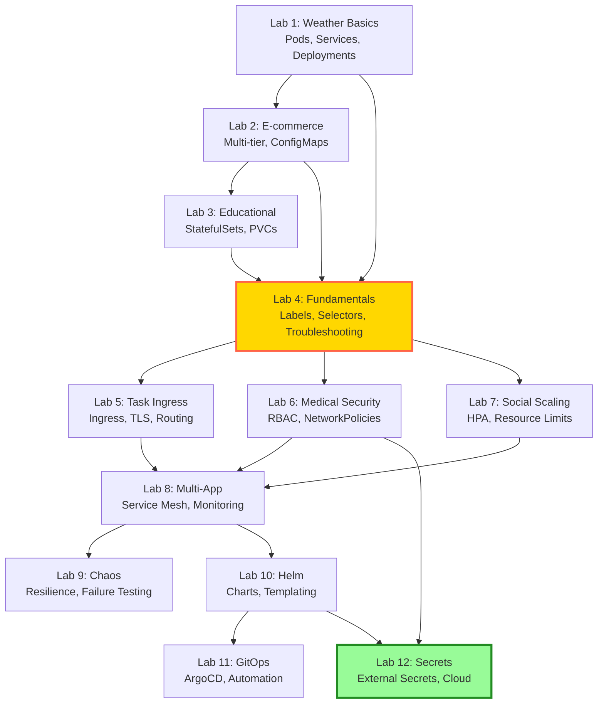

# 🎓 Kubernetes Learning Labs

Practice Kubernetes with 6 real applications across **14 core labs + 3 challenges**. 🌶️

**Mindset**: Less "read the docs", more "ship to cluster". Each lab is a guided mission with validation, troubleshooting, and real-world fire drills.

**✨ NEW**: Observability sections (3-pillar validation), Docker Compose bridge, decision trees, certification prep, production war stories!

---

## 🧭 Lab Map

### 🚀 Start Here: Visual Setup & Migration (Lab 0)
0. 👀 **[Lab 0: See Kubernetes Think](../labs/00-visual-kubernetes.md)** (15 min)  
   Install k9s, stern, kubectl-tree. Watch Kubernetes come alive! **Do this first**.
   
   - 🐳 **[Lab 0.5: Docker Compose → Kubernetes](../labs/00.5-docker-compose-to-kubernetes.md)** (40 min)  
     **NEW!** Migrate from `docker-compose.yml` to K8s manifests. Side-by-side translation, conversion patterns, when to use each.

### ⭐ Stage 1 — Foundations (Labs 1-4)
1. 🌦️ **[Lab 1: Weather App Basics](../labs/01-weather-basics.md)** (20 min)  
   Deploy your first app. Master pods, services, port-forwarding. **Includes Break & Fix challenge**.
2. 🛒 **[Lab 2: E-commerce Multi-tier](../labs/02-ecommerce-basics.md)** (30 min)  
   Frontend + backend + database. Understand multi-service communication.
3. 🎓 **[Lab 3: Educational Stateful](../labs/03-educational-stateful.md)** (40 min)  
   Persistent volumes, StatefulSets, data retention.
   - 🔧 **[Lab 3.5: Kubernetes Under the Hood](../labs/03.5-kubernetes-under-the-hood.md)** (50 min)  
     **NEW!** Demystify K8s internals—controller loops, etcd, scheduler, API server lifecycle. Advanced debugging.
4. 🏷️ **[Lab 4: Kubernetes Fundamentals Deep Dive](../labs/04-kubernetes-fundamentals.md)** (75 min)  
   **NEW!** Labels & selectors mastery, troubleshooting workflows, kubectl power moves.

### ⚙️ Stage 2: Production Ops (Labs 5-7)
5. ✅ **[Lab 5: Task Manager Ingress](../labs/05-task-ingress.md)** (45 min)  
   Expose apps with Ingress (NGINX), manage external traffic.
6. 🏥 **[Lab 6: Medical Security](../labs/06-medical-security.md)** (60 min)  
   RBAC, NetworkPolicies, secrets, TLS. Secure apps like a pro.
7. 📈 **[Lab 7: Social Scaling](../labs/07-social-scaling.md)** (90 min)  
   HPA, resource limits, multi-replica deployments, caching.

### 🤖 Stage 3: Platform Engineering (Labs 8-9)
8. 🧩 **[Lab 8: Multi-App Orchestration](../labs/08-multi-app.md)** (120 min)  
   Deploy all 6 apps with shared configs, service mesh, centralized monitoring.
   - 🏢 **[Lab 8.5: Multi-Tenancy](../labs/08.5-multi-tenancy.md)** (75 min)  
     Namespace isolation, resource quotas, tenant separation patterns.
9. ⚡ **[Lab 9: Chaos Engineering](../labs/09-chaos.md)** (90 min)  
   Break pods, test self-healing, resilience patterns.
   - 🔧 **[Lab 9.5: Complex Microservices](../labs/09.5-complex-microservices.md)** (105 min)  
     Service mesh, distributed tracing, observability at scale.

### 🪄 Stage 4: Automation Masters (Labs 10-13)
10. 🪄 **[Lab 10: Helm Package Management](../labs/10-helm-package-management.md)** (75 min)  
    Build charts, templating, versioned releases.
11. 🤖 **[Lab 11: GitOps with ArgoCD](../labs/11-gitops-argocd.md)** (90 min)  
    Git as source of truth, automated sync, rollback workflows.
    - 🚨 **[Lab 11.5: Disaster Recovery](../labs/11.5-disaster-recovery.md)** (120 min)  
      Backup strategies, cross-region restore, business continuity planning.
12. 🔐 **[Lab 12: External Secrets Management](../labs/12-external-secrets.md)** (60 min)  
    External Secrets Operator, cloud secret stores, production security.
    - ☁️ **[Lab 12.5: Multi-Cloud Secrets](../labs/12.5-multi-cloud-secrets.md)** (90 min)  
      Cross-cloud secret federation, hybrid environments, compliance patterns.
13. 🤖 **[Lab 13: AI/ML GPU Workloads](../labs/13-ai-ml-gpu.md)** (150 min)  
    **ADVANCED!** GPU scheduling, ML pipelines, resource optimization for AI workloads.

---

## 🎮 Challenge Labs (Test Your Skills Under Pressure!)

These are **incident simulations**—real production scenarios where you're the on-call engineer. No hand-holding, just you vs. a broken cluster.

- 🔥 **[Challenge Lab A: The Midnight Incident](../labs/challenge-a-midnight-incident.md)** (45 min)  
  **After Lab 3** - App is down at 2 AM. Find 3 bugs, restore service in 30 min. Ready?

- 🛍️ **[Challenge Lab B: Black Friday Rush](../labs/challenge-b-black-friday.md)** (60 min)  
  **After Lab 7** - Scale e-commerce during traffic spike. 13 minutes until midnight!

- 🏗️ **[Challenge Lab C: Platform Migration](../labs/challenge-c-platform-migration.md)** (90 min)  
  **After Lab 12** - Migrate 6 apps to new cluster with zero downtime. GitOps + secrets + monitoring. FINAL BOSS! 🏆

**Pro tip**: Don't skip these. They cement your skills 10x better than normal labs.

---

## 🎖️ Expert Badge System (Optional Advanced Track)

Want to go beyond the standard labs? **Expert Modes** are inline advanced challenges embedded in 7 labs. They're 100% optional but unlock senior-level debugging and performance tuning skills.

### 🎯 Two Learning Paths

| Path | Labs | Time | Outcome |
|------|------|------|---------|
| **Standard Path** | Labs 1-12 (standard sections) | ~10-12 hours | CKA/CKAD ready, production-capable |
| **Expert Path** | Labs 1-12 + 7 Expert Modes | ~12-15 hours | Senior SRE/Platform Engineer ready |

**When to use Expert Modes**: Complete standard labs first to build foundation, then revisit Expert Modes when you want to level up to senior roles.

### 🏅 Expert Badge Locations

| Badge | Lab | Challenge | Difficulty | Interview Topics |
|-------|-----|-----------|------------|------------------|
| 🔬 **Forensic Investigator** | [Lab 1](../labs/01-weather-basics.md#expert-mode-forensic-debugging) | Debug CrashLoopBackOff with no logs | ⭐⭐⭐⭐ | kubectl debug, crictl, ephemeral containers |
| 💾 **Data Recovery** | [Lab 3](../labs/03-educational-stateful.md#expert-mode-data-recovery) | Recover PVC after node crash | ⭐⭐⭐⭐ | PVC rebinding, force delete, node affinity |
| ⚙️ **Control Plane Architect** | [Lab 3.5](../labs/03.5-kubernetes-under-the-hood.md#expert-mode-control-plane-tuning) | Tune etcd performance | ⭐⭐⭐⭐⭐ | etcd compaction, defragmentation |
| 📈 **Scaling Architect** | [Lab 7](../labs/07-social-scaling.md#expert-mode-cluster-autoscaler-debugging) | Debug Cluster Autoscaler | ⭐⭐⭐⭐ | Autoscaler logs, node groups, PDBs |
| 🕸️ **Mesh Performance** | [Lab 8](../labs/08-multi-app.md#expert-mode-service-mesh-performance-profiling) | Optimize Istio sidecar CPU | ⭐⭐⭐⭐⭐ | Envoy profiling, connection pooling |
| 🔍 **Network Detective** | [Lab 9](../labs/09-chaos.md#expert-mode-the-impossible-network-debug) | Debug "impossible" CNI failures | ⭐⭐⭐⭐⭐ | CNI logs, network namespaces, IPAM |
| 🌉 **Hybrid Cloud Architect** | [Lab 12](../labs/12-external-secrets.md#expert-mode-hybrid-cloud-architecture) | External DB via VPN with HA | ⭐⭐⭐⭐ | VPN sidecars, service discovery |

**Achievement Tiers**:
- 0-2 badges: 🥉 Advanced Practitioner
- 3-5 badges: 🥈 Senior Engineer
- 6-7 badges: 🥇 Kubernetes Expert (top 5%)

**Track your progress**: [LAB-PROGRESS.md](learning/LAB-PROGRESS.md#expert-badge-system-optional-advanced-challenges)

**Complete interview guide**: [Senior K8s Debugging Reference](reference/senior-k8s-debugging.md) — All 7 challenges with production stories and interview templates

---

## 🛠️ Lab Dependency Graph

Visual guide to skill prerequisites. Follow the arrows to understand which concepts build on each other:



**Legend**:
- 🟨 **Lab 4 (Gold)**: Critical foundation—master labels/selectors before advancing
- 🟩 **Lab 12 (Green)**: New addition—production-grade secrets management

**Key Learning Paths**:
1. **Fast Track**: Labs 1→2→3→4→5 (Core skills in ~3 hours)
2. **Security Focus**: Labs 1→2→3→4→6→12 (Security-first approach)
3. **Platform Engineer**: Complete all 12 in sequence (Full mastery)

---

## �🚀 Quick Start

### Prerequisites (smoke checks)
```bash
# Verify K8s cluster
kubectl cluster-info

# Verify Docker
docker --version
```

### Start Learning
```bash
# Clone repo
git clone https://github.com/temitayocharles/full-stack-apps.git
cd full-stack-apps

# Start with Lab 1
open labs/01-weather-basics.md
```

---

## 📦 Pre-Built Images
All apps have multi-arch images on Docker Hub: `temitayocharles/*`

No building required - focus on **Kubernetes**, not Docker.

---

## 🆘 Stuck?
- **[Common Issues](troubleshooting/troubleshooting.md)** - Quick fixes
- **[kubectl Cheat Sheet](reference/kubectl-cheatsheet.md)** - Essential commands
(debugging guidance consolidated into the Troubleshooting Hub)

---

## 📚 Reference Guides (Quick Lookups)

- 🌳 **[Decision Trees](reference/decision-trees.md)** - Visual flowcharts for quick decisions  
  StatefulSet vs Deployment? Ingress vs LoadBalancer? HPA vs VPA? 7 diagrams to save you 20 minutes of Googling.

- 📜 **[Certification Prep (CKA/CKAD)](reference/certification-guide.md)** - Exam alignment  
  Map labs to CNCF exam objectives. Includes speedrun cheatsheet, 8-week study plan, mock exam tips.

- ⚠️ **[Production War Stories](reference/production-war-stories.md)** - Learn from $100M+ mistakes  
  GitHub's 24-hour outage, Shopify's Black Friday, Capital One breach, Cloudflare meltdown, and more. Real root causes + fixes.

- 📖 **[kubectl Cheat Sheet](reference/kubectl-cheatsheet.md)** - Essential commands  
  One-liners for debugging, scaling, logs, events, and more.

- 🔧 **[API Keys Guide](reference/api-keys-guide.md)** - Get OpenWeather, external API keys

---

## 🎯 Learning Objectives

By completing these labs, you'll master:

**Core Concepts**:
- Pods, Deployments, Services
- ConfigMaps, Secrets
- Namespaces, Labels, Selectors

**Storage**:
- PersistentVolumes
- PersistentVolumeClaims  
- StatefulSets

**Networking**:
- ClusterIP, NodePort, LoadBalancer
- Ingress controllers
- Network policies
- Service mesh basics

**Operations**:
- Rolling updates
- Rollbacks
- Scaling (HPA, VPA)
- Resource management
- Health checks

**Security**:
- RBAC
- Pod security policies
- Secrets management
- Network isolation

**Observability**:
- Logging aggregation
- Metrics collection
- Distributed tracing
- Alerting

**Package Management**:
- Helm charts and repositories
- Chart templating and values
- Release lifecycle management
- Chart dependencies and best practices

**GitOps & Automation**:
- GitOps principles and workflows
- ArgoCD deployment and management
- Multi-environment automation
- Git-driven continuous deployment

---

**Ready to master Kubernetes?**

👉 Start with **[Lab 1: Weather App Basics](../labs/01-weather-basics.md)**
