# 📊 Learning Progress Dashboard & Skill Heatmap

Track your Kubernetes mastery journey from beginner to expert. This page visualizes your progression across 7 core skill areas and shows how each lab builds your expertise.

---

## 📈 Learning Progression Map

```mermaid
graph TD
    A["🌟 Complete Lab 1<br/>Core Concepts Mastered"] 
    B["🎯 Complete Labs 2-3<br/>Stateful Workloads"]
    C["⚙️ Complete Lab 4<br/>Troubleshooting Skills"]
    D["🚀 Complete Labs 5-7<br/>Production Ready"]
    E["🏗️ Complete Labs 8-9<br/>Platform Engineering"]
    F["🤖 Complete Labs 10-12<br/>Automation Masters"]
    G["🏆 Senior Engineer Level<br/>Kubernetes Expert"]
    
    A --> B
    B --> C
    C --> D
    D --> E
    E --> F
    F --> G
    
    style A fill:#e1f5ff
    style B fill:#b3e5fc
    style C fill:#81d4fa
    style D fill:#4fc3f7
    style E fill:#29b6f6
    style F fill:#03a9f4
    style G fill:#039be5
```



### Learning Stages Explained

| Stage | Labs | What You'll Build | Skills Gained | Time |
|-------|------|-------------------|----------------|------|
| **Foundation** | 0-4 | Your first 3 apps | Deploy, debug, understand K8s | ~6 hours |
| **Production Ops** | 5-7 | Secure, scaled apps | Security, scaling, monitoring | ~8 hours |
| **Platform** | 8-9 | Multi-app ecosystem | Service mesh, chaos, orchestration | ~8 hours |
| **Automation** | 10-12 | GitOps pipeline | Helm, ArgoCD, secrets | ~7 hours |
| **Challenges** | A-C | Real incidents | Expert-level debugging, migrations | ~6 hours |
| **Senior** | Combine all | Production system | Architecture, optimization, mentoring | Ongoing |

---

## 🎯 Skill Heatmap: Track Your Mastery

### Foundation Stage (Labs 1-4)

```
SKILL PROGRESSION CHART

Deployment & Pods
  Lab 1: ████░░░░░░ 40% (Deploy first app)
  Lab 2: ████████░░ 80% (Multi-tier deployment)
  Lab 3: █████████░ 90% (StatefulSets)
  Lab 4: ██████████ 100% (Deep dive)

Debugging & Troubleshooting
  Lab 1: ███░░░░░░░ 30% (Basic logs)
  Lab 2: ████░░░░░░ 40% (Describe pods)
  Lab 3: ██████░░░░ 60% (Events, conditions)
  Lab 4: ██████████ 100% (Advanced debugging)

Labels & Selectors
  Lab 1: ██░░░░░░░░ 20% (First exposure)
  Lab 2: ████░░░░░░ 40% (Service routing)
  Lab 3: ██████░░░░ 60% (StatefulSet selectors)
  Lab 4: ██████████ 100% (Mastery)

Volumes & Persistence
  Lab 1: ░░░░░░░░░░  0% (Not covered)
  Lab 2: ██░░░░░░░░ 20% (Mentions)
  Lab 3: ████████░░ 80% (PVCs, StatefulSets)
  Lab 4: ██████████ 100% (Full depth)

Network & Services
  Lab 1: ████░░░░░░ 40% (Service basics)
  Lab 2: ██████░░░░ 60% (Multi-service)
  Lab 3: ████████░░ 80% (Headless services)
  Lab 4: ██████████ 100% (Advanced)
```

### Production Stage (Labs 5-7)

```
Security & RBAC
  Lab 5: ██░░░░░░░░ 20% (Brief intro)
  Lab 6: ████████░░ 80% (RBAC, policies)
  Lab 7: ██████████ 100% (Advanced security)

Scaling & Performance
  Lab 5: ███░░░░░░░ 30% (Horizontal scaling)
  Lab 6: █████░░░░░ 50% (Resources, limits)
  Lab 7: ██████████ 100% (HPA, metrics)

Ingress & Routing
  Lab 5: ████████░░ 80% (NGINX basics)
  Lab 6: █████████░ 90% (TLS, auth)
  Lab 7: ██████████ 100% (Advanced routing)
```

### Platform Stage (Labs 8-9)

```
Service Mesh
  Lab 8: ████░░░░░░ 40% (Istio intro)
  Lab 9.5: ████████░░ 80% (Advanced features)

Observability
  Lab 8: ██████░░░░ 60% (Monitoring setup)
  Lab 9.5: ██████████ 100% (Distributed tracing)

Resilience & Chaos
  Lab 9: ██████████ 100% (Chaos engineering)
```

### Automation Stage (Labs 10-12)

```
Package Management (Helm)
  Lab 10: ██████████ 100% (Full mastery)

GitOps (ArgoCD)
  Lab 11: ██████████ 100% (Full mastery)

Secrets Management
  Lab 12: ██████████ 100% (Full mastery)

Disaster Recovery
  Lab 11.5: ██████████ 100% (DR patterns)
```

---

## 🏅 Expert Badge Progression

Complete these optional challenges to unlock expert badges:

```
┌─────────────────────────────────────────┐
│ 🏅 EXPERT BADGE SYSTEM                  │
├─────────────────────────────────────────┤
│                                         │
│ 🔬 Forensic Investigator (Lab 1)        │
│    └─ Debug CrashLoopBackOff            │
│                                         │
│ 💾 Data Recovery (Lab 3)                │
│    └─ Recover PVC after node crash      │
│                                         │
│ ⚙️  Control Plane Architect (Lab 3.5)   │
│    └─ Tune etcd performance             │
│                                         │
│ 📈 Scaling Architect (Lab 7)            │
│    └─ Debug Cluster Autoscaler          │
│                                         │
│ 🕸️  Mesh Performance (Lab 8)            │
│    └─ Optimize Istio sidecar            │
│                                         │
│ 🔍 Network Detective (Lab 9)            │
│    └─ Debug "impossible" CNI failures   │
│                                         │
│ 🌉 Hybrid Cloud Architect (Lab 12)      │
│    └─ External DB via VPN with HA       │
│                                         │
└─────────────────────────────────────────┘

ACHIEVEMENT TIERS:
  🥉 0-2 badges   → Advanced Practitioner
  🥈 3-5 badges   → Senior Engineer
  🥇 6-7 badges   → Kubernetes Expert (Top 5%)
```

---

## 📋 Self-Assessment Checklist

### Foundation Skills (Labs 1-4)

**After Lab 1**, you should be able to:
- [ ] Deploy a pod without YAML (kubectl run)
- [ ] Create a Deployment from manifest
- [ ] Port-forward to access services
- [ ] View pod logs and understand output
- [ ] Use kubectl describe to troubleshoot
- [ ] Understand pod lifecycle
- [ ] Gracefully delete pods

**After Lab 2**, you should additionally:
- [ ] Design multi-tier architecture (frontend + backend + DB)
- [ ] Create Services to route traffic
- [ ] Understand service selectors
- [ ] Deploy with dependencies
- [ ] Scale deployments manually
- [ ] Update deployments (rolling updates)

**After Lab 3**, you should additionally:
- [ ] Create and mount PersistentVolumeClaims
- [ ] Understand StatefulSets vs Deployments
- [ ] Design for stateful applications
- [ ] Understand pod ordinal naming
- [ ] Recover data from PVCs

**After Lab 4**, you should additionally:
- [ ] Use labels effectively
- [ ] Write complex selectors
- [ ] Debug networking issues
- [ ] Analyze events and logs forensically
- [ ] Use kubectl advanced commands

---

### Production Skills (Labs 5-7)

**After Lab 5**, you should:
- [ ] Deploy Ingress controller (NGINX)
- [ ] Create Ingress routes
- [ ] Route multiple services via single IP
- [ ] Understand ingress vs service types
- [ ] Troubleshoot ingress issues

**After Lab 6**, you should additionally:
- [ ] Create RBAC policies
- [ ] Write NetworkPolicies
- [ ] Manage secrets securely
- [ ] Understand TLS in K8s
- [ ] Audit access to resources

**After Lab 7**, you should additionally:
- [ ] Set resource requests/limits
- [ ] Configure HPA
- [ ] Understand load balancing
- [ ] Optimize for performance
- [ ] Monitor scaling behavior

---

### Platform Skills (Labs 8-9)

**After Lab 8**, you should:
- [ ] Deploy multiple apps together
- [ ] Use namespaces effectively
- [ ] Set up service mesh basics
- [ ] Configure distributed tracing
- [ ] Monitor multi-app ecosystem

**After Lab 9**, you should additionally:
- [ ] Use chaos engineering tools
- [ ] Design for resilience
- [ ] Test failure scenarios
- [ ] Implement circuit breakers
- [ ] Monitor failure recovery

---

### Automation Skills (Labs 10-12)

**After Lab 10**, you should:
- [ ] Write Helm charts
- [ ] Use chart templates
- [ ] Manage dependencies
- [ ] Version releases

**After Lab 11**, you should additionally:
- [ ] Set up ArgoCD
- [ ] Git-sync configs
- [ ] Implement GitOps workflows
- [ ] Rollback via Git

**After Lab 12**, you should additionally:
- [ ] Manage secrets securely
- [ ] Integrate with external secret stores
- [ ] Rotate secrets automatically
- [ ] Audit secret access

---

## 🎯 Recommended Practice Path

### Week 1-2: Foundation Mastery
```
Day 1-2: Lab 0 + Lab 1 (Visual Tools + First App)
         └─ Run: ./scripts/check-lab-prereqs.sh 1
         └─ Read: Common Mistakes guide
         └─ Do: Challenge track in Lab 1

Day 3-4: Lab 2 (Multi-tier apps)
         └─ Build understanding of communication
         └─ Deploy 3-tier app
         └─ Read: Network troubleshooting guide

Day 5-6: Lab 3 (Stateful workloads)
         └─ Understand persistence
         └─ Create StatefulSets
         └─ Backup data manually

Day 7:   Lab 4 (Deep dive)
         └─ Master debugging
         └─ Learn advanced kubectl
         └─ Complete challenge if ready

Week 2 Self-Assessment:
  [ ] Can deploy any app
  [ ] Can debug pod issues
  [ ] Understand service routing
  [ ] Know persistent data flow
```

### Week 3-4: Production Readiness
```
Day 8-9: Lab 5 (Ingress & routing)
         └─ Expose apps externally
         └─ Test ingress routing

Day 10-11: Lab 6 (Security)
           └─ RBAC fundamentals
           └─ Network policies
           └─ Secret management

Day 12-13: Lab 7 (Scaling)
           └─ HPA configuration
           └─ Performance tuning
           └─ Run under load

Week 3 Checkpoint:
  [ ] Can secure cluster
  [ ] Understand scaling
  [ ] Ready for production
  [ ] **Optional: Complete Challenge Lab B**
```

### Week 5-6: Platform Engineering
```
Day 15-17: Lab 8 (Multi-app)
           └─ Deploy ecosystem
           └─ Service mesh intro

Day 18-20: Lab 9 + 9.5 (Advanced)
           └─ Chaos engineering
           └─ Microservices patterns

Week 4 Checkpoint:
  [ ] Understand platform thinking
  [ ] Design for reliability
  [ ] Know failure modes
```

### Week 7-8: Automation Experts
```
Day 22-24: Lab 10 (Helm)
           └─ Package applications
           
Day 25-27: Lab 11 (GitOps)
           └─ Automation workflow
           
Day 28-30: Lab 12 (Secrets)
           └─ Secure everything

Final Checkpoint:
  [ ] Production-ready system
  [ ] **Ready for: Challenge Lab C**
```

---

## 📊 Progress Tracking Template

Copy and fill this in your own repo:

```markdown
# My Learning Progress

## Foundation Stage
- [x] Lab 0: Visual Kubernetes (Completed: Oct 21)
- [x] Lab 1: Weather Basics (Completed: Oct 22)
- [ ] Lab 2: E-commerce
- [ ] Lab 3: Stateful Workloads
- [ ] Lab 4: Fundamentals

## Production Stage
- [ ] Lab 5: Ingress
- [ ] Lab 6: Security
- [ ] Lab 7: Scaling

## Platform Stage
- [ ] Lab 8: Multi-App
- [ ] Lab 9: Chaos Engineering

## Automation Stage
- [ ] Lab 10: Helm
- [ ] Lab 11: GitOps
- [ ] Lab 12: Secrets

## Expert Badges
- [ ] 🔬 Forensic Investigator
- [ ] 💾 Data Recovery
- [ ] ⚙️  Control Plane Architect
- [ ] 📈 Scaling Architect
- [ ] 🕸️  Mesh Performance
- [ ] 🔍 Network Detective
- [ ] 🌉 Hybrid Cloud Architect

## Challenge Labs
- [ ] Challenge A: Midnight Incident
- [ ] Challenge B: Black Friday Rush
- [ ] Challenge C: Platform Migration

## Production Systems Built
- [ ] Deployed to staging
- [ ] Deployed to production
- [ ] Handled incident
- [ ] Mentored teammate
```

---

## 🚀 From Beginner to Expert Timeline

```
WEEKS 1-2 (Hours 0-10)
Foundation
├─ Lab 0-1: First deployment
├─ Understand pods & services
└─ Debug basic issues

     ↓

WEEKS 3-4 (Hours 10-20)
Production Ready
├─ Lab 5-7: Security, scaling, routing
├─ Understand networking
└─ Design for HA

     ↓

WEEKS 5-6 (Hours 20-30)
Platform Engineering
├─ Lab 8-9: Multi-app, chaos
├─ Design for resilience
└─ Understand trade-offs

     ↓

WEEKS 7-8 (Hours 30-40+)
Automation & Experts
├─ Lab 10-12: Helm, GitOps, secrets
├─ Complete challenges
└─ Build production systems

     ↓

MONTHS 2+ (Ongoing)
Senior Engineer
├─ Optimize existing systems
├─ Mentor junior engineers
├─ Architect new platforms
└─ Contribute to open source
```

---

## 📈 Skill Assessment Matrix

Rate yourself (0-5) on each dimension:

| Skill | Beginner | After Labs 1-4 | After Labs 5-7 | After Labs 8-9 | After Labs 10-12 |
|-------|----------|---|---|---|---|
| **Deployment** | 1 | 5 | 5 | 5 | 5 |
| **Debugging** | 1 | 4 | 4 | 5 | 5 |
| **Networking** | 0 | 3 | 5 | 5 | 5 |
| **Security** | 0 | 1 | 4 | 4 | 5 |
| **Scaling** | 0 | 2 | 5 | 5 | 5 |
| **Automation** | 0 | 1 | 2 | 3 | 5 |
| **Troubleshooting** | 1 | 4 | 5 | 5 | 5 |
| **Architecture** | 0 | 1 | 3 | 5 | 5 |
| **Production Ready** | 0 | 3 | 5 | 5 | 5 |

---

## 🎓 What "Expert" Really Means

**Expert isn't about knowing everything.** It's about:

✅ **You can**:
- Design systems that scale
- Troubleshoot in production calmly
- Mentor junior engineers
- Make trade-off decisions
- Build for reliability
- Automate everything
- Teach Kubernetes to others

✅ **You understand**:
- When to use which tools
- Trade-offs of each approach
- Cost implications
- Security implications
- Performance characteristics

✅ **You have**:
- Deployed to production
- Handled real incidents
- Made architectural decisions
- Optimized systems
- Mentored others

---

## 🤝 How to Share Your Progress

Completed the labs? Share your achievement!

1. **Tweet about it** with #100DaysOfKubernetes
2. **Link a GitHub repo** with your manifests
3. **Submit a solution** to our [Challenge Solutions Showcase](../20-labs/CHALLENGE-SOLUTIONS-SHOWCASE.md)
4. **Write a blog post** about what you learned
5. **Mentor someone else** (best way to solidify knowledge)

---

## 📚 Related Resources

- [Lab Roadmap](../20-labs/KUBERNETES-LABS.md) — All available labs
- [Challenge Solutions](../20-labs/CHALLENGE-SOLUTIONS-SHOWCASE.md) — See how others approached it
- [Self-Assessment](../20-labs/SELF-ASSESSMENT.md) — Test your knowledge
- [Lab Progress Tracker](../20-labs/LAB-PROGRESS.md) — Mark labs complete

---

**Ready to start?** [Begin with Getting Started](../00-introduction/GETTING-STARTED.md) or [jump to Lab 0](../../labs/00-visual-kubernetes.md).

