# 🌳 Kubernetes Decision Trees

Quick visual guides to help you choose the right K8s resource for your use case.

---

## 1. Deployment vs. StatefulSet vs. DaemonSet

```mermaid
flowchart TD
    Start[Need to run pods?] --> Stateful{Does app need<br/>stable identity<br/>or ordered startup?}
    
    Stateful -->|Yes<br/>Database, Kafka, etc.| CheckStorage{Need persistent<br/>storage per pod?}
    CheckStorage -->|Yes| StatefulSet[✅ StatefulSet<br/>+ PVC]
    CheckStorage -->|No<br/>Just identity| StatefulSet
    
    Stateful -->|No<br/>Stateless app| EveryNode{Run on<br/>EVERY node?}
    
    EveryNode -->|Yes<br/>Logging, monitoring| DaemonSet[✅ DaemonSet]
    EveryNode -->|No<br/>Normal app| Deployment[✅ Deployment]
    
    style StatefulSet fill:#ff6b6b
    style DaemonSet fill:#4ecdc4
    style Deployment fill:#95e1d3
```

**When to Use What**:
- **Deployment**: 95% of apps (web servers, APIs, workers)
- **StatefulSet**: Databases, message queues, anything needing stable pod names (e.g., `mysql-0`, `mysql-1`)
- **DaemonSet**: Node-level agents (log collectors, monitoring, CNI plugins)

---

## 2. Service Types: ClusterIP vs. NodePort vs. LoadBalancer

**Quick Rules**:
- **ClusterIP**: Default. Use for backend services (not internet-facing)
- **NodePort**: Testing/dev only (exposes random port 30000-32767)
- **LoadBalancer**: Production external access (costs $$$ - one per service)
- **Ingress**: Production HTTP/HTTPS (shares one LoadBalancer across many services)

---

## 3. PVC vs. emptyDir vs. ConfigMap/Secret (Storage)

**Decision Matrix**:
| Data Type | Persists? | Resource |
|-----------|-----------|----------|
| Database | ✅ Yes | PVC (RWO) |
| Shared files | ✅ Yes | PVC (RWX) |
| Cache | ❌ No | emptyDir |
| Config files | N/A | ConfigMap |
| Passwords | N/A | Secret |

---

## 4. HPA vs. VPA vs. Manual Scaling

```mermaid
flowchart TD
    Start[Need to scale pods?] --> Auto{Automatic<br/>or manual?}
    
    Auto -->|Manual<br/>kubectl scale| Manual[✅ Manual Scaling<br/>kubectl scale deploy/app --replicas=5]
    
    Auto -->|Automatic<br/>Based on metrics| What{Scale based<br/>on what?}
    
    What -->|CPU/Memory<br/>Traffic patterns| HPA[✅ HPA<br/>Horizontal Pod Autoscaler<br/>Adds more pods]
    
    What -->|Resource requests<br/>Right-sizing| VPA[✅ VPA<br/>Vertical Pod Autoscaler<br/>Adjusts CPU/memory requests]
    
    What -->|Both| Both[✅ HPA + VPA<br/>Use together<br/>with updateMode: Auto]
    
    HPA --> Warning1[⚠️ Requires metrics-server]
    VPA --> Warning2[⚠️ Restarts pods when resizing]
    Both --> Warning3[⚠️ Complex - master HPA first]
    
    style HPA fill:#55efc4
    style VPA fill:#fdcb6e
    style Both fill:#fab1a0
    style Manual fill:#dfe6e9
```

**When to Use What**:
- **Manual**: Dev/test environments, one-time events
- **HPA**: Production apps with variable traffic (e.g., web servers, APIs)
- **VPA**: Batch jobs, ML training (right-size resource requests)
- **HPA + VPA**: Advanced (scale out when busy, scale up when over-resourced)

---

## 5. Ingress vs. LoadBalancer (External Access)

**Cost Comparison**:
- **LoadBalancer per service**: $30/month × 5 services = **$150/month** 💸
- **Ingress (one LoadBalancer)**: $30/month for all services = **$30/month** 💰

---

## 6. ConfigMap vs. Secret (Configuration)

**Best Practices**:
- **Never commit Secrets to Git** (use External Secrets Operator or sealed-secrets)
- **Rotate secrets regularly** (use K8s 1.24+ automatic secret rotation)
- **Use RBAC to restrict Secret access** (not all pods need all secrets)

---

## 7. Namespace Strategy (Multi-Tenancy)

```mermaid
flowchart TD
    Start[Organize resources?] --> Env{Separate by<br/>what?}
    
    Env -->|Environment<br/>Dev, staging, prod| EnvNS[✅ Namespace per env<br/>dev-app, staging-app, prod-app]
    
    Env -->|Team<br/>Multiple teams| TeamNS[✅ Namespace per team<br/>team-a, team-b, team-c]
    
    Env -->|Customer<br/>Multi-tenant SaaS| TenantNS[✅ Namespace per tenant<br/>customer-acme, customer-contoso]
    
    EnvNS --> Quota1{Need resource<br/>limits?}
    TeamNS --> Quota2{Need resource<br/>limits?}
    TenantNS --> Quota3{Need resource<br/>limits?}
    
    Quota1 -->|Yes| RQ1[Add ResourceQuota<br/>Limit CPU/memory per namespace]
    Quota2 -->|Yes| RQ2[Add ResourceQuota<br/>+ NetworkPolicy for isolation]
    Quota3 -->|Yes| RQ3[Add ResourceQuota<br/>+ NetworkPolicy<br/>+ RBAC per tenant]
    
    style EnvNS fill:#74b9ff
    style TeamNS fill:#a29bfe
    style TenantNS fill:#fd79a8
```

**Namespace Patterns**:
- **Default namespace**: Never use for production (use for testing only)
- **kube-system**: Reserved for K8s components (don't deploy apps here)
- **Your apps**: Always create dedicated namespaces

---

## 🎯 How to Use These Trees

1. **Bookmark this page** for quick reference during lab work
2. **Start at the top** of each tree and follow the YES/NO arrows
3. **Check the colored boxes** for the recommended resource type
4. **Read the warnings** (⚠️) for gotchas and prerequisites

**Example Walkthrough** (Tree #1):
- Question: "Does my app need stable identity?"
- Answer: "No, it's a stateless API"
- Follow arrow: "No" → "Run on EVERY node?"
- Answer: "No, just replicas"
- **Result**: ✅ Use **Deployment**

---

## 📚 Learn More

Each decision tree maps to specific labs:
- **Tree #1 (Deployment types)**: [Lab 2](../labs/02-ecommerce-basics.md), [Lab 3](../labs/03-educational-stateful.md)
- **Tree #2 (Service types)**: [Lab 1](../labs/01-weather-basics.md), [Lab 5](../labs/05-task-ingress.md)
- **Tree #3 (Storage)**: [Lab 3](../labs/03-educational-stateful.md)
- **Tree #4 (Scaling)**: [Lab 7](../labs/07-social-scaling.md)
- **Tree #5 (External access)**: [Lab 5](../labs/05-task-ingress.md)
- **Tree #6 (Config)**: [Lab 2](../labs/02-ecommerce-basics.md), [Lab 12](../labs/12-external-secrets.md)
- **Tree #7 (Namespaces)**: [Lab 8](../labs/08-multi-app.md), [Lab 8.5](../labs/08.5-multi-tenancy.md) *(coming soon)*

---

**💡 Pro Tip**: Print this page and keep it next to your laptop during labs. These trees save 10+ minutes of googling per deployment!
