# CI/CD Pipeline Architecture - Educational Platform

## 🔄 Complete DevOps Pipeline Overview

This document outlines the comprehensive CI/CD pipeline for the Educational Platform, designed for enterprise-grade deployment with multiple environments and automated quality gates.

## 📊 CI/CD Pipeline Diagram

```mermaid
graph TB
    subgraph "Developer Workflow"
        DEV[👨‍💻 Developer] --> GIT[📚 Git Repository]
        GIT --> PR[🔀 Pull Request]
    end

    subgraph "CI Pipeline (GitHub Actions)"
        PR --> TRIGGER[⚡ Webhook Trigger]
        TRIGGER --> CHECKOUT[📥 Code Checkout]
        CHECKOUT --> DEPS[📦 Install Dependencies]
        
        DEPS --> LINT[🔍 Code Linting]
        DEPS --> TEST[🧪 Unit Tests]
        DEPS --> SECURITY[🛡️ Security Scan]
        
        LINT --> BUILD[🏗️ Build Applications]
        TEST --> BUILD
        SECURITY --> BUILD
        
        BUILD --> SONAR[📊 SonarQube Analysis]
        BUILD --> DOCKER[🐳 Docker Build]
        
        SONAR --> QUALITY[✅ Quality Gate]
        DOCKER --> SCAN[🔒 Container Scan]
        
        QUALITY --> REGISTRY[📦 Push to Registry]
        SCAN --> REGISTRY
    end

    subgraph "CD Pipeline (ArgoCD)"
        REGISTRY --> MANIFEST[📋 Update Manifests]
        MANIFEST --> ARGO[🚀 ArgoCD Sync]
        
        ARGO --> DEV_DEPLOY[🔧 Deploy to Dev]
        DEV_DEPLOY --> DEV_TEST[🧪 Dev Testing]
        
        DEV_TEST --> STAGING_DEPLOY[🎭 Deploy to Staging]
        STAGING_DEPLOY --> E2E[🔄 E2E Tests]
        
        E2E --> APPROVE[👍 Manual Approval]
        APPROVE --> PROD_DEPLOY[🚀 Deploy to Production]
        
        PROD_DEPLOY --> MONITOR[📈 Production Monitoring]
    end

    subgraph "Infrastructure"
        K8S[☸️ Kubernetes Cluster]
        PROMETHEUS[📊 Prometheus]
        GRAFANA[📈 Grafana]
        ALERTS[🚨 Alertmanager]
    end

    DEV_DEPLOY --> K8S
    STAGING_DEPLOY --> K8S
    PROD_DEPLOY --> K8S
    
    K8S --> PROMETHEUS
    PROMETHEUS --> GRAFANA
    PROMETHEUS --> ALERTS
```



## 🏗️ Pipeline Stages Breakdown

### 1. Source Control & Triggering
**Tools**: GitHub, GitLab, or Bitbucket
**Triggers**:
- Push to feature branches
- Pull Request creation/updates
- Merge to main/develop branches
- Manual pipeline triggers
- Scheduled nightly builds

### 2. Continuous Integration (CI)

#### Code Quality Stage
```yaml
Code Linting:
  - Frontend: ESLint, Prettier, Angular lint
  - Backend: Checkstyle, SpotBugs, PMD
  - Infrastructure: Terraform fmt, tflint
  
Unit Testing:
  - Frontend: Jest, Karma, Jasmine
  - Backend: JUnit 5, Mockito, TestContainers
  - Coverage: 80% minimum threshold
  
Security Scanning:
  - SAST: SonarQube, CodeQL
  - Dependency Check: OWASP, Snyk
  - Secrets Detection: GitLeaks, TruffleHog
```

#### Build Stage
```yaml
Frontend Build:
  - npm install
  - ng build --prod
  - Bundle analysis
  - Asset optimization
  
Backend Build:
  - Maven/Gradle build
  - JAR packaging
  - Dependency resolution
  - Test artifact creation

Database:
  - Schema validation
  - Migration testing
  - Data seed scripts
```

#### Container Stage
```yaml
Docker Build:
  - Multi-stage builds for optimization
  - Security hardening
  - Layer caching
  - Cross-platform builds (AMD64/ARM64)
  
Container Security:
  - Trivy vulnerability scanning
  - Distroless base images
  - Non-root user execution
  - Minimal attack surface
```

### 3. Continuous Deployment (CD)

#### Environment Progression
```yaml
Development Environment:
  - Automatic deployment on feature branch merge
  - Integration testing
  - Developer validation
  - Database migrations
  
Staging Environment:
  - Production-like environment
  - E2E testing suite
  - Performance testing
  - User acceptance testing
  - Security penetration testing
  
Production Environment:
  - Blue-green deployment
  - Canary releases
  - Health checks
  - Rollback capabilities
  - Monitoring and alerting
```

## 🔧 Tool Stack Details

### CI/CD Platform
**GitHub Actions** (Primary)
- Native GitHub integration
- Matrix builds for multiple environments
- Reusable workflows
- Secret management
- Artifact storage

**Alternative Options**:
- Jenkins (Self-hosted)
- GitLab CI/CD
- Azure DevOps
- CircleCI

### Container Registry
**Options**:
- Docker Hub (Public)
- Amazon ECR (AWS)
- Google Container Registry (GCP)
- Azure Container Registry (Azure)
- Harbor (Self-hosted)

### Deployment Tools
**ArgoCD** (GitOps)
- Declarative deployments
- Git-based configuration
- Automated sync
- Rollback capabilities
- Multi-cluster support

**Alternative Options**:
- Flux CD
- Jenkins X
- Tekton
- Spinnaker

### Quality Gates
**SonarQube Integration**:
- Code coverage > 80%
- No critical/major issues
- Security hotspots addressed
- Maintainability rating A/B
- Reliability rating A/B

## 📊 Monitoring & Observability

### Application Metrics
```yaml
Prometheus Metrics:
  - Custom business metrics
  - JVM metrics (Backend)
  - HTTP request metrics
  - Database connection pools
  - Cache hit rates

Grafana Dashboards:
  - Application performance
  - Infrastructure health
  - Business KPIs
  - User behavior analytics
  - Error rate tracking
```

### Logging Strategy
```yaml
Centralized Logging:
  - ELK Stack (Elasticsearch, Logstash, Kibana)
  - Fluentd for log collection
  - Structured JSON logging
  - Log correlation IDs
  - Security audit logs

Log Levels:
  - DEBUG: Development troubleshooting
  - INFO: General application flow
  - WARN: Potential issues
  - ERROR: Error conditions
  - AUDIT: Security and compliance events
```

### Alerting Rules
```yaml
Critical Alerts:
  - Application down (>5 minutes)
  - Database connectivity issues
  - High error rates (>5%)
  - Memory/CPU threshold breaches
  - Security incidents

Warning Alerts:
  - High response times (>2s)
  - Increased error rates (>1%)
  - Low disk space (<20%)
  - Certificate expiration (<30 days)
  - Unusual traffic patterns
```

## 🔒 Security Integration

### Security Scanning Pipeline
```yaml
Static Application Security Testing (SAST):
  - SonarQube security rules
  - CodeQL analysis
  - Custom security rules
  - Vulnerability database updates

Dynamic Application Security Testing (DAST):
  - OWASP ZAP integration
  - Automated penetration testing
  - API security testing
  - Authentication bypass testing

Container Security:
  - Base image vulnerability scanning
  - Runtime security monitoring
  - Network policy enforcement
  - Admission controllers
```

### Compliance & Governance
```yaml
Policy as Code:
  - OPA (Open Policy Agent) policies
  - Resource limits enforcement
  - Security baseline compliance
  - Audit trail maintenance

Secret Management:
  - HashiCorp Vault integration
  - Kubernetes secrets encryption
  - Secret rotation policies
  - Access audit logging
```

## 🚀 Deployment Strategies

### Blue-Green Deployment
```yaml
Process:
  1. Deploy new version to "Green" environment
  2. Run health checks and smoke tests
  3. Switch traffic from "Blue" to "Green"
  4. Monitor for issues
  5. Keep "Blue" as immediate rollback option
```

### Canary Deployment
```yaml
Process:
  1. Deploy to small subset of users (5%)
  2. Monitor metrics and error rates
  3. Gradually increase traffic (25%, 50%, 75%)
  4. Full rollout or rollback based on metrics
  5. Automated rollback on error thresholds
```

### Rolling Deployment
```yaml
Process:
  1. Update pods one at a time
  2. Wait for health checks
  3. Continue to next pod
  4. Maintain service availability
  5. Gradual complete replacement
```

## 📈 Performance Testing Integration

### Load Testing Pipeline
```yaml
Tools: K6, JMeter, Artillery
Scenarios:
  - Normal load testing
  - Stress testing
  - Spike testing
  - Volume testing
  - Endurance testing

Metrics Collected:
  - Response times (p95, p99)
  - Throughput (requests/second)
  - Error rates
  - Resource utilization
  - Database performance
```

## 🔄 Rollback Strategies

### Automated Rollback Triggers
```yaml
Error Rate Threshold:
  - >5% error rate for 5 minutes
  - Critical service unavailability
  - Database connectivity issues
  - Memory/CPU resource exhaustion

Manual Rollback:
  - One-click rollback capability
  - Database migration rollback
  - Configuration rollback
  - Traffic switching
```

This CI/CD pipeline provides:
- **Automated Quality Assurance**: Multiple quality gates ensure only high-quality code reaches production
- **Security-First Approach**: Security scanning at every stage
- **Zero-Downtime Deployments**: Blue-green and canary strategies
- **Comprehensive Monitoring**: Full observability stack
- **Rapid Recovery**: Automated rollback capabilities
- **Compliance Ready**: Audit trails and policy enforcement

The pipeline is designed to handle enterprise-scale applications with multiple teams, ensuring code quality, security, and reliability throughout the software delivery lifecycle.
