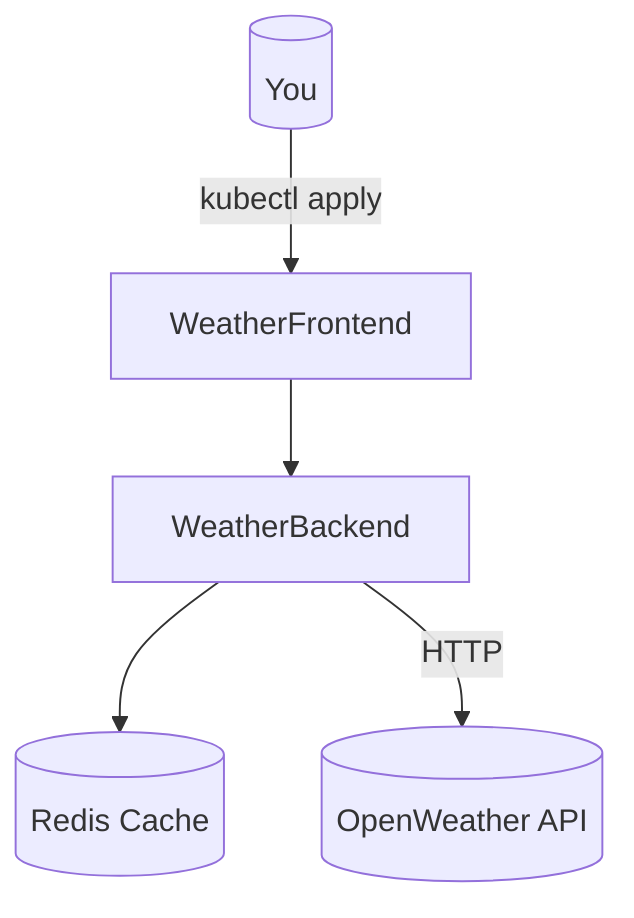

# Lab 1: Deploy Weather App (Basics)

In 20 minutes, go from empty cluster to a working weather service—with real validation, not a toy hello world.

Build a small, resilient weather service (frontend + backend) and verify basic service plumbing.

**Time**: 20 minutes  
**Difficulty**: ⭐ Beginner  
**Focus**: Pods, Deployments, Services

> 🏅 Looking for a challenge? Jump to [Expert mode: advanced CrashLoopBackOff debugging](#-expert-mode-advanced-crashloopbackoff-debugging) after the main steps.

> 🎯 Challenge track (after main steps):
> 1) [Quick check](#-quick-check) · 2) [Break & fix](#-break--fix-debugging-challenge-optional-but-recommended) · 3) [Troubleshooting flow](#-troubleshooting-flow) · 4) [Observability check](#-observability-check-is-it-really-working) · 5) [Expert mode](#-expert-mode-advanced-crashloopbackoff-debugging) · 6) [Test your knowledge](#-test-your-knowledge) · 7) [Next lab](#-next-lab)

## ✅ Success criteria
- `kubectl get pods -n weather-lab` shows frontend & backend Running
- `kubectl get svc -n weather-lab` exposes the frontend (LoadBalancer or port-forwardable)
- You can curl the frontend and receive a 200 response

---

## 🎯 Objective
Deploy a 2-tier weather application and learn fundamental Kubernetes concepts.

## 📋 What You'll Learn
- Create and manage Pods
- Deploy with Deployments
- Expose services
- Scale replicas
- View logs

---

## ✅ Prerequisites Check

Before you dive in, make sure your workstation is ready:

```bash
./scripts/check-lab-prereqs.sh 1
```

This verifies `kubectl`, the Weather app manifests, and the optional manifest overlay are present.

## 💻 Resource Requirements

> **💡 Planning ahead?** See the complete [Resource Requirements Guide](../docs/reference/resource-requirements.md) for all labs, port allocation matrix, and optimization tips.

**This lab needs**:
- **CPU**: 300m requests, 1.45 CPU limits
- **Memory**: 384Mi requests, 1.5Gi limits
- **Pods**: 4 total (1 Redis, 1 backend, 2 frontend)
- **Disk**: ~200MB for container images
- **Ports**: Frontend (8080), Backend (5000)

**Minimum cluster**: 2 CPU cores, 4GB RAM, 10GB disk  
**Estimated time**: 20 minutes

<details>
<summary>👉 Click to see detailed breakdown</summary>

| Component | CPU Request | CPU Limit | Memory Request | Memory Limit | Replicas |
|-----------|-------------|-----------|----------------|--------------|----------|
| Redis | 50m | 200m | 64Mi | 256Mi | 1 |
| Backend | 100m | 500m | 128Mi | 512Mi | 1 |
| Frontend | 50m | 250m | 64Mi | 256Mi | 2 |

**Port Allocation**:
- Frontend Service: 80 (ClusterIP)
- Frontend Port-Forward: 8080 → 80 (browser access)
- Backend Service: 5000 (ClusterIP)
- Backend Port-Forward: 5000 → 5000 (API testing)
- Redis: 6379 (internal only)

**Working Directory**: All commands assume you're in `/path/to/stack-to-k8s-main` (repository root)

</details>

## 🧭 Architecture Snapshot



## 📦 Manifest Starter Kit

This workspace offers **two learning paths** for each lab. Choose the one that matches your learning style:

### 🚀 Fast Track (Recommended for beginners)
Use pre-built `kustomize` overlays that bundle all resources for each lab:
```bash
kustomize build labs/manifests/lab-01 | kubectl apply -f -
```
**Benefits**:
- ✅ One command deploys everything
- ✅ Pre-configured namespaces and labels
- ✅ Focus on concepts, not YAML details
- ✅ Faster iteration for learning

**When to use**: First time through labs, concept validation, quick demos

---

### 🛠️ Hands-On Mode (Deep learning)
Manually apply manifests from each app's `k8s/` directory:
```bash
kubectl apply -f weather-app/k8s/backend-deployment.yaml -n weather-lab
kubectl apply -f weather-app/k8s/backend-service.yaml -n weather-lab
# ... repeat for all resources
```
**Benefits**:
- ✅ Understand each resource individually
- ✅ Practice YAML troubleshooting
- ✅ Build muscle memory for kubectl commands
- ✅ Prepare for CKA/CKAD exams

**When to use**: Second pass through labs, skill building, exam prep

---

**💡 Pro Tip**: Try Fast Track first to understand the concepts, then repeat the lab in Hands-On Mode to master the mechanics.

The steps below use **Hands-On Mode** commands. To use Fast Track, replace manual commands with the kustomize command shown above.

---

## 🧠 Quick Check

1. What Kubernetes object provides a stable network endpoint for a set of pods?
2. How do you scale a Deployment to 3 replicas from the CLI?
3. Why is it better to use `-n` on kubectl commands instead of changing the current context namespace?

Check your answers after completing the lab.

## 🏆 Challenge Mode

- Add a simple readiness probe to the frontend deployment that checks `/` (root path) and verify the pod stays in Ready state during a simulated slow backend response (use `kubectl exec` to simulate delay if needed).

## 🚀 Steps

> **📂 Working Directory**: All commands below assume you're in the **repository root** (`/path/to/stack-to-k8s-main`). If you just cloned the repo, you're already there!
>
> ```bash
> # Verify you're in the right place
> pwd
> # Should show: /path/to/stack-to-k8s-main
> 
> # If not, navigate there
> cd /path/to/stack-to-k8s-main
> ```

### 1. Verify Cluster (2 min)

```bash
# Check cluster is running
kubectl cluster-info

# Check available nodes
kubectl get nodes

# Should see: 1+ nodes in Ready state
```

**✅ Success Check**: Node status shows `Ready`, control plane is reachable

---

### 2. Create Namespace (1 min)

```bash
# Create isolated environment for this lab
kubectl create namespace weather-lab

# Safer option (recommended): prefer using -n on kubectl commands rather than switching your current kubectl context
# Example: kubectl apply -f weather-app/k8s/backend-deployment.yaml -n weather-lab

# If you prefer to change the current context namespace, capture previous namespace and restore when done:
PREV_NS=$(kubectl config view --minify --output 'jsonpath={..namespace}' 2>/dev/null || echo default)
kubectl config set-context --current --namespace=weather-lab
# To restore:
kubectl config set-context --current --namespace="$PREV_NS"

# Verify namespace was created
kubectl get namespace weather-lab
```

**✅ Success Check**: Namespace `weather-lab` exists and is `Active`

---

### 3. Deploy Backend (5 min)

```bash
# Deploy backend API
kubectl apply -f weather-app/k8s/backend-deployment.yaml -n weather-lab

# Watch pods start
kubectl get pods -n weather-lab -w

# Wait for Running status (press Ctrl+C when ready)
```

**Check pod details**:
```bash
# List pods
kubectl get pods -n weather-lab

# Describe pod (replace <pod-name>)
kubectl describe pod <backend-pod-name> -n weather-lab

# View logs
kubectl logs <backend-pod-name> -n weather-lab
```

### 4. Expose Backend Service (2 min)

```bash
# Create service
kubectl apply -f weather-app/k8s/backend-service.yaml -n weather-lab

# Verify service
kubectl get svc -n weather-lab

# Check endpoints
kubectl get endpoints -n weather-lab
```

### 5. Deploy Redis Cache (3 min)

```bash
# Deploy Redis for caching weather data
kubectl apply -f weather-app/k8s/redis-deployment.yaml -n weather-lab
kubectl apply -f weather-app/k8s/redis-service.yaml -n weather-lab

# Verify Redis is running
kubectl get pods -n weather-lab -l app=redis

# Check Redis connectivity
kubectl exec -n weather-lab deploy/redis -- redis-cli ping
# Expected: PONG
```

### 6. Deploy Frontend (5 min)

```bash
# Deploy frontend
kubectl apply -f weather-app/k8s/frontend-deployment.yaml -n weather-lab
kubectl apply -f weather-app/k8s/frontend-service.yaml -n weather-lab

# Check all resources
kubectl get all -n weather-lab
```

### 7. Access Application (3 min)

```bash
# Port forward to frontend
kubectl port-forward -n weather-lab service/weather-frontend 8080:80

# Open browser: http://localhost:8080
# Try searching for a city (e.g., "London")
```

### 8. Scale Application (2 min)

```bash
# Scale backend to 3 replicas
kubectl scale deployment/weather-backend --replicas=3 -n weather-lab

# Verify scaling
kubectl get pods -n weather-lab -l app=weather-backend

# Should see 3 backend pods
```

---

## ✅ Validation

Run these commands to verify success:

```bash
# 1. All pods running
kubectl get pods -n weather-lab
# Expected: 3 backend + 1 frontend + 1 redis (all Running)

# 2. Services created
kubectl get svc -n weather-lab
# Expected: weather-backend (ClusterIP), weather-frontend (LoadBalancer), redis (ClusterIP)

# 3. Application responding
kubectl port-forward -n weather-lab svc/weather-frontend 8080:80 &
sleep 2  # Wait for port-forward to establish
curl http://localhost:8080
# Expected: HTML response

# 4. Backend API working
kubectl port-forward -n weather-lab svc/weather-backend 5000:5000 &
sleep 2  # Wait for port-forward to establish
curl http://localhost:5000/api/health
# Expected: {"status":"healthy"}
```

**All checks pass?** ✅ Lab complete!

---

## 🧠 Quick Check

<details>
	<summary>What happens if the service selector doesn't match the pod labels?</summary>
	The service will show **0 endpoints** and all traffic to `weather-frontend` will fail. Diagnose with:

	```bash
	kubectl describe service weather-frontend -n weather-lab
	```
	</details>

<details>
	<summary>How do you inspect logs for a single backend replica?</summary>
	Use label selectors so you don't have to copy/paste pod names:

	```bash
	kubectl logs -n weather-lab -l app=weather-backend
	```
	</details>

## 🏆 Challenge Mode

- Swap Redis for the in-memory cache by adding an environment variable toggle.
- Configure a horizontal pod autoscaler that scales `weather-backend` between 2 and 5 replicas at 60% CPU.
- Create a Kubernetes Job that warms the cache with a list of popular cities.

## 🔧 Troubleshooting Flow

1. **Pod stuck Pending?** → `kubectl describe pod <name> -n weather-lab` → look for image pull or scheduling issues.
2. **Port-forward fails?** → Ensure the service port is correct: `kubectl get svc weather-frontend -n weather-lab`.
3. **API returns 500s?** → Check Redis connectivity: `kubectl exec -n weather-lab deploy/weather-backend -- redis-cli ping`.
4. **No weather data?** → Confirm the OpenWeather key is populated: `kubectl get secret weather-secrets -n weather-lab -o yaml`.

---

## 🔍 Observability Check: Is It Really Working?

**The Problem**: "It deployed!" ≠ "It works!" Many beginners kubectl apply, see Running pods, then spend 30 minutes debugging why the app doesn't actually work.

**The Solution**: Always validate the **3 Pillars of Observability** after deployment:

### ✅ Pillar 1: Metrics (Resource Health)
```bash
# Are pods consuming expected resources?
kubectl top pods -n weather-lab

# Expected output:
# NAME                               CPU(cores)   MEMORY(bytes)
# weather-frontend-xxx               5m           50Mi        ← Normal for Node.js
# weather-backend-xxx                10m          80Mi        ← Redis client overhead
# weather-redis-xxx                  15m          20Mi        ← Idle Redis

# 🚨 Red flags:
# - CPU > 200m = likely crash loop (check logs)
# - Memory > 500Mi = possible memory leak
# - No output = metrics-server not installed (kubectl apply -f https://github.com/kubernetes-sigs/metrics-server/releases/latest/download/components.yaml)
```

### ✅ Pillar 2: Logs (Application Behavior)
```bash
# Follow live logs from all pods (use stern for simplicity)
stern -n weather-lab weather

# Or individual component logs:
kubectl logs -n weather-lab deploy/weather-frontend --tail=20
kubectl logs -n weather-lab deploy/weather-backend --tail=20

# Expected success indicators:
# Frontend: "Server listening on port 3000"
# Backend: "Connected to Redis at weather-redis:6379"
# Backend: "Fetched weather for New York: 72°F"

# 🚨 Red flags in logs:
# - "ECONNREFUSED" = Service name typo or port mismatch
# - "401 Unauthorized" = API key not loaded from Secret
# - "OOMKilled" in kubectl describe = Increase memory limits
```

### ✅ Pillar 3: Events (Kubernetes Actions)
```bash
# View recent cluster events (scheduling, pulling images, errors)
kubectl get events -n weather-lab --sort-by='.lastTimestamp' --field-selector type!=Normal | tail -20

# No news is good news! If you see:
# - "Failed to pull image" → Image name typo or Docker Hub rate limit
# - "Back-off restarting failed container" → App crashes on startup (check logs)
# - "FailedScheduling" → Insufficient CPU/memory on nodes

# Pro tip: Watch events in real-time during deployment
kubectl get events -n weather-lab --watch
```

### 🎯 Quick Validation Checklist
After `kubectl apply`, run these 3 commands:
```bash
# 1. All pods Running?
kubectl get pods -n weather-lab

# 2. Logs show "started" messages?
kubectl logs -n weather-lab deploy/weather-backend --tail=5

# 3. App responds to HTTP?
kubectl run curl-test --image=curlimages/curl -i --rm --restart=Never -n weather-lab -- \
  curl -s http://weather-backend:3001/api/weather/London
# Expected: {"city":"London","temp":59,...}
```

**Golden Rule**: If any pillar shows errors, **don't move forward**. Fix it now—debugging gets 10x harder after adding more components.

---

## 🧹 Cleanup

```bash
# Delete namespace (removes everything)
kubectl delete namespace weather-lab

# Verify deletion
kubectl get all -n weather-lab
# Expected: "No resources found"
```

---

## 🎓 Key Concepts Learned

1. **Pods**: Smallest deployable unit (container wrapper)
2. **Deployments**: Manage pod replicas and updates
3. **Services**: Stable network endpoint for pods
4. **Scaling**: Increase/decrease replicas
5. **Port Forwarding**: Access services from local machine
6. **Namespaces**: Isolated environments

---

## 📚 Commands Reference

```bash
# View resources
kubectl get pods
kubectl get deployments
kubectl get services
kubectl get all

# Describe resource (detailed info)
kubectl describe pod <name>

# View logs
kubectl logs <pod-name>
kubectl logs -f <pod-name>  # Follow logs

# Scale deployment
kubectl scale deployment/<name> --replicas=N

# Delete resources
kubectl delete pod <name>
kubectl delete deployment <name>
kubectl delete namespace <name>
```

---

## 🏭 Production vs lab: what changes in real life?

You've learned to deploy pods with basic manifests. But **production Kubernetes** looks very different! Here's what you'd actually deploy at scale:

### **Your Lab Deployment (Simplified for Learning)**

```yaml
apiVersion: apps/v1
kind: Deployment
metadata:
  name: weather-backend
  namespace: weather-lab
spec:
  replicas: 2
  selector:
    matchLabels:
      app: weather-backend
  template:
    metadata:
      labels:
        app: weather-backend
    spec:
      containers:
      - name: backend
        image: your-registry/weather-backend:latest
        ports:
        - containerPort: 8000
```

**What's good**: Simple, easy to understand, gets you started  
**What's missing**: Everything needed for production reliability!

---

### **🏭 Production Deployment (What Netflix/Stripe/Airbnb Actually Run)**

```yaml
apiVersion: apps/v1
kind: Deployment
metadata:
  name: weather-backend
  namespace: production
  labels:
    app: weather-backend
    version: v2.1.3
    tier: backend
    owner: weather-team
    cost-center: engineering
  annotations:
    prometheus.io/scrape: "true"         # Enable metrics scraping
    prometheus.io/port: "8000"
    fluxcd.io/automated: "true"          # GitOps automation
    deployment.kubernetes.io/revision: "42"
spec:
  replicas: 5                            # More replicas for HA
  revisionHistoryLimit: 10               # Keep last 10 deployments for rollback
  strategy:
    type: RollingUpdate
    rollingUpdate:
      maxSurge: 1                        # Create 1 extra pod during update
      maxUnavailable: 0                  # Never go below desired count (zero downtime!)
  selector:
    matchLabels:
      app: weather-backend
      version: v2.1.3                    # Specific version selector
  template:
    metadata:
      labels:
        app: weather-backend
        version: v2.1.3
        tier: backend
      annotations:
        sidecar.istio.io/inject: "true"  # Service mesh sidecar
    spec:
      # Security: Run as non-root user
      securityContext:
        runAsNonRoot: true
        runAsUser: 1000
        fsGroup: 1000
        seccompProfile:
          type: RuntimeDefault
      
      # High availability: Spread pods across nodes
      affinity:
        podAntiAffinity:
          requiredDuringSchedulingIgnoredDuringExecution:
          - labelSelector:
              matchLabels:
                app: weather-backend
            topologyKey: kubernetes.io/hostname  # Different nodes
        nodeAffinity:
          preferredDuringSchedulingIgnoredDuringExecution:
          - weight: 100
            preference:
              matchExpressions:
              - key: node.kubernetes.io/instance-type
                operator: In
                values:
                - c5.xlarge                       # Prefer compute-optimized nodes
      
      # Tolerations: Can run on spot instances (cost savings)
      tolerations:
      - key: "spot"
        operator: "Equal"
        value: "true"
        effect: "NoSchedule"
      
      # Service account for RBAC
      serviceAccountName: weather-backend-sa
      automountServiceAccountToken: true
      
      # Restart policy
      restartPolicy: Always
      terminationGracePeriodSeconds: 30
      
      # Init container: Wait for database
      initContainers:
      - name: wait-for-db
        image: busybox:1.36
        command:
        - sh
        - -c
        - |
          until nc -z postgres.default.svc.cluster.local 5432; do
            echo "Waiting for database..."
            sleep 2
          done
      
      containers:
      - name: backend
        image: your-registry/weather-backend:v2.1.3  # Immutable tag (SHA or semver)
        imagePullPolicy: Always
        
        ports:
        - name: http
          containerPort: 8000
          protocol: TCP
        - name: metrics
          containerPort: 9090
          protocol: TCP
        
        # Resource limits: Prevent resource starvation
        resources:
          requests:
            cpu: 500m                    # Minimum CPU (0.5 cores)
            memory: 512Mi                # Minimum memory
          limits:
            cpu: 1000m                   # Maximum CPU (1 core)
            memory: 1Gi                  # Maximum memory (prevents OOMKill)
        
        # Health checks: Kubernetes monitors and restarts if unhealthy
        livenessProbe:
          httpGet:
            path: /health
            port: 8000
            scheme: HTTP
          initialDelaySeconds: 30        # Wait 30s after start
          periodSeconds: 10              # Check every 10s
          timeoutSeconds: 5              # Fail if no response in 5s
          successThreshold: 1
          failureThreshold: 3            # Restart after 3 failures
        
        readinessProbe:
          httpGet:
            path: /ready
            port: 8000
          initialDelaySeconds: 10
          periodSeconds: 5
          timeoutSeconds: 3
          successThreshold: 1
          failureThreshold: 2
        
        startupProbe:                    # For slow-starting apps
          httpGet:
            path: /startup
            port: 8000
          initialDelaySeconds: 0
          periodSeconds: 5
          failureThreshold: 30           # Allow 150s for startup (30 × 5s)
        
        # Environment variables
        env:
        - name: LOG_LEVEL
          value: "info"
        - name: REDIS_HOST
          valueFrom:
            configMapKeyRef:
              name: weather-config
              key: redis.host
        - name: POSTGRES_PASSWORD
          valueFrom:
            secretKeyRef:
              name: weather-db-credentials
              key: password
        - name: POD_NAME
          valueFrom:
            fieldRef:
              fieldPath: metadata.name
        - name: POD_NAMESPACE
          valueFrom:
            fieldRef:
              fieldPath: metadata.namespace
        - name: POD_IP
          valueFrom:
            fieldRef:
              fieldPath: status.podIP
        
        # Volume mounts
        volumeMounts:
        - name: config
          mountPath: /app/config
          readOnly: true
        - name: secrets
          mountPath: /app/secrets
          readOnly: true
        - name: tmp
          mountPath: /tmp
        - name: cache
          mountPath: /app/cache
      
      # Volumes
      volumes:
      - name: config
        configMap:
          name: weather-config
      - name: secrets
        csi:
          driver: secrets-store.csi.k8s.io
          readOnly: true
          volumeAttributes:
            secretProviderClass: "weather-secrets"
      - name: tmp
        emptyDir: {}
      - name: cache
        emptyDir:
          sizeLimit: 1Gi
```

---

### **🎓 What Changed & Why?**

Let's break down every production addition (70+ lines added!):

#### **1. Metadata Enrichment**
```yaml
labels:
  version: v2.1.3          # Track deployment versions
  tier: backend            # Architecture layer
  owner: weather-team      # Team ownership
  cost-center: engineering # Cost allocation
```
**Why**: Enables filtering (`kubectl get pods -l tier=backend`), cost tracking (AWS Cost Explorer tags), and team accountability.

---

#### **2. Rollout Strategy**
```yaml
strategy:
  rollingUpdate:
    maxSurge: 1           # Create 1 new pod before terminating old one
    maxUnavailable: 0     # Never go below 5 replicas (zero downtime!)
```
**Why**: Lab deployment can briefly go to 0 pods during update (downtime!). Production uses rolling update: New pod starts → becomes healthy → old pod terminates. **Zero downtime deployments.**

**Example**: 5 replicas rolling update:
```
Old pods: [1][2][3][4][5]  
New pod created: [1][2][3][4][5][6-new]  ← maxSurge: 1
New pod healthy: [1][2][3][4][5][6-new]  
Old pod terminated: [2][3][4][5][6-new]  ← maxUnavailable: 0 (still 5 pods)
Repeat until all old pods replaced...
```

---

#### **3. Security Context**
```yaml
securityContext:
  runAsNonRoot: true       # Container can't run as root
  runAsUser: 1000          # Specific non-root UID
  seccompProfile:
    type: RuntimeDefault   # Restrict syscalls (defense in depth)
```
**Why**: Lab containers run as root (UID 0) by default - **security vulnerability**! If attacker exploits app, they have root access. Production runs as non-root user (least-privilege).

**Real incident**: Tesla Kubernetes breach (2018) - attackers gained root access because containers ran as root. Used it to mine cryptocurrency on Tesla's AWS bill ($100K/month).

---

#### **4. Pod Anti-Affinity**
```yaml
podAntiAffinity:
  requiredDuringSchedulingIgnoredDuringExecution:
  - topologyKey: kubernetes.io/hostname  # Different nodes
```
**Why**: Lab allows all 2 pods on same node. If node crashes, **both pods die = downtime**. Production spreads pods across nodes. If 1 node crashes, 4 pods still running on other nodes.

---

#### **5. Resource Requests & Limits**
```yaml
resources:
  requests:
    cpu: 500m              # Guaranteed minimum
    memory: 512Mi
  limits:
    cpu: 1000m             # Hard cap (throttle if exceeded)
    memory: 1Gi            # Hard cap (OOMKill if exceeded)
```
**Why**: Lab has no limits - pods can consume 100% node CPU, starving other pods (**"noisy neighbor" problem**). Production limits prevent one app from crashing the entire node.

**Calculation**:
- Node: 8 CPU, 16 GB RAM
- Weather backend: 500m CPU request × 5 replicas = 2.5 CPU reserved
- Leaves 5.5 CPU for other apps (multi-tenancy)

---

#### **6. Health Probes (3 Types!)**
```yaml
livenessProbe:           # Is app alive? (Restart if fails)
  httpGet:
    path: /health
  failureThreshold: 3    # Restart after 3 failures

readinessProbe:          # Is app ready for traffic? (Remove from Service if fails)
  httpGet:
    path: /ready
  failureThreshold: 2

startupProbe:            # Is app starting? (Give slow apps more time)
  httpGet:
    path: /startup
  failureThreshold: 30   # Allow 150s for startup
```
**Why**: Lab has no probes - Kubernetes doesn't know if app is working! Production probes:
- **Liveness**: Restart crashed apps automatically (no manual intervention)
- **Readiness**: Remove unhealthy pods from load balancer (traffic goes to healthy pods only)
- **Startup**: Java apps can take 2 minutes to start - without this, Kubernetes restarts them prematurely

**Real impact**: Without readiness probes, 10% of requests hit unhealthy pods = 10% error rate!

---

#### **7. Init Containers**
```yaml
initContainers:
- name: wait-for-db
  image: busybox
  command: ["sh", "-c", "until nc -z postgres 5432; do sleep 2; done"]
```
**Why**: Lab app starts immediately, crashes if database isn't ready yet (CrashLoopBackOff). Production init containers wait for dependencies before starting main app.

---

#### **8. Secret Management**
```yaml
# Lab: Hardcoded Secret (❌ NEVER DO THIS IN PRODUCTION!)
env:
- name: POSTGRES_PASSWORD
  value: "hardcoded-password-123"

# Production: External Secrets Operator
volumeMounts:
- name: secrets
  mountPath: /app/secrets
volumes:
- name: secrets
  csi:
    driver: secrets-store.csi.k8s.io  # Fetches from AWS Secrets Manager
```
**Why**: Lab secrets in Git = **security breach** (see Capital One $190M fine). Production uses External Secrets Operator - secrets never touch Git.

---

#### **9. Observability**
```yaml
annotations:
  prometheus.io/scrape: "true"        # Prometheus scrapes metrics
  prometheus.io/port: "9090"
env:
- name: POD_NAME                      # Inject pod identity
  valueFrom:
    fieldRef:
      fieldPath: metadata.name
```
**Why**: Lab has no metrics - you're blind when issues occur. Production exposes metrics (request rate, latency, error rate) for Prometheus dashboards.

---

#### **10. Cost Optimization**
```yaml
tolerations:
- key: "spot"
  operator: "Equal"
  value: "true"
  effect: "NoSchedule"
```
**Why**: Lab runs on expensive on-demand instances. Production uses spot instances (70% cheaper!) for non-critical workloads.

**Savings**:
- On-demand: $0.096/hour × 5 pods × 730 hours = $350/month
- Spot: $0.029/hour × 5 pods × 730 hours = $106/month
- **Savings: $244/month = $2,928/year per app!**

---

### **📊 Production vs Lab Comparison Table**

| Feature | Lab Deployment | Production Deployment | Why It Matters |
|---------|----------------|----------------------|----------------|
| **Security** | Runs as root | Runs as non-root (UID 1000) | Limits damage if compromised |
| **High Availability** | All pods on 1 node | Spread across 3+ nodes | Node failure doesn't kill all pods |
| **Resource Limits** | None (can starve node) | CPU/memory limits set | Prevents "noisy neighbor" issues |
| **Health Checks** | None (blind restarts) | 3 probes (liveness, readiness, startup) | Automatic recovery, zero failed requests |
| **Rollout Strategy** | Can go to 0 pods | RollingUpdate (maxUnavailable: 0) | Zero downtime deployments |
| **Secrets** | Hardcoded in YAML | External Secrets Operator (CSI) | Prevents Capital One-style breaches |
| **Monitoring** | No metrics | Prometheus annotations, structured logs | MTTD (Mean Time To Detect) 2 min vs 20 min |
| **Cost** | On-demand instances | Spot instances (70% cheaper) | $2,928/year savings per app |
| **Dependencies** | App crashes if DB not ready | Init container waits for dependencies | Faster, cleaner startups |
| **Rollback** | Manual (no history) | revisionHistoryLimit: 10 | One-command rollback: `kubectl rollout undo` |

---

### **🎯 Key Takeaway**

> **Lab YAML teaches you Kubernetes basics. Production YAML keeps you employed.** 

The difference between "I deployed a pod" and "I architected a resilient, secure, cost-optimized production platform" is **these 70 lines of YAML**.

**Interview Gold**: When asked "Describe a production Kubernetes deployment you designed," reference this comparison. Shows you understand:
- ✅ Security (non-root, secrets management)
- ✅ Reliability (anti-affinity, health probes, rollout strategy)
- ✅ Observability (metrics, structured logs)
- ✅ Cost optimization (spot instances, right-sizing)
- ✅ Operations (rollback, GitOps, monitoring)

---

## 🔨 Break & Fix: Debugging Challenge (Optional but Recommended!)

**🟢 Debug Level 1** - Beginner: Label mismatches, basic pod issues

**Scenario**: Someone deployed the weather app but made 3 mistakes. Can you find and fix them?

### Setup

Deploy this broken manifest:

### 🎯 Bug Hunt

**Use these commands to investigate**:
```bash
# Check pod status
kubectl get pods -n weather-lab

# Check events (your best friend!)
kubectl get events -n weather-lab --sort-by='.lastTimestamp'

# Describe the pods
kubectl describe pod -n weather-lab -l app=weather-backed

# Check logs (if pod is running)
kubectl logs -n weather-lab -l app=weather-backend
```

### 🐛 Bug #1: Label Mismatch (EASY)

**Symptom**: Service can't find pods even though they're Running

**How to find it**:
```bash
kubectl get pods -n weather-lab --show-labels
kubectl get svc weather-backend -n weather-lab -o yaml | grep -A3 selector
```

**Hint**: Compare the Service selector with the pod labels. One character is different.

<details>
<summary>Solution</summary>

Pod label is `weather-backed` but Service looks for `weather-backend`.

**Fix**:
```bash
kubectl patch deployment weather-backend -n weather-lab \
  -p '{"spec":{"template":{"metadata":{"labels":{"app":"weather-backend"}}}}}'
```
</details>

### 🐛 Bug #2: ImagePullBackOff (MEDIUM)

**Symptom**: Pods stuck in ImagePullBackOff

**How to find it**:
```bash
kubectl describe pod -n weather-lab -l app=weather-backend | grep -A5 Events
```

**Hint**: Look for "Failed to pull image" in events. The tag `v1.0.99` doesn't exist.

<details>
<summary>Solution</summary>

Use a real image tag:
```bash
kubectl set image deployment/weather-backend -n weather-lab \
  backend=your-registry/weather-backend:latest
```

Or use the correct manifest from Lab 1 instructions.
</details>

### 🐛 Bug #3: OOMKilled (HARD)

**Symptom**: Pods start but crash after a few seconds. Status shows `OOMKilled`.

**How to find it**:
```bash
kubectl get pods -n weather-lab
# Look for STATUS: CrashLoopBackOff

kubectl describe pod <pod-name> -n weather-lab | grep -A3 "Last State"
# Shows: Reason: OOMKilled
```

**Hint**: Memory limit is 10Mi. Python Flask app needs at least 128Mi.

<details>
<summary>Solution</summary>

Increase memory limits:
```bash
kubectl set resources deployment weather-backend -n weather-lab \
  --limits=memory=256Mi \
  --requests=memory=128Mi
```
</details>

### ✅ Verify All Fixes

```bash
# All pods should be Running
kubectl get pods -n weather-lab

# Service should have endpoints
kubectl get endpoints weather-backend -n weather-lab

# Port-forward and test
kubectl port-forward -n weather-lab svc/weather-backend 5000:5000 &
sleep 2
curl http://localhost:5000/api/health
# Should return: {"status": "healthy"}
```

### 🎓 What You Learned

✅ **Label mismatches**: Cause silent failures (Service can't find pods)  
✅ **ImagePullBackOff**: Check image tags and registry access  
✅ **OOMKilled**: Set memory limits based on actual app needs (profile first!)  
✅ **Events are king**: `kubectl get events` shows most issues immediately  

**Real-world stat**: Label/selector mismatches cause 30% of Kubernetes incidents. You just debugged the most common production issue!

---

## 🎖️ Expert mode: advanced CrashLoopBackOff debugging

> 💡 **Optional Challenge** — This section is for those who want to master senior-level debugging skills. **Completing this is NOT required** to progress to Lab 2, but it will unlock the **🔬 Forensic Investigator** badge!

**⏱️ Time**: +20 minutes  
**🎯 Difficulty**: ⭐⭐⭐⭐ (Advanced)  
**📚 Prerequisites**: Complete Break & Fix section above

### The Scenario

It's 2:47 AM. You're on-call. A pod is in `CrashLoopBackOff`, but:
- ❌ `kubectl logs` shows **nothing**
- ❌ `kubectl describe` shows **no obvious errors**
- ❌ Exit code is `1` (generic failure)

**This is the scenario that stumps 70% of intermediate Kubernetes engineers in interviews.**

### Challenge: Debug Beyond kubectl

Your mission: Use advanced debugging techniques to find out why the pod crashes.

#### Step 1: Deploy the Mystery Pod

```bash
# Deploy a pod that crashes with no logs
kubectl apply -f - <<EOF
apiVersion: v1
kind: Pod
metadata:
  name: mystery-crash
  namespace: weather-lab
spec:
  containers:
  - name: app
    image: busybox:1.28
    command: ["/bin/sh"]
    args: ["-c", "/app/run.sh"]
    volumeMounts:
    - name: app-code
      mountPath: /app
  volumes:
  - name: app-code
    configMap:
      name: mystery-app
      defaultMode: 0644  # ← Key clue!
---
apiVersion: v1
kind: ConfigMap
metadata:
  name: mystery-app
  namespace: weather-lab
data:
  run.sh: |
    #!/bin/sh
    echo "Starting app..."
    sleep 5
    echo "App started successfully!"
EOF
```

#### Step 2: Observe the Problem

```bash
# Pod will crash immediately
kubectl get pod mystery-crash -n weather-lab -w

# Try standard debugging (won't help!)
kubectl logs mystery-crash -n weather-lab
# Output: (empty)

kubectl describe pod mystery-crash -n weather-lab
# Last State: Terminated, Reason: Error, Exit Code: 1
```

### Advanced Debugging Techniques

#### Technique 1: Ephemeral Debug Container (K8s 1.23+)

```bash
# Attach a debug container to inspect the crashed pod
kubectl debug mystery-crash -n weather-lab -it \
  --image=busybox:1.28 \
  --target=app \
  --copy-to=mystery-crash-debug

# Inside the debug container:
ls -la /app
# Notice: run.sh has NO execute permission!

# Check permissions
stat /app/run.sh
# Output: Access: (0644/-rw-r--r--)  ← Not executable!
```

**Root Cause**: ConfigMap `defaultMode: 0644` means files are NOT executable. Should be `0755`.

#### Technique 2: Check Container Logs Directly (Node Access)

```bash
# Find which node the pod is on
kubectl get pod mystery-crash -n weather-lab -o wide

# If you have node access (e.g., kind cluster):
docker exec -it <node-name> sh

# Find container logs (bypasses kubectl caching)
crictl ps -a | grep mystery-crash
crictl logs <container-id>
# Shows: /bin/sh: /app/run.sh: Permission denied
```

#### Technique 3: Inspect Image & Entrypoint

```bash
# What command actually runs?
kubectl get pod mystery-crash -n weather-lab -o json | jq '.spec.containers[0].command'

# Inspect the image locally
docker run --rm --entrypoint sh busybox:1.28 -c 'ls -la /app 2>&1'
```

### The Fix

```bash
# Delete broken pod
kubectl delete pod mystery-crash -n weather-lab

# Recreate with correct permissions
kubectl apply -f - <<EOF
apiVersion: v1
kind: ConfigMap
metadata:
  name: mystery-app
  namespace: weather-lab
data:
  run.sh: |
    #!/bin/sh
    echo "Starting app..."
    sleep 5
    echo "App started successfully!"
---
apiVersion: v1
kind: Pod
metadata:
  name: mystery-crash-fixed
  namespace: weather-lab
spec:
  containers:
  - name: app
    image: busybox:1.28
    command: ["/bin/sh"]
    args: ["-c", "/app/run.sh"]
    volumeMounts:
    - name: app-code
      mountPath: /app
  volumes:
  - name: app-code
    configMap:
      name: mystery-app
      defaultMode: 0755  # ✅ FIXED: Executable permissions
EOF

# Verify it works
kubectl logs mystery-crash-fixed -n weather-lab -f
```

### 🏆 Badge Unlocked: 🔬 Forensic Investigator

**Congratulations!** You've mastered debugging pods with no logs. This skill is invaluable for:
- Production incidents where logs are lost
- Crashes that happen before logging frameworks initialize
- Permission and file system issues

**Next Level**: Learn more advanced debugging in [Senior Kubernetes Debugging Guide](../docs/reference/senior-k8s-debugging.md#11-pod-stuck-in-crashloopbackoff---no-logs-no-errors).

### Interview Prep

**Common interview question**: "A pod crashes with no logs. Walk me through your debugging process."

**Your answer now**:
> "First, I check the exit code in `kubectl describe`. Exit code 1 is generic, so I'd use `kubectl debug` with an ephemeral container to inspect the filesystem and check file permissions. I've seen cases where ConfigMaps mount files without execute permissions. If that doesn't reveal it, I'd SSH to the node and use `crictl logs` to bypass kubectl's log caching. For compiled binaries, I'd also check shared library dependencies with `ldd`. The key is having multiple debugging techniques beyond just `kubectl logs`."

---

## 🧠 Test Your Knowledge

Ready to verify your mastery? Take the **[Lab 1 Self-Assessment Quiz](../docs/learning/SELF-ASSESSMENT.md#%EF%B8%8F-lab-1--weather-app-basics)** and see how you score!

---

## 🚀 Next lab

**[Lab 2: E-commerce Multi-Service](02-ecommerce-basics.md)**

Learn about:
- Multi-container deployments
- Service discovery
- ConfigMaps
- Health checks
