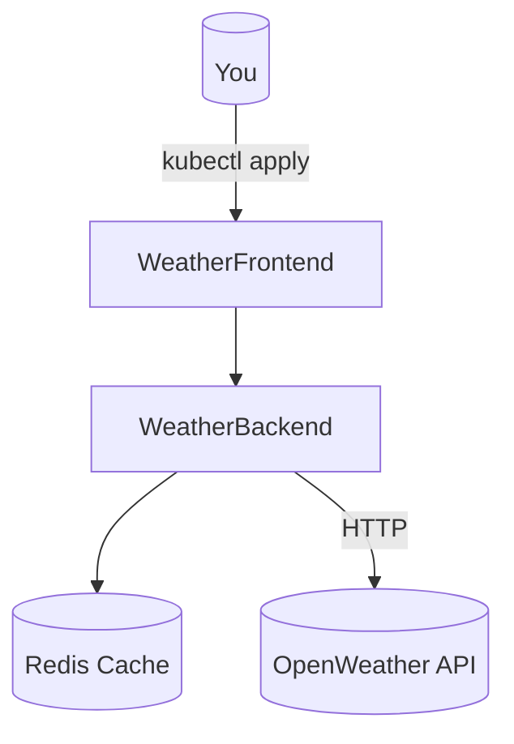

# Lab 1: Deploy Weather App (Basics)
Ship a two-tier app to your cluster and prove it works — fast.

Build a small, resilient weather service (frontend + backend) and verify basic service plumbing.

**Time**: 20 minutes  
**Difficulty**: ⭐ Beginner  
**Focus**: Pods, Deployments, Services

## ✅ Success criteria
- `kubectl get pods -n weather-lab` shows frontend & backend Running
- `kubectl get svc -n weather-lab` exposes the frontend (ClusterIP / port-forwardable)
- You can curl the frontend and receive a 200 response

---

## 🎯 Objective
Deploy a 2-tier weather application and learn fundamental Kubernetes concepts.

## 📋 What You'll Learn
- Create and manage Pods
- Deploy with Deployments
- Expose services
- Scale replicas
- View logs

---

## ✅ Prerequisites Check

Before you dive in, make sure your workstation is ready:

```bash
./scripts/check-lab-prereqs.sh 1
```

This verifies `kubectl`, the Weather app manifests, and the optional manifest overlay are present.

## 🧭 Architecture Snapshot



## 📦 Manifest Starter Kit

- Premium shortcut: `kustomize build labs/manifests/lab-01 | kubectl apply -f -`
- DIY route: apply the manifests in `weather-app/k8s/base`, swapping the namespace to `weather-lab` as shown below.

---

## 🚀 Steps

### 1. Verify Cluster (2 min)

```bash
# Check cluster is running
kubectl cluster-info

# Check available nodes
kubectl get nodes

# Should see: 1+ nodes in Ready state
```

### 2. Create Namespace (1 min)

```bash
# Create isolated environment
kubectl create namespace weather-lab

# Safer option (recommended): prefer using -n on kubectl commands rather than switching your current kubectl context
# Example: kubectl apply -f weather-app/k8s/backend-deployment.yaml -n weather-lab

# If you prefer to change the current context namespace, capture previous namespace and restore when done:
PREV_NS=$(kubectl config view --minify --output 'jsonpath={..namespace}' 2>/dev/null || echo default)
kubectl config set-context --current --namespace=weather-lab
# To restore:
kubectl config set-context --current --namespace="$PREV_NS"

# Verify
kubectl get namespace weather-lab
```

### 3. Deploy Backend (5 min)

```bash
# Deploy backend API
kubectl apply -f weather-app/k8s/backend-deployment.yaml -n weather-lab

# Watch pods start
kubectl get pods -n weather-lab -w

# Wait for Running status (press Ctrl+C when ready)
```

**Check pod details**:
```bash
# List pods
kubectl get pods -n weather-lab

# Describe pod (replace <pod-name>)
kubectl describe pod <backend-pod-name> -n weather-lab

# View logs
kubectl logs <backend-pod-name> -n weather-lab
```

### 4. Expose Backend Service (2 min)

```bash
# Create service
kubectl apply -f weather-app/k8s/backend-service.yaml -n weather-lab

# Verify service
kubectl get svc -n weather-lab

# Check endpoints
kubectl get endpoints -n weather-lab
```

### 5. Deploy Frontend (5 min)

```bash
# Deploy frontend
kubectl apply -f weather-app/k8s/frontend-deployment.yaml -n weather-lab
kubectl apply -f weather-app/k8s/frontend-service.yaml -n weather-lab

# Check all resources
kubectl get all -n weather-lab
```

### 6. Access Application (3 min)

```bash
# Port forward to frontend
kubectl port-forward -n weather-lab service/weather-frontend 8080:80

# Open browser: http://localhost:8080
# Try searching for a city (e.g., "London")
```

### 7. Scale Application (2 min)

```bash
# Scale backend to 3 replicas
kubectl scale deployment/weather-backend --replicas=3 -n weather-lab

# Verify scaling
kubectl get pods -n weather-lab -l app=weather-backend

# Should see 3 backend pods
```

---

## ✅ Validation

Run these commands to verify success:

```bash
# 1. All pods running
kubectl get pods -n weather-lab
# Expected: 3 backend + 1 frontend (all Running)

# 2. Services created
kubectl get svc -n weather-lab
# Expected: weather-backend (ClusterIP), weather-frontend (LoadBalancer/NodePort)

# 3. Application responding
kubectl port-forward -n weather-lab svc/weather-frontend 8080:80 &
curl http://localhost:8080
# Expected: HTML response

# 4. Backend API working
kubectl port-forward -n weather-lab svc/weather-backend 5000:5000 &
curl http://localhost:5000/api/health
# Expected: {"status":"healthy"}
```

**All checks pass?** ✅ Lab complete!

---

## 📊 Validate Your Work

Prefer an automated audit? Run the validator:

```bash
./scripts/validate-lab.sh 1
```

You’ll get a success/fail summary for namespaces, deployments, and services touched in this lab.

## 🧠 Quick Check

<details>
	<summary>What happens if the service selector doesn't match the pod labels?</summary>
	The service will show **0 endpoints** and all traffic to `weather-frontend` will fail. Diagnose with:

	```bash
	kubectl describe service weather-frontend -n weather-lab
	```
	</details>

<details>
	<summary>How do you inspect logs for a single backend replica?</summary>
	Use label selectors so you don't have to copy/paste pod names:

	```bash
	kubectl logs -n weather-lab -l app=weather-backend
	```
	</details>

## 🏆 Challenge Mode

- Swap Redis for the in-memory cache by adding an environment variable toggle.
- Configure a horizontal pod autoscaler that scales `weather-backend` between 2 and 5 replicas at 60% CPU.
- Create a Kubernetes Job that warms the cache with a list of popular cities.

## 🔧 Troubleshooting Flow

1. **Pod stuck Pending?** → `kubectl describe pod <name> -n weather-lab` → look for image pull or scheduling issues.
2. **Port-forward fails?** → Ensure the service port is correct: `kubectl get svc weather-frontend -n weather-lab`.
3. **API returns 500s?** → Check Redis connectivity: `kubectl exec -n weather-lab deploy/weather-backend -- redis-cli ping`.
4. **No weather data?** → Confirm the OpenWeather key is populated: `kubectl get secret weather-secrets -n weather-lab -o yaml`.

---

## 🧹 Cleanup

```bash
# Delete namespace (removes everything)
kubectl delete namespace weather-lab

# Verify deletion
kubectl get all -n weather-lab
# Expected: "No resources found"
```

---

## 🎓 Key Concepts Learned

1. **Pods**: Smallest deployable unit (container wrapper)
2. **Deployments**: Manage pod replicas and updates
3. **Services**: Stable network endpoint for pods
4. **Scaling**: Increase/decrease replicas
5. **Port Forwarding**: Access services from local machine
6. **Namespaces**: Isolated environments

---

## 📚 Commands Reference

```bash
# View resources
kubectl get pods
kubectl get deployments
kubectl get services
kubectl get all

# Describe resource (detailed info)
kubectl describe pod <name>

# View logs
kubectl logs <pod-name>
kubectl logs -f <pod-name>  # Follow logs

# Scale deployment
kubectl scale deployment/<name> --replicas=N

# Delete resources
kubectl delete pod <name>
kubectl delete deployment <name>
kubectl delete namespace <name>
```

---

## 🚀 Next Lab

**[Lab 2: E-commerce Multi-Service](02-ecommerce-basics.md)**

Learn about:
- Multi-container deployments
- Service discovery
- ConfigMaps
- Health checks
