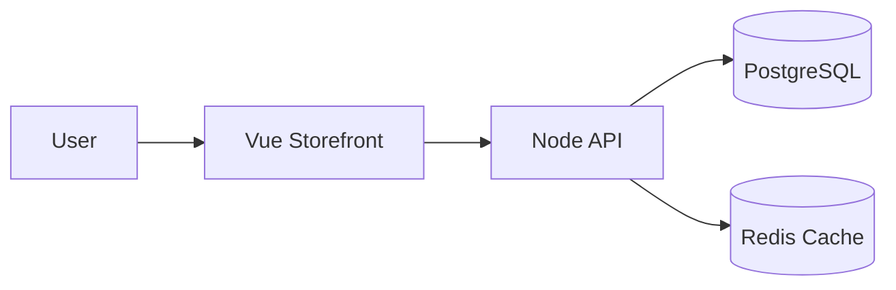

# Lab 2: E-commerce Multi-Service Deployment
Deploy a production-like storefront and verify inter-service comms and persistence.

Build a multi-service storefront (backend, frontend, DB) and validate service discovery and config-driven deployment.

**Time**: 30 minutes  
**Difficulty**: ⭐⭐ Intermediate  
**Focus**: Multi-tier apps, Service discovery, ConfigMaps

## ✅ Success criteria
- PostgreSQL pod is Running and PVC bound
- Backend and frontend pods are Running
- Frontend returns HTTP 200 via port-forward

---

## 🎯 Objective
Deploy a complete e-commerce application with backend API, frontend, and PostgreSQL database. Learn how services communicate in Kubernetes.

## 📋 What You'll Learn
- Multi-container deployments
- Service discovery (DNS)
- ConfigMaps for configuration
- Database persistent storage
- Environment variables in K8s

---

## ✅ Prerequisites Check

```bash
./scripts/check-lab-prereqs.sh 2
```

Ensure `kubectl` can reach your cluster and that the `ecommerce-app/k8s` manifests are available locally.

## 🧭 Architecture Snapshot



## 📦 Manifest Starter Kit

- Curated overlay: coming soon at `labs/manifests/lab-02/`
- Manual route: apply manifests from `ecommerce-app/k8s`, setting the namespace to `ecommerce-lab` per the guide.

---

## 🚀 Steps

### 1. Create Namespace (1 min)

```bash
kubectl create namespace ecommerce-lab

# Safer option: prefer using -n on kubectl commands rather than switching your current kubectl context
# Example: kubectl apply -f ecommerce-app/k8s/database-deployment.yaml -n ecommerce-lab

# If you must change the current context namespace, capture and restore it:
PREV_NS=$(kubectl config view --minify --output 'jsonpath={..namespace}' 2>/dev/null || echo default)
kubectl config set-context --current --namespace=ecommerce-lab
# To restore:
kubectl config set-context --current --namespace="$PREV_NS"
```

### 2. Deploy Database (5 min)

```bash
# Deploy PostgreSQL
kubectl apply -f ecommerce-app/k8s/database-deployment.yaml -n ecommerce-lab
kubectl apply -f ecommerce-app/k8s/database-service.yaml -n ecommerce-lab

# Wait for database to be ready
kubectl wait --for=condition=ready pod -l app=postgres -n ecommerce-lab --timeout=120s
```

**Check database**:
```bash
# List pods
kubectl get pods -n ecommerce-lab

# Check logs
kubectl logs -l app=postgres -n ecommerce-lab

# Should see: "database system is ready to accept connections"
```

### 3. Create ConfigMap (3 min)

```bash
# Create config for backend
kubectl create configmap ecommerce-config -n ecommerce-lab \
  --from-literal=DATABASE_HOST=postgres \
  --from-literal=DATABASE_PORT=5432 \
  --from-literal=DATABASE_NAME=ecommerce

# Verify
kubectl get configmap ecommerce-config -n ecommerce-lab -o yaml
```

### 4. Deploy Backend API (5 min)

```bash
# Deploy backend
kubectl apply -f ecommerce-app/k8s/backend-deployment.yaml -n ecommerce-lab
kubectl apply -f ecommerce-app/k8s/backend-service.yaml -n ecommerce-lab

# Watch backend start
kubectl get pods -n ecommerce-lab -w
# Press Ctrl+C when backend is Running
```

**Test backend connectivity**:
```bash
# Port forward
kubectl port-forward -n ecommerce-lab service/ecommerce-backend 8000:8000 &

# Test API
curl http://localhost:8000/api/health
# Expected: {"status":"healthy","database":"connected"}
```

### 5. Deploy Frontend (5 min)

```bash
# Deploy frontend
kubectl apply -f ecommerce-app/k8s/frontend-deployment.yaml -n ecommerce-lab
kubectl apply -f ecommerce-app/k8s/frontend-service.yaml -n ecommerce-lab

# Check all resources
kubectl get all -n ecommerce-lab
```

### 6. Test Service Discovery (5 min)

**Key concept**: Services communicate using DNS names.

```bash
# Get backend pod name
BACKEND_POD=$(kubectl get pods -n ecommerce-lab -l app=ecommerce-backend -o jsonpath='{.items[0].metadata.name}')

# Test DNS resolution from backend to database
kubectl exec -n ecommerce-lab $BACKEND_POD -- nslookup postgres

# Test connection
kubectl exec -n ecommerce-lab $BACKEND_POD -- curl -s http://postgres:5432
```

### 7. Access Application (3 min)

```bash
# Port forward frontend
kubectl port-forward -n ecommerce-lab service/ecommerce-frontend 3000:80

# Open browser: http://localhost:3000
# Browse products, add to cart, checkout
```

### 8. Scale Backend (3 min)

```bash
# Scale to handle more traffic
kubectl scale deployment/ecommerce-backend --replicas=3 -n ecommerce-lab

# Watch pods scale
kubectl get pods -n ecommerce-lab -l app=ecommerce-backend -w

# Test load distribution
for i in {1..10}; do
  kubectl exec -n ecommerce-lab $BACKEND_POD -- curl -s http://ecommerce-backend:8000/api/health | grep -o "pod.*"
done
```

---

## ✅ Validation

Run these commands to verify success:

```bash
# 1. All pods running
kubectl get pods -n ecommerce-lab
# Expected: 1 database, 3 backend, 1 frontend (all Running)

# 2. All services created
kubectl get svc -n ecommerce-lab
# Expected: postgres, ecommerce-backend, ecommerce-frontend

# 3. ConfigMap exists
kubectl get configmap -n ecommerce-lab
# Expected: ecommerce-config

# 4. Service discovery works
kubectl exec -n ecommerce-lab $BACKEND_POD -- nslookup postgres
# Expected: DNS resolution successful

# 5. Backend connects to database
curl http://localhost:8000/api/products
# Expected: JSON list of products

# 6. Frontend accessible
curl http://localhost:3000
# Expected: HTML response
```

**All checks pass?** ✅ Lab complete!

---

## 📊 Validate Your Work

```bash
./scripts/validate-lab.sh 2
```

This confirms the namespace, Deployments, Services, and ConfigMap required for Lab 2.

## 🧠 Quick Check

<details>
  <summary>How can you confirm the backend is reading from the ConfigMap?</summary>
  Describe the deployment and inspect the mounted env vars:

  ```bash
  kubectl describe deployment ecommerce-backend -n ecommerce-lab | grep DATABASE_HOST
  ```
  </details>

<details>
  <summary>How do services discover each other inside the cluster?</summary>
  Through Kubernetes DNS. Test it from the backend pod:

  ```bash
  kubectl exec -n ecommerce-lab deploy/ecommerce-backend -- nslookup postgres
  ```
  </details>

## 🏆 Challenge Mode

- Add a readiness probe to `ecommerce-frontend` that checks the `/health` endpoint.
- Switch PostgreSQL to a StatefulSet and verify PVC creation.
- Introduce a staging environment by duplicating the namespace with a different ConfigMap.

## 🔧 Troubleshooting Flow

1. **Pods CrashLooping?** → `kubectl logs -n ecommerce-lab deploy/ecommerce-backend`.
2. **Database unreachable?** → Check service endpoints: `kubectl get endpoints postgres -n ecommerce-lab`.
3. **Config values missing?** → `kubectl get configmap ecommerce-config -n ecommerce-lab -o yaml`.
4. **Frontend blank screen?** → Inspect browser console and ensure port-forwarding to 3000 is active.

---

## 🧹 Cleanup

```bash
# Delete namespace
kubectl delete namespace ecommerce-lab

# Verify
kubectl get all -n ecommerce-lab
# Expected: "No resources found"
```

---

## 🎓 Key Concepts Learned

1. **Multi-tier Architecture**: Database → Backend → Frontend
2. **Service Discovery**: Services find each other using DNS (e.g., `http://postgres:5432`)
3. **ConfigMaps**: Store configuration separately from code
4. **Environment Variables**: Pass config to containers
5. **Persistent Storage**: Database data survives pod restarts
6. **Service Types**: ClusterIP (internal) vs LoadBalancer (external)

---

## 📚 Important Patterns

### Service Communication
```yaml
# Backend connects to database using service name
DATABASE_HOST: postgres  # This is the service name!
# Kubernetes DNS resolves: postgres → postgres.ecommerce-lab.svc.cluster.local
```

### ConfigMap Usage
```yaml
# In deployment:
env:
- name: DATABASE_HOST
  valueFrom:
    configMapKeyRef:
      name: ecommerce-config
      key: DATABASE_HOST
```

### Service Discovery
```
Service Name: postgres
Namespace: ecommerce-lab
Full DNS: postgres.ecommerce-lab.svc.cluster.local
Short Form: postgres (works within same namespace)
```

---

## 🔍 Debugging Tips

**Backend can't connect to database?**
```bash
# Check database is running
kubectl get pods -l app=postgres -n ecommerce-lab

# Check service endpoints
kubectl get endpoints postgres -n ecommerce-lab

# Test connectivity from backend
kubectl exec -n ecommerce-lab $BACKEND_POD -- ping postgres
```

**Frontend can't reach backend?**
```bash
# Check backend service
kubectl get svc ecommerce-backend -n ecommerce-lab

# Check environment variables
kubectl exec -n ecommerce-lab $BACKEND_POD -- env | grep DATABASE
```

---

## 🚀 Next Lab

**[Lab 3: Educational Platform - Stateful Apps](03-educational-stateful.md)**

Learn about:
- StatefulSets
- Persistent Volumes (PV) and Claims (PVC)
- Headless Services
- Init Containers
- Database backups
