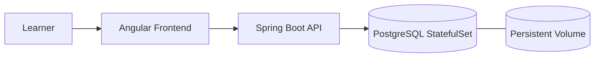

# Lab 3: Educational Platform - Stateful Applications
Build a resilient educational platform using StatefulSets and persistent volumes.

**Time**: 40 minutes  
**Difficulty**: ⭐⭐ Intermediate  
**Focus**: StatefulSets, Persistent Volumes, Data persistence

---

## 🎯 Objective
Deploy an educational platform with persistent database storage. Learn how to manage stateful applications that require data to survive pod restarts.

## 📋 What You'll Learn
- StatefulSets vs Deployments
- PersistentVolumes (PV) and PersistentVolumeClaims (PVC)
- Storage classes
- Headless services
- Data persistence
- Volume management

---

## ✅ Prerequisites Check

```bash
./scripts/check-lab-prereqs.sh 3
```

The script confirms `kubectl` availability and checks for the `educational-platform/k8s` manifests.

## ✅ Success criteria

- StatefulSet `postgres` is Running and Ready
- PersistentVolumeClaim `postgres-pvc` is Bound
- Data persists after deleting and recreating `postgres-0` pod

## 🧭 Architecture Snapshot



## 📦 Manifest Starter Kit

- Overlay status: `labs/manifests/lab-03/` (in progress)
- Manual approach: apply manifests from `educational-platform/k8s`, but override the namespace to `educational-lab` and ensure the PVC uses a storage class that exists on your cluster.

---

## 🚀 Steps

### 1. Create Namespace (1 min)

```bash
kubectl create namespace educational-lab

# Safer option (recommended): avoid changing your current kubectl context; use -n on commands
# Example: kubectl apply -f educational-platform/k8s/database-statefulset.yaml -n educational-lab

# If you prefer to change the current context namespace, be explicit and capture the previous namespace:
PREV_NS=$(kubectl config view --minify --output 'jsonpath={..namespace}' 2>/dev/null || echo default)
kubectl config set-context --current --namespace=educational-lab
# To restore:
kubectl config set-context --current --namespace="$PREV_NS"
```

### 2. Create PersistentVolumeClaim (5 min)

```bash
# View available storage classes
kubectl get storageclass

# Create PVC for database
cat <<EOF | kubectl apply -f -
apiVersion: v1
kind: PersistentVolumeClaim
metadata:
  name: postgres-pvc
  namespace: educational-lab
spec:
  accessModes:
    - ReadWriteOnce
  resources:
    requests:
      storage: 5Gi
EOF

# Check PVC status
kubectl get pvc -n educational-lab
# Wait for STATUS: Bound
```

### 3. Deploy Database with StatefulSet (10 min)

```bash
# Deploy PostgreSQL as StatefulSet
kubectl apply -f educational-platform/k8s/database-statefulset.yaml -n educational-lab
kubectl apply -f educational-platform/k8s/database-service.yaml -n educational-lab

# Watch StatefulSet pods
kubectl get pods -n educational-lab -w

# StatefulSet pods have predictable names: postgres-0, postgres-1, etc.
```

**Understand StatefulSet naming**:
```bash
# List pods (note the naming)
kubectl get pods -n educational-lab -l app=postgres

# Should see: postgres-0 (not random hash like deployments)
```

### 4. Test Data Persistence (8 min)

```bash
# Connect to database
kubectl exec -it postgres-0 -n educational-lab -- psql -U postgres

# Create table and data
CREATE DATABASE educational;
\c educational
CREATE TABLE courses (id SERIAL PRIMARY KEY, name VARCHAR(100));
INSERT INTO courses (name) VALUES ('Kubernetes Basics'), ('Docker Fundamentals');
SELECT * FROM courses;
\q
```

**Now test persistence by deleting pod**:
```bash
# Delete the pod
kubectl delete pod postgres-0 -n educational-lab

# Watch it recreate
kubectl get pods -n educational-lab -w

# Once Running, reconnect and verify data still exists
kubectl exec -it postgres-0 -n educational-lab -- psql -U postgres -d educational -c "SELECT * FROM courses;"

# Data is still there! ✅
```

### 5. Deploy Backend (5 min)

```bash
# Deploy backend API
kubectl apply -f educational-platform/k8s/backend-deployment.yaml -n educational-lab
kubectl apply -f educational-platform/k8s/backend-service.yaml -n educational-lab

# Wait for backend
kubectl wait --for=condition=ready pod -l app=educational-backend -n educational-lab --timeout=120s
```

### 6. Deploy Frontend (3 min)

```bash
# Deploy frontend
kubectl apply -f educational-platform/k8s/frontend-deployment.yaml -n educational-lab
kubectl apply -f educational-platform/k8s/frontend-service.yaml -n educational-lab

# Check all resources
kubectl get all -n educational-lab
```

### 7. Access Application (3 min)

```bash
# Port forward frontend
kubectl port-forward -n educational-lab service/educational-frontend 8080:80

# Open: http://localhost:8080
```

### 8. Volume Management (5 min)

```bash
# List PVCs
kubectl get pvc -n educational-lab

# Describe PVC to see details
kubectl describe pvc postgres-pvc -n educational-lab

# Check actual PersistentVolume
kubectl get pv

# View volume info
kubectl describe pv <pv-name>
```

---

## ✅ Validation

Run these commands to verify success:

```bash
# 1. StatefulSet running
kubectl get statefulset -n educational-lab
# Expected: postgres (1/1 ready)

# 2. PVC bound to PV
kubectl get pvc -n educational-lab
# Expected: STATUS = Bound

# 3. Data persists after pod deletion
kubectl delete pod postgres-0 -n educational-lab
kubectl wait --for=condition=ready pod postgres-0 -n educational-lab
kubectl exec -it postgres-0 -n educational-lab -- psql -U postgres -d educational -c "SELECT * FROM courses;"
# Expected: Data still exists

# 4. Backend connects to database
BACKEND_POD=$(kubectl get pods -n educational-lab -l app=educational-backend -o jsonpath='{.items[0].metadata.name}')
kubectl exec -n educational-lab $BACKEND_POD -- curl -s http://postgres:5432
# Expected: Connection successful

# 5. Application accessible
curl http://localhost:8080
# Expected: HTML response
```

**All checks pass?** ✅ Lab complete!

---

## 📊 Validate Your Work

```bash
./scripts/validate-lab.sh 3
```

The checker verifies the namespace, StatefulSet, PVC, and supporting deployments.

## 🧠 Quick Check

<details>
  <summary>How do you confirm data survived a pod restart?</summary>
  Connect to the database after deleting `postgres-0`:

  ```bash
  kubectl exec -it postgres-0 -n educational-lab -- psql -U postgres -d educational -c "SELECT COUNT(*) FROM courses;"
  ```
  </details>

<details>
  <summary>Which command shows the PVC binding to the PV?</summary>
  ```bash
  kubectl get pvc postgres-pvc -n educational-lab -o wide
  ```
  </details>

## 🏆 Challenge Mode

- Scale the StatefulSet to 3 replicas and inspect the persistent data directories.
- Convert the backend deployment into a StatefulSet and compare pod naming.
- Add a CronJob that runs nightly backups using `pg_dump`.

## 🔧 Troubleshooting Flow

1. **PVC stuck Pending?** → Check storage classes: `kubectl get storageclass`.
2. **Pod can't mount volume?** → `kubectl describe pod postgres-0 -n educational-lab` for events.
3. **Backend can't connect?** → Ensure the headless service resolves: `nslookup postgres -n educational-lab`.
4. **Lost data after restart?** → Validate volume mount path and ensure data writes outside `/tmp`.

---

## 🧹 Cleanup

```bash
# Delete namespace (this also deletes PVC)
kubectl delete namespace educational-lab

# Verify PV is released
kubectl get pv

# If PV is stuck, delete manually
kubectl delete pv <pv-name>
```

---

## 🎓 Key Concepts Learned

1. **StatefulSets**: For apps that need stable network identity and persistent storage
2. **PersistentVolumeClaims**: Request for storage resources
3. **PersistentVolumes**: Actual storage in cluster
4. **Storage Classes**: Define types of storage (SSD, HDD, etc.)
5. **Data Persistence**: Data survives pod deletion/restart
6. **Headless Services**: For StatefulSet DNS (postgres-0.postgres.namespace.svc)

---

## 📚 StatefulSet vs Deployment

| Feature | Deployment | StatefulSet |
|---------|-----------|-------------|
| Pod names | Random hash | Ordered index (app-0, app-1) |
| Network identity | Not stable | Stable DNS names |
| Storage | Shared or none | Dedicated per pod |
| Scaling | Parallel | Ordered (0→1→2) |
| Updates | Rolling | Ordered rolling |
| Use case | Stateless apps | Databases, queues |

---

## 🔍 Important Patterns

### PVC in StatefulSet
```yaml
apiVersion: apps/v1
kind: StatefulSet
metadata:
  name: postgres
spec:
  volumeClaimTemplates:  # Each pod gets own PVC
  - metadata:
      name: data
    spec:
      accessModes: ["ReadWriteOnce"]
      resources:
        requests:
          storage: 5Gi
```

### Headless Service for StatefulSet
```yaml
apiVersion: v1
kind: Service
metadata:
  name: postgres
spec:
  clusterIP: None  # Headless!
  selector:
    app: postgres
```

### Accessing StatefulSet Pods
```bash
# Each pod has stable DNS:
postgres-0.postgres.educational-lab.svc.cluster.local
postgres-1.postgres.educational-lab.svc.cluster.local
```

---

## 🔍 Debugging Tips

**PVC stuck in Pending?**
```bash
# Check events
kubectl describe pvc postgres-pvc -n educational-lab

# Check storage classes
kubectl get storageclass

# Might need to create StorageClass if none exists
```

**Data not persisting?**
```bash
# Check if PVC is actually bound
kubectl get pvc -n educational-lab

# Check volume mount in pod
kubectl describe pod postgres-0 -n educational-lab | grep -A 5 Mounts
```

**StatefulSet pod stuck?**
```bash
# Check events
kubectl describe statefulset postgres -n educational-lab

# Check pod events
kubectl describe pod postgres-0 -n educational-lab
```

---

---

## 🧠 Test Your Knowledge

Ready to verify your mastery? Take the **[Lab 3 Self-Assessment Quiz](../docs/learning/SELF-ASSESSMENT.md#-lab-3--educational-stateful)** and see how you score!

---

## 🚀 Next Lab

**[Lab 4: Task Management with Ingress](04-task-ingress.md)**

Learn about:
- Ingress controllers
- Path-based routing
- TLS certificates
- Domain names
- External access
