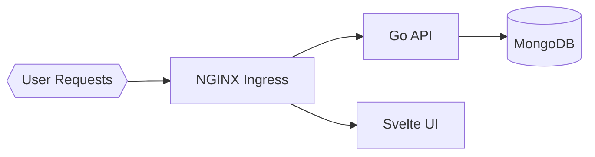

# Lab 4: Task Manager - Ingress & External Access

**Time**: 45 minutes  
**Difficulty**: ⭐⭐⭐ Advanced  
**Focus**: Ingress controllers, Routing, TLS, Domain access

---

## 🎯 Objective
Deploy task management app and expose it externally using Ingress. Learn how to route traffic, use custom domains, and configure TLS.

## 📋 What You'll Learn
- Ingress controllers (nginx)
- Path-based routing
- Host-based routing
- TLS/SSL certificates
- External DNS access
- Load balancing

---

## ✅ Prerequisites Check

```bash
./scripts/check-lab-prereqs.sh 4
```

Confirms access to the Task Manager manifests and required CLI tooling.

## 🧭 Architecture Snapshot



## 📦 Manifest Starter Kit

- Overlay status: `labs/manifests/lab-04/` (in progress)
- Manual approach: apply `task-management-app/k8s/deployment.yaml` and create the ingress manifest from the lab instructions using namespace `task-lab`.

---

## 🚀 Steps

### 1. Install Ingress Controller (10 min)

```bash
# Install nginx ingress controller
kubectl apply -f https://raw.githubusercontent.com/kubernetes/ingress-nginx/controller-v1.8.2/deploy/static/provider/cloud/deploy.yaml

# Wait for controller to be ready
kubectl wait --namespace ingress-nginx \
  --for=condition=ready pod \
  --selector=app.kubernetes.io/component=controller \
  --timeout=120s

# Verify installation
kubectl get pods -n ingress-nginx
kubectl get svc -n ingress-nginx
```

### 2. Create Namespace & Deploy App (5 min)

```bash
# Create namespace
kubectl create namespace task-lab

# Deploy MongoDB
kubectl apply -f task-management-app/k8s/database-deployment.yaml -n task-lab
kubectl apply -f task-management-app/k8s/database-service.yaml -n task-lab

# Deploy backend
kubectl apply -f task-management-app/k8s/backend-deployment.yaml -n task-lab
kubectl apply -f task-management-app/k8s/backend-service.yaml -n task-lab

# Deploy frontend
kubectl apply -f task-management-app/k8s/frontend-deployment.yaml -n task-lab
kubectl apply -f task-management-app/k8s/frontend-service.yaml -n task-lab

# Wait for all pods
kubectl wait --for=condition=ready pod --all -n task-lab --timeout=180s
```

### 3. Create Basic Ingress (5 min)

```bash
# Create ingress for path-based routing
cat <<EOF | kubectl apply -f -
apiVersion: networking.k8s.io/v1
kind: Ingress
metadata:
  name: task-ingress
  namespace: task-lab
  annotations:
    nginx.ingress.kubernetes.io/rewrite-target: /
spec:
  ingressClassName: nginx
  rules:
  - http:
      paths:
      - path: /api
        pathType: Prefix
        backend:
          service:
            name: task-backend
            port:
              number: 5000
      - path: /
        pathType: Prefix
        backend:
          service:
            name: task-frontend
            port:
              number: 80
EOF

# Check ingress
kubectl get ingress -n task-lab
kubectl describe ingress task-ingress -n task-lab
```

### 4. Test Path-Based Routing (5 min)

```bash
# Get ingress IP
INGRESS_IP=$(kubectl get svc -n ingress-nginx ingress-nginx-controller -o jsonpath='{.status.loadBalancer.ingress[0].ip}')

# If no IP (local cluster), use localhost
if [ -z "$INGRESS_IP" ]; then
  INGRESS_IP="localhost"
  kubectl port-forward -n ingress-nginx service/ingress-nginx-controller 8080:80 &
fi

# Test frontend
curl http://$INGRESS_IP:8080/

# Test backend API
curl http://$INGRESS_IP:8080/api/health

# Both should work! ✅
```

### 5. Add Host-Based Routing (10 min)

```bash
# Update ingress with host
cat <<EOF | kubectl apply -f -
apiVersion: networking.k8s.io/v1
kind: Ingress
metadata:
  name: task-ingress
  namespace: task-lab
  annotations:
    nginx.ingress.kubernetes.io/rewrite-target: /
spec:
  ingressClassName: nginx
  rules:
  - host: task.local  # Custom domain
    http:
      paths:
      - path: /api
        pathType: Prefix
        backend:
          service:
            name: task-backend
            port:
              number: 5000
      - path: /
        pathType: Prefix
        backend:
          service:
            name: task-frontend
            port:
              number: 80
EOF

# Add to /etc/hosts (local testing)
echo "$INGRESS_IP task.local" | sudo tee -a /etc/hosts

# Test with domain
curl http://task.local:8080/
curl http://task.local:8080/api/health
```

### 6. Add TLS Certificate (10 min)

```bash
# Create self-signed certificate (for learning)
openssl req -x509 -nodes -days 365 -newkey rsa:2048 \
  -keyout /tmp/tls.key -out /tmp/tls.crt \
  -subj "/CN=task.local/O=task-lab"

# Create TLS secret
kubectl create secret tls task-tls \
  --key /tmp/tls.key \
  --cert /tmp/tls.crt \
  -n task-lab

# Update ingress with TLS
cat <<EOF | kubectl apply -f -
apiVersion: networking.k8s.io/v1
kind: Ingress
metadata:
  name: task-ingress
  namespace: task-lab
  annotations:
    nginx.ingress.kubernetes.io/rewrite-target: /
    nginx.ingress.kubernetes.io/ssl-redirect: "true"
spec:
  ingressClassName: nginx
  tls:
  - hosts:
    - task.local
    secretName: task-tls
  rules:
  - host: task.local
    http:
      paths:
      - path: /api
        pathType: Prefix
        backend:
          service:
            name: task-backend
            port:
              number: 5000
      - path: /
        pathType: Prefix
        backend:
          service:
            name: task-frontend
            port:
              number: 80
EOF

# Test HTTPS (ignore cert warning)
curl -k https://task.local:8080/
```

---

## ✅ Validation

```bash
# 1. Ingress controller running
kubectl get pods -n ingress-nginx
# Expected: controller pod Running

# 2. Ingress created
kubectl get ingress -n task-lab
# Expected: task-ingress with ADDRESS

# 3. Path routing works
curl http://task.local:8080/
curl http://task.local:8080/api/health
# Both return valid responses

# 4. TLS configured
kubectl get secret task-tls -n task-lab
# Expected: secret exists

# 5. HTTPS works
curl -k https://task.local:8080/
# Expected: HTML response

# 6. HTTP redirects to HTTPS
curl -I http://task.local:8080/
# Expected: 301/308 redirect to HTTPS
```

**All checks pass?** ✅ Lab complete!

---

## 📊 Validate Your Work

```bash
./scripts/validate-lab.sh 4
```

Ensures the namespace, workloads, and ingress objects exist and are healthy.

## 🧠 Quick Check

<details>
  <summary>How do you confirm the ingress is routing traffic correctly?</summary>
  ```bash
  kubectl describe ingress task-ingress -n task-lab
  ```
  Review the backend service/port mappings.
  </details>

<details>
  <summary>Where can you see the external address for the ingress controller?</summary>
  ```bash
  kubectl get svc -n ingress-nginx
  ```
  </details>

## 🏆 Challenge Mode

- Add TLS termination using a self-signed certificate via a Kubernetes secret.
- Configure host-based routing to serve the API on `api.example.local` and UI on `app.example.local`.
- Add rate-limiting annotations to throttle brute-force login attempts.

## 🔧 Troubleshooting Flow

1. **404 from ingress?** → Verify path & service names in ingress spec.
2. **Ingress controller pending?** → Check `kubectl get pods -n ingress-nginx` for crash loops.
3. **TLS handshake fails?** → Ensure the secret referenced in `tls:` exists and contains valid cert/key.
4. **Backend 502 errors?** → Inspect backend service endpoints and backend pod logs.

---

## 🧹 Cleanup

```bash
# Remove /etc/hosts entry
sudo sed -i '' '/task.local/d' /etc/hosts  # macOS
# sudo sed -i '/task.local/d' /etc/hosts   # Linux

# Delete namespace
kubectl delete namespace task-lab

# Optional: Uninstall ingress controller
# kubectl delete -f https://raw.githubusercontent.com/kubernetes/ingress-nginx/controller-v1.8.2/deploy/static/provider/cloud/deploy.yaml
```

---

## 🎓 Key Concepts Learned

1. **Ingress**: HTTP/HTTPS routing to services
2. **Ingress Controller**: Implements ingress rules (nginx, Traefik, etc.)
3. **Path-Based Routing**: /api → backend, / → frontend
4. **Host-Based Routing**: Different domains → different services
5. **TLS Termination**: HTTPS handled by ingress
6. **Annotations**: Configure ingress behavior

---

## 📚 Ingress Patterns

### Path-Based Routing
```yaml
spec:
  rules:
  - http:
      paths:
      - path: /api        # example.com/api → backend
      - path: /admin      # example.com/admin → admin
      - path: /           # example.com/ → frontend
```

### Host-Based Routing
```yaml
spec:
  rules:
  - host: api.example.com    # Separate subdomain
  - host: www.example.com
  - host: admin.example.com
```

### TLS Configuration
```yaml
spec:
  tls:
  - hosts:
    - example.com
    - www.example.com
    secretName: tls-cert
```

---

## 🔍 Common Annotations

```yaml
metadata:
  annotations:
    # Rewrite URL paths
    nginx.ingress.kubernetes.io/rewrite-target: /
    
    # Force HTTPS
    nginx.ingress.kubernetes.io/ssl-redirect: "true"
    
    # CORS
    nginx.ingress.kubernetes.io/enable-cors: "true"
    
    # Rate limiting
    nginx.ingress.kubernetes.io/limit-rps: "10"
    
    # Timeouts
    nginx.ingress.kubernetes.io/proxy-connect-timeout: "30"
    
    # WebSocket support
    nginx.ingress.kubernetes.io/websocket-services: "task-backend"
```

---

## 🔍 Debugging Tips

**Ingress not getting IP?**
```bash
# Check controller logs
kubectl logs -n ingress-nginx deployment/ingress-nginx-controller

# Check service
kubectl get svc -n ingress-nginx
```

**404 errors?**
```bash
# Check ingress rules
kubectl describe ingress task-ingress -n task-lab

# Check backend services exist
kubectl get svc -n task-lab

# Check service endpoints
kubectl get endpoints -n task-lab
```

**TLS not working?**
```bash
# Check secret exists
kubectl get secret task-tls -n task-lab

# Describe secret
kubectl describe secret task-tls -n task-lab

# Check cert details
kubectl get secret task-tls -n task-lab -o jsonpath='{.data.tls\.crt}' | base64 -d | openssl x509 -text -noout
```

---

## 🚀 Next Lab

**[Lab 5: Medical System - Security & RBAC](05-medical-security.md)**

Learn about:
- Role-Based Access Control (RBAC)
- Service Accounts
- Network Policies
- Secrets management
- Pod Security Standards
