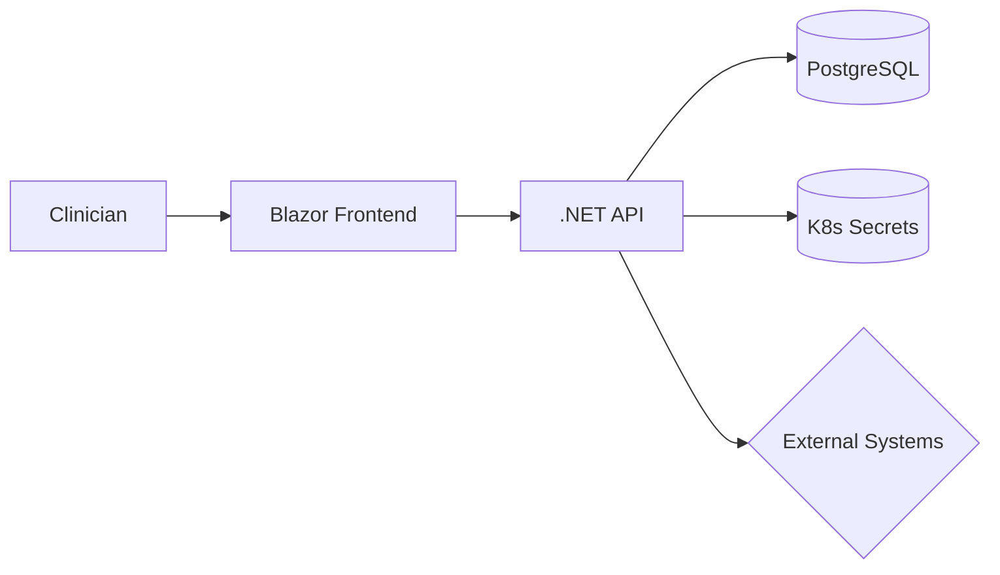

# Lab 5: Medical System - Security & RBAC
Harden the medical system with RBAC, network policies, and secure secret handling.

**Time**: 60 minutes  
**Difficulty**: ⭐⭐⭐ Advanced  
**Focus**: RBAC, Network Policies, Secrets, Security

---

## 🎯 Objective
Deploy medical care system with production-grade security. Learn Kubernetes security fundamentals including RBAC, network policies, and secrets management.

## 📋 What You'll Learn
- Role-Based Access Control (RBAC)
- Service Accounts
- Network Policies
- Secrets management
- Pod Security Standards
- Security contexts

---

## ✅ Prerequisites Check

```bash
./scripts/check-lab-prereqs.sh 5
```

Validates availability of the medical system manifests and `kubectl` access.

## 🧭 Architecture Snapshot



## 📦 Manifest Starter Kit

- Overlay status: `labs/manifests/lab-05/` (in progress)
- Manual approach: start with `medical-care-system/k8s` manifests and add the RBAC, network policies, and security context tweaks from this lab.

---

## 🚀 Steps

### 1. Create Namespace with Labels (2 min)

```bash
# Create namespace with security label
kubectl create namespace medical-lab

# Label for network policies
kubectl label namespace medical-lab security=restricted

# Safer option: prefer using -n on kubectl commands rather than switching your current kubectl context
# Example: kubectl create secret generic postgres-secret -n medical-lab --from-literal=postgres-user=... 

# If you prefer changing the current context, capture and restore it:
PREV_NS=$(kubectl config view --minify --output 'jsonpath={..namespace}' 2>/dev/null || echo default)
kubectl config set-context --current --namespace=medical-lab
# To restore:
kubectl config set-context --current --namespace="$PREV_NS"
```

## ✅ Success criteria

- Secrets (`postgres-secret`, `api-secret`) present in `medical-lab`
- NetworkPolicies enforce default deny and allow only intended traffic
- ServiceAccount `medical-api-sa` can access required secrets (via RBAC)

### 2. Create Secrets (5 min)

```bash
# Create database credentials secret
kubectl create secret generic postgres-secret \
  --from-literal=postgres-user=medical_user \
  --from-literal=postgres-password=$(openssl rand -base64 32) \
  --from-literal=postgres-db=medical_db \
  -n medical-lab

# Create API JWT secret
kubectl create secret generic api-secret \
  --from-literal=jwt-secret=$(openssl rand -hex 32) \
  -n medical-lab

# Verify (values are base64 encoded)
kubectl get secrets -n medical-lab
```

### 3. Create Service Account (5 min)

```bash
# Create service account for medical API
cat <<EOF | kubectl apply -f -
apiVersion: v1
kind: ServiceAccount
metadata:
  name: medical-api-sa
  namespace: medical-lab
EOF

# Verify
kubectl get serviceaccount -n medical-lab
```

### 4. Configure RBAC (10 min)

```bash
# Create Role (namespace-level permissions)
cat <<EOF | kubectl apply -f -
apiVersion: rbac.authorization.k8s.io/v1
kind: Role
metadata:
  name: medical-api-role
  namespace: medical-lab
rules:
- apiGroups: [""]
  resources: ["pods", "services"]
  verbs: ["get", "list", "watch"]
- apiGroups: [""]
  resources: ["secrets"]
  verbs: ["get"]
  resourceNames: ["postgres-secret", "api-secret"]
- apiGroups: [""]
  resources: ["configmaps"]
  verbs: ["get", "list"]
EOF

# Create RoleBinding (attach role to service account)
cat <<EOF | kubectl apply -f -
apiVersion: rbac.authorization.k8s.io/v1
kind: RoleBinding
metadata:
  name: medical-api-binding
  namespace: medical-lab
subjects:
- kind: ServiceAccount
  name: medical-api-sa
  namespace: medical-lab
roleRef:
  kind: Role
  name: medical-api-role
  apiGroup: rbac.authorization.k8s.io
EOF

# Verify RBAC
kubectl get role,rolebinding -n medical-lab
```

### 5. Test RBAC Permissions (5 min)

```bash
# Test what the service account can do
kubectl auth can-i get pods --as=system:serviceaccount:medical-lab:medical-api-sa -n medical-lab
# Should return: yes

kubectl auth can-i delete pods --as=system:serviceaccount:medical-lab:medical-api-sa -n medical-lab
# Should return: no

kubectl auth can-i get secrets --as=system:serviceaccount:medical-lab:medical-api-sa -n medical-lab
# Should return: yes (only specific secrets)
```

### 6. Deploy Database with Security Context (8 min)

```bash
# Deploy PostgreSQL with security settings
cat <<EOF | kubectl apply -f -
apiVersion: apps/v1
kind: Deployment
metadata:
  name: postgres
  namespace: medical-lab
spec:
  replicas: 1
  selector:
    matchLabels:
      app: postgres
  template:
    metadata:
      labels:
        app: postgres
        tier: database
    spec:
      securityContext:
        runAsNonRoot: true
        runAsUser: 999
        fsGroup: 999
      containers:
      - name: postgres
        image: postgres:14-alpine
        securityContext:
          allowPrivilegeEscalation: false
          readOnlyRootFilesystem: false
          runAsNonRoot: true
          capabilities:
            drop: ["ALL"]
        env:
        - name: POSTGRES_USER
          valueFrom:
            secretKeyRef:
              name: postgres-secret
              key: postgres-user
        - name: POSTGRES_PASSWORD
          valueFrom:
            secretKeyRef:
              name: postgres-secret
              key: postgres-password
        - name: POSTGRES_DB
          valueFrom:
            secretKeyRef:
              name: postgres-secret
              key: postgres-db
        ports:
        - containerPort: 5432
---
apiVersion: v1
kind: Service
metadata:
  name: postgres
  namespace: medical-lab
  labels:
    tier: database
spec:
  selector:
    app: postgres
  ports:
  - port: 5432
EOF

# Wait for database
kubectl wait --for=condition=ready pod -l app=postgres -n medical-lab --timeout=120s
```

### 7. Create Network Policy (10 min)

```bash
# Deny all traffic by default
cat <<EOF | kubectl apply -f -
apiVersion: networking.k8s.io/v1
kind: NetworkPolicy
metadata:
  name: default-deny-all
  namespace: medical-lab
spec:
  podSelector: {}
  policyTypes:
  - Ingress
  - Egress
EOF

# Allow API to database
cat <<EOF | kubectl apply -f -
apiVersion: networking.k8s.io/v1
kind: NetworkPolicy
metadata:
  name: allow-api-to-db
  namespace: medical-lab
spec:
  podSelector:
    matchLabels:
      tier: database
  policyTypes:
  - Ingress
  ingress:
  - from:
    - podSelector:
        matchLabels:
          tier: api
    ports:
    - protocol: TCP
      port: 5432
EOF

# Allow frontend to API
cat <<EOF | kubectl apply -f -
apiVersion: networking.k8s.io/v1
kind: NetworkPolicy
metadata:
  name: allow-frontend-to-api
  namespace: medical-lab
spec:
  podSelector:
    matchLabels:
      tier: api
  policyTypes:
  - Ingress
  ingress:
  - from:
    - podSelector:
        matchLabels:
          tier: frontend
    ports:
    - protocol: TCP
      port: 8000
EOF

# Allow DNS (necessary for service discovery)
cat <<EOF | kubectl apply -f -
apiVersion: networking.k8s.io/v1
kind: NetworkPolicy
metadata:
  name: allow-dns
  namespace: medical-lab
spec:
  podSelector: {}
  policyTypes:
  - Egress
  egress:
  - to:
    - namespaceSelector:
        matchLabels:
          name: kube-system
    ports:
    - protocol: UDP
      port: 53
EOF

# List network policies
kubectl get networkpolicy -n medical-lab
```

### 8. Deploy API with Security (10 min)

```bash
# Deploy medical API
kubectl apply -f medical-care-system/k8s/backend-deployment.yaml -n medical-lab
kubectl apply -f medical-care-system/k8s/backend-service.yaml -n medical-lab

# Patch to use service account
kubectl patch deployment medical-api -n medical-lab \
  --patch '{"spec":{"template":{"spec":{"serviceAccountName":"medical-api-sa"}}}}'

# Wait for API
kubectl wait --for=condition=ready pod -l app=medical-api -n medical-lab --timeout=120s
```

### 9. Test Network Policies (5 min)

```bash
# Try to access database from a test pod without label (should fail)
kubectl run test-pod --image=busybox -n medical-lab --rm -it --restart=Never -- \
  wget -O- --timeout=2 http://postgres:5432

# Should timeout due to network policy

# Now try from API pod (should work)
API_POD=$(kubectl get pods -n medical-lab -l app=medical-api -o jsonpath='{.items[0].metadata.name}')
kubectl exec -n medical-lab $API_POD -- curl -s --max-time 2 postgres:5432

# Should connect successfully
```

---

## ✅ Validation

```bash
# 1. Secrets created
kubectl get secrets -n medical-lab
# Expected: postgres-secret, api-secret

# 2. Service account exists
kubectl get sa medical-api-sa -n medical-lab

# 3. RBAC configured
kubectl get role,rolebinding -n medical-lab

# 4. Service account has limited permissions
kubectl auth can-i delete deployments --as=system:serviceaccount:medical-lab:medical-api-sa -n medical-lab
# Expected: no

# 5. Network policies active
kubectl get networkpolicy -n medical-lab
# Expected: 4 policies

# 6. Database accessible only from API
kubectl run test --image=busybox -n medical-lab --rm -it --restart=Never -- \
  nc -zv -w 2 postgres 5432
# Expected: timeout (blocked by network policy)

# 7. Security context enforced
kubectl get pod -n medical-lab -l app=postgres -o jsonpath='{.items[0].spec.securityContext}'
# Expected: runAsNonRoot: true
```

**All checks pass?** ✅ Lab complete!

---

## 📊 Validate Your Work

```bash
./scripts/validate-lab.sh 5
```

The script ensures secrets, RBAC objects, network policies, and deployments match expectations.

## 🧠 Quick Check

<details>
  <summary>How can you see what a service account is allowed to do?</summary>
  ```bash
  kubectl auth can-i list pods --as=system:serviceaccount:medical-lab:medical-api-sa -n medical-lab
  ```
  </details>

<details>
  <summary>How do you confirm the default-deny policy is active?</summary>
  ```bash
  kubectl get networkpolicy -n medical-lab
  ```
  Then attempt a curl from a throwaway pod and observe the timeout.
  </details>

## 🏆 Challenge Mode

- Introduce Pod Security Admission labels (`pod-security.kubernetes.io/enforce=restricted`).
- Create a `NetworkPolicy` that allows monitoring traffic from the `observability` namespace only.
- Add Kyverno or OPA Gatekeeper policies that prevent privileged pods in the namespace.

## 🔧 Troubleshooting Flow

1. **API cannot read secrets?** → Verify Role rules: `kubectl describe role medical-api-role -n medical-lab`.
2. **Traffic blocked unexpectedly?** → Inspect applied network policies and ensure selectors match.
3. **Service account missing permissions?** → Check RoleBinding subjects for typos.
4. **Pods running as root?** → Inspect `securityContext` in the deployment and reapply with `runAsNonRoot`.

---

## 🧹 Cleanup

```bash
kubectl delete namespace medical-lab
```

---

## 🎓 Key Concepts Learned

1. **Service Accounts**: Identity for pods
2. **RBAC**: Control what pods can do
3. **Secrets**: Secure sensitive data
4. **Network Policies**: Control pod-to-pod traffic
5. **Security Contexts**: Container security settings
6. **Principle of Least Privilege**: Grant minimum permissions

---

## 📚 Security Best Practices

### 1. Secrets Management
```bash
# Never hardcode credentials
# Use secrets instead
env:
- name: DB_PASSWORD
  valueFrom:
    secretKeyRef:
      name: db-secret
      key: password
```

### 2. RBAC Least Privilege
```yaml
# Grant only needed permissions
rules:
- apiGroups: [""]
  resources: ["pods"]
  verbs: ["get", "list"]  # Not "delete", "create"
```

### 3. Network Segmentation
```yaml
# Default deny all
spec:
  podSelector: {}
  policyTypes:
  - Ingress
  - Egress
```

### 4. Security Context
```yaml
securityContext:
  runAsNonRoot: true
  runAsUser: 1000
  allowPrivilegeEscalation: false
  readOnlyRootFilesystem: true
```

---

## 🔍 Debugging Tips

**RBAC denying access?**
```bash
# Check what's allowed
kubectl auth can-i <verb> <resource> --as=system:serviceaccount:<namespace>:<sa-name>

# Describe role
kubectl describe role <name> -n <namespace>
```

**Network policy blocking traffic?**
```bash
# List all policies
kubectl get networkpolicy --all-namespaces

# Describe policy
kubectl describe networkpolicy <name> -n <namespace>

# Test connectivity
kubectl run test --image=nicolaka/netshoot -it --rm -- \
  curl -v <service>:<port>
```

**Secret not mounting?**
```bash
# Check secret exists
kubectl get secret <name> -n <namespace>

# Check pod events
kubectl describe pod <name> -n <namespace>
```

---

## 🚀 Next Lab

**[Lab 6: Social Media - Autoscaling & Performance](06-social-scaling.md)**

Learn about:
- Horizontal Pod Autoscaler (HPA)
- Vertical Pod Autoscaler (VPA)
- Resource requests & limits
- Load testing
- Performance optimization
