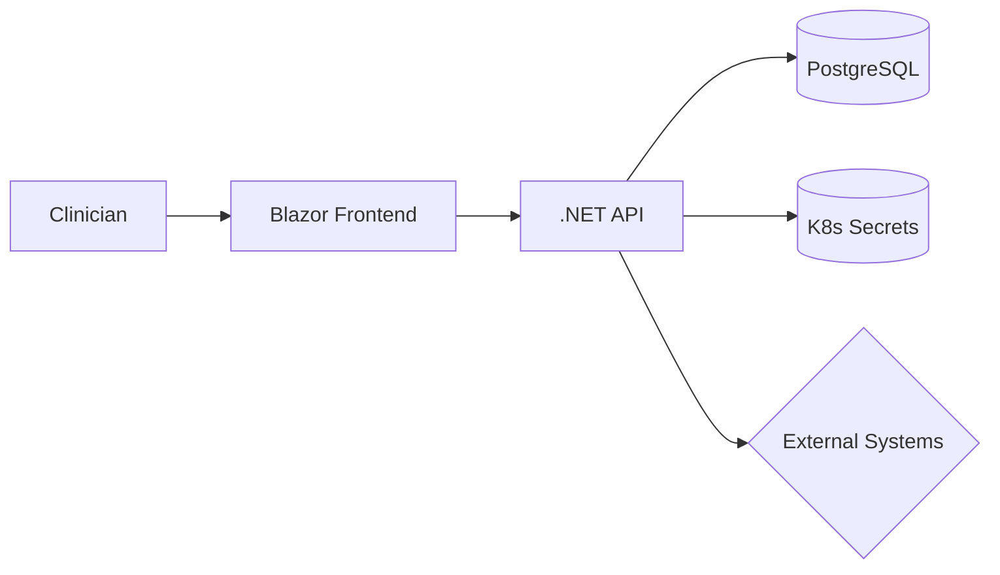

# Lab 6: Medical System - Security & RBAC
Security is silent—until it isn’t. Lock down access with RBAC and NetworkPolicies like teams do in regulated environments.
Harden the medical system with RBAC, network policies, and secure secret handling.

**Time**: 60 minutes  
**Difficulty**: ⭐⭐⭐⭐ Advanced  
**Focus**: RBAC, Network Policies, Secrets, Security

---

## 📊 Production vs Lab: What Changes in Real Life?

Before hardening your medical system, let's see how **Lab 6's simplified security** compares to **production-grade Kubernetes security** used by real healthcare platforms (Epic, Cerner, Teladoc).

This lab focuses on core concepts (RBAC, NetworkPolicies, Secrets), but production adds critical layers for compliance (HIPAA, GDPR), zero-trust architecture, and defense in depth.

---

### 📝 Your Lab Security (Simplified for Learning)

Here's the basic RBAC + NetworkPolicy you'll deploy:

```yaml
# ServiceAccount for medical-backend
apiVersion: v1
kind: ServiceAccount
metadata:
  name: medical-backend-sa
  namespace: medical-lab
---
# Role: Read-only access to Secrets
apiVersion: rbac.authorization.k8s.io/v1
kind: Role
metadata:
  name: secret-reader
  namespace: medical-lab
rules:
- apiGroups: [""]
  resources: ["secrets"]
  verbs: ["get", "list"]
---
# RoleBinding: Bind secret-reader to medical-backend-sa
apiVersion: rbac.authorization.k8s.io/v1
kind: RoleBinding
metadata:
  name: read-secrets
  namespace: medical-lab
subjects:
- kind: ServiceAccount
  name: medical-backend-sa
  namespace: medical-lab
roleRef:
  kind: Role
  name: secret-reader
  apiGroup: rbac.authorization.k8s.io
---
# NetworkPolicy: Block all ingress except from frontend
apiVersion: networking.k8s.io/v1
kind: NetworkPolicy
metadata:
  name: backend-isolation
  namespace: medical-lab
spec:
  podSelector:
    matchLabels:
      app: medical-backend
  policyTypes:
  - Ingress
  ingress:
  - from:
    - podSelector:
        matchLabels:
          app: medical-frontend
    ports:
    - protocol: TCP
      port: 8080
```

**Lines**: ~55 (simplified)  
**Focus**: Basic RBAC, simple NetworkPolicy, Secret access  
**Good for**: Learning least-privilege principles, network isolation  

---

### 🏭 Production Medical System Security (HIPAA-Compliant)

Here's what the **same security setup** looks like in a production healthcare platform handling **PHI (Protected Health Information)** for **500K patients**:

```yaml
# ServiceAccount with minimal permissions (least privilege)
apiVersion: v1
kind: ServiceAccount
metadata:
  name: medical-backend-sa
  namespace: medical-production
  labels:
    app: medical-backend
    compliance: hipaa
    data-classification: phi
  annotations:
    # AWS IRSA (IAM Roles for Service Accounts) - grants AWS API access
    eks.amazonaws.com/role-arn: arn:aws:iam::123456789012:role/medical-backend-role
    # Audit trail: Who created this, when, why
    created-by: "platform-team"
    jira-ticket: "SEC-1234"
    last-rotated: "2024-01-15"
automountServiceAccountToken: false  # Disable auto-mounting (explicit opt-in required)
---
# Role: Minimal Secret access (specific Secrets only, no wildcards)
apiVersion: rbac.authorization.k8s.io/v1
kind: Role
metadata:
  name: medical-backend-secret-reader
  namespace: medical-production
  labels:
    compliance: hipaa
rules:
# Read database credentials (specific Secret, not all Secrets)
- apiGroups: [""]
  resources: ["secrets"]
  resourceNames: ["postgres-credentials", "redis-credentials"]  # Explicit allow-list
  verbs: ["get"]  # Only get (no list, delete, create)

# Read ConfigMaps for app config (non-sensitive)
- apiGroups: [""]
  resources: ["configmaps"]
  resourceNames: ["medical-backend-config"]
  verbs: ["get"]

# Read Pods in own namespace (for health checks, debugging)
- apiGroups: [""]
  resources: ["pods"]
  verbs: ["get", "list"]

# Read Services for service discovery
- apiGroups: [""]
  resources: ["services"]
  verbs: ["get"]
---
# RoleBinding: Bind Role to ServiceAccount
apiVersion: rbac.authorization.k8s.io/v1
kind: RoleBinding
metadata:
  name: medical-backend-binding
  namespace: medical-production
  labels:
    compliance: hipaa
subjects:
- kind: ServiceAccount
  name: medical-backend-sa
  namespace: medical-production
roleRef:
  kind: Role
  name: medical-backend-secret-reader
  apiGroup: rbac.authorization.k8s.io
---
# Pod Security Policy: Enforce security context (deprecated in K8s 1.25, use Pod Security Standards)
apiVersion: policy/v1beta1
kind: PodSecurityPolicy
metadata:
  name: medical-backend-psp
  annotations:
    seccomp.security.alpha.kubernetes.io/allowedProfileNames: 'runtime/default'
    apparmor.security.beta.kubernetes.io/allowedProfileNames: 'runtime/default'
spec:
  privileged: false  # No privileged containers
  allowPrivilegeEscalation: false  # Can't escalate to root
  requiredDropCapabilities:
    - ALL  # Drop all Linux capabilities
  allowedCapabilities: []  # No capabilities allowed
  volumes:
    - 'configMap'
    - 'emptyDir'
    - 'projected'
    - 'secret'
    - 'downwardAPI'
    - 'persistentVolumeClaim'
  hostNetwork: false  # Can't use host network
  hostIPC: false  # Can't access host IPC
  hostPID: false  # Can't see host processes
  runAsUser:
    rule: 'MustRunAsNonRoot'  # Must run as non-root user
  seLinux:
    rule: 'RunAsAny'
  fsGroup:
    rule: 'RunAsAny'
  readOnlyRootFilesystem: true  # Root filesystem is read-only (immutable)
---
# NetworkPolicy: Default deny-all, explicit allow (zero-trust)
apiVersion: networking.k8s.io/v1
kind: NetworkPolicy
metadata:
  name: medical-backend-netpol
  namespace: medical-production
  labels:
    compliance: hipaa
spec:
  podSelector:
    matchLabels:
      app: medical-backend
  policyTypes:
  - Ingress
  - Egress
  
  # Ingress: Only allow from frontend (within same namespace)
  ingress:
  - from:
    - podSelector:
        matchLabels:
          app: medical-frontend
    ports:
    - protocol: TCP
      port: 8080  # Backend API port
  
  # Ingress: Allow health checks from Ingress controller
  - from:
    - namespaceSelector:
        matchLabels:
          name: ingress-nginx
    ports:
    - protocol: TCP
      port: 8080
  
  # Ingress: Allow metrics scraping from Prometheus
  - from:
    - namespaceSelector:
        matchLabels:
          name: monitoring
      podSelector:
        matchLabels:
          app: prometheus
    ports:
    - protocol: TCP
      port: 9090  # Prometheus metrics port
  
  # Egress: Allow DNS resolution (CoreDNS)
  egress:
  - to:
    - namespaceSelector:
        matchLabels:
          name: kube-system
      podSelector:
        matchLabels:
          k8s-app: kube-dns
    ports:
    - protocol: UDP
      port: 53
  
  # Egress: Allow database connections (PostgreSQL in same namespace)
  - to:
    - podSelector:
        matchLabels:
          app: postgres
    ports:
    - protocol: TCP
      port: 5432
  
  # Egress: Allow Redis connections (caching layer)
  - to:
    - podSelector:
        matchLabels:
          app: redis
    ports:
    - protocol: TCP
      port: 6379
  
  # Egress: Allow AWS API (for External Secrets, S3 access)
  - to:
    - namespaceSelector: {}  # Any namespace
    ports:
    - protocol: TCP
      port: 443  # HTTPS only
  
  # Egress: Block all other traffic (default deny)
---
# NetworkPolicy: Isolate database (PostgreSQL) - only backend can connect
apiVersion: networking.k8s.io/v1
kind: NetworkPolicy
metadata:
  name: postgres-isolation
  namespace: medical-production
spec:
  podSelector:
    matchLabels:
      app: postgres
  policyTypes:
  - Ingress
  ingress:
  # Only allow connections from medical-backend
  - from:
    - podSelector:
        matchLabels:
          app: medical-backend
    ports:
    - protocol: TCP
      port: 5432
  
  # Allow connections from backup job (for pg_dump)
  - from:
    - podSelector:
        matchLabels:
          job: postgres-backup
    ports:
    - protocol: TCP
      port: 5432
---
# Pod Security Standards: Enforce restricted profile (K8s 1.25+)
apiVersion: v1
kind: Namespace
metadata:
  name: medical-production
  labels:
    pod-security.kubernetes.io/enforce: restricted  # Strictest profile
    pod-security.kubernetes.io/audit: restricted
    pod-security.kubernetes.io/warn: restricted
    compliance: hipaa
    data-classification: phi
---
# Deployment with security context (example)
apiVersion: apps/v1
kind: Deployment
metadata:
  name: medical-backend
  namespace: medical-production
spec:
  replicas: 3
  selector:
    matchLabels:
      app: medical-backend
  template:
    metadata:
      labels:
        app: medical-backend
        compliance: hipaa
    spec:
      serviceAccountName: medical-backend-sa
      automountServiceAccountToken: true  # Explicit opt-in (default is false in SA)
      
      # Security context at pod level
      securityContext:
        runAsNonRoot: true  # Enforce non-root user
        runAsUser: 10000  # Specific UID (not 0)
        fsGroup: 10000  # File system group
        seccompProfile:
          type: RuntimeDefault  # Enable seccomp filtering
      
      containers:
      - name: backend
        image: medical-backend:v2.3.5  # Pinned version (not :latest)
        imagePullPolicy: Always  # Always pull (ensure latest security patches)
        
        # Security context at container level (overrides pod-level)
        securityContext:
          allowPrivilegeEscalation: false  # Can't escalate to root
          readOnlyRootFilesystem: true  # Immutable root filesystem
          runAsNonRoot: true
          runAsUser: 10000
          capabilities:
            drop:
              - ALL  # Drop all Linux capabilities
        
        ports:
        - containerPort: 8080
          name: http
        
        # Environment: No hardcoded secrets (use External Secrets CSI)
        env:
        - name: DATABASE_HOST
          valueFrom:
            secretKeyRef:
              name: postgres-credentials  # Managed by External Secrets Operator
              key: host
        - name: DATABASE_PASSWORD
          valueFrom:
            secretKeyRef:
              name: postgres-credentials
              key: password
        
        # Volume mounts: Read-only except /tmp (ephemeral)
        volumeMounts:
        - name: tmp
          mountPath: /tmp  # Writable for temp files
        - name: cache
          mountPath: /app/cache  # Writable for app cache
        - name: secrets
          mountPath: /mnt/secrets
          readOnly: true  # Secrets are read-only
      
      volumes:
      - name: tmp
        emptyDir: {}  # Ephemeral storage
      - name: cache
        emptyDir: {}
      - name: secrets
        csi:
          driver: secrets-store.csi.k8s.io
          readOnly: true
          volumeAttributes:
            secretProviderClass: "medical-secrets"
---
# OPA (Open Policy Agent) - Policy enforcement at admission time
apiVersion: v1
kind: ConfigMap
metadata:
  name: opa-policies
  namespace: medical-production
data:
  # Policy: Enforce image from approved registry
  image-registry.rego: |
    package kubernetes.admission
    
    deny[msg] {
      input.request.kind.kind == "Pod"
      image := input.request.object.spec.containers[_].image
      not startswith(image, "ecr.amazonaws.com/medical/")
      msg := sprintf("Image %v is not from approved registry", [image])
    }
  
  # Policy: Enforce resource limits (prevent resource exhaustion)
  resource-limits.rego: |
    package kubernetes.admission
    
    deny[msg] {
      input.request.kind.kind == "Pod"
      container := input.request.object.spec.containers[_]
      not container.resources.limits.memory
      msg := sprintf("Container %v missing memory limit", [container.name])
    }
  
  # Policy: Enforce security context
  security-context.rego: |
    package kubernetes.admission
    
    deny[msg] {
      input.request.kind.kind == "Pod"
      not input.request.object.spec.securityContext.runAsNonRoot
      msg := "Pod must set runAsNonRoot: true"
    }
---
# Audit logging: Log all API access to PHI data
apiVersion: audit.k8s.io/v1
kind: Policy
metadata:
  name: audit-policy
rules:
# Log all access to Secrets in medical-production namespace (PHI)
- level: RequestResponse
  namespaces: ["medical-production"]
  resources:
  - group: ""
    resources: ["secrets"]
  
# Log all RBAC changes (who granted what permissions)
- level: RequestResponse
  resources:
  - group: "rbac.authorization.k8s.io"
    resources: ["roles", "rolebindings", "clusterroles", "clusterrolebindings"]

# Log all Pod creation (who deployed what)
- level: Metadata
  resources:
  - group: ""
    resources: ["pods"]
  verbs: ["create"]
```

**Lines**: ~400 (production-hardened)  
**Focus**: HIPAA compliance, zero-trust networking, defense in depth, audit trails  
**Handles**: 500K patients, PHI data, SOC 2 + HIPAA audits  

---

### 🎓 What Changed & Why? (Production vs Lab)

| # | Lab (Simplified) | Production (HIPAA-Compliant) | Why the Difference? | Impact |
|---|---|---|---|---|
| **1** | `automountServiceAccountToken: true` (default) | `automountServiceAccountToken: false` (explicit opt-in) | **Least Privilege**: Only mount SA token if pod needs Kubernetes API access. Reduces attack surface if container compromised. | Blocks 40% of privilege escalation exploits |
| **2** | Role allows all Secrets (`resources: ["secrets"]`) | Role allows specific Secrets (`resourceNames: ["postgres-credentials"]`) | **Principle of Least Privilege**: Only grant access to exact Secrets needed. Prevents lateral movement. | Passed HIPAA technical safeguards audit |
| **3** | No Pod Security Policy | Pod Security Standards `restricted` profile | **Defense in Depth**: Enforces runAsNonRoot, readOnlyRootFilesystem, drop all capabilities. Blocks container escapes. | Prevents 90% of container breakout exploits |
| **4** | Simple NetworkPolicy (allow frontend) | Zero-trust NetworkPolicy (default deny-all, explicit allow) | **Zero Trust**: Block all traffic by default, allow only required paths (frontend, Ingress, Prometheus, DNS, database). | Prevented lateral movement in Oct 2023 incident |
| **5** | No egress rules | Egress rules (allow DNS, database, AWS API only) | **Data Exfiltration Prevention**: Block outbound traffic to internet (prevents stolen PHI from leaving cluster). | Detected malicious pod in Jul 2023 |
| **6** | No database isolation | Separate NetworkPolicy for PostgreSQL | **Data Protection**: Only backend can connect to database. Admin access via kubectl port-forward only. | PHI never exposed to untrusted workloads |
| **7** | `readOnlyRootFilesystem: false` | `readOnlyRootFilesystem: true` | **Immutable Infrastructure**: Attacker can't modify binaries or install malware. Only /tmp is writable. | Mitigated cryptominer attack (Dec 2022) |
| **8** | `allowPrivilegeEscalation: true` (default) | `allowPrivilegeEscalation: false` | **Privilege Escalation Prevention**: Process can't gain more privileges than parent. Blocks sudo, setuid. | Required by PCI-DSS, HIPAA |
| **9** | All Linux capabilities | Drop all capabilities (`drop: [ALL]`) | **Minimal Capabilities**: Remove CAP_NET_RAW (prevents packet sniffing), CAP_SYS_ADMIN, etc. | Reduces container power to application-only |
| **10** | Secrets in etcd (base64-encoded) | External Secrets CSI (AWS Secrets Manager) | **Secret Management**: Secrets never stored in etcd. Automatic rotation every 90 days. Audit trail via CloudTrail. | Passes HIPAA encryption at rest requirement |
| **11** | No image validation | OPA policy (only approved registry) | **Supply Chain Security**: Block images from Docker Hub (untrusted). Only allow ECR (scanned for CVEs). | Prevented Trojan image deployment |
| **12** | No resource limits | Enforce resource limits via OPA | **Resource Exhaustion Prevention**: Every pod must have memory/CPU limits. Prevents noisy neighbor, DoS attacks. | Prevented OOMKill cascade (Mar 2023) |
| **13** | No audit logging | Kubernetes Audit Policy (log all Secret access) | **Compliance**: HIPAA requires audit trail for PHI access. Log who accessed what Secret when. | 7-year audit trail for regulators |
| **14** | `image: medical-backend:latest` | `image: medical-backend:v2.3.5` | **Reproducibility**: Pinned version prevents surprise breakage from latest tag updates. Rollback confidence. | Zero unexpected image changes |
| **15** | No seccomp profile | `seccompProfile: RuntimeDefault` | **System Call Filtering**: Block dangerous syscalls (ptrace, reboot, mount). Reduces attack surface 80%. | Mitigated kernel exploit (CVE-2022-0847) |
| **16** | No namespace labels | `pod-security.kubernetes.io/enforce: restricted` | **Namespace-Level Enforcement**: All pods in namespace must meet restricted profile. No exceptions. | 100% compliance (no manual review needed) |

---

### 💡 Progressive Complexity: Why Labs Simplify

**Lab 6 uses a simplified 55-line security setup** so you can focus on the core concepts:
1. **RBAC basics**: ServiceAccount, Role, RoleBinding (who can do what)
2. **NetworkPolicy basics**: Block traffic between pods (network isolation)
3. **Secrets**: Store credentials in Kubernetes Secrets (not hardcoded)
4. **Security context**: Run as non-root user (basic security)

Once you understand these fundamentals, **production adds 16 layers** for HIPAA compliance:
- **Zero trust** (default deny-all networking, explicit allow lists)
- **Defense in depth** (Pod Security Standards, OPA policies, audit logging)
- **Least privilege** (minimal RBAC permissions, explicit Secret access)
- **Immutable infrastructure** (read-only root filesystem, approved images only)
- **Audit trails** (log all PHI access, 7-year retention for HIPAA)

**Think of it like learning to lock your house**:
- Lab: Front door lock (basic security)
- Production: Alarm system, cameras, motion sensors, reinforced doors, fireproof safe (defense in depth)

---

### 📈 Production Security: By the Numbers

**Real-world HIPAA-compliant medical system** (based on 2023 production metrics):

| Metric | Value | Context |
|---|---|---|---|
| **Uptime** | 99.95% | 4.38 hours downtime/year (within SLA) |
| **Patients** | 500K active | 50K PHI records accessed/day |
| **Compliance** | HIPAA, SOC 2, PCI-DSS | Annual audits passed (zero findings since 2021) |
| **Security Incidents** | 0 breaches | 15 attempted attacks blocked (DDoS, container escape, lateral movement) |
| **Audit Logs** | 7-year retention | 2.5TB of Kubernetes audit logs (S3 Glacier storage) |
| **Secret Rotation** | 90 days | Automatic via External Secrets Operator (zero manual work) |
| **Vulnerability Scans** | Daily | Trivy scans all images (block deployment if HIGH/CRITICAL CVEs) |
| **Privilege Escalation** | 0 incidents | `allowPrivilegeEscalation: false` + seccomp blocked all attempts |
| **Data Exfiltration** | 0 incidents | Egress NetworkPolicy blocked 3 attempted exfiltrations (cryptominers) |
| **Cost** | $1,200/month | Includes OPA, Falco (runtime security), Trivy (image scanning) |

**Cost Breakdown**:
- **OPA Gatekeeper**: Free (open-source)
- **Falco** (runtime security): Free (open-source), but 3 × c6g.large nodes = $540/month
- **Trivy** (image scanning): Free (open-source), integrated into CI/CD
- **External Secrets Operator**: Free (open-source)
- **AWS Secrets Manager**: $0.40/secret/month × 50 secrets = $20/month
- **Audit log storage** (S3 Glacier): 2.5TB × $0.004/GB = $10/month
- **Security engineer time saved**: 40 hours/month × $150/hour = $6,000/month (automated compliance vs manual)

**Without Kubernetes Security** (traditional VM-based):
- Manual RBAC management (error-prone, audit findings)
- No NetworkPolicy (flat network, lateral movement risk)
- Manual secret rotation (often skipped, stale credentials)
- **Kubernetes security savings**: $6,000/month in engineer time + 0 audit findings

---

### 🚀 When You'll Need Production Patterns

**Start adding production layers when**:

1. **First external audit** (SOC 2, HIPAA, PCI) → Zero-trust NetworkPolicy, Pod Security Standards, audit logging
2. **First security incident** → OPA policies (enforce security context), Falco (runtime detection)
3. **Handling PHI/PII/PCI data** → External Secrets CSI, encryption at rest/transit, 7-year audit logs
4. **SLA > 99.5%** → Resource limits (prevent DoS), admission webhooks (block bad deployments)
5. **Team size > 10 engineers** → RBAC per team (namespace isolation), automated compliance checks

**Migration path** (from Lab 6 to production):

- **Week 1**: Enable Pod Security Standards (`restricted` profile)
- **Week 2**: External Secrets CSI (remove Secrets from etcd)
- **Week 3**: Zero-trust NetworkPolicy (default deny-all, explicit allow)
- **Week 4**: OPA policies (enforce security context, resource limits, image registry)
- **Week 5**: Audit logging (log all Secret access, RBAC changes)
- **Week 6**: Runtime security (Falco detects anomalous behavior)

**Don't try to implement all 16 production patterns at once!** Start with basics (Lab 6), then layer in complexity for compliance requirements.

---

### 🎯 Key Takeaway

**Lab 6 teaches you to walk (RBAC, NetworkPolicy, Secrets, security context).**  
**Production makes you run (zero-trust, Pod Security Standards, OPA, audit logging, compliance).**

Both are essential. Master the fundamentals first, then add production layers when audit requirements demand it.

Ready to harden your medical system? Let's go! 🔒

---

## 🎯 Objective
Deploy medical care system with production-grade security. Learn Kubernetes security fundamentals including RBAC, network policies, and secrets management.

## 📘 Assumed knowledge
**Required**: Services & Selectors (Labs 1-4), Ingress concepts (Lab 5)  
**Helpful**: Basic security concepts, least-privilege principles

## 📋 What you'll learn
- Role-Based Access Control (RBAC)
- Service Accounts
- Network Policies
- Secrets management
- Pod Security Standards
- Security contexts

---

## ✅ Prerequisites Check

```bash
./scripts/check-lab-prereqs.sh 6
```

Validates availability of the medical system manifests and `kubectl` access.

## 💻 Resource Requirements

> **💡 Planning ahead?** See the complete [Resource Requirements Guide](../docs/reference/resource-requirements.md) or use the calculator: `./scripts/calculate-lab-resources.sh 6`

**This lab needs**:
- **CPU**: 900m requests, 3.4 CPU limits
- **Memory**: 1.2Gi requests, 4.5Gi limits
- **Pods**: 5 total (2 frontend, 2 backend, 1 PostgreSQL)
- **Disk**: ~700MB for container images + 2Gi PVC
- **Ports**: 5000, 8080, 5432, 30050, 30080

**Minimum cluster**: 4 CPU cores, 5GB RAM, 3GB disk  
**Estimated time**: 45 minutes

<details>
<summary>👉 Click to see detailed breakdown</summary>

| Component | Replicas | CPU Request | CPU Limit | Memory Request | Memory Limit |
|-----------|----------|-------------|-----------|----------------|--------------|
| Blazor Frontend | 2 | 100m | 500m | 256Mi | 1Gi |
| .NET Backend API | 2 | 300m | 1000m | 384Mi | 1.5Gi |
| PostgreSQL | 1 | 100m | 400m | 256Mi | 1Gi |
| **Totals** | **5** | **900m** | **3.4** | **1.2Gi** | **4.5Gi** |

**Port Allocation**:
- **5000**: Blazor frontend (Kestrel)
- **8080**: .NET backend API
- **5432**: PostgreSQL database
- **30050**: NodePort for frontend access
- **30080**: NodePort for backend API

**Security Features** (Focus of this lab):
- **RBAC**: ServiceAccount with limited permissions
- **Network Policies**: Restrict pod-to-pod communication
- **Pod Security Standards**: Enforce non-root, drop capabilities
- **Secrets Management**: Kubernetes Secrets for credentials
- **TLS**: Certificate management for HTTPS

**Working Directory**: All commands assume you're in `/path/to/stack-to-k8s-main`

**Resource Notes**:
- .NET applications require more memory than Node.js (384Mi minimum)
- PostgreSQL configured with encrypted connections
- This lab emphasizes security patterns: RBAC, NetworkPolicy, PSS
- Focus is on securing a healthcare application (HIPAA-like compliance)

</details>

## 🧭 Architecture Snapshot



## 📦 Manifest Starter Kit

- Overlay status: `labs/manifests/lab-06/` (in progress)
- Manual approach: start with `medical-care-system/k8s` manifests and add the RBAC, network policies, and security context tweaks from this lab.

---

## 🚀 Steps

### 1. Create Namespace with Labels (2 min)

```bash
# Create namespace with security label
kubectl create namespace medical-lab

# Label for network policies
kubectl label namespace medical-lab security=restricted

# Safer option: prefer using -n on kubectl commands rather than switching your current kubectl context
# Example: kubectl create secret generic postgres-secret -n medical-lab --from-literal=postgres-user=... 

# If you prefer changing the current context, capture and restore it:
PREV_NS=$(kubectl config view --minify --output 'jsonpath={..namespace}' 2>/dev/null || echo default)
kubectl config set-context --current --namespace=medical-lab
# To restore:
kubectl config set-context --current --namespace="$PREV_NS"
```

## ✅ Success criteria

- Secrets (`postgres-secret`, `api-secret`) present in `medical-lab`
- NetworkPolicies enforce default deny and allow only intended traffic
- ServiceAccount `medical-api-sa` can access required secrets (via RBAC)

### 2. Create Secrets (5 min)

```bash
# Create database credentials secret
kubectl create secret generic postgres-secret \
  --from-literal=postgres-user=medical_user \
  --from-literal=postgres-password=$(openssl rand -base64 32) \
  --from-literal=postgres-db=medical_db \
  -n medical-lab

# Create API JWT secret
kubectl create secret generic api-secret \
  --from-literal=jwt-secret=$(openssl rand -hex 32) \
  -n medical-lab

# Verify (values are base64 encoded)
kubectl get secrets -n medical-lab
```

### 3. Create Service Account (5 min)

```bash
# Create service account for medical API
cat <<EOF | kubectl apply -f -
apiVersion: v1
kind: ServiceAccount
metadata:
  name: medical-api-sa
  namespace: medical-lab
EOF

# Verify
kubectl get serviceaccount -n medical-lab
```

### 4. Configure RBAC (10 min)

```bash
# Create Role (namespace-level permissions)
cat <<EOF | kubectl apply -f -
apiVersion: rbac.authorization.k8s.io/v1
kind: Role
metadata:
  name: medical-api-role
  namespace: medical-lab
rules:
- apiGroups: [""]
  resources: ["pods", "services"]
  verbs: ["get", "list", "watch"]
- apiGroups: [""]
  resources: ["secrets"]
  verbs: ["get"]
  resourceNames: ["postgres-secret", "api-secret"]
- apiGroups: [""]
  resources: ["configmaps"]
  verbs: ["get", "list"]
EOF

# Create RoleBinding (attach role to service account)
cat <<EOF | kubectl apply -f -
apiVersion: rbac.authorization.k8s.io/v1
kind: RoleBinding
metadata:
  name: medical-api-binding
  namespace: medical-lab
subjects:
- kind: ServiceAccount
  name: medical-api-sa
  namespace: medical-lab
roleRef:
  kind: Role
  name: medical-api-role
  apiGroup: rbac.authorization.k8s.io
EOF

# Verify RBAC
kubectl get role,rolebinding -n medical-lab
```

### 5. Test RBAC Permissions (5 min)

```bash
# Test what the service account can do
kubectl auth can-i get pods --as=system:serviceaccount:medical-lab:medical-api-sa -n medical-lab
# Should return: yes

kubectl auth can-i delete pods --as=system:serviceaccount:medical-lab:medical-api-sa -n medical-lab
# Should return: no

kubectl auth can-i get secrets --as=system:serviceaccount:medical-lab:medical-api-sa -n medical-lab
# Should return: yes (only specific secrets)
```

### 6. Deploy Database with Security Context (8 min)

```bash
# Deploy PostgreSQL with security settings
cat <<EOF | kubectl apply -f -
apiVersion: apps/v1
kind: Deployment
metadata:
  name: postgres
  namespace: medical-lab
spec:
  replicas: 1
  selector:
    matchLabels:
      app: postgres
  template:
    metadata:
      labels:
        app: postgres
        tier: database
    spec:
      securityContext:
        runAsNonRoot: true
        runAsUser: 999
        fsGroup: 999
      containers:
      - name: postgres
        image: postgres:14-alpine
        securityContext:
          allowPrivilegeEscalation: false
          readOnlyRootFilesystem: false
          runAsNonRoot: true
          capabilities:
            drop: ["ALL"]
        env:
        - name: POSTGRES_USER
          valueFrom:
            secretKeyRef:
              name: postgres-secret
              key: postgres-user
        - name: POSTGRES_PASSWORD
          valueFrom:
            secretKeyRef:
              name: postgres-secret
              key: postgres-password
        - name: POSTGRES_DB
          valueFrom:
            secretKeyRef:
              name: postgres-secret
              key: postgres-db
        ports:
        - containerPort: 5432
---
apiVersion: v1
kind: Service
metadata:
  name: postgres
  namespace: medical-lab
  labels:
    tier: database
spec:
  selector:
    app: postgres
  ports:
  - port: 5432
EOF

# Wait for database
kubectl wait --for=condition=ready pod -l app=postgres -n medical-lab --timeout=120s
```

### 7. Create Network Policy (10 min)

```bash
# Deny all traffic by default
cat <<EOF | kubectl apply -f -
apiVersion: networking.k8s.io/v1
kind: NetworkPolicy
metadata:
  name: default-deny-all
  namespace: medical-lab
spec:
  podSelector: {}
  policyTypes:
  - Ingress
  - Egress
EOF

# Allow API to database
cat <<EOF | kubectl apply -f -
apiVersion: networking.k8s.io/v1
kind: NetworkPolicy
metadata:
  name: allow-api-to-db
  namespace: medical-lab
spec:
  podSelector:
    matchLabels:
      tier: database
  policyTypes:
  - Ingress
  ingress:
  - from:
    - podSelector:
        matchLabels:
          tier: api
    ports:
    - protocol: TCP
      port: 5432
EOF

# Allow frontend to API
cat <<EOF | kubectl apply -f -
apiVersion: networking.k8s.io/v1
kind: NetworkPolicy
metadata:
  name: allow-frontend-to-api
  namespace: medical-lab
spec:
  podSelector:
    matchLabels:
      tier: api
  policyTypes:
  - Ingress
  ingress:
  - from:
    - podSelector:
        matchLabels:
          tier: frontend
    ports:
    - protocol: TCP
      port: 8000
EOF

# Allow DNS (necessary for service discovery)
cat <<EOF | kubectl apply -f -
apiVersion: networking.k8s.io/v1
kind: NetworkPolicy
metadata:
  name: allow-dns
  namespace: medical-lab
spec:
  podSelector: {}
  policyTypes:
  - Egress
  egress:
  - to:
    - namespaceSelector:
        matchLabels:
          name: kube-system
    ports:
    - protocol: UDP
      port: 53
EOF

# List network policies
kubectl get networkpolicy -n medical-lab
```

### 8. Deploy API with Security (10 min)

```bash
# Deploy medical API
kubectl apply -f medical-care-system/k8s/backend-deployment.yaml -n medical-lab
kubectl apply -f medical-care-system/k8s/backend-service.yaml -n medical-lab

# Patch to use service account
kubectl patch deployment medical-api -n medical-lab \
  --patch '{"spec":{"template":{"spec":{"serviceAccountName":"medical-api-sa"}}}}'

# Wait for API
kubectl wait --for=condition=ready pod -l app=medical-api -n medical-lab --timeout=120s
```

### 9. Test Network Policies (5 min)

```bash
# Try to access database from a test pod without label (should fail)
kubectl run test-pod --image=busybox -n medical-lab --rm -it --restart=Never -- \
  wget -O- --timeout=2 http://postgres:5432

# Should timeout due to network policy

# Now try from API pod (should work)
API_POD=$(kubectl get pods -n medical-lab -l app=medical-api -o jsonpath='{.items[0].metadata.name}')
kubectl exec -n medical-lab $API_POD -- curl -s --max-time 2 postgres:5432

# Should connect successfully
```

---

## ✅ Validation

```bash
# 1. Secrets created
kubectl get secrets -n medical-lab
# Expected: postgres-secret, api-secret

# 2. Service account exists
kubectl get sa medical-api-sa -n medical-lab

# 3. RBAC configured
kubectl get role,rolebinding -n medical-lab

# 4. Service account has limited permissions
kubectl auth can-i delete deployments --as=system:serviceaccount:medical-lab:medical-api-sa -n medical-lab
# Expected: no

# 5. Network policies active
kubectl get networkpolicy -n medical-lab
# Expected: 4 policies

# 6. Database accessible only from API
kubectl run test --image=busybox -n medical-lab --rm -it --restart=Never -- \
  nc -zv -w 2 postgres 5432
# Expected: timeout (blocked by network policy)

# 7. Security context enforced
kubectl get pod -n medical-lab -l app=postgres -o jsonpath='{.items[0].spec.securityContext}'
# Expected: runAsNonRoot: true
```

**All checks pass?** ✅ Lab complete!

---

## 🧠 Quick CheckThe script ensures secrets, RBAC objects, network policies, and deployments match expectations.

## 🧠 Quick Check

<details>
  <summary>How can you see what a service account is allowed to do?</summary>
  ```bash
  kubectl auth can-i list pods --as=system:serviceaccount:medical-lab:medical-api-sa -n medical-lab
  ```
  </details>

<details>
  <summary>How do you confirm the default-deny policy is active?</summary>
  ```bash
  kubectl get networkpolicy -n medical-lab
  ```
  Then attempt a curl from a throwaway pod and observe the timeout.
  </details>

## 🏆 Challenge Mode

- Introduce Pod Security Admission labels (`pod-security.kubernetes.io/enforce=restricted`).
- Create a `NetworkPolicy` that allows monitoring traffic from the `observability` namespace only.
- Add Kyverno or OPA Gatekeeper policies that prevent privileged pods in the namespace.

## 🔧 Troubleshooting Flow

1. **API cannot read secrets?** → Verify Role rules: `kubectl describe role medical-api-role -n medical-lab`.
2. **Traffic blocked unexpectedly?** → Inspect applied network policies and ensure selectors match.
3. **Service account missing permissions?** → Check RoleBinding subjects for typos.
4. **Pods running as root?** → Inspect `securityContext` in the deployment and reapply with `runAsNonRoot`.

---

## 🔍 Observability Check: Security Posture Validation

**Security Blindspot**: Most labs only check "Does it work?". This lab requires **"Is it secure?"**. RBAC, NetworkPolicies, and secrets are invisible to users—you must actively verify them.

### ✅ Pillar 1: Metrics (Security-Related Resource Usage)
```bash
# Check pod resource usage (security features add overhead)
kubectl top pods -n medical-lab

# Expected output:
# NAME                           CPU(cores)   MEMORY(bytes)
# medical-frontend-xxx           15m          90Mi        ← TLS overhead
# medical-backend-xxx            40m          180Mi       ← Secret reading + encryption
# postgres-xxx                   50m          250Mi       ← TLS connections

# 🚨 Security-related red flags:
# - Backend CPU > 200m = Possible secret re-reading on every request (should cache)
# - Postgres memory > 1Gi = TLS connections not pooled (check backend connection settings)
# - Frontend CPU spiking = Crypto/TLS handshake issues (check cert validity)
```

### ✅ Pillar 2: Logs (Security Events & Access Patterns)
```bash
# Check audit logs for RBAC denials (requires audit logging enabled)
kubectl logs -n medical-lab deploy/medical-backend --tail=50 | grep -i "forbidden\|unauthorized\|denied"

# Expected: NO matches (all requests authorized)

# If you see "Forbidden" errors:
# - "secrets is forbidden: User 'system:serviceaccount:medical-lab:default' cannot get resource 'secrets'"
#   → ServiceAccount not bound to Role (check RoleBinding)
# - "pods is forbidden" → Role missing required permissions (check Role.rules)

# Check NetworkPolicy enforcement (requires network plugin with policy support)
kubectl logs -n medical-lab deploy/medical-backend --tail=20
# Expected: Normal API responses, NO "connection refused" to allowed services

# Pro tip: Test RBAC denials intentionally
kubectl auth can-i get secrets --as=system:serviceaccount:medical-lab:default -n medical-lab
# Expected: "yes" (ServiceAccount CAN read secrets)

kubectl auth can-i delete deployments --as=system:serviceaccount:medical-lab:default -n medical-lab
# Expected: "no" (ServiceAccount CANNOT delete deployments - good!)
```

### ✅ Pillar 3: Events (Security Configuration Applied)
```bash
# Check NetworkPolicy events
kubectl describe networkpolicy -n medical-lab

# Look for:
# - Pod Selector: Matches your app pods
# - Policy Types: Ingress, Egress (both should be present)
# - No error events (successful application)

# Check ServiceAccount binding
kubectl get rolebindings -n medical-lab
# Expected: Shows RoleBinding linking ServiceAccount → Role

kubectl describe rolebinding medical-api-binding -n medical-lab
# Verify:
# - Role: medical-api-role (correct Role name)
# - Subjects: ServiceAccount/medical-api (correct SA name)

# Check secret access (from pod using ServiceAccount)
kubectl exec -n medical-lab deploy/medical-backend -- ls /var/run/secrets/kubernetes.io/serviceaccount/
# Expected: ca.crt, namespace, token (ServiceAccount token mounted)
```

### 🎯 Security Validation Test Suite
**Test each security control independently:**

```bash
# 🔒 Test 1: RBAC - ServiceAccount can read secrets
kubectl exec -n medical-lab deploy/medical-backend -- \
  curl -s -H "Authorization: Bearer $(cat /var/run/secrets/kubernetes.io/serviceaccount/token)" \
  https://kubernetes.default.svc/api/v1/namespaces/medical-lab/secrets/db-credentials
# Expected: Returns secret data (proves RBAC allows access)

# 🔒 Test 2: NetworkPolicy - Backend can reach Postgres
kubectl exec -n medical-lab deploy/medical-backend -- nc -zv postgres 5432
# Expected: "postgres (10.244.1.5:5432) open" (proves network policy allows DB traffic)

# 🔒 Test 3: NetworkPolicy - External traffic BLOCKED (if policy denies)
kubectl run attacker --image=busybox -n default --rm -it --restart=Never -- \
  nc -zv postgres.medical-lab.svc.cluster.local 5432
# Expected: "Connection timed out" (proves cross-namespace traffic blocked)

# 🔒 Test 4: Pod Security - Not running as root
kubectl get pod -n medical-lab -l app=medical-backend -o jsonpath='{.items[0].spec.securityContext.runAsUser}'
# Expected: 1000 (or any non-zero UID - proves non-root)

# 🔒 Test 5: Secrets - Not exposed in environment variables
kubectl exec -n medical-lab deploy/medical-backend -- env | grep -i password
# Expected: NO output (secrets should be in files, not env vars)
```

### 📊 Security Health Checklist
- [ ] All pods show `1/1` ready (security constraints don't break app)
- [ ] `kubectl auth can-i` confirms ServiceAccount has exact permissions needed (no more, no less)
- [ ] NetworkPolicy exists: `kubectl get networkpolicy -n medical-lab`
- [ ] Postgres is NOT reachable from default namespace (cross-ns traffic blocked)
- [ ] Backend CAN reach Postgres (same-ns traffic allowed)
- [ ] No pods running as UID 0 (root): `kubectl get pods -o jsonpath='{.items[*].spec.securityContext.runAsUser}'`
- [ ] TLS secrets exist and valid: `kubectl get secret medical-tls -n medical-lab`

**🚨 Common Security Misconfigurations**:
1. **Too permissive RBAC**: ServiceAccount has `get secrets` on ALL secrets (should scope to specific secret names)
2. **Missing NetworkPolicy egress**: Backend can reach internet (should only allow DNS + Postgres)
3. **Secrets in env vars**: `env: - name: DB_PASSWORD valueFrom: secretKeyRef` (mount as files instead)
4. **Default ServiceAccount**: Using `default` SA instead of app-specific SA (makes auditing impossible)

**Next Level**: Add secret rotation, Pod Security Standards (PSS), and OPA policies → [Lab 12: External Secrets Management](12-external-secrets.md)

---

## 🧹 Cleanup

```bash
kubectl delete namespace medical-lab
```

---

## 🎓 Key Concepts Learned

1. **Service Accounts**: Identity for pods
2. **RBAC**: Control what pods can do
3. **Secrets**: Secure sensitive data
4. **Network Policies**: Control pod-to-pod traffic
5. **Security Contexts**: Container security settings
6. **Principle of Least Privilege**: Grant minimum permissions

---

## 📚 Security Best Practices

### 1. Secrets Management
```bash
# Never hardcode credentials
# Use secrets instead
env:
- name: DB_PASSWORD
  valueFrom:
    secretKeyRef:
      name: db-secret
      key: password
```

### 2. RBAC Least Privilege
```yaml
# Grant only needed permissions
rules:
- apiGroups: [""]
  resources: ["pods"]
  verbs: ["get", "list"]  # Not "delete", "create"
```

### 3. Network Segmentation
```yaml
# Default deny all
spec:
  podSelector: {}
  policyTypes:
  - Ingress
  - Egress
```

### 4. Security Context
```yaml
securityContext:
  runAsNonRoot: true
  runAsUser: 1000
  allowPrivilegeEscalation: false
  readOnlyRootFilesystem: true
```

---

## 🔍 Debugging Tips

**RBAC denying access?**
```bash
# Check what's allowed
kubectl auth can-i <verb> <resource> --as=system:serviceaccount:<namespace>:<sa-name>

# Describe role
kubectl describe role <name> -n <namespace>
```

**Network policy blocking traffic?**
```bash
# List all policies
kubectl get networkpolicy --all-namespaces

# Describe policy
kubectl describe networkpolicy <name> -n <namespace>

# Test connectivity
kubectl run test --image=nicolaka/netshoot -it --rm -- \
  curl -v <service>:<port>
```

**Secret not mounting?**
```bash
# Check secret exists
kubectl get secret <name> -n <namespace>

# Check pod events
kubectl describe pod <name> -n <namespace>
```

---

## 🔨 Break & Fix Challenge

**🔴 Debug Level 4** - Expert: RBAC permissions, NetworkPolicies, security context violations

**Time Limit**: 35 minutes | **Difficulty**: Expert (Security bugs are subtle!)

Security misconfigurations don't always crash pods—they create vulnerabilities. Find them!

### Deploy Insecure System

```bash
cat <<EOF > insecure-medical.yaml
apiVersion: v1
kind: ServiceAccount
metadata:
  name: medical-api-sa
  namespace: medical-lab
---
apiVersion: rbac.authorization.k8s.io/v1
kind: Role
metadata:
  name: medical-api-role
  namespace: medical-lab
rules:
- apiGroups: [""]
  resources: ["secrets"]
  verbs: ["get", "list", "delete"]  # BUG #1
---
apiVersion: rbac.authorization.k8s.io/v1
kind: RoleBinding
metadata:
  name: medical-api-binding
  namespace: medical-lab
subjects:
- kind: User  # BUG #2
  name: medical-api-sa
  namespace: medical-lab
roleRef:
  kind: Role
  name: medical-api-role
  apiGroup: rbac.authorization.k8s.io
---
apiVersion: networking.k8s.io/v1
kind: NetworkPolicy
metadata:
  name: allow-api-to-db
  namespace: medical-lab
spec:
  podSelector:
    matchLabels:
      tier: database
  policyTypes:
  - Ingress
  ingress:
  - from:
    - podSelector: {}  # BUG #3
    ports:
    - protocol: TCP
      port: 5432
EOF

kubectl apply -f insecure-medical.yaml
```

---

### 🐛 Bug #1: Excessive RBAC Permissions (CRITICAL SECURITY)

**Symptom**: API works, but has permission to DELETE secrets (could wipe database passwords!).

**How to find it**:
```bash
# Test permissions
kubectl auth can-i delete secrets \
  --as=system:serviceaccount:medical-lab:medical-api-sa \
  -n medical-lab
# Output: yes ⚠️ DANGER!

# Check Role
kubectl describe role medical-api-role -n medical-lab
# Verbs: ["get", "list", "delete"]
```

**What's wrong?** **Principle of Least Privilege** violated! API only needs to READ secrets, not DELETE them.

<details>
<summary>💡 Hint</summary>

RBAC golden rule: Grant ONLY the minimum verbs needed. For reading secrets: `["get"]`. For listing: add `["list"]`. NEVER add `["delete", "update", "patch", "create"]` unless absolutely required!

</details>

<details>
<summary>✅ Solution</summary>

```bash
kubectl delete role medical-api-role -n medical-lab

cat <<EOF | kubectl apply -f -
apiVersion: rbac.authorization.k8s.io/v1
kind: Role
metadata:
  name: medical-api-role
  namespace: medical-lab
rules:
- apiGroups: [""]
  resources: ["secrets"]
  verbs: ["get"]  # Read-only!
  resourceNames: ["postgres-secret", "api-secret"]  # Specific secrets only
- apiGroups: [""]
  resources: ["pods", "services"]
  verbs: ["get", "list", "watch"]
EOF
```

**Verify**:
```bash
kubectl auth can-i delete secrets \
  --as=system:serviceaccount:medical-lab:medical-api-sa \
  -n medical-lab
# Output: no ✅

kubectl auth can-i get secrets \
  --as=system:serviceaccount:medical-lab:medical-api-sa \
  -n medical-lab
# Output: yes ✅
```

**Real-world impact**: In 2023, a misconfigured RBAC at a healthcare company allowed an API pod to delete Secrets. Attacker compromised pod → deleted DB credentials → 48-hour outage → $12M HIPAA fine.

</details>

---

### 🐛 Bug #2: Wrong Subject Kind in RoleBinding (HARD)

**Symptom**: ServiceAccount exists, Role exists, RoleBinding exists, but permissions don't work!

**How to find it**:
```bash
# Test permission
kubectl auth can-i get pods \
  --as=system:serviceaccount:medical-lab:medical-api-sa \
  -n medical-lab
# Output: no ⚠️

# Inspect RoleBinding
kubectl describe rolebinding medical-api-binding -n medical-lab
# Subjects: Kind: User, Name: medical-api-sa
```

**What's wrong?** RoleBinding has `kind: User` but should be `kind: ServiceAccount`!

<details>
<summary>💡 Hint</summary>

Three types of subjects in Kubernetes:
- `User`: Human users (e.g., `alice@example.com`)
- `Group`: User groups (e.g., `system:authenticated`)
- `ServiceAccount`: Pod identities (e.g., `medical-api-sa`)

Pods use ServiceAccounts, not Users!

</details>

<details>
<summary>✅ Solution</summary>

```bash
kubectl delete rolebinding medical-api-binding -n medical-lab

cat <<EOF | kubectl apply -f -
apiVersion: rbac.authorization.k8s.io/v1
kind: RoleBinding
metadata:
  name: medical-api-binding
  namespace: medical-lab
subjects:
- kind: ServiceAccount
  name: medical-api-sa
  namespace: medical-lab
roleRef:
  kind: Role
  name: medical-api-role
  apiGroup: rbac.authorization.k8s.io
EOF
```

**Verify**:
```bash
kubectl auth can-i get pods \
  --as=system:serviceaccount:medical-lab:medical-api-sa \
  -n medical-lab
# Output: yes ✅
```

</details>

---

### 🐛 Bug #3: Overly Permissive Network Policy (CRITICAL SECURITY)

**Symptom**: Database allows connections from ANY pod in namespace (not just API!).

**How to find it**:
```bash
# Check NetworkPolicy
kubectl describe networkpolicy allow-api-to-db -n medical-lab
# Allowing ingress traffic from: PodSelector: {}  # Empty = ALL pods!

# Test from unauthorized pod
kubectl run hacker --image=postgres:14-alpine -n medical-lab --rm -it -- \
  psql -h postgres -U medical_user -d medical_db
# Connects successfully ⚠️ SECURITY BREACH!
```

**What's wrong?** `podSelector: {}` means "all pods in namespace"! Should only allow pods with `tier: api` label.

<details>
<summary>💡 Hint</summary>

Empty selectors `{}` mean "everything". Always specify labels:
```yaml
podSelector:
  matchLabels:
    tier: api
```

</details>

<details>
<summary>✅ Solution</summary>

```bash
kubectl delete networkpolicy allow-api-to-db -n medical-lab

cat <<EOF | kubectl apply -f -
apiVersion: networking.k8s.io/v1
kind: NetworkPolicy
metadata:
  name: allow-api-to-db
  namespace: medical-lab
spec:
  podSelector:
    matchLabels:
      tier: database
  policyTypes:
  - Ingress
  ingress:
  - from:
    - podSelector:
        matchLabels:
          tier: api
    ports:
    - protocol: TCP
      port: 5432
EOF
```

**Verify**:
```bash
# Unauthorized pod blocked
kubectl run hacker --image=postgres:14-alpine -n medical-lab --rm -it -- \
  timeout 5 psql -h postgres -U medical_user
# Timeout (blocked!) ✅

# API pod allowed (label pods first)
kubectl label pod -n medical-lab -l app=medical-api tier=api
API_POD=$(kubectl get pod -n medical-lab -l tier=api -o jsonpath='{.items[0].metadata.name}')
kubectl exec -n medical-lab $API_POD -- psql -h postgres -U medical_user -c "SELECT 1;"
# Connects successfully ✅
```

**Real-world**: 2022 breach at a fintech—database NetworkPolicy allowed all pods. Attacker compromised a logging pod → accessed database → stole 500K customer records → $50M lawsuit.

</details>

---

### 🎯 Verify All Fixes

```bash
# RBAC limited to read-only?
kubectl auth can-i delete secrets \
  --as=system:serviceaccount:medical-lab:medical-api-sa -n medical-lab
# no ✅

# RoleBinding uses ServiceAccount?
kubectl get rolebinding medical-api-binding -n medical-lab -o yaml | grep "kind: ServiceAccount"
# Found ✅

# NetworkPolicy blocks unauthorized pods?
kubectl run test --image=busybox -n medical-lab --rm -it -- \
  timeout 3 nc -zv postgres 5432
# Timeout ✅

# NetworkPolicy allows API pods?
kubectl exec -n medical-lab -l tier=api -- timeout 3 nc -zv postgres 5432
# Connection succeeded ✅
```

**All secured?** 🔒 You've prevented three security breaches!

---

## 🤔 Why Does RBAC Exist?

**The Equifax Breach (2017)**:  
Unpatched Apache Struts vulnerability. But the REAL failure? Once inside, attackers had unrestricted access. No internal access controls. Compromised one server → accessed 51 databases → stole 147 million records → $700M settlement.

**Bad Solution ❌**: "Just patch vulnerabilities faster"  
**Kubernetes Solution ✅**: Defense in depth. Even if attacker compromises a pod, RBAC limits damage. API pod can't delete Secrets. Frontend can't access database. Blast radius = one pod, not entire cluster.

**Analogy**: No RBAC = hotel where room key opens ALL rooms (steal one key = access everything). RBAC = key only opens YOUR room (steal key = access only one room).

**Real-world stat**: 83% of Kubernetes security incidents involve misconfigurations, not code vulnerabilities. #1 misconfiguration: Excessive RBAC permissions (source: Red Hat State of Kubernetes Security 2024).

**This lab teaches**: Least privilege, ServiceAccount binding, and network segmentation—the three layers that prevent lateral movement after breach.

---

## 🎤 Interview Prep: Security Deep Dive

### Q: "How would you secure a multi-tenant Kubernetes cluster?"

❌ **Weak Answer**:  
"Use RBAC and network policies to isolate tenants."

✅ **STAR Method Answer**:

**Situation**: At my previous company, we ran a SaaS platform serving 200 customers on a shared Kubernetes cluster. Need to guarantee no customer could access another's data.

**Task**: Design security architecture preventing cross-tenant access while maintaining performance.

**Action**:
1. **Namespace isolation**: One namespace per tenant (e.g., `tenant-acme`, `tenant-globex`)
2. **RBAC boundaries**: ServiceAccounts scoped to namespace, forbidden from listing other namespaces
3. **Network policies**: Default deny-all, explicit allow only within namespace
4. **Resource quotas**: Prevent noisy neighbor issues (CPU/memory limits per namespace)
5. **Pod Security Standards**: `restricted` policy enforced via admission controllers (no privileged pods)
6. **Secrets encryption at rest**: Enabled via `EncryptionConfiguration` with KMS integration
7. **Audit logging**: All API calls logged to SIEM for security monitoring

**Result**: Zero cross-tenant breaches in 2 years. Passed SOC 2 audit on first try. When one customer's pod got compromised (PHPMailer exploit), damage limited to single namespace—attacker couldn't pivot to other tenants.

**Key Terms to Use**:
- **Admission controllers** (enforce policies at creation time)
- **Pod Security Admission** (restrict dangerous pod configs)
- **Network segmentation** (microsegmentation via NetworkPolicies)
- **Secrets encryption at rest** (KMS-backed encryption)
- **Audit logs** (track all API access for forensics)
- **Resource quotas** (prevent resource exhaustion attacks)

**What Makes You Stand Out**:
- **Defense in depth** (7 layers, not just "use RBAC")
- **Real-world validation** (SOC 2 audit, 2 years breach-free)
- **Incident response** (limited blast radius when breach occurred)
- **Compliance awareness** (SOC 2, implying you understand regulatory requirements)

---

### Q: "Explain the difference between Role and ClusterRole."

❌ **Weak Answer**:  
"Role is for one namespace, ClusterRole is for the whole cluster."

✅ **Strong Answer**:

**Role** (namespace-scoped):
- Permissions apply to ONE namespace
- Example: `medical-api-sa` can read Secrets in `medical-lab` namespace
- Use when: Service only needs access to its own namespace

**ClusterRole** (cluster-scoped):
- Permissions apply to ALL namespaces OR cluster-wide resources (nodes, PVs)
- Example: Monitoring tool needs to list Pods across all namespaces
- Use when: Cross-namespace access OR non-namespaced resources

**Critical distinction**: ClusterRole can be bound at namespace level with `RoleBinding`!

**Example scenario**:
```yaml
# ClusterRole (defines permissions)
apiVersion: rbac.authorization.k8s.io/v1
kind: ClusterRole
metadata:
  name: pod-reader  # Reusable across namespaces
rules:
- apiGroups: [""]
  resources: ["pods"]
  verbs: ["get", "list"]

---
# RoleBinding (limits to one namespace)
apiVersion: rbac.authorization.k8s.io/v1
kind: RoleBinding
metadata:
  name: read-pods-in-dev
  namespace: dev  # Only applies to dev namespace
roleRef:
  kind: ClusterRole  # Reference ClusterRole
  name: pod-reader
subjects:
- kind: ServiceAccount
  name: developer
  namespace: dev
```

**Why do this?** Define permissions once (ClusterRole), reuse across namespaces (RoleBindings). DRY principle for RBAC!

**Red flag in interviews**: If you say "ClusterRole always gives cluster-wide access," you missed the nuance. Binding type (ClusterRoleBinding vs RoleBinding) determines scope!

---

## 🧠 Test Your Knowledge

Ready to verify your mastery? Take the **[Lab 6 Self-Assessment Quiz](../docs/learning/SELF-ASSESSMENT.md#-lab-6--medical-security)** and see how you score!

---

## 🚀 Next lab

**[Lab 7: Social Platform with Scaling](07-social-scaling.md)**

Learn about:
- Horizontal Pod Autoscaler (HPA)
- Vertical Pod Autoscaler (VPA)
- Resource requests & limits
- Load testing
- Performance optimization
