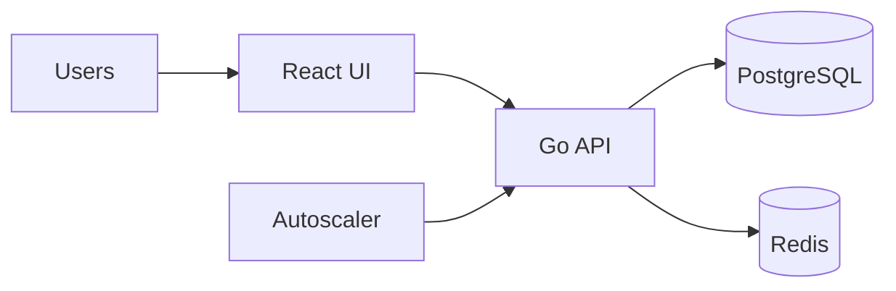

# Lab 6: Social Media - Autoscaling & Performance

**Time**: 90 minutes  
**Difficulty**: ⭐⭐⭐⭐ Expert  
**Focus**: Autoscaling, Resource management, Performance optimization

---

## 🎯 Objective
Deploy social media platform and configure autoscaling for high traffic. Learn how Kubernetes automatically scales applications based on load.

## 📋 What You'll Learn
- Horizontal Pod Autoscaler (HPA)
- Vertical Pod Autoscaler (VPA)
- Resource requests & limits
- Metrics Server
- Load testing
- Performance tuning

---

## ✅ Prerequisites Check

```bash
./scripts/check-lab-prereqs.sh 6
```

Ensures `kubectl`, `helm`, and the social media manifests are ready to go.

## 🧭 Architecture Snapshot



## 📦 Manifest Starter Kit

- Overlay status: `labs/manifests/lab-06/` (in progress)
- Manual approach: apply manifests from `social-media-platform/k8s`, then layer in the HPA, VPA, and resource patch commands detailed in this lab.

---

## 🚀 Steps

### 1. Install Metrics Server (5 min)

```bash
# Install metrics server (required for HPA)
kubectl apply -f https://github.com/kubernetes-sigs/metrics-server/releases/latest/download/components.yaml

# For local clusters, might need to disable TLS verification
kubectl patch deployment metrics-server -n kube-system --type='json' \
  -p='[{"op": "add", "path": "/spec/template/spec/containers/0/args/-", "value": "--kubelet-insecure-tls"}]'

# Wait for metrics server
kubectl wait --for=condition=ready pod -l k8s-app=metrics-server -n kube-system --timeout=120s

# Test metrics
kubectl top nodes
```

### 2. Create Namespace & Deploy (10 min)

```bash
kubectl create namespace social-lab
kubectl config set-context --current --namespace=social-lab

# Deploy database
kubectl apply -f social-media-platform/k8s/database-deployment.yaml -n social-lab
kubectl apply -f social-media-platform/k8s/database-service.yaml -n social-lab

# Deploy backend with resource limits
kubectl apply -f social-media-platform/k8s/backend-deployment.yaml -n social-lab
kubectl apply -f social-media-platform/k8s/backend-service.yaml -n social-lab

# Deploy frontend
kubectl apply -f social-media-platform/k8s/frontend-deployment.yaml -n social-lab
kubectl apply -f social-media-platform/k8s/frontend-service.yaml -n social-lab

# Wait for all pods
kubectl wait --for=condition=ready pod --all -n social-lab --timeout=180s
```

### 3. Set Resource Requests & Limits (10 min)

```bash
# Update backend deployment with resources
kubectl patch deployment social-backend -n social-lab --type='json' -p='[
  {
    "op": "add",
    "path": "/spec/template/spec/containers/0/resources",
    "value": {
      "requests": {
        "cpu": "100m",
        "memory": "128Mi"
      },
      "limits": {
        "cpu": "500m",
        "memory": "512Mi"
      }
    }
  }
]'

# Verify resources set
kubectl describe deployment social-backend -n social-lab | grep -A 5 "Limits"

# Check current resource usage
kubectl top pods -n social-lab
```

### 4. Create Horizontal Pod Autoscaler (10 min)

```bash
# Create HPA (scale based on CPU)
kubectl autoscale deployment social-backend \
  --cpu-percent=50 \
  --min=2 \
  --max=10 \
  -n social-lab

# Verify HPA
kubectl get hpa -n social-lab

# Watch HPA (in separate terminal)
kubectl get hpa -n social-lab -w
```

### 5. Generate Load (15 min)

```bash
# Port forward backend
kubectl port-forward -n social-lab service/social-backend 8000:8000 &

# Install load testing tool
# brew install k6  # macOS
# Or use Apache Bench (ab) that comes with Apache

# Create load test script
cat > /tmp/load-test.js <<'EOF'
import http from 'k6/http';
import { sleep } from 'k6';

export let options = {
  stages: [
    { duration: '2m', target: 10 },   // Ramp up to 10 users
    { duration: '5m', target: 50 },   // Stay at 50 users
    { duration: '2m', target: 100 },  // Spike to 100 users
    { duration: '3m', target: 0 },    // Ramp down
  ],
};

export default function () {
  http.get('http://localhost:8000/api/posts');
  sleep(1);
}
EOF

# Run load test
k6 run /tmp/load-test.js

# Or use Apache Bench
# ab -n 10000 -c 100 http://localhost:8000/api/posts
```

### 6. Watch Autoscaling (10 min)

While load test runs, watch in separate terminals:

```bash
# Terminal 1: Watch HPA
watch -n 2 kubectl get hpa -n social-lab

# Terminal 2: Watch pods
watch -n 2 kubectl get pods -n social-lab

# Terminal 3: Watch resource usage
watch -n 2 kubectl top pods -n social-lab

# You should see:
# 1. CPU usage increase
# 2. HPA target % go above 50%
# 3. New pods being created
# 4. Pods reach up to 10 replicas
```

### 7. Advanced HPA with Multiple Metrics (15 min)

```bash
# Delete simple HPA
kubectl delete hpa social-backend -n social-lab

# Create advanced HPA with multiple metrics
cat <<EOF | kubectl apply -f -
apiVersion: autoscaling/v2
kind: HorizontalPodAutoscaler
metadata:
  name: social-backend-hpa
  namespace: social-lab
spec:
  scaleTargetRef:
    apiVersion: apps/v1
    kind: Deployment
    name: social-backend
  minReplicas: 2
  maxReplicas: 20
  metrics:
  - type: Resource
    resource:
      name: cpu
      target:
        type: Utilization
        averageUtilization: 70
  - type: Resource
    resource:
      name: memory
      target:
        type: Utilization
        averageUtilization: 80
  behavior:
    scaleDown:
      stabilizationWindowSeconds: 300
      policies:
      - type: Percent
        value: 50
        periodSeconds: 60
    scaleUp:
      stabilizationWindowSeconds: 0
      policies:
      - type: Percent
        value: 100
        periodSeconds: 30
      - type: Pods
        value: 4
        periodSeconds: 30
      selectPolicy: Max
EOF

# Describe HPA
kubectl describe hpa social-backend-hpa -n social-lab
```

### 8. Test Scale Down (10 min)

```bash
# Stop load test (Ctrl+C)

# Watch scale down (takes 5+ minutes due to stabilization window)
kubectl get hpa social-backend-hpa -n social-lab -w

# You should see:
# 1. CPU usage decrease
# 2. HPA target % go below 70%
# 3. Pods gradually removed (not all at once)
# 4. Eventually stabilize at minReplicas (2)
```

### 9. Configure Pod Disruption Budget (5 min)

```bash
# Ensure high availability during scaling
cat <<EOF | kubectl apply -f -
apiVersion: policy/v1
kind: PodDisruptionBudget
metadata:
  name: social-backend-pdb
  namespace: social-lab
spec:
  minAvailable: 1
  selector:
    matchLabels:
      app: social-backend
EOF

# Verify
kubectl get pdb -n social-lab
```

---

## ✅ Validation

```bash
# 1. Metrics server working
kubectl top nodes
kubectl top pods -n social-lab

# 2. HPA created
kubectl get hpa -n social-lab
# Expected: social-backend-hpa

# 3. Resources set
kubectl describe deployment social-backend -n social-lab | grep -A 10 Resources

# 4. Autoscaling happened
kubectl get hpa social-backend-hpa -n social-lab
# Check REPLICAS column (should have scaled during load test)

# 5. Current pods match HPA
kubectl get pods -n social-lab -l app=social-backend | wc -l

# 6. PDB configured
kubectl get pdb -n social-lab
```

**All checks pass?** ✅ Lab complete!

---

## 📊 Validate Your Work

```bash
./scripts/validate-lab.sh 6
```

This checks the namespace, deployments, database service, metrics server, and HPA configuration.

## 🧠 Quick Check

<details>
  <summary>How can you watch HPA decisions in real time?</summary>
  ```bash
  kubectl get hpa social-backend -n social-lab -w
  ```
  </details>

<details>
  <summary>What command shows current pod CPU usage?</summary>
  ```bash
  kubectl top pods -n social-lab
  ```
  </details>

## 🏆 Challenge Mode

- Add a Vertical Pod Autoscaler (VPA) in recommendation mode and compare suggestions.
- Configure Prometheus/Grafana dashboards to visualize CPU and HPA metrics.
- Introduce a PodDisruptionBudget to maintain minimum backend replicas during node maintenance.

## 🔧 Troubleshooting Flow

1. **HPA status unknown?** → Ensure metrics server pods are running without TLS errors.
2. **HPA not scaling?** → Confirm CPU resource requests are set (HPA uses requests as baseline).
3. **Pods throttled?** → Examine `kubectl describe pod` for throttling messages due to low limits.
4. **Load test fails?** → Verify port-forward is active and consider increasing the HPA max replicas.

---

## 🧹 Cleanup

```bash
kubectl delete namespace social-lab
```

---

## 🎓 Key Concepts Learned

1. **HPA**: Automatically scales pods based on metrics
2. **Resource Requests**: Minimum guaranteed resources
3. **Resource Limits**: Maximum allowed resources
4. **Metrics Server**: Provides CPU/memory metrics
5. **Scale-up Policy**: How fast to add pods
6. **Scale-down Policy**: How fast to remove pods
7. **PodDisruptionBudget**: Maintain availability during scaling

---

## 📚 HPA Behavior Explained

### Scale Up
- **Fast response**: Add pods quickly when load increases
- **Multiple policies**: Can add % or fixed number
- **selectPolicy: Max**: Use policy that adds more pods

### Scale Down
- **Slow and steady**: Remove pods gradually
- **Stabilization window**: Wait before scaling down (avoid flapping)
- **Safety first**: Don't remove too many pods at once

---

## 🔧 Resource Management Best Practices

### CPU
```yaml
requests:
  cpu: "100m"      # 0.1 CPU core (guaranteed)
limits:
  cpu: "500m"      # 0.5 CPU core (throttled if exceeded)
```

### Memory
```yaml
requests:
  memory: "128Mi"  # 128 MiB (guaranteed)
limits:
  memory: "512Mi"  # 512 MiB (killed if exceeded - OOMKilled)
```

### Recommendations
- **Requests**: Set based on average usage
- **Limits**: Set based on peak usage
- **CPU**: Throttled when exceeded
- **Memory**: Pod killed when exceeded
- **Always set both**: For predictable behavior

---

## 📊 HPA Metrics

### CPU Utilization
```yaml
- type: Resource
  resource:
    name: cpu
    target:
      type: Utilization
      averageUtilization: 70  # Scale when avg > 70%
```

### Memory Utilization
```yaml
- type: Resource
  resource:
    name: memory
    target:
      type: Utilization
      averageUtilization: 80
```

### Custom Metrics (Advanced)
```yaml
- type: Pods
  pods:
    metric:
      name: http_requests_per_second
    target:
      type: AverageValue
      averageValue: "1000"
```

---

## 🔍 Debugging Tips

**HPA not scaling?**
```bash
# Check HPA events
kubectl describe hpa <name> -n <namespace>

# Check metrics available
kubectl top pods -n <namespace>

# Check resource requests set
kubectl describe deployment <name> -n <namespace>
```

**Metrics server not working?**
```bash
# Check metrics-server logs
kubectl logs -n kube-system -l k8s-app=metrics-server

# Check metrics-server service
kubectl get apiservice v1beta1.metrics.k8s.io
```

**Pods OOMKilled?**
```bash
# Check pod status
kubectl get pods -n <namespace>

# Check events
kubectl describe pod <name> -n <namespace>

# Increase memory limits
```

---

## 🚀 Next Lab

**[Lab 7: Multi-App Orchestration](07-multi-app.md)**

Learn about:
- Deploy all 6 apps together
- Service mesh (Istio basics)
- Centralized logging
- Monitoring with Prometheus
- Cross-app communication
