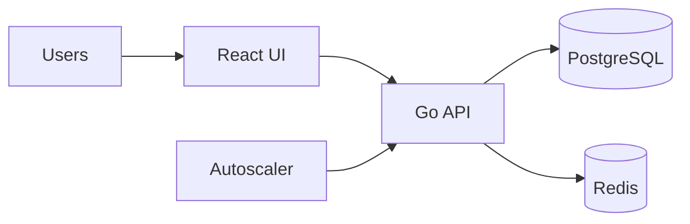

# Lab 7: Social Media - Autoscaling & Performance
Learn to scale a social media backend automatically and tune resource requests/limits.

**Time**: 90 minutes  
**Difficulty**: ⭐⭐⭐⭐ Expert  
**Focus**: Autoscaling, Resource management, Performance optimization

---

## 🎯 Objective
Deploy social media platform and configure autoscaling for high traffic. Learn how Kubernetes automatically scales applications based on load.

## 📚 Assumed Knowledge
**Required**: Resource limits (Lab 4), RBAC (Lab 6), Multi-tier architecture (Labs 2-3)  
**Helpful**: Basic understanding of metrics and monitoring

## 📋 What You'll Learn
- Horizontal Pod Autoscaler (HPA)
- Vertical Pod Autoscaler (VPA)
- Resource requests & limits
- Metrics Server
- Load testing
- Performance tuning---

## 🧠 Test Your Knowledge

Ready to verify your mastery? Take the **[Lab 7 Self-Assessment Quiz](../docs/learning/SELF-ASSESSMENT.md#-lab-7--social-scaling)** and see how you score!

---

## � Ready for the Ultimate Scaling Challenge?

**You've mastered autoscaling and performance optimization!** Now face a real Black Friday scenario:

### [🛍️ Challenge Lab B: Black Friday Rush](challenge-b-black-friday.md)

**Scenario**: Black Friday. E-commerce traffic is 10x normal. You have 13 minutes to midnight.

**What you'll face**:
- Aggressive traffic spikes
- Resource bottlenecks
- Database pressure
- Real-time scaling decisions
- Performance vs. cost tradeoffs

**Prerequisites**: Complete Labs 1-7 ✅ (you're ready!)

**Time**: 60 minutes  
**Difficulty**: ⭐⭐⭐⭐ Expert+

This challenge tests everything you learned about scaling, HPA, resource management, and performance under extreme pressure. It simulates the most stressful day in e-commerce!

**[→ Accept the Challenge](challenge-b-black-friday.md)**

---

## �🚀 Next Lab

**[Lab 8: Multi-App Orchestration](08-multi-app.md)**
- Resource requests & limits
- Metrics Server
- Load testing
- Performance tuning

---

## ✅ Prerequisites Check

```bash
./scripts/check-lab-prereqs.sh 7
```

Ensures `kubectl`, `helm`, and the social media manifests are ready to go.

## 💻 Resource Requirements

> **💡 Planning ahead?** See the complete [Resource Requirements Guide](../docs/reference/resource-requirements.md) or use the calculator: `./scripts/calculate-lab-resources.sh 7`

**This lab needs**:
- **CPU**: 900m requests, 3.4 CPU limits
- **Memory**: 1.2Gi requests, 4.5Gi limits
- **Pods**: 8 total (2-4 frontend, 2-4 backend with HPA, 1 PostgreSQL, 1 Redis)
- **Disk**: ~1200MB for container images + 2Gi PVC
- **Ports**: 3000, 8080, 5432, 6379, 30300, 30380

**Minimum cluster**: 4 CPU cores, 5GB RAM, 3GB disk  
**Estimated time**: 50 minutes

<details>
<summary>👉 Click to see detailed breakdown</summary>

| Component | Replicas | CPU Request | CPU Limit | Memory Request | Memory Limit |
|-----------|----------|-------------|-----------|----------------|--------------|
| React Frontend (HPA: 2-4) | 2 | 100m | 500m | 128Mi | 512Mi |
| Go Backend API (HPA: 2-4) | 2 | 200m | 800m | 256Mi | 1Gi |
| PostgreSQL | 1 | 200m | 500m | 384Mi | 1Gi |
| Redis Cache | 1 | 100m | 200m | 128Mi | 256Mi |
| Metrics Server | 1 | 100m | 200m | 128Mi | 256Mi |
| **Totals (min)** | **8** | **900m** | **3.4** | **1.2Gi** | **4.5Gi** |

**Port Allocation**:
- **3000**: React frontend
- **8080**: Go backend API
- **5432**: PostgreSQL database
- **6379**: Redis cache
- **30300**: NodePort for frontend access
- **30380**: NodePort for backend API

**Horizontal Pod Autoscaler (HPA) Behavior**:
- **Frontend**: Scales 2 → 4 replicas when CPU > 70%
- **Backend**: Scales 2 → 4 replicas when CPU > 70%
- **Metrics Server**: Required for HPA to function
- **Max resources**: Can grow to 1.3 CPU request, 5.2 CPU limits at full scale

**Working Directory**: All commands assume you're in `/path/to/stack-to-k8s-main`

**Resource Notes**:
- **HPA requires Metrics Server** (automatically installed in most clusters)
- Resource requests enable proper autoscaling decisions
- Redis caching reduces database load during traffic spikes
- This lab simulates viral content scenarios with load testing

</details>

## 🧭 Architecture Snapshot



## 📦 Manifest Starter Kit

- Overlay status: `labs/manifests/lab-07/` (in progress)
- Manual approach: apply manifests from `social-media-platform/k8s`, then layer in the HPA, VPA, and resource patch commands detailed in this lab.

---

## 🚀 Steps

### 1. Install Metrics Server (5 min)

```bash
# Install metrics server (required for HPA)
kubectl apply -f https://github.com/kubernetes-sigs/metrics-server/releases/latest/download/components.yaml

# For local clusters, might need to disable TLS verification
kubectl patch deployment metrics-server -n kube-system --type='json' \
  -p='[{"op": "add", "path": "/spec/template/spec/containers/0/args/-", "value": "--kubelet-insecure-tls"}]'

# Wait for metrics server
kubectl wait --for=condition=ready pod -l k8s-app=metrics-server -n kube-system --timeout=120s

# Test metrics
kubectl top nodes
```

# 2. Create Namespace & Deploy (10 min)

```bash
kubectl create namespace social-lab

# Safer option: prefer using -n on kubectl commands rather than switching your current kubectl context
# Example: kubectl apply -f social-media-platform/k8s/database-deployment.yaml -n social-lab

# If you prefer to change the current context, capture previous namespace and restore it:
PREV_NS=$(kubectl config view --minify --output 'jsonpath={..namespace}' 2>/dev/null || echo default)
kubectl config set-context --current --namespace=social-lab
# To restore:
kubectl config set-context --current --namespace="$PREV_NS"

# Deploy database
kubectl apply -f social-media-platform/k8s/database-deployment.yaml -n social-lab
kubectl apply -f social-media-platform/k8s/database-service.yaml -n social-lab

# Deploy Redis cache
kubectl apply -f social-media-platform/k8s/redis-deployment.yaml -n social-lab
kubectl apply -f social-media-platform/k8s/redis-service.yaml -n social-lab

# Deploy backend with resource limits
kubectl apply -f social-media-platform/k8s/backend-deployment.yaml -n social-lab
kubectl apply -f social-media-platform/k8s/backend-service.yaml -n social-lab

# Deploy frontend
kubectl apply -f social-media-platform/k8s/frontend-deployment.yaml -n social-lab
kubectl apply -f social-media-platform/k8s/frontend-service.yaml -n social-lab

# Wait for all pods
kubectl wait --for=condition=ready pod --all -n social-lab --timeout=180s
```

### 3. Set Resource Requests & Limits (10 min)

```bash
# Update backend deployment with resources
kubectl patch deployment social-backend -n social-lab --type='json' -p='[
  {
    "op": "add",
    "path": "/spec/template/spec/containers/0/resources",
    "value": {
      "requests": {
        "cpu": "100m",
        "memory": "128Mi"
      },
      "limits": {
        "cpu": "500m",
        "memory": "512Mi"
      }
    }
  }
]'

# Verify resources set
kubectl describe deployment social-backend -n social-lab | grep -A 5 "Limits"

# Check current resource usage
kubectl top pods -n social-lab
```

### 4. Create Horizontal Pod Autoscaler (10 min)

```bash
# Create HPA (scale based on CPU)
kubectl autoscale deployment social-backend \
  --cpu-percent=50 \
  --min=2 \
  --max=10 \
  -n social-lab

# Verify HPA
kubectl get hpa -n social-lab

# Watch HPA (in separate terminal)
kubectl get hpa -n social-lab -w
```

---

## 💰 Cost Reality Check

**Your current setup**:
```yaml
resources:
  requests:
    cpu: 500m      # Reserved for each pod
    memory: 1Gi    
  limits:
    cpu: 1000m     # Maximum allowed
    memory: 2Gi
```

**HPA Configuration**:
- Min pods: 2
- Max pods: 10
- Scale target: 50% CPU

### Monthly Cost Calculation

**Assumptions** (AWS pricing, adjust for your cloud):
- CPU: $0.03/hour per 1 vCPU (On-Demand)
- Memory: $0.01/hour per 1 GB

**Minimum Cost** (2 pods always running):
```
CPU: 2 pods × 0.5 vCPU × $0.03 × 730 hours = $21.90/month
Memory: 2 pods × 1 GB × $0.01 × 730 hours = $14.60/month
Total Minimum: $36.50/month
```

**Maximum Cost** (scaled to 10 pods during peak):
```
CPU: 10 pods × 0.5 vCPU × $0.03 × 730 hours = $109.50/month
Memory: 10 pods × 1 GB × $0.01 × 730 hours = $73.00/month
Total Maximum: $182.50/month
```

**Realistic Average** (assuming 20% of time at max, 80% at min):
```
$36.50 × 0.80 + $182.50 × 0.20 = $65.70/month per backend service
```

### 🎯 Optimization Challenge

**Can you reduce this by 50%?**

Hints:
1. **Profile first**: Does your app really need 500m CPU?
   ```bash
   kubectl top pods -n social-lab --containers
   # If actual usage is 150m, you're over-provisioned by 3x
   ```

2. **Right-size requests**:
   ```bash
   kubectl set resources deployment social-backend -n social-lab \
     --requests=cpu=200m,memory=512Mi \
     --limits=cpu=400m,memory=1Gi
   ```

3. **New Cost**:
   ```
   Min: 2 pods × 0.2 vCPU × $0.03 × 730 = $8.76/month  ✅ 76% savings!
   Max: 10 pods × 0.2 vCPU × $0.03 × 730 = $43.80/month
   Average: $17.52/month  ✅ Saved $48.18/month ($578/year)
   ```

4. **Multiply across services**: 50 microservices × $578 = **$28,900 annual savings** 💰

### Spot Instances Bonus

Use Spot/Preemptible instances for non-critical workloads:
```bash
# Add node selector for spot instances
kubectl patch deployment social-backend -n social-lab -p '
spec:
  template:
    spec:
      nodeSelector:
        kubernetes.io/lifecycle: spot
      tolerations:
      - key: spot
        operator: Exists
'
```

**Additional savings**: 70% off = **$12.26/month total** ✅ 81% total savings!

---

### 5. Generate Load (15 min)

```bash
# Port forward backend
kubectl port-forward -n social-lab service/social-backend 8000:8000 &
sleep 2  # Wait for port-forward to establish

# Install load testing tool
# brew install k6  # macOS
# Or use Apache Bench (ab) that comes with Apache

# Create load test script
cat > /tmp/load-test.js <<'EOF'
import http from 'k6/http';
import { sleep } from 'k6';

export let options = {
  stages: [
    { duration: '2m', target: 10 },   // Ramp up to 10 users
    { duration: '5m', target: 50 },   // Stay at 50 users
    { duration: '2m', target: 100 },  // Spike to 100 users
    { duration: '3m', target: 0 },    // Ramp down
  ],
};

export default function () {
  http.get('http://localhost:8000/api/posts');
  sleep(1);
}
EOF

# Run load test
k6 run /tmp/load-test.js

# Or use Apache Bench
# ab -n 10000 -c 100 http://localhost:8000/api/posts
```

### 6. Watch Autoscaling (10 min)

While load test runs, watch in separate terminals:

```bash
# Terminal 1: Watch HPA
watch -n 2 kubectl get hpa -n social-lab

# Terminal 2: Watch pods
watch -n 2 kubectl get pods -n social-lab

# Terminal 3: Watch resource usage
watch -n 2 kubectl top pods -n social-lab

# You should see:
# 1. CPU usage increase
# 2. HPA target % go above 50%
# 3. New pods being created
# 4. Pods reach up to 10 replicas
```

### 7. Advanced HPA with Multiple Metrics (15 min)

```bash
# Delete simple HPA
kubectl delete hpa social-backend -n social-lab

# Create advanced HPA with multiple metrics
cat <<EOF | kubectl apply -f -
apiVersion: autoscaling/v2
kind: HorizontalPodAutoscaler
metadata:
  name: social-backend-hpa
  namespace: social-lab
spec:
  scaleTargetRef:
    apiVersion: apps/v1
    kind: Deployment
    name: social-backend
  minReplicas: 2
  maxReplicas: 20
  metrics:
  - type: Resource
    resource:
      name: cpu
      target:
        type: Utilization
        averageUtilization: 70
  - type: Resource
    resource:
      name: memory
      target:
        type: Utilization
        averageUtilization: 80
  behavior:
    scaleDown:
      stabilizationWindowSeconds: 300
      policies:
      - type: Percent
        value: 50
        periodSeconds: 60
    scaleUp:
      stabilizationWindowSeconds: 0
      policies:
      - type: Percent
        value: 100
        periodSeconds: 30
      - type: Pods
        value: 4
        periodSeconds: 30
      selectPolicy: Max
EOF

# Describe HPA
kubectl describe hpa social-backend-hpa -n social-lab
```

### 8. Test Scale Down (10 min)

```bash
# Stop load test (Ctrl+C)

# Watch scale down (takes 5+ minutes due to stabilization window)
kubectl get hpa social-backend-hpa -n social-lab -w

# You should see:
# 1. CPU usage decrease
# 2. HPA target % go below 70%
# 3. Pods gradually removed (not all at once)
# 4. Eventually stabilize at minReplicas (2)
```

### 9. Configure Pod Disruption Budget (5 min)

```bash
# Ensure high availability during scaling
cat <<EOF | kubectl apply -f -
apiVersion: policy/v1
kind: PodDisruptionBudget
metadata:
  name: social-backend-pdb
  namespace: social-lab
spec:
  minAvailable: 1
  selector:
    matchLabels:
      app: social-backend
EOF

# Verify
kubectl get pdb -n social-lab
```

---

## ✅ Validation

```bash
# 1. Metrics server working
kubectl top nodes
kubectl top pods -n social-lab

# 2. HPA created
kubectl get hpa -n social-lab
# Expected: social-backend-hpa

# 3. Resources set
kubectl describe deployment social-backend -n social-lab | grep -A 10 Resources

# 4. Autoscaling happened
kubectl get hpa social-backend-hpa -n social-lab
# Check REPLICAS column (should have scaled during load test)

# 5. Current pods match HPA
kubectl get pods -n social-lab -l app=social-backend | wc -l

# 6. PDB configured
kubectl get pdb -n social-lab
```

**All checks pass?** ✅ Lab complete!

---
## 🧠 Quick Check

<details>
  <summary>How can you watch HPA decisions in real time?</summary>
  ```bash
  kubectl get hpa social-backend -n social-lab -w
  ```
  </details>

<details>
  <summary>What command shows current pod CPU usage?</summary>
  ```bash
  kubectl top pods -n social-lab
  ```
  </details>

## 🏆 Challenge Mode

- Add a Vertical Pod Autoscaler (VPA) in recommendation mode and compare suggestions.
- Configure Prometheus/Grafana dashboards to visualize CPU and HPA metrics.
- Introduce a PodDisruptionBudget to maintain minimum backend replicas during node maintenance.

## 🔧 Troubleshooting Flow

1. **HPA status unknown?** → Ensure metrics server pods are running without TLS errors.
2. **HPA not scaling?** → Confirm CPU resource requests are set (HPA uses requests as baseline).
3. **Pods throttled?** → Examine `kubectl describe pod` for throttling messages due to low limits.
4. **Load test fails?** → Verify port-forward is active and consider increasing the HPA max replicas.

---

## 🔍 Observability Check: Autoscaling & Performance Validation

**Scaling Blindspot**: HPA status "Running" doesn't mean it's working! Many beginners configure HPA but never verify scaling actually happens under load.

### ✅ Pillar 1: Metrics (HPA Decision-Making)
```bash
# Check HPA status (most important command for this lab)
kubectl get hpa -n social-lab
# NAME              REFERENCE                      TARGETS   MINPODS   MAXPODS   REPLICAS   AGE
# social-backend    Deployment/social-backend      45%/50%   2         10        3          5m
#                                                   ↑ Current/Target

# Detailed HPA metrics
kubectl describe hpa social-backend -n social-lab
# Look for:
# - Current CPU: 45% (should be below target 50% when idle)
# - Desired Replicas: 3 (matches actual pod count)
# - Events: "Scaled up to 3" (proves HPA is active)

# 🚨 HPA red flags:
# - TARGETS shows "<unknown>/50%" → metrics-server not working (check kubectl top nodes)
# - Current CPU > Target but REPLICAS not increasing → Max replicas reached or insufficient cluster resources
# - Events show "FailedGetResourceMetric" → Pod missing `resources.requests.cpu`

# Check per-pod CPU usage (to understand HPA decisions)
kubectl top pods -n social-lab
# NAME                           CPU(cores)   MEMORY(bytes)
# social-backend-xxx-1           120m         200Mi       ← 60% of 200m request = triggers scale
# social-backend-xxx-2           110m         190Mi
# social-backend-xxx-3           100m         180Mi

# HPA calculates: AVG(120m + 110m + 100m) / 200m request = 55% → Scale up!
```

### ✅ Pillar 2: Logs (Scaling Events & Load Patterns)
```bash
# Watch HPA scaling decisions in real-time
kubectl get events -n social-lab --watch --field-selector involvedObject.kind=HorizontalPodAutoscaler

# Expected during load test:
# 0s   Normal   SuccessfulRescale   HorizontalPodAutoscaler   Scaled up to 4 replicas
# 30s  Normal   SuccessfulRescale   HorizontalPodAutoscaler   Scaled up to 6 replicas
# 2m   Normal   SuccessfulRescale   HorizontalPodAutoscaler   Scaled down to 3 replicas

# Check backend logs during scaling (verify new pods handle traffic)
stern -n social-lab social-backend | grep "GET /api"
# Should see requests distributed across all replicas (load balancing working)

# 🚨 Scaling failure patterns in logs:
# - New pod logs: "CrashLoopBackOff" → Pod can't start (check resource limits too low)
# - Old pod logs: "Connection pool exhausted" → Scale happened too late (lower HPA target)
# - No logs from new pods → Service selector mismatch (new pods not receiving traffic)
```

### ✅ Pillar 3: Events (Resource Pressure & Scheduling)
```bash
# Check if cluster has capacity for scaling
kubectl describe nodes | grep -A 5 "Allocated resources"
# cpu: 2000m / 4000m (50%)  ← Still room to scale
# memory: 4Gi / 8Gi (50%)

# If nodes are full (80%+ allocated):
# - HPA can't scale → Pods stuck Pending
# - Solution: Add cluster autoscaler OR increase node capacity

# Check pod scheduling during scale-up
kubectl get events -n social-lab --field-selector reason=FailedScheduling
# If you see events: "0/3 nodes available: insufficient cpu"
# → Cluster can't support max HPA replicas (reduce HPA maxReplicas or add nodes)
```

### 🎯 Load Testing Validation (Prove HPA Works)
**The Ultimate Test: Generate load → Watch HPA scale → Verify performance improves**

```bash
# 1. Start load test (use 'hey' for HTTP load generation)
kubectl run load-generator --image=williamyeh/hey:latest -n social-lab --rm -it --restart=Never -- \
  -z 60s -c 50 -q 10 http://social-backend:3001/api/posts

# Flags explained:
# -z 60s = Run for 60 seconds
# -c 50 = 50 concurrent requests
# -q 10 = 10 requests/second per worker

# 2. Watch HPA scale in real-time (separate terminal)
watch -n 2 'kubectl get hpa -n social-lab'
# Expected: REPLICAS increases from 2 → 4 → 6 as load increases

# 3. Verify response time improves with scale-up
# Before scaling: AVG latency = 500ms (2 replicas overloaded)
# After scaling: AVG latency = 150ms (6 replicas distribute load)

# 4. Watch scale-down after load stops (HPA default cooldown = 5min)
# After 5 minutes of low traffic: REPLICAS decreases 6 → 4 → 2
```

### 📊 Autoscaling Health Checklist
- [ ] `kubectl get hpa` shows TARGETS as percentage (not `<unknown>`)
- [ ] HPA Events show "SuccessfulRescale" during load test
- [ ] `kubectl top pods` shows CPU% matching HPA target
- [ ] New pods reach `Running` state within 30 seconds of scale-up
- [ ] Load test shows latency DECREASES as replicas increase
- [ ] HPA scales down after 5 minutes of idle time (default cooldown)
- [ ] Cluster has capacity for max replicas (check node allocations)

**Pro Tip**: HPA uses `targetAverageUtilization`, not absolute CPU. Example:
- Pod `resources.requests.cpu: 200m`
- HPA `targetCPUUtilizationPercentage: 50`
- HPA scales up when pod uses > 100m (50% of 200m request)

**Common HPA Mistakes**:
1. **No resource requests**: HPA can't calculate percentage → Shows `<unknown>`
2. **Target too high (80%+)**: Pods thrash under load before HPA reacts
3. **Min = Max replicas**: HPA can't scale (pointless configuration)
4. **Too-short cooldown**: Pods scale up/down rapidly (wastes resources)

**Next Level**: Combine HPA with Cluster Autoscaler for infinite scale → [Lab 8: Multi-App Orchestration](08-multi-app.md)

---

## 🧹 Cleanup

```bash
kubectl delete namespace social-lab
```

---

## 🎓 Key Concepts Learned

1. **HPA**: Automatically scales pods based on metrics
2. **Resource Requests**: Minimum guaranteed resources
3. **Resource Limits**: Maximum allowed resources
4. **Metrics Server**: Provides CPU/memory metrics
5. **Scale-up Policy**: How fast to add pods
6. **Scale-down Policy**: How fast to remove pods
7. **PodDisruptionBudget**: Maintain availability during scaling

---

## 📚 HPA Behavior Explained

### Scale Up
- **Fast response**: Add pods quickly when load increases
- **Multiple policies**: Can add % or fixed number
- **selectPolicy: Max**: Use policy that adds more pods

### Scale Down
- **Slow and steady**: Remove pods gradually
- **Stabilization window**: Wait before scaling down (avoid flapping)
- **Safety first**: Don't remove too many pods at once

---

## 🔧 Resource Management Best Practices

### CPU
```yaml
requests:
  cpu: "100m"      # 0.1 CPU core (guaranteed)
limits:
  cpu: "500m"      # 0.5 CPU core (throttled if exceeded)
```

### Memory
```yaml
requests:
  memory: "128Mi"  # 128 MiB (guaranteed)
limits:
  memory: "512Mi"  # 512 MiB (killed if exceeded - OOMKilled)
```

### Recommendations
- **Requests**: Set based on average usage
- **Limits**: Set based on peak usage
- **CPU**: Throttled when exceeded
- **Memory**: Pod killed when exceeded
- **Always set both**: For predictable behavior

---

## 📊 HPA Metrics

### CPU Utilization
```yaml
- type: Resource
  resource:
    name: cpu
    target:
      type: Utilization
      averageUtilization: 70  # Scale when avg > 70%
```

### Memory Utilization
```yaml
- type: Resource
  resource:
    name: memory
    target:
      type: Utilization
      averageUtilization: 80
```

### Custom Metrics (Advanced)
```yaml
- type: Pods
  pods:
    metric:
      name: http_requests_per_second
    target:
      type: AverageValue
      averageValue: "1000"
```

---

## 🔍 Debugging Tips

**HPA not scaling?**
```bash
# Check HPA events
kubectl describe hpa <name> -n <namespace>

# Check metrics available
kubectl top pods -n <namespace>

# Check resource requests set
kubectl describe deployment <name> -n <namespace>
```

**Metrics server not working?**
```bash
# Check metrics-server logs
kubectl logs -n kube-system -l k8s-app=metrics-server

# Check metrics-server service
kubectl get apiservice v1beta1.metrics.k8s.io
```

**Pods OOMKilled?**
```bash
# Check pod status
kubectl get pods -n <namespace>

# Check events
kubectl describe pod <name> -n <namespace>

# Increase memory limits
```

---

## � Performance Benchmarking (Optional)

### Autoscaling Under Load

Test HPA behavior with realistic traffic patterns:

```bash
# Install hey
# macOS: brew install hey
# Linux: go install github.com/rakyll/hey@latest
# Windows: go install github.com/rakyll/hey@latest
#   Or download from: https://github.com/rakyll/hey/releases

# Get service IP
SERVICE_IP=$(kubectl get svc social-backend -n social-lab -o jsonpath='{.status.loadBalancer.ingress[0].ip}')

# Windows (PowerShell):
# $SERVICE_IP = kubectl get svc social-backend -n social-lab -o jsonpath='{.status.loadBalancer.ingress[0].ip}'

# Baseline test (low load)
hey -n 1000 -c 10 http://$SERVICE_IP:8080/api/posts

# Expected: 2 replicas (min replicas), P95 <200ms

# Spike test (trigger autoscaling)
hey -z 5m -c 50 http://$SERVICE_IP:8080/api/posts

# Watch HPA in real-time
watch kubectl get hpa social-backend-hpa -n social-lab

# Expected scaling behavior:
# 0-30s: 2 replicas (current load: 30% CPU)
# 30-60s: 4 replicas (load spike detected, scaling up)
# 60-120s: 8 replicas (load continues, further scaling)
# 120-180s: 8 replicas (load drops, in cooldown period)
# 180-300s: 4 replicas (scale down after stabilization window)
# 300s+: 2 replicas (back to baseline)
```

### Metrics Collection

Track performance during autoscaling:

```bash
# Collect metrics every 10 seconds during load test
while true; do
  echo "$(date +%H:%M:%S) - Replicas: $(kubectl get hpa social-backend-hpa -n social-lab -o jsonpath='{.status.currentReplicas}') CPU: $(kubectl get hpa social-backend-hpa -n social-lab -o jsonpath='{.status.currentMetrics[0].resource.current.averageUtilization}')%"
  sleep 10
done

# Sample output:
# 14:00:00 - Replicas: 2 CPU: 25%
# 14:00:10 - Replicas: 2 CPU: 85%  ← Spike detected
# 14:00:20 - Replicas: 4 CPU: 70%  ← Scaled up
# 14:00:30 - Replicas: 4 CPU: 80%  ← Still high
# 14:00:40 - Replicas: 8 CPU: 45%  ← Scaled up again
# 14:00:50 - Replicas: 8 CPU: 40%  ← Load distributed
```

### Performance Optimization

**If HPA reacts too slowly**:

```yaml
# Reduce scale-up delay
behavior:
  scaleUp:
    stabilizationWindowSeconds: 0  # Scale up immediately
    policies:
    - type: Percent
      value: 100  # Double replicas per scale event
      periodSeconds: 15
```

**If pods are OOMKilled during spikes**:

```yaml
# Increase memory limits
resources:
  limits:
    memory: "1Gi"  # Was 512Mi
  requests:
    memory: "512Mi"  # Was 256Mi
```

**If latency is still high after scaling**:

```bash
# Check if database is bottleneck
kubectl top pod postgres-0 -n social-lab

# If DB CPU >80%, scale PostgreSQL (read replicas)
# Or add Redis caching layer for frequently accessed data
```

### Benchmark Report Template

```
=== Autoscaling Benchmark Report ===
Date: 2025-10-20
Test Duration: 5 minutes
Concurrent Users: 50

Baseline (Before Load):
- Replicas: 2
- P50 Latency: 45ms
- P95 Latency: 120ms
- Throughput: 250 RPS

Peak Load (During Spike):
- Replicas: 8 (scaled 4x)
- P50 Latency: 55ms (+22%)
- P95 Latency: 180ms (+50%)
- Throughput: 850 RPS (3.4x increase)

Recovery (After Load):
- Scale Down Time: 180 seconds
- Final Replicas: 2
- Latency: Back to baseline

Observations:
- HPA detected spike in 30s ✅
- Scaled from 2→8 replicas in 60s ✅
- P95 latency stayed under 200ms ✅
- Scale down took 3 minutes (expected) ✅

Recommendations:
- Current HPA configuration is optimal
- Consider increasing maxReplicas to 10 for Black Friday
- Monitor database CPU during next spike
```

---

## �🚀 Next Lab

**[Lab 8: Multi-App Orchestration](08-multi-app.md)**

## 🧠 Quick Check

1. What metric does the basic HPA example use to scale pods?
2. Why are resource requests required for HPA to function properly?
3. What does `stabilizationWindowSeconds` control in HPA behavior?


---

## 🎖️ Expert Mode: Cluster Autoscaler Debugging

> 💡 **Optional Challenge** — Master production scaling mysteries! **This is NOT required** to progress, but completing it unlocks the **📈 Scaling Architect** badge!

**⏱️ Time**: +20 minutes  
**🎯 Difficulty**: ⭐⭐⭐⭐ (Advanced)  
**📋 Prerequisites**: Complete Lab 7 HPA setup above

### The Scenario

Your HPA scaled up pods to 10 replicas, but 5 pods are stuck `Pending`. You have Cluster Autoscaler installed, but **it's not adding nodes**:

```bash
kubectl get pods -n social-lab
# NAME                      READY   STATUS    AGE
# social-backend-abc-1      1/1     Running   10m
# social-backend-abc-2      1/1     Running   10m
# social-backend-abc-3      0/1     Pending   5m
# social-backend-abc-4      0/1     Pending   5m
# social-backend-abc-5      0/1     Pending   5m
```

**Your application is degraded because pods can't schedule!**

### Challenge: Debug Why Autoscaler Won't Scale

**Your Mission**:
1. Check Cluster Autoscaler logs
2. Verify node group limits (min/max)
3. Inspect pod events for scheduling failures
4. Check PodDisruptionBudgets
5. Fix the issue and verify scale-up

**Hints**:
```bash
# Find autoscaler pod
kubectl get pods -n kube-system | grep cluster-autoscaler

# Check logs
kubectl logs -n kube-system cluster-autoscaler-xxx --tail=50

# Check node group config (AWS example)
aws autoscaling describe-auto-scaling-groups --query 'AutoScalingGroups[*].[AutoScalingGroupName,MinSize,MaxSize,DesiredCapacity]'

# Check pod events
kubectl describe pod social-backend-abc-3 -n social-lab

# Check PDBs
kubectl get pdb --all-namespaces
```

### Expected Outcome

- ✅ Identify root cause (max nodes, IAM perms, PDB, etc.)
- ✅ Fix configuration
- ✅ Autoscaler adds nodes
- ✅ Pending pods schedule successfully

### Deep Dive: What You're Learning

**Production Skills**:
- Cluster Autoscaler troubleshooting
- Node group configuration
- Pod scheduling constraints
- PodDisruptionBudget impact

**Interview Topics**:
- "Pods are pending, autoscaler won't scale—walk me through your top 3 debugging steps"
- "How do PodDisruptionBudgets affect autoscaling?"
- "What's the difference between HPA and Cluster Autoscaler?"

**Real-World Impact**: **Airbnb's 2021 Black Friday issue**—Cluster Autoscaler hit max node count during traffic spike. Pods stayed pending, bookings failed. Engineers who spotted the ASG limit saved $5M in lost revenue.

### Complete Guide

For detailed autoscaler debugging steps, see:  
**[Senior K8s Debugging Guide: Cluster Autoscaler](../docs/reference/senior-k8s-debugging.md#13-pods-pending---cluster-autoscaler-wont-scale)**

### Badge Unlocked! 🎉

Complete this challenge and you've earned:  
**📈 Scaling Architect** — You can troubleshoot production scaling issues!

**Track your progress**: [Lab Progress Tracker](../docs/learning/LAB-PROGRESS.md#expert-badges)

## 🏆 Challenge Mode

- Create a short k6 script that generates a 2-minute spike and observe the HPA reaction. Summarize the HPA replica counts before, during, and after the spike.


Learn about:
- Deploy all 6 apps together
- Service mesh (Istio basics)
- Centralized logging
- Monitoring with Prometheus
- Cross-app communication
