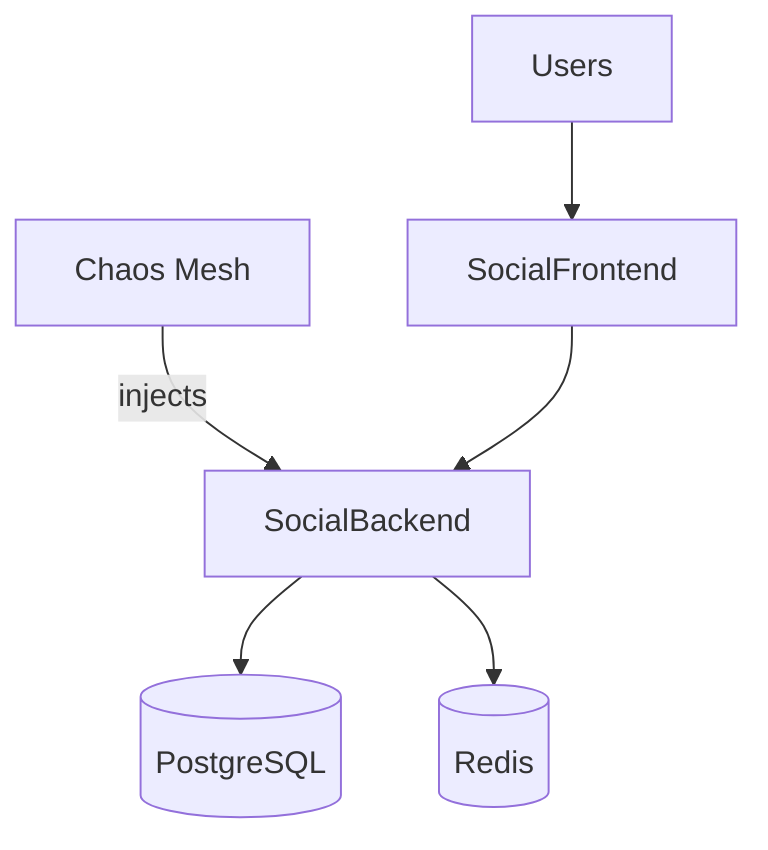

# Lab 8: Chaos Engineering
Practice resilience by injecting controlled failures and validating system recovery.

**Time**: 90 minutes  
**Difficulty**: ⭐⭐⭐⭐ Expert  
**Focus**: Resilience testing, Failure scenarios, Recovery strategies

---

## 🎯 Objective
Learn chaos engineering by intentionally breaking things and watching how Kubernetes recovers. Test application resilience under failure conditions.

## 📋 What You'll Learn
- Chaos Mesh basics
- Pod failure scenarios
- Network delays & partitions
- Resource stress testing
- DNS failures
- Recovery validation
- Resilience patterns

---

## ✅ Prerequisites Check

```bash
./scripts/check-lab-prereqs.sh 8
```

Verifies `kubectl`, `helm`, and the social media manifests are available.

## ✅ Success criteria

- Chaos Mesh control plane is Running and experiments can be created
- Target app recovers after injected failures (pods return to Running)
- No lingering experiments after cleanup

## 🧭 Architecture Snapshot



## 📦 Manifest Starter Kit

- Overlay status: `labs/manifests/lab-08/` (in progress)
- Manual approach: deploy the social media app, then install Chaos Mesh via the Helm chart referenced in this guide.

---

## 🚀 Steps

### 1. Install Chaos Mesh (10 min)

```bash
# Create namespace
kubectl create namespace chaos-testing

# Add Chaos Mesh repo
helm repo add chaos-mesh https://charts.chaos-mesh.org
helm repo update

# Install Chaos Mesh
helm install chaos-mesh chaos-mesh/chaos-mesh \
  --namespace=chaos-mesh \
  --create-namespace \
  --set dashboard.create=true

# Wait for Chaos Mesh
kubectl wait --for=condition=ready pod --all -n chaos-mesh --timeout=180s

# Port forward dashboard
kubectl port-forward -n chaos-mesh svc/chaos-dashboard 2333:2333 &

echo "Chaos Dashboard: http://localhost:2333"
```

### 2. Deploy Test Application (5 min)

```bash
# Deploy social media app for testing
kubectl apply -f social-media-platform/k8s/ -n chaos-testing

# Scale up for better testing
kubectl scale deployment social-backend --replicas=3 -n chaos-testing
kubectl scale deployment social-frontend --replicas=2 -n chaos-testing

# Wait for all pods
kubectl wait --for=condition=ready pod --all -n chaos-testing --timeout=180s

# Verify
kubectl get pods -n chaos-testing
```

### 3. Scenario 1: Pod Kill (10 min)

```bash
# Create PodChaos - randomly kill pods
cat <<EOF | kubectl apply -f -
apiVersion: chaos-mesh.org/v1alpha1
kind: PodChaos
metadata:
  name: pod-kill
  namespace: chaos-testing
spec:
  action: pod-kill
  mode: one
  selector:
    namespaces:
      - chaos-testing
    labelSelectors:
      app: social-backend
  scheduler:
    cron: '@every 30s'
EOF

# Watch pods being killed and recreated
watch -n 2 kubectl get pods -n chaos-testing

# Check events
kubectl get events -n chaos-testing --sort-by='.lastTimestamp'

# Verify app still accessible during chaos
kubectl port-forward -n chaos-testing svc/social-backend 8000:8000 &
while true; do curl -s http://localhost:8000/api/health; sleep 5; done

# Stop chaos after 3 minutes
kubectl delete podchaos pod-kill -n chaos-testing
```

### 4. Scenario 2: Pod Failure (10 min)

```bash
# Create PodChaos - make pod fail (not killed, stays in error state)
cat <<EOF | kubectl apply -f -
apiVersion: chaos-mesh.org/v1alpha1
kind: PodChaos
metadata:
  name: pod-failure
  namespace: chaos-testing
spec:
  action: pod-failure
  mode: fixed
  value: '1'
  duration: '2m'
  selector:
    namespaces:
      - chaos-testing
    labelSelectors:
      app: social-backend
EOF

# Watch pod status
kubectl get pods -n chaos-testing -w

# Check which pod is affected
kubectl describe podchaos pod-failure -n chaos-testing

# Test app resilience (should still work with 2/3 pods)
for i in {1..10}; do
  curl -s http://localhost:8000/api/health
  sleep 1
done

# Cleanup
kubectl delete podchaos pod-failure -n chaos-testing
```

### 5. Scenario 3: Network Delay (15 min)

```bash
# Add 500ms latency to backend
cat <<EOF | kubectl apply -f -
apiVersion: chaos-mesh.org/v1alpha1
kind: NetworkChaos
metadata:
  name: network-delay
  namespace: chaos-testing
spec:
  action: delay
  mode: all
  selector:
    namespaces:
      - chaos-testing
    labelSelectors:
      app: social-backend
  delay:
    latency: '500ms'
    correlation: '100'
    jitter: '0ms'
  duration: '3m'
  direction: to
  target:
    mode: all
    selector:
      namespaces:
        - chaos-testing
EOF

# Test latency impact
echo "Before chaos (should be fast):"
time curl -s http://localhost:8000/api/health

echo "During chaos (should be slow ~500ms):"
time curl -s http://localhost:8000/api/health

# Monitor response times
for i in {1..20}; do
  time curl -s http://localhost:8000/api/health
  sleep 2
done

# Cleanup
kubectl delete networkchaos network-delay -n chaos-testing
```

### 6. Scenario 4: Network Partition (10 min)

```bash
# Partition backend from database
cat <<EOF | kubectl apply -f -
apiVersion: chaos-mesh.org/v1alpha1
kind: NetworkChaos
metadata:
  name: network-partition
  namespace: chaos-testing
spec:
  action: partition
  mode: all
  selector:
    namespaces:
      - chaos-testing
    labelSelectors:
      app: social-backend
  direction: to
  target:
    mode: all
    selector:
      namespaces:
        - chaos-testing
      labelSelectors:
        app: mongodb
  duration: '2m'
EOF

# Watch pod logs (should see connection errors)
kubectl logs -n chaos-testing -l app=social-backend --tail=20 -f

# Test API (should fail for database operations)
curl -s http://localhost:8000/api/posts

# Cleanup
kubectl delete networkchaos network-partition -n chaos-testing
```

### 7. Scenario 5: CPU Stress (10 min)

```bash
# Stress CPU on backend pods
cat <<EOF | kubectl apply -f -
apiVersion: chaos-mesh.org/v1alpha1
kind: StressChaos
metadata:
  name: cpu-stress
  namespace: chaos-testing
spec:
  mode: one
  selector:
    namespaces:
      - chaos-testing
    labelSelectors:
      app: social-backend
  stressors:
    cpu:
      workers: 2
      load: 80
  duration: '3m'
EOF

# Monitor CPU usage
watch -n 2 kubectl top pods -n chaos-testing

# Check if HPA scales up (if configured)
kubectl get hpa -n chaos-testing -w

# Cleanup
kubectl delete stresschaos cpu-stress -n chaos-testing
```

### 8. Scenario 6: Memory Stress (10 min)

```bash
# Stress memory (risk of OOMKill)
cat <<EOF | kubectl apply -f -
apiVersion: chaos-mesh.org/v1alpha1
kind: StressChaos
metadata:
  name: memory-stress
  namespace: chaos-testing
spec:
  mode: one
  selector:
    namespaces:
      - chaos-testing
    labelSelectors:
      app: social-backend
  stressors:
    memory:
      workers: 1
      size: '256MB'
  duration: '2m'
EOF

# Watch for OOMKilled
kubectl get pods -n chaos-testing -w

# Check events
kubectl get events -n chaos-testing | grep OOM

# Monitor memory
watch -n 2 kubectl top pods -n chaos-testing

# Cleanup
kubectl delete stresschaos memory-stress -n chaos-testing
```

### 9. Scenario 7: DNS Failure (10 min)

```bash
# Make DNS fail for specific domains
cat <<EOF | kubectl apply -f -
apiVersion: chaos-mesh.org/v1alpha1
kind: DNSChaos
metadata:
  name: dns-failure
  namespace: chaos-testing
spec:
  action: error
  mode: all
  selector:
    namespaces:
      - chaos-testing
    labelSelectors:
      app: social-backend
  patterns:
    - mongodb
    - social-database
  duration: '2m'
EOF

# Watch logs (should see DNS resolution errors)
kubectl logs -n chaos-testing -l app=social-backend --tail=50

# Test API
curl -s http://localhost:8000/api/health

# Cleanup
kubectl delete dnschaos dns-failure -n chaos-testing
```

### 10. Workflow: Combined Chaos (10 min)

```bash
# Run multiple chaos experiments sequentially
cat <<EOF | kubectl apply -f -
apiVersion: chaos-mesh.org/v1alpha1
kind: Workflow
metadata:
  name: combined-chaos
  namespace: chaos-testing
spec:
  entry: the-entry
  templates:
    - name: the-entry
      templateType: Serial
      deadline: 10m
      children:
        - pod-kill-workflow
        - network-delay-workflow
        - cpu-stress-workflow
    - name: pod-kill-workflow
      templateType: PodChaos
      deadline: 2m
      podChaos:
        action: pod-kill
        mode: one
        selector:
          namespaces:
            - chaos-testing
          labelSelectors:
            app: social-backend
    - name: network-delay-workflow
      templateType: NetworkChaos
      deadline: 3m
      networkChaos:
        action: delay
        mode: all
        selector:
          namespaces:
            - chaos-testing
          labelSelectors:
            app: social-backend
        delay:
          latency: '300ms'
    - name: cpu-stress-workflow
      templateType: StressChaos
      deadline: 3m
      stressChaos:
        mode: one
        selector:
          namespaces:
            - chaos-testing
          labelSelectors:
            app: social-backend
        stressors:
          cpu:
            workers: 1
            load: 50
EOF

# Watch workflow progress
kubectl get workflow combined-chaos -n chaos-testing -w

# Check workflow status
kubectl describe workflow combined-chaos -n chaos-testing

# Cleanup
kubectl delete workflow combined-chaos -n chaos-testing
```

---

## ✅ Validation

```bash
# 1. Chaos Mesh installed
kubectl get pods -n chaos-mesh
# Expected: chaos-controller-manager, chaos-daemon, chaos-dashboard

# 2. Dashboard accessible
curl -s http://localhost:2333 | grep Chaos

# 3. All chaos experiments ran
kubectl get podchaos,networkchaos,stresschaos,dnschaos -n chaos-testing

# 4. App recovered after chaos
kubectl get pods -n chaos-testing
# Expected: All pods Running

# 5. No lingering chaos experiments
kubectl get chaos-mesh.org -A
# Expected: No active experiments

# 6. Check app health
curl http://localhost:8000/api/health
# Expected: 200 OK
```

**All checks pass?** ✅ Lab complete!

---

## 📊 Validate Your Work

```bash
./scripts/validate-lab.sh 8
```

Confirms the `chaos-testing` workloads and the Chaos Mesh control plane are operational.

## 🧠 Quick Check

<details>
  <summary>How do you watch chaos experiments in real time?</summary>
  ```bash
  kubectl get podchaos -n chaos-testing -w
  ```
  </details>

<details>
  <summary>Where are Chaos Mesh logs stored?</summary>
  In the controller manager:

  ```bash
  kubectl logs -n chaos-mesh deploy/chaos-controller-manager
  ```
  </details>

## 🏆 Challenge Mode

- Add latency to only 50% of requests by using the `pod-failure` selector with `mode: fixed-percent`.
- Chain experiments (pod kill + network delay) with schedules to mimic cascading failures.
- Export Chaos Mesh metrics to Prometheus for visualization.

## 🔧 Troubleshooting Flow

1. **Chaos Mesh CRDs missing?** → Re-run the Helm installation with `--set installCRDs=true`.
2. **Experiments stuck in Injecting state?** → Check controller logs for RBAC issues.
3. **Target pods unaffected?** → Verify label selectors in the Chaos object match pod labels.
4. **Cluster instability?** → Disable experiments quickly with `kubectl delete <chaos-kind>`.

---

## 🧹 Cleanup

```bash
kubectl delete namespace chaos-testing
kubectl delete namespace chaos-mesh

# Kill port forwards
pkill -f "port-forward"
```

---

## 🎓 Key Concepts Learned

1. **Chaos Engineering**: Proactively test failures
2. **Pod Chaos**: Kill, fail, container kill
3. **Network Chaos**: Delay, loss, partition, duplicate
4. **Stress Chaos**: CPU, memory, IO stress
5. **DNS Chaos**: Error, random DNS responses
6. **Workflows**: Orchestrate multiple chaos scenarios
7. **Recovery**: Kubernetes self-healing in action

---

## 📚 Chaos Engineering Best Practices

### Start Small
1. Test in dev/staging first
2. Start with one pod
3. Short durations (1-2 min)
4. Monitor closely

### Gradually Increase
1. Increase blast radius (mode: one → fixed → percentage → all)
2. Longer durations
3. Multiple simultaneous chaos
4. Production testing (careful!)

### Always Have
- Monitoring in place
- Alerting configured
- Rollback plan
- Incident response process

---

## 🔧 Chaos Mesh Actions

### PodChaos
- `pod-kill`: Delete pod
- `pod-failure`: Make pod fail
- `container-kill`: Kill container

### NetworkChaos
- `delay`: Add latency
- `loss`: Drop packets
- `duplicate`: Duplicate packets
- `corrupt`: Corrupt packets
- `partition`: Network partition
- `bandwidth`: Limit bandwidth

### StressChaos
- `cpu`: CPU stress
- `memory`: Memory stress

### IOChaos
- `latency`: IO delays
- `fault`: IO errors
- `attrOverride`: Modify file attributes

### DNSChaos
- `error`: DNS resolution fails
- `random`: Return random IP

---

## 📊 Monitoring During Chaos

### Key Metrics
```bash
# Pod restarts
kubectl get pods -n chaos-testing -o jsonpath='{range .items[*]}{.metadata.name}{"\t"}{.status.containerStatuses[0].restartCount}{"\n"}{end}'

# Response times
for i in {1..100}; do
  time curl -s http://localhost:8000/api/health 2>&1 | grep real
done

# Error rates
# Monitor 4xx/5xx responses

# Resource usage
kubectl top pods -n chaos-testing
```

---

## 🔍 Debugging Tips

**Chaos not applying?**
```bash
# Check chaos experiment status
kubectl describe <chaos-type> <name> -n <namespace>

# Check chaos-daemon logs
kubectl logs -n chaos-mesh -l app.kubernetes.io/component=chaos-daemon

# Verify selector matches pods
kubectl get pods -n <namespace> --show-labels
```

**App not recovering?**
```bash
# Check if chaos is still active
kubectl get chaos-mesh.org -A

# Force delete chaos
kubectl delete <chaos-type> <name> -n <namespace> --force

# Restart pods
kubectl rollout restart deployment <name> -n <namespace>
```

**Dashboard not accessible?**
```bash
# Check dashboard pod
kubectl get pods -n chaos-mesh -l app.kubernetes.io/component=chaos-dashboard

# Check service
kubectl get svc -n chaos-mesh

# Try different port forward
kubectl port-forward -n chaos-mesh svc/chaos-dashboard 8080:2333
```

---

## 🎯 Real-World Chaos Scenarios

### Scenario: Database Outage
```yaml
# Partition all apps from database for 5 min
action: partition
target: database
duration: 5m
```
**Expected**: Apps queue requests, retry, degrade gracefully

### Scenario: Zone Failure
```yaml
# Kill all pods in one availability zone
selector:
  labelSelectors:
    topology.kubernetes.io/zone: us-east-1a
action: pod-kill
mode: all
```
**Expected**: Traffic shifts to other zones

### Scenario: Cascading Failure
```yaml
# Stress one service, causing downstream failures
stressors:
  cpu:
    load: 100
duration: 10m
```
**Expected**: Circuit breakers prevent cascade

---

## 🏆 Congratulations!

You've completed all 8 labs! You now have hands-on experience with:

✅ **Lab 1**: Pods, Deployments, Services  
✅ **Lab 2**: Multi-tier apps, ConfigMaps  
✅ **Lab 3**: StatefulSets, Persistent storage  
✅ **Lab 4**: Ingress, TLS, External access  
✅ **Lab 5**: RBAC, Security, Network policies  
✅ **Lab 6**: Autoscaling, Resource management  
✅ **Lab 7**: Service mesh, Monitoring, Multi-app  
✅ **Lab 8**: Chaos engineering, Resilience

---

## 🚀 What's Next?

### Practice More
- Run all labs again from scratch
- Modify YAML files and experiment
- Break things and fix them
- Document your learnings

### Contribute
- Share your lab results
- Report issues you found
- Suggest improvements
- Help others learn

### Advanced Topics
- GitOps (ArgoCD, Flux)
- Policy enforcement (OPA, Kyverno)
- eBPF & Cilium
- Multi-cluster management
- Cloud provider integrations

### Certifications
- CKA (Certified Kubernetes Administrator)
- CKAD (Certified Kubernetes App Developer)
- CKS (Certified Kubernetes Security Specialist)

---

## 📚 Additional Resources

- **Official Docs**: kubernetes.io/docs
- **Practice**: KodeKloud, A Cloud Guru
- **Community**: Kubernetes Slack, Reddit r/kubernetes
- **Blogs**: kubernetes.io/blog
- **YouTube**: Kubernetes official channel

---

**Thank you for completing this learning journey! Keep practicing and exploring Kubernetes!** 🎉
