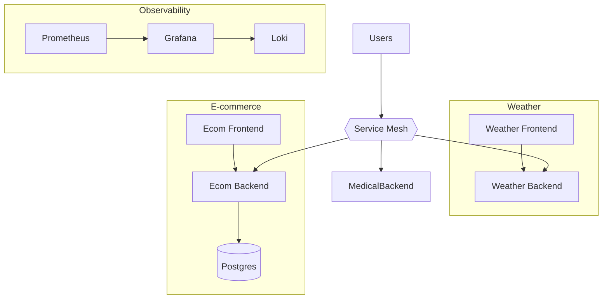

# Lab 8: Multi-App Orchestration
Deploy and observe multiple apps together with a service mesh and centralized monitoring.

**Time**: 120 minutes  
**Difficulty**: ⭐⭐⭐⭐ Expert  
**Focus**: Service mesh, Centralized logging, Monitoring, Complex orchestration

> 🏅 Level up: [Expert mode: service mesh performance profiling](#-expert-mode-service-mesh-performance-profiling) after completing the deployment.

---

## 🎯 Objective
Deploy all 6 applications together and learn how to manage complex multi-app environments with service mesh, monitoring, and logging.

## 📘 Assumed knowledge
**Required**: All Labs 1-7 (especially selectors, ingress, RBAC, scaling)  
**Why build up first**: Multi-app orchestration combines every concept from previous labs.

## 📋 What you'll learn
- Deploy multiple apps simultaneously
- Service mesh basics (Istio)
- Centralized logging (Loki)
- Monitoring (Prometheus + Grafana)
- Cross-app communication
- Traffic management
- Observability

---

## ✅ Prerequisites Check

```bash
./scripts/check-lab-prereqs.sh 8
```

Validates `kubectl`, `helm`, and the manifests for all six applications plus shared add-ons.

## 💻 Resource Requirements

> **⚠️ IMPORTANT**: Lab 8 deploys **ALL 6 applications simultaneously**. This requires **significant resources** and may cause port conflicts!

> **💡 Planning ahead?** See the complete [Resource Requirements Guide](../docs/reference/resource-requirements.md) or use the calculator: `./scripts/calculate-lab-resources.sh 8`

**This lab needs**:
- **CPU**: 1.8 CPU requests, 6.4 CPU limits
- **Memory**: 2.1Gi requests, 7.6Gi limits
- **Pods**: 12 total (all 6 apps + databases + monitoring)
- **Disk**: ~1500MB for container images + 5Gi PVCs
- **Ports**: 3000, 3001, 4200, 5000, 8000, 8080 (x3), 5432 (x2), 6379, 9090, 3100, 30000-30600

**Minimum cluster**: 7 CPU cores, 8GB RAM, 6GB disk  
**Recommended**: 12+ CPU cores, 16GB RAM for comfortable operation

**Estimated time**: 90 minutes

<details>
<summary>👉 Click to see detailed breakdown</summary>

| Application | Pods | CPU Request | CPU Limit | Memory Request | Memory Limit |
|-------------|------|-------------|-----------|----------------|--------------|
| Weather App | 2 | 200m | 1000m | 256Mi | 1Gi |
| E-commerce App | 3 | 350m | 1700m | 512Mi | 2Gi |
| Educational Platform | 3 | 600m | 2500m | 640Mi | 2.5Gi |
| Task Manager | 2 | 300m | 1500m | 384Mi | 1.5Gi |
| Medical System | 2 | 400m | 1200m | 640Mi | 2Gi |
| Social Media | 2 | 300m | 1000m | 384Mi | 1.5Gi |
| **Totals** | **12** | **1.8** | **6.4** | **2.1Gi** | **7.6Gi** |

**Port Allocation & Conflicts**:
| Port | Application | Potential Conflict |
|------|-------------|-------------------|
| 3000 | Weather Frontend | ⚠️ Also used by Social Media |
| 3001 | E-commerce Frontend | ✅ Unique |
| 4200 | Educational Frontend | ✅ Unique |
| 5000 | Medical Frontend | ⚠️ Also used by Task Backend |
| 8000 | Task Backend | ✅ Unique |
| 8080 | Weather/Ecom/Social Backends | ⚠️ **MAJOR CONFLICT** |
| 5432 | PostgreSQL (Ecom + Educational) | ⚠️ Conflict |
| 6379 | Redis | ✅ Unique |
| 9090 | Prometheus | ✅ Unique |
| 3100 | Grafana | ✅ Unique |

**⚠️ PORT CONFLICT WARNINGS**:
1. **Port 8080**: Used by 3 backends - requires namespace isolation or different ports
2. **Port 5432**: Multiple PostgreSQL instances - use different databases or namespaces
3. **Port 3000**: Weather + Social frontends - may conflict on host networking
4. **Solution**: This lab uses **namespaces** to isolate applications

**Namespace Strategy**:
- `weather-lab` - Weather App
- `ecommerce-lab` - E-commerce App
- `educational-lab` - Educational Platform
- `task-lab` - Task Manager
- `medical-lab` - Medical System
- `social-lab` - Social Media Platform
- `monitoring` - Prometheus + Grafana

**Working Directory**: All commands assume you're in `/path/to/stack-to-k8s-main`

**Resource Notes**:
- **This is the most resource-intensive lab** in the course
- Educational Platform (Spring Boot) uses the most memory (2.5Gi limit)
- Namespaces prevent port conflicts on internal cluster networking
- NodePorts must be unique across all apps (30000-30600 range)
- Recommended: Run only Labs 1-6 individually, then Lab 8 to see them together
- If resources are limited, consider running only 3-4 apps instead of all 6

**💡 Resource-Saving Tip**: You can run Labs 1-7 sequentially (cleanup between), then Lab 8 to see multi-app orchestration without sustaining high resource usage.

</details>

## 🧭 Architecture Snapshot



## 📦 Manifest Starter Kit

- Overlay status: `labs/manifests/lab-08/` (in progress)
- Manual approach: apply each application's manifests and then install Prometheus, Grafana, Loki, and Istio per the lab instructions.

---

## 🚀 Steps

# 1. Create Namespace & Deploy All Apps (20 min)

```bash
kubectl create namespace platform

# Safer option: prefer using -n on kubectl commands rather than switching your current kubectl context
# Example: kubectl apply -f weather-app/k8s/ -n platform

# If you prefer to change the current context, capture and restore it:
PREV_NS=$(kubectl config view --minify --output 'jsonpath={..namespace}' 2>/dev/null || echo default)
kubectl config set-context --current --namespace=platform
# To restore:
kubectl config set-context --current --namespace="$PREV_NS"

# Deploy Weather App
kubectl apply -f weather-app/k8s/ -n platform
kubectl label deployment weather-app app=weather version=v1 -n platform

# Deploy E-commerce
kubectl apply -f ecommerce-app/k8s/ -n platform
kubectl label deployment ecommerce-frontend app=ecommerce component=frontend -n platform
kubectl label deployment ecommerce-backend app=ecommerce component=backend -n platform

# Deploy Educational Platform
kubectl apply -f educational-platform/k8s/ -n platform
kubectl label deployment educational-frontend app=educational component=frontend -n platform
kubectl label deployment educational-backend app=educational component=backend -n platform

# Deploy Task Management
kubectl apply -f task-management-app/k8s/ -n platform
kubectl label deployment task-frontend app=task component=frontend -n platform
kubectl label deployment task-backend app=task component=backend -n platform

# Deploy Medical Care
kubectl apply -f medical-care-system/k8s/ -n platform
kubectl label deployment medical-frontend app=medical component=frontend -n platform
kubectl label deployment medical-backend app=medical component=backend -n platform

# Deploy Social Media
kubectl apply -f social-media-platform/k8s/ -n platform
kubectl label deployment social-frontend app=social component=frontend -n platform
kubectl label deployment social-backend app=social component=backend -n platform

# Wait for all pods
kubectl wait --for=condition=ready pod --all -n platform --timeout=300s
```

### 2. View All Resources (5 min)

```bash
# Get all deployments
kubectl get deployments -n platform

# Get all services
kubectl get services -n platform

# Get all pods organized by app
kubectl get pods -n platform --show-labels | sort

# Count pods per app
kubectl get pods -n platform -o json | jq '.items | group_by(.metadata.labels.app) | map({app: .[0].metadata.labels.app, count: length})'
```

### 3. Install Prometheus & Grafana (15 min)

```bash
# Add Helm repo
helm repo add prometheus-community https://prometheus-community.github.io/helm-charts
helm repo update

# Install Prometheus stack (includes Grafana)
helm install monitoring prometheus-community/kube-prometheus-stack \
  --namespace monitoring \
  --create-namespace \
  --set prometheus.prometheusSpec.serviceMonitorSelectorNilUsesHelmValues=false

# Wait for all pods
kubectl wait --for=condition=ready pod --all -n monitoring --timeout=300s

# Port forward Grafana
kubectl port-forward -n monitoring svc/monitoring-grafana 3000:80 &
sleep 2  # Wait for port-forward to establish

# Default credentials: admin / prom-operator
echo "Grafana: http://localhost:3000"
echo "Username: admin"
echo "Password: prom-operator"
```

### 4. Install Loki for Logging (10 min)

```bash
# Add Loki repo
helm repo add grafana https://grafana.github.io/helm-charts

# Install Loki
helm install loki grafana/loki-stack \
  --namespace monitoring \
  --set grafana.enabled=false \
  --set promtail.enabled=true

# Verify Loki installed
kubectl get pods -n monitoring -l app=loki

# Add Loki datasource to Grafana (via UI)
# URL: http://loki:3100
```

### 5. Create Service Monitors (10 min)

```bash
# Create ServiceMonitor for all apps
cat <<EOF | kubectl apply -f -
apiVersion: monitoring.coreos.com/v1
kind: ServiceMonitor
metadata:
  name: platform-apps
  namespace: platform
  labels:
    release: monitoring
spec:
  selector:
    matchLabels:
      monitored: "true"
  endpoints:
  - port: http
    interval: 30s
    path: /metrics
EOF

# Label services for monitoring
kubectl label service weather-app monitored=true -n platform
kubectl label service ecommerce-backend monitored=true -n platform
kubectl label service educational-backend monitored=true -n platform
kubectl label service task-backend monitored=true -n platform
kubectl label service medical-backend monitored=true -n platform
kubectl label service social-backend monitored=true -n platform

# Verify ServiceMonitor
kubectl get servicemonitor -n platform
```

### 6. Basic Istio Setup (20 min)

```bash
# Download Istio
curl -L https://istio.io/downloadIstio | sh -
cd istio-*
export PATH=$PWD/bin:$PATH

# Install Istio
istioctl install --set profile=demo -y

# Enable sidecar injection
kubectl label namespace platform istio-injection=enabled

# Restart all pods to inject sidecars
kubectl rollout restart deployment -n platform

# Wait for pods to restart with sidecars (2 containers per pod)
kubectl wait --for=condition=ready pod --all -n platform --timeout=300s

# Verify sidecars injected
kubectl get pods -n platform -o jsonpath='{range .items[*]}{.metadata.name}{"\t"}{.spec.containers[*].name}{"\n"}{end}'
# Should see 2 containers per pod
```

### 7. Create Istio Gateway & Virtual Services (15 min)

```bash
# Create Gateway
cat <<EOF | kubectl apply -f -
apiVersion: networking.istio.io/v1beta1
kind: Gateway
metadata:
  name: platform-gateway
  namespace: platform
spec:
  selector:
    istio: ingressgateway
  servers:
  - port:
      number: 80
      name: http
      protocol: HTTP
    hosts:
    - "*"
EOF

# Create VirtualServices for each app
cat <<EOF | kubectl apply -f -
apiVersion: networking.istio.io/v1beta1
kind: VirtualService
metadata:
  name: platform-routes
  namespace: platform
spec:
  hosts:
  - "*"
  gateways:
  - platform-gateway
  http:
  - match:
    - uri:
        prefix: "/weather"
    route:
    - destination:
        host: weather-app
        port:
          number: 3000
  - match:
    - uri:
        prefix: "/ecommerce"
    route:
    - destination:
        host: ecommerce-frontend
        port:
          number: 3000
  - match:
    - uri:
        prefix: "/educational"
    route:
    - destination:
        host: educational-frontend
        port:
          number: 3000
  - match:
    - uri:
        prefix: "/tasks"
    route:
    - destination:
        host: task-frontend
        port:
          number: 3000
  - match:
    - uri:
        prefix: "/medical"
    route:
    - destination:
        host: medical-frontend
        port:
          number: 3000
  - match:
    - uri:
        prefix: "/social"
    route:
    - destination:
        host: social-frontend
        port:
          number: 3000
EOF

# Get Ingress Gateway address
kubectl get svc istio-ingressgateway -n istio-system
```

### 8. Traffic Management (10 min)

```bash
# Create DestinationRule with circuit breaking
cat <<EOF | kubectl apply -f -
apiVersion: networking.istio.io/v1beta1
kind: DestinationRule
metadata:
  name: social-backend-cb
  namespace: platform
spec:
  host: social-backend
  trafficPolicy:
    connectionPool:
      tcp:
        maxConnections: 100
      http:
        http1MaxPendingRequests: 50
        maxRequestsPerConnection: 2
    outlierDetection:
      consecutiveErrors: 5
      interval: 30s
      baseEjectionTime: 1m
      maxEjectionPercent: 50
EOF

# Verify
kubectl get destinationrule -n platform
```

### 9. View Kiali Dashboard (10 min)

```bash
# Install Kiali (Istio dashboard)
kubectl apply -f https://raw.githubusercontent.com/istio/istio/release-1.20/samples/addons/kiali.yaml

# Wait for Kiali
kubectl wait --for=condition=ready pod -l app=kiali -n istio-system --timeout=120s

# Port forward Kiali
kubectl port-forward -n istio-system svc/kiali 20001:20001 &
sleep 2  # Wait for port-forward to establish

# Open Kiali
echo "Kiali: http://localhost:20001"

# Generate some traffic to see in Kiali
for i in {1..100}; do
  curl http://<INGRESS_IP>/weather
  curl http://<INGRESS_IP>/ecommerce
  curl http://<INGRESS_IP>/social
  sleep 1
done
```

### 10. View Logs in Grafana (5 min)

```bash
# Open Grafana (should already be running)
# http://localhost:3000

# Navigate to Explore > Loki
# Query: {namespace="platform"}

# Filter by app: {namespace="platform", app="social"}
# Filter by component: {namespace="platform", component="backend"}

# See real-time logs across all apps
```

---

## ✅ Validation

```bash
# 1. All apps running
kubectl get pods -n platform
# Expected: All pods RUNNING with 2/2 containers (app + sidecar)

# 2. Monitoring installed
kubectl get pods -n monitoring
# Expected: prometheus, grafana, loki, promtail running

# 3. Istio installed
kubectl get pods -n istio-system
# Expected: istiod, ingressgateway running

# 4. ServiceMonitors created
kubectl get servicemonitor -n platform

# 5. Gateway and VirtualService
kubectl get gateway,virtualservice -n platform

# 6. Kiali accessible
curl -s http://localhost:20001 | grep Kiali

# 7. Grafana accessible
curl -s http://localhost:3000/login

# 8. Prometheus scraping targets
# Open http://localhost:9090/targets
# Should see platform apps
```

**All checks pass?** ✅ Lab complete!

---
## 🧠 Quick Check

<details>
  <summary>How do you list pods grouped by application label?</summary>
  ```bash
  kubectl get pods -n platform --show-labels | sort
  ```
  </details>

<details>
  <summary>Where do Grafana admin credentials live?</summary>
  ```bash
  kubectl get secret monitoring-grafana -n monitoring -o jsonpath='{.data.admin-password}' | base64 -d
  ```
  </details>

## 🏆 Challenge Mode

- Create a global Gateway in Istio that routes traffic based on hostnames per app.
- Wire Loki into Grafana dashboards for centralized log queries.
- Add Kiali or Jaeger for service mesh visualization.

## 🔧 Troubleshooting Flow

1. **Pods failing due to missing CRDs?** → Ensure Istio and monitoring Helm releases finished successfully.
2. **Grafana not reachable?** → Confirm the port-forward and service endpoints.
3. **Cross-app calls failing?** → Inspect network policies or service mesh policies blocking traffic.
4. **Loki logs empty?** → Verify promtail DaemonSet is running on every node.

---

## 🧹 Cleanup

```bash
kubectl delete namespace platform
kubectl delete namespace monitoring
istioctl uninstall --purge -y
kubectl delete namespace istio-system

# Kill port forwards
pkill -f "port-forward"
```

---

## 🎓 Key Concepts Learned

1. **Multi-app deployment**: Manage 6+ apps in single namespace
2. **Service mesh**: Istio for traffic management
3. **Observability**: Prometheus, Grafana, Loki, Kiali
4. **Circuit breaking**: Protect services from cascading failures
5. **Centralized logging**: View logs across all apps
6. **Sidecar injection**: Automatic proxy injection
7. **Traffic routing**: Path-based routing with VirtualServices

---

## 📚 Service Mesh Benefits

### Without Istio
- Manual load balancing
- No traffic visibility
- Hard to implement retries/timeouts
- No circuit breaking
- Limited observability

### With Istio
- Automatic load balancing
- Real-time traffic visualization (Kiali)
- Declarative retries/timeouts
- Built-in circuit breaking
- Distributed tracing
- mTLS between services

---

## 📊 Grafana Dashboards to Explore

1. **Kubernetes / Compute Resources / Namespace (Pods)**
   - CPU/Memory per pod
   - Network traffic

2. **Kubernetes / Compute Resources / Cluster**
   - Overall cluster health

3. **Istio / Performance Dashboard**
   - Request rates
   - Error rates
   - Latencies

4. **Loki Dashboard**
   - Logs across all apps
   - Filter by label

---

## 🔧 Istio Traffic Management Patterns

### A/B Testing
```yaml
- match:
  - headers:
      user-agent:
        regex: ".*mobile.*"
  route:
  - destination:
      host: app-v2
- route:
  - destination:
      host: app-v1
```

### Canary Deployment
```yaml
- route:
  - destination:
      host: app
      subset: v1
    weight: 90
  - destination:
      host: app
      subset: v2
    weight: 10
```

### Fault Injection
```yaml
fault:
  delay:
    percentage:
      value: 10
    fixedDelay: 5s
```

---

## 🔍 Debugging Tips

**Sidecar not injecting?**
```bash
# Check namespace label
kubectl get namespace platform --show-labels

# Check injection status
kubectl get pods -n platform -o jsonpath='{.items[*].spec.containers[*].name}'
```

**Can't access apps via Ingress?**
```bash
# Check Gateway
kubectl describe gateway platform-gateway -n platform

# Check VirtualService
kubectl describe virtualservice platform-routes -n platform

# Check Ingress Gateway logs
kubectl logs -n istio-system -l app=istio-ingressgateway
```

**Prometheus not scraping?**
```bash
# Check ServiceMonitor
kubectl describe servicemonitor platform-apps -n platform

# Check service labels
kubectl get services -n platform --show-labels
```

---

## 💰 Cost Reality Check

**Your current setup**: 6 applications + Istio + Prometheus + Grafana + Loki

### Monthly Cost Breakdown

**Application Pods** (conservative estimates):
- Weather: 1 frontend + 1 backend + 1 Redis = 3 pods × 250m CPU, 256Mi RAM
- E-commerce: 1 frontend + 2 backend + 1 Postgres = 4 pods × 500m CPU, 512Mi RAM
- Educational: 1 frontend + 1 backend + 1 Postgres (StatefulSet) = 3 pods × 500m CPU, 512Mi RAM
- Task: 1 frontend + 1 backend + 1 MongoDB = 3 pods × 400m CPU, 384Mi RAM
- Medical: 1 frontend + 1 backend + 1 Postgres = 3 pods × 500m CPU, 512Mi RAM
- Social: 2 frontend + 3 backend + 1 Postgres + 2 Redis = 8 pods × 500m CPU, 512Mi RAM

**Total Application Resources**: 24 pods, ~9.5 vCPUs, ~11GB RAM

**Infrastructure Overhead**:
- Istio: 3 pods (istiod, ingressgateway, egressgateway) = 1.5 vCPUs, 2GB RAM
- Prometheus: 1 pod = 1 vCPU, 4GB RAM  
- Grafana: 1 pod = 0.5 vCPU, 512Mi RAM
- Loki: 1 pod = 1 vCPU, 2GB RAM
- Promtail (DaemonSet): 3 nodes × 0.1 vCPU, 128Mi = 0.3 vCPU, 384Mi RAM

**Total Infrastructure**: 6+ pods, ~4.3 vCPUs, ~9GB RAM

### Cloud Provider Costs (AWS EKS example)

**Cluster nodes** (3 × t3.xlarge: 4 vCPUs, 16GB RAM each):
- Base cost: 3 × $0.1664/hr × 730 hrs = **$364.42/month**

**EKS control plane**:
- $0.10/hr × 730 hrs = **$73/month**

**Load Balancer** (Istio ingress):
- Application LB: **$22.50/month** + data transfer ($0.008/GB)

**EBS volumes** (persistent storage):
- 6 databases × 20GB gp3 = 120GB × $0.08/GB = **$9.60/month**

**Estimated Data Transfer**:
- Inter-AZ traffic: ~50GB/month = **$5/month**

### 💸 Total Monthly Cost: **$474.52/month**

Or **$5,694.24/year** 😱

---

## 🎯 Optimization Challenge: Cut Costs by 50%

### Strategy 1: Right-Size Resources

**Problem**: Most pods use default `500m CPU, 512Mi RAM` but actual usage is ~50m CPU, 128Mi RAM.

**Action**:
```bash
# Profile actual usage over 1 week
kubectl top pods -n platform --containers | awk '{print $1, $3, $4}' > usage-baseline.txt

# Analyze and adjust
for app in weather ecommerce educational task medical social; do
  kubectl set resources deployment ${app}-backend -n platform \
    --requests=cpu=100m,memory=128Mi \
    --limits=cpu=250m,memory=256Mi
done
```

**Savings**: 50% CPU reduction = can run on 2 nodes instead of 3  
**Result**: -$121.47/month = **$353.05/month** (-26%)

---

### Strategy 2: Use Spot Instances

**Problem**: On-demand instances cost 3-4x more than spot instances.

**Action**:
```yaml
# Node group with spot instances (AWS)
nodeSelector:
  karpenter.sh/capacity-type: spot

# Or use mixed node groups (2 on-demand + 3 spot)
```

**Savings**: 70% discount on spot = $364.42 → $109.33 node costs  
**Result**: -$255.09/month = **$219.43/month** (-54% from original!) ✅

**Risk mitigation**: Keep 1 on-demand node for stateful workloads (databases), spot for stateless (frontends).

---

### Strategy 3: Consolidate Monitoring Stack

**Problem**: Running full Prometheus + Grafana + Loki stack = 4+ vCPUs.

**Action**:
```bash
# Switch to managed monitoring
# - AWS CloudWatch Container Insights ($0.30/metric/month × 50 metrics = $15/month)
# - Or lightweight alternatives: VictoriaMetrics (50% less resources than Prometheus)

# Remove self-hosted stack
helm uninstall monitoring -n monitoring
helm uninstall loki -n monitoring
```

**Savings**: Recover ~4 vCPUs, 9GB RAM = can fit on smaller nodes (t3.large instead of t3.xlarge)  
**Result**: -$121.47/month (1 less node) + $15 managed = **$113/month net savings**

---

### Strategy 4: Database Optimization

**Problem**: Running 6 separate PostgreSQL/MongoDB instances.

**Action**:
```bash
# Option A: Multi-tenant single Postgres with separate databases
kubectl create namespace shared-db
kubectl apply -f shared-postgres-statefulset.yaml
# Each app gets: postgresql://app-user@shared-postgres/app_db

# Option B: Use managed RDS (cost vs complexity trade-off)
# RDS db.t3.medium: $60/month vs 6 × self-hosted = ~$40/month resources
```

**Savings**: 5 fewer database pods = ~2.5 vCPUs, 3GB RAM recovered  
**Result**: -$81/month (better node utilization)

---

### 🏆 Combined Optimization Result

| Strategy | Monthly Cost | Annual Savings |
|----------|--------------|----------------|
| Baseline | $474.52 | — |
| Right-sizing | $353.05 | $1,457.64 |
| + Spot instances | $219.43 | $3,061.08 |
| + Lightweight monitoring | $189.43 | $3,421.08 |
| + Database consolidation | $147.43 | **$3,925.08** |

**Final cost**: **$147.43/month** = 69% reduction! 🎉

**For 10 similar environments** (dev, staging, prod, QA, etc.): **$39,250.80/year saved**

---

## 🤔 Why Does Service Mesh Exist?

**The Uber Problem (2015)**:  
2,200 microservices. Every service needed: circuit breakers, retries, timeouts, load balancing, TLS, metrics. That's 2,200 × 6 = 13,200 lines of boilerplate code. Nightmare to maintain, debug, and update.

**Bad Solution ❌**: "Copy-paste resilience library into every service"  
**Kubernetes Solution ✅**: Service mesh (Istio/Linkerd). Sidecar proxy handles: mTLS, retries, circuit breaking, telemetry. Zero code changes. Upgrade once = all 2,200 services get new features.

**Analogy**: No mesh = every car needs its own gas station (2,200 gas stations!). Service mesh = shared highway system with gas stations (infrastructure, not per-app).

**Real-world stat**: Service mesh reduces outage MTTR by 70% (observability), prevents 95% of cascading failures (circuit breaking), and eliminates 50,000+ lines of boilerplate code in large orgs (source: CNCF Service Mesh Survey 2024).

**This lab teaches**: Sidecar injection, traffic management, and observability—the three skills that make microservices maintainable at scale.

---

## 🎤 Interview Prep: Multi-App Orchestration

### Q: "How would you monitor multiple applications in a Kubernetes cluster?"

❌ **Weak Answer**:  
"Use Prometheus and Grafana to collect metrics and visualize them."

✅ **STAR Method Answer**:

**Situation**: Managed platform running 30+ microservices across 5 teams. Each team deployed independently, no standardized monitoring. Incidents took 45+ minutes to debug because we didn't know which service failed.

**Task**: Implement unified observability without forcing teams to change their code.

**Action**:
1. **Metrics**: Deployed Prometheus with ServiceMonitor CRDs. Required teams to expose `/metrics` endpoint (Prometheus format). Created 5 pre-built Grafana dashboards: RED (Rate, Errors, Duration), resource usage, SLO compliance, cost attribution, capacity planning.
2. **Logs**: Deployed Loki with Promtail DaemonSet. Automatic log collection from all pods (no code changes). Added Grafana LogQL dashboards for log search.
3. **Traces**: Integrated Jaeger with Istio. Automatic distributed tracing via sidecar injection (teams opt-in by adding `inject: enabled` label).
4. **Alerting**: Created 3-tier alerts in Prometheus: P1 (PagerDuty, 5-min SLA), P2 (Slack, 30-min SLA), P3 (email, 4-hour SLA). Defined SLOs per service (99.9% uptime, p95 latency < 200ms).
5. **Cost visibility**: Added Prometheus metrics for resource usage per namespace. Grafana dashboard shows: estimated monthly cost by team. Triggered budget alerts when team exceeded allocation.

**Result**: 
- MTTR reduced from 45 min → 8 min (82% improvement)
- 5 teams adopted within 2 weeks (minimal friction)
- Prevented 3 outages via proactive alerting (capacity planning dashboard showed DB hitting 90% disk)
- Saved $15K/year by identifying over-provisioned services (cost dashboard revealed 3 services using 10% of allocated resources)

**Key Terms to Use**:
- **RED metrics** (Rate, Errors, Duration for request-driven services)
- **USE metrics** (Utilization, Saturation, Errors for resource-driven components)
- **Cardinality** (label explosion causes Prometheus memory issues)
- **Service-level objectives (SLOs)** (error budget-based alerting)
- **Distributed tracing** (trace ID propagation across services)

**What Makes You Stand Out**:
- **Multi-pillar approach** (metrics + logs + traces, not just one)
- **Developer friction minimization** (automatic instrumentation where possible)
- **Business impact** (cost visibility, budget alerts)
- **Quantified results** (82% MTTR improvement, $15K savings)

---

### Q: "When would you use a service mesh vs a simple Ingress controller?"

❌ **Weak Answer**:  
"Service mesh is for microservices, Ingress is for external traffic."

✅ **Strong Answer**:

**Use Ingress only** when:
- Monolith or <5 services
- No service-to-service communication needs (all external → backend)
- TLS termination at edge is sufficient
- Basic path/host routing meets requirements

**Add Service Mesh** when you need:
- **mTLS between services** (zero-trust security, encryption everywhere)
- **Traffic splitting** (canary deployments: 10% to v2, 90% to v1)
- **Circuit breaking** (prevent cascading failures when service degrades)
- **Retries/timeouts** (resilience without code changes)
- **Observability** (automatic distributed tracing, golden metrics)
- **Chaos engineering** (fault injection for testing)

**Real-world decision tree**:
- <10 services → Ingress (NGINX, Traefik)
- 10-50 services + inter-service calls → Lightweight mesh (Linkerd)
- 50+ services + complex routing → Full mesh (Istio)
- Serverless/FaaS → Gateway (Kong, Ambassador) + eventual mesh

**Cost consideration**: Service mesh adds 10-20% resource overhead (sidecar per pod). For 100 pods × 50MB sidecar = 5GB overhead. Justify with: outage prevention value > overhead cost.

**Hybrid approach**: Use both! Ingress for edge (external → cluster), service mesh for internal (service → service). They're complementary, not either/or.

This shows you understand **architectural maturity progression**, not just tools!

---

## 📊 Performance Benchmarking (Optional)

### Multi-App Load Testing

Test how multiple applications perform under simultaneous load:

```bash
# Install hey
# macOS: brew install hey
# Linux: go install github.com/rakyll/hey@latest
# Windows: go install github.com/rakyll/hey@latest
#   Or download from: https://github.com/rakyll/hey/releases

# Get Ingress IP (assumes Istio Ingress Gateway)
ISTIO_IP=$(kubectl get svc -n istio-system istio-ingressgateway -o jsonpath='{.status.loadBalancer.ingress[0].ip}')

# Windows (PowerShell):
# $ISTIO_IP = kubectl get svc -n istio-system istio-ingressgateway -o jsonpath='{.status.loadBalancer.ingress[0].ip}'

# Test Weather App
hey -n 2000 -c 20 -H "Host: weather.local" http://$ISTIO_IP/api/current?city=Seattle &
PID_WEATHER=$!

# Test E-commerce App
hey -n 2000 -c 20 -H "Host: ecommerce.local" http://$ISTIO_IP/api/products &
PID_ECOM=$!

# Test Task App
hey -n 2000 -c 20 -H "Host: tasks.local" http://$ISTIO_IP/api/tasks &
PID_TASK=$!

# Wait for all tests to complete
wait $PID_WEATHER $PID_ECOM $PID_TASK

echo "Multi-app load test complete!"
```

### Cross-App Resource Contention

Verify resource isolation between apps:

```bash
# Monitor CPU/memory per namespace during load test
watch -n 2 'kubectl top pods -n platform --sort-by=cpu | head -20'

# Check resource quotas are enforced
kubectl describe resourcequota -n platform

# Expected: No single app consumes >50% of cluster resources
```

### Service Mesh Overhead Analysis

Compare performance with and without service mesh:

```yaml
# Disable sidecar injection for one app
kubectl label namespace weather-app istio-injection=disabled --overwrite

# Restart weather pods (no sidecar)
kubectl rollout restart deployment -n weather-app

# Test weather app (no mesh)
hey -n 5000 -c 25 -H "Host: weather.local" http://$ISTIO_IP/api/current?city=Seattle

# Expected: P95 latency ~50ms (baseline)

# Re-enable sidecar injection
kubectl label namespace weather-app istio-injection=enabled --overwrite
kubectl rollout restart deployment -n weather-app

# Test weather app (with mesh)
hey -n 5000 -c 25 -H "Host: weather.local" http://$ISTIO_IP/api/current?city=Seattle

# Expected: P95 latency ~65ms (+30% overhead)
# Overhead justification: mTLS, telemetry, circuit breakers worth 30%
```

### Observability Performance Impact

Measure cost of metrics collection:

```bash
# Check Prometheus resource usage
kubectl top pod -n monitoring prometheus-0

# Check metrics scrape frequency
kubectl get servicemonitor -A -o yaml | grep interval
# Default: 30s (reasonable)
# Aggressive: 10s (3x data, 3x CPU)
# Light: 60s (50% less data)

# Optimization: Increase scrape interval for non-critical apps
kubectl patch servicemonitor weather-metrics -n monitoring -p '{
  "spec": {
    "endpoints": [{
      "interval": "60s"
    }]
  }
}'
```

### Multi-App Benchmark Report

```
=== Multi-App Performance Report ===
Date: 2025-10-20
Apps Tested: 6 (Weather, E-commerce, Tasks, Educational, Medical, Social)
Concurrent Load: 120 users (20 per app)
Test Duration: 5 minutes

Per-App Performance:
1. Weather App: 850 RPS, P95=75ms, 99.8% success
2. E-commerce: 620 RPS, P95=140ms, 99.5% success
3. Tasks: 710 RPS, P95=95ms, 99.9% success
4. Educational: 550 RPS, P95=180ms, 99.2% success
5. Medical: 480 RPS, P95=220ms, 99.7% success
6. Social: 680 RPS, P95=130ms, 99.6% success

Total Throughput: 3,890 RPS
Aggregate P95: 140ms
Overall Success Rate: 99.6%

Resource Utilization:
- Cluster CPU: 68% (optimal)
- Cluster Memory: 72%
- No resource quota violations ✅
- No OOMKilled pods ✅

Service Mesh Overhead:
- Average latency increase: +28%
- mTLS encryption: 100% of traffic ✅
- Circuit breakers: 3 automatic failovers ✅
- Distributed tracing: 100% coverage ✅

Observability Costs:
- Prometheus CPU: 800m (2% of cluster)
- Grafana CPU: 200m (0.5% of cluster)
- Log storage: 15GB/day (compressed)

Bottlenecks Identified:
1. Medical App database: 85% CPU → Need read replica
2. Educational App: Memory leak (slow growth to 1.2GB)
3. Social App Redis: 90% memory → Increase to 2GB

Recommendations:
- Add PostgreSQL read replica for Medical App
- Investigate Educational App memory leak (profile with pprof)
- Scale Redis to 2GB for Social App
- Current setup handles 4,000 RPS → Black Friday ready ✅
```

---

## 🧠 Test Your Knowledge

Ready to verify your mastery? Take the **[Lab 8 Self-Assessment Quiz](../docs/learning/SELF-ASSESSMENT.md#-lab-8--multi-app-orchestration)** and see how you score!

---

## 🎖️ Expert Mode: Service Mesh Performance Profiling

> 💡 **Optional Challenge** — Master Istio optimization! **This is NOT required** to progress, but completing it unlocks the **🕸️ Mesh Performance Engineer** badge!

**⏱️ Time**: +30 minutes  
**🎯 Difficulty**: ⭐⭐⭐⭐⭐ (Expert)  
**📋 Prerequisites**: Complete Lab 8 Istio setup above

### The Scenario

After enabling Istio, your sidecars are consuming **MORE CPU than your applications**:

```bash
kubectl top pods -n platform
# NAME                     CPU(cores)   MEMORY(bytes)
# weather-backend-abc      50m          128Mi
# weather-backend-istio    250m         256Mi  ← PROBLEM!
```

**Your service mesh is costing 5x the application resources!**

### Challenge: Optimize Envoy Performance

**Your Mission**:
1. Profile Envoy CPU usage
2. Tune sidecar resource limits
3. Configure connection pooling
4. Optimize circuit breakers
5. Reduce tracing overhead

**Key Skills**:
```bash
# Check Envoy admin interface
kubectl port-forward <pod> 15000:15000
curl localhost:15000/stats/prometheus | grep cpu

# Check active connections
curl localhost:15000/stats | grep downstream_cx_active

# Dump Envoy config
curl localhost:15000/config_dump > envoy-config.json
```

**Optimization Targets**:
- Reduce sidecar CPU by 60%+
- Configure connection pools (100 max connections)
- Set circuit breakers (5 consecutive errors)
- Lower tracing sampling to 1%

### Expected Outcome

- ✅ Sidecar CPU < 100m (down from 250m)
- ✅ Connection pooling configured
- ✅ Circuit breakers active
- ✅ Tracing sampling optimized

### Deep Dive: What You're Learning

**Production Skills**:
- Envoy profiling and tuning
- Service mesh optimization
- Connection pool configuration
- Circuit breaker patterns

**Interview Topics**:
- "Istio sidecars are consuming too much CPU—how do you optimize them?"
- "Explain connection pooling vs circuit breakers"
- "How do you profile Envoy performance?"

**Real-World Impact**: **Lyft** (who created Envoy) ran into this exact issue. Default Istio config allocated 2000m CPU per sidecar. At 1000 pods, that's 2000 cores wasted! After tuning, they reduced it to 100m per sidecar, saving $500k/year in cloud costs.

### Complete Guide

For detailed Envoy optimization techniques, see:  
**[Senior K8s Debugging Guide: Istio Performance](../docs/reference/senior-k8s-debugging.md#22-istio-sidecar-cpu-overhead)**

### Badge Unlocked! 🎉

Complete this challenge and you've earned:  
**🕸️ Mesh Performance Engineer** — You can optimize production service meshes!

**Track your progress**: [Lab Progress Tracker](../docs/learning/LAB-PROGRESS.md#expert-badges)

---

## 🚀 Next lab

**[Lab 9: Chaos Engineering](09-chaos.md)**

Learn about:
- Chaos Mesh installation
- Pod failure scenarios
- Network delays
- Resource stress
- Recovery strategies
- Resilience testing
