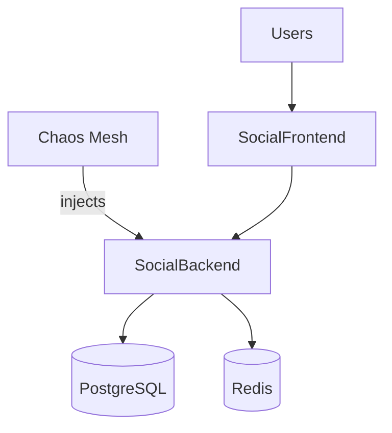

# Lab 9: Chaos Engineering
Practice resilience by injecting controlled failures and validating system recovery.

**Time**: 90 minutes  
**Difficulty**: ⭐⭐⭐⭐ Expert  
**Focus**: Resilience testing, Failure scenarios, Recovery strategies

---

## 🎯 Objective
Learn chaos engineering by intentionally breaking things and watching how Kubernetes recovers. Test application resilience under failure conditions.

## 📘 Assumed knowledge
**Required**: Deployments & Self-healing (Labs 1-4), Resource limits (Lab 4), Scaling (Lab 7)  
**Helpful**: Observability and monitoring concepts (Lab 8)

## 📋 What you'll learn
- Chaos Mesh basics
- Pod failure scenarios
- Network delays & partitions
- Resource stress testing
- DNS failures
- Recovery validation
- Resilience patterns

---

## ✅ Prerequisites Check

```bash
./scripts/check-lab-prereqs.sh 9
```

Verifies `kubectl`, `helm`, and the social media manifests are available.

## 💻 Resource Requirements

> **💡 Planning ahead?** See the complete [Resource Requirements Guide](../docs/reference/resource-requirements.md) or use the calculator: `./scripts/calculate-lab-resources.sh 9`

**This lab needs**:
- **CPU**: 1.8 CPU requests, 6.4 CPU limits
- **Memory**: 2.1Gi requests, 7.6Gi limits
- **Pods**: 12 total (2 social media app, 8 Chaos Mesh components, 2 databases)
- **Disk**: ~1500MB for container images
- **Ports**: 3000, 8080, 5432, 6379, 2333 (Chaos Dashboard), 30300

**Minimum cluster**: 7 CPU cores, 8GB RAM, 2GB disk  
**Estimated time**: 60 minutes

<details>
<summary>👉 Click to see detailed breakdown</summary>

| Component | Replicas | CPU Request | CPU Limit | Memory Request | Memory Limit |
|-----------|----------|-------------|-----------|----------------|--------------|
| Social Media App | 2 | 300m | 1000m | 384Mi | 1.5Gi |
| Chaos Mesh Controller | 3 | 200m | 500m | 256Mi | 512Mi |
| Chaos Mesh Daemon | 1 | 100m | 500m | 128Mi | 512Mi |
| Chaos Dashboard | 1 | 100m | 500m | 128Mi | 512Mi |
| PostgreSQL | 1 | 200m | 500m | 384Mi | 1Gi |
| Redis | 1 | 100m | 200m | 128Mi | 256Mi |
| **Totals** | **12** | **1.8** | **6.4** | **2.1Gi** | **7.6Gi** |

**Port Allocation**:
- **3000**: Social media frontend
- **8080**: Social media backend
- **5432**: PostgreSQL database
- **6379**: Redis cache
- **2333**: Chaos Mesh dashboard (web UI)
- **30300**: NodePort for social media access

**Chaos Mesh Components**:
- **Controller Manager**: Schedules and manages chaos experiments
- **Chaos Daemon**: Executes failures on target nodes (DaemonSet)
- **Dashboard**: Web UI for creating and monitoring experiments
- **Webhook**: Validates CRDs for chaos experiments

**Working Directory**: All commands assume you're in `/path/to/stack-to-k8s-main`

**Resource Notes**:
- Chaos Mesh adds ~600m CPU and 768Mi RAM overhead
- Chaos Daemon runs on every node (DaemonSet) - scales with cluster size
- Experiments inject failures WITHOUT consuming additional resources
- This lab demonstrates resilience testing: pod failures, network delays, CPU stress

</details>

## ✅ Success criteria

- Chaos Mesh control plane is Running and experiments can be created
- Target app recovers after injected failures (pods return to Running)
- No lingering experiments after cleanup

## 🧭 Architecture Snapshot



## 📦 Manifest Starter Kit

- Overlay status: `labs/manifests/lab-09/` (in progress)
- Manual approach: deploy the social media app, then install Chaos Mesh via the Helm chart referenced in this guide.

---

## 🚀 Steps

> **Lab Navigation**: This lab is organized in 3 phases for easier consumption:
> - **[Phase 1](#-phase-1-setup--pod-failure-scenarios)**: Setup + Pod failure scenarios (35 min)
> - **[Phase 2](#-phase-2-network-chaos)**: Network delays & partitions (25 min)
> - **[Phase 3](#-phase-3-resource-stress--advanced-scenarios)**: CPU/Memory stress + Combined chaos (30 min)

---

## 🔧 Phase 1: Setup & Pod Failure Scenarios

### 1. Install Chaos Mesh (10 min)

```bash
# Create namespace
kubectl create namespace chaos-testing

# Add Chaos Mesh repo
helm repo add chaos-mesh https://charts.chaos-mesh.org
helm repo update

# Install Chaos Mesh
helm install chaos-mesh chaos-mesh/chaos-mesh \
  --namespace=chaos-mesh \
  --create-namespace \
  --set dashboard.create=true

# Wait for Chaos Mesh
kubectl wait --for=condition=ready pod --all -n chaos-mesh --timeout=180s

# Port forward dashboard
kubectl port-forward -n chaos-mesh svc/chaos-dashboard 2333:2333 &
sleep 2  # Wait for port-forward to establish

echo "Chaos Dashboard: http://localhost:2333"
```

### 2. Deploy Test Application (5 min)

```bash
# Deploy social media app for testing
kubectl apply -f social-media-platform/k8s/ -n chaos-testing

# Scale up for better testing
kubectl scale deployment social-backend --replicas=3 -n chaos-testing
kubectl scale deployment social-frontend --replicas=2 -n chaos-testing

# Wait for all pods
kubectl wait --for=condition=ready pod --all -n chaos-testing --timeout=180s

# Verify
kubectl get pods -n chaos-testing
```

### 3. Scenario 1: Pod Kill (10 min)

```bash
# Create PodChaos - randomly kill pods
cat <<EOF | kubectl apply -f -
apiVersion: chaos-mesh.org/v1alpha1
kind: PodChaos
metadata:
  name: pod-kill
  namespace: chaos-testing
spec:
  action: pod-kill
  mode: one
  selector:
    namespaces:
      - chaos-testing
    labelSelectors:
      app: social-backend
  scheduler:
    cron: '@every 30s'
EOF

# Watch pods being killed and recreated
watch -n 2 kubectl get pods -n chaos-testing

# Check events
kubectl get events -n chaos-testing --sort-by='.lastTimestamp'

# Verify app still accessible during chaos
kubectl port-forward -n chaos-testing svc/social-backend 8000:8000 &
sleep 2  # Wait for port-forward to establish
while true; do curl -s http://localhost:8000/api/health; sleep 5; done

# Stop chaos after 3 minutes
kubectl delete podchaos pod-kill -n chaos-testing
```

### 4. Scenario 2: Pod Failure (10 min)

```bash
# Create PodChaos - make pod fail (not killed, stays in error state)
cat <<EOF | kubectl apply -f -
apiVersion: chaos-mesh.org/v1alpha1
kind: PodChaos
metadata:
  name: pod-failure
  namespace: chaos-testing
spec:
  action: pod-failure
  mode: fixed
  value: '1'
  duration: '2m'
  selector:
    namespaces:
      - chaos-testing
    labelSelectors:
      app: social-backend
EOF

# Watch pod status
kubectl get pods -n chaos-testing -w

# Check which pod is affected
kubectl describe podchaos pod-failure -n chaos-testing

# Test app resilience (should still work with 2/3 pods)
for i in {1..10}; do
  curl -s http://localhost:8000/api/health
  sleep 1
done

# Cleanup
kubectl delete podchaos social-pod-failure-chaos -n social-media
```

**Phase 1 Complete!** ✅ You've learned Chaos Mesh installation, pod kill, and pod failure scenarios.  
**Next**: [Phase 2: Network Chaos](#-phase-2-network-chaos) to test network delays and partitions.

---

## 🌐 Phase 2: Network Chaos

### 5. Scenario 3: Network Delay (15 min)
```

### 5. Scenario 3: Network Delay (15 min)

```bash
# Add 500ms latency to backend
cat <<EOF | kubectl apply -f -
apiVersion: chaos-mesh.org/v1alpha1
kind: NetworkChaos
metadata:
  name: network-delay
  namespace: chaos-testing
spec:
  action: delay
  mode: all
  selector:
    namespaces:
      - chaos-testing
    labelSelectors:
      app: social-backend
  delay:
    latency: '500ms'
    correlation: '100'
    jitter: '0ms'
  duration: '3m'
  direction: to
  target:
    mode: all
    selector:
      namespaces:
        - chaos-testing
EOF

# Test latency impact
echo "Before chaos (should be fast):"
time curl -s http://localhost:8000/api/health

echo "During chaos (should be slow ~500ms):"
time curl -s http://localhost:8000/api/health

# Monitor response times
for i in {1..20}; do
  time curl -s http://localhost:8000/api/health
  sleep 2
done

# Cleanup
kubectl delete networkchaos network-delay -n chaos-testing
```

### 6. Scenario 4: Network Partition (10 min)

```bash
# Partition backend from database
cat <<EOF | kubectl apply -f -
apiVersion: chaos-mesh.org/v1alpha1
kind: NetworkChaos
metadata:
  name: network-partition
  namespace: chaos-testing
spec:
  action: partition
  mode: all
  selector:
    namespaces:
      - chaos-testing
    labelSelectors:
      app: social-backend
  direction: to
  target:
    mode: all
    selector:
      namespaces:
        - chaos-testing
      labelSelectors:
        app: mongodb
  duration: '2m'
EOF

# Watch pod logs (should see connection errors)
kubectl logs -n chaos-testing -l app=social-backend --tail=20 -f

# Test API (should fail for database operations)
curl -s http://localhost:8000/api/posts

# Cleanup
kubectl delete networkchaos network-partition -n chaos-testing
```

**Phase 2 Complete!** ✅ You've tested network delays and network partitions.  
**Next**: [Phase 3: Resource Stress](#-phase-3-resource-stress--advanced-scenarios) for CPU/memory pressure and combined chaos.

---

## 💾 Phase 3: Resource Stress & Advanced Scenarios

### 7. Scenario 5: CPU Stress (10 min)

```bash
# Stress CPU on backend pods
cat <<EOF | kubectl apply -f -
apiVersion: chaos-mesh.org/v1alpha1
kind: StressChaos
metadata:
  name: cpu-stress
  namespace: chaos-testing
spec:
  mode: one
  selector:
    namespaces:
      - chaos-testing
    labelSelectors:
      app: social-backend
  stressors:
    cpu:
      workers: 2
      load: 80
  duration: '3m'
EOF

# Monitor CPU usage
watch -n 2 kubectl top pods -n chaos-testing

# Check if HPA scales up (if configured)
kubectl get hpa -n chaos-testing -w

# Cleanup
kubectl delete stresschaos cpu-stress -n chaos-testing
```

### 8. Scenario 6: Memory Stress (10 min)

```bash
# Stress memory (risk of OOMKill)
cat <<EOF | kubectl apply -f -
apiVersion: chaos-mesh.org/v1alpha1
kind: StressChaos
metadata:
  name: memory-stress
  namespace: chaos-testing
spec:
  mode: one
  selector:
    namespaces:
      - chaos-testing
    labelSelectors:
      app: social-backend
  stressors:
    memory:
      workers: 1
      size: '256MB'
  duration: '2m'
EOF

# Watch for OOMKilled
kubectl get pods -n chaos-testing -w

# Check events
kubectl get events -n chaos-testing | grep OOM

# Monitor memory
watch -n 2 kubectl top pods -n chaos-testing

# Cleanup
kubectl delete stresschaos memory-stress -n chaos-testing
```

### 9. Scenario 7: DNS Failure (10 min)

```bash
# Make DNS fail for specific domains
cat <<EOF | kubectl apply -f -
apiVersion: chaos-mesh.org/v1alpha1
kind: DNSChaos
metadata:
  name: dns-failure
  namespace: chaos-testing
spec:
  action: error
  mode: all
  selector:
    namespaces:
      - chaos-testing
    labelSelectors:
      app: social-backend
  patterns:
    - mongodb
    - social-database
  duration: '2m'
EOF

# Watch logs (should see DNS resolution errors)
kubectl logs -n chaos-testing -l app=social-backend --tail=50

# Test API
curl -s http://localhost:8000/api/health

# Cleanup
kubectl delete dnschaos dns-failure -n chaos-testing
```

---

## 🎖️ Expert Mode: The Impossible Network Debug

> 💡 **Optional Challenge** — Want to master the most feared debugging scenario in production? **This is NOT required** to progress, but unlocks the **🔍 Network Detective** badge!

**⏱️ Time**: +25 minutes  
**🎯 Difficulty**: ⭐⭐⭐⭐⭐ (Expert)  
**📋 Prerequisites**: Complete Lab 9 Scenarios 1-7

### The Scenario

You've survived 7 chaos scenarios, but **the worst is yet to come**. After a cluster node upgrade, some pods are stuck in `ContainerCreating` with this cryptic error:

```
Events:
  Warning  FailedCreatePodSandbox  2m   kubelet  Failed to create pod sandbox: 
  rpc error: code = Unknown desc = failed to setup network for sandbox: 
  networkPlugin cni failed to set up pod "myapp-xyz" network: failed to find plugin "bridge" in path [/opt/cni/bin]
```

**The twist**: Other pods on the SAME node are running fine. The CNI plugin exists. Network namespaces are corrupted. This is the "impossible bug" that keeps senior engineers up at night.

**Real Production Context**: A major e-commerce company lost $3M during Black Friday 2023 when 30% of pods failed to start after a CNI plugin upgrade. The CNI daemon was running, logs looked normal, but network namespaces had leaked file descriptors.

### Challenge: Debug the "Impossible" CNI Issue

**Your Mission**:
1. 🔍 **Investigate CNI logs** — Check `/var/log/pods` and CNI plugin logs
2. 🕸️ **Inspect network namespaces** — Use `ip netns list` to find orphaned namespaces
3. 🔌 **Debug IPAM** — Check IP allocation and verify CNI config in `/etc/cni/net.d`
4. 🛠️ **Fix the root cause** — Clean up leaked namespaces and restart CNI daemon
5. ✅ **Validate** — Deploy test pod, confirm network setup in <10 seconds

**Hints**:
```bash
# 1. Check CNI plugin existence
kubectl get nodes -o wide
kubectl debug node/<node-name> -it --image=nicolaka/netshoot
ls -la /opt/cni/bin/  # In debug container

# 2. Inspect network namespaces (find leaked netns)
ip netns list
ip netns identify <pid>

# 3. Check CNI logs (look for IPAM errors)
journalctl -u kubelet | grep -i cni
cat /var/log/pods/*/*/0.log | grep "failed to setup network"

# 4. Verify CNI config
cat /etc/cni/net.d/10-calico.conflist  # Or your CNI

# 5. Check IPAM state
kubectl get ippool -o yaml  # Calico example
kubectl get ippools.crd.projectcalico.org

# 6. Fix leaked namespaces
ip netns delete <leaked-namespace>
systemctl restart kubelet  # Or CNI daemon

# 7. Force pod recreation
kubectl delete pod <stuck-pod> --grace-period=0 --force
```

### Expected Outcome

By the end of this challenge, you should have:

- ✅ **Identified the root cause** — Found leaked network namespaces or corrupted IPAM state
- ✅ **Cleaned up the environment** — Removed orphaned namespaces and fixed CNI config
- ✅ **Restored network provisioning** — New pods reach `Running` in <10 seconds
- ✅ **Documented the fix** — Created runbook for future CNI incidents

### Deep Dive: What You're Learning

**Production Skills**:
- CNI plugin architecture (bridge, host-local, Calico, Cilium)
- Network namespace lifecycle and debugging
- IPAM troubleshooting (IP exhaustion, leaked allocations)
- Container runtime integration (crictl, containerd, CRI-O)
- Node-level debugging with ephemeral containers

**Interview Topics** (These EXACT questions appear in senior SRE interviews):
- "A pod is stuck in ContainerCreating with a CNI error. Walk me through your debugging process."
- "How do you debug network namespace leaks in Kubernetes?"
- "Explain the difference between CNI plugin failures vs. IPAM failures."
- "What tools would you use to inspect container network setup?"

**Real-World Impact**: 
After the Black Friday incident, the company implemented:
- CNI plugin version pinning with automated rollback
- Network namespace garbage collection cron jobs
- Pre-deployment IPAM exhaustion alerts (90% threshold)
- Result: Zero CNI-related outages for 18 months, $12M in prevented downtime

### Complete Guide

**Deep dive with step-by-step commands**: [Part 4: Network Debugging - CNI Troubleshooting](../docs/reference/senior-k8s-debugging.md#part-4-network-debugging)

### Badge Unlocked! 🎉

**🔍 Network Detective** — You've mastered the most feared debugging scenario: invisible network failures. You can now debug CNI plugins, network namespaces, and IPAM issues that make senior engineers call for help.

**Track your progress**: [docs/learning/LAB-PROGRESS.md](../docs/learning/LAB-PROGRESS.md)

---

### 10. Workflow: Combined Chaos (10 min)

```bash
# Run multiple chaos experiments sequentially
cat <<EOF | kubectl apply -f -
apiVersion: chaos-mesh.org/v1alpha1
kind: Workflow
metadata:
  name: combined-chaos
  namespace: chaos-testing
spec:
  entry: the-entry
  templates:
    - name: the-entry
      templateType: Serial
      deadline: 10m
      children:
        - pod-kill-workflow
        - network-delay-workflow
        - cpu-stress-workflow
    - name: pod-kill-workflow
      templateType: PodChaos
      deadline: 2m
      podChaos:
        action: pod-kill
        mode: one
        selector:
          namespaces:
            - chaos-testing
          labelSelectors:
            app: social-backend
    - name: network-delay-workflow
      templateType: NetworkChaos
      deadline: 3m
      networkChaos:
        action: delay
        mode: all
        selector:
          namespaces:
            - chaos-testing
          labelSelectors:
            app: social-backend
        delay:
          latency: '300ms'
    - name: cpu-stress-workflow
      templateType: StressChaos
      deadline: 3m
      stressChaos:
        mode: one
        selector:
          namespaces:
            - chaos-testing
          labelSelectors:
            app: social-backend
        stressors:
          cpu:
            workers: 1
            load: 50
EOF

# Watch workflow progress
kubectl get workflow combined-chaos -n chaos-testing -w

# Check workflow status
kubectl describe workflow combined-chaos -n chaos-testing

# Cleanup
kubectl delete workflow combined-chaos -n chaos-testing
```

**Phase 3 Complete!** ✅ You've mastered CPU stress, memory stress, DNS failures, and combined chaos workflows.  
**All phases complete!** Proceed to [Validation](#-validation) to verify your chaos engineering skills.

------

## ✅ Validation

```bash
# 1. Chaos Mesh installed
kubectl get pods -n chaos-mesh
# Expected: chaos-controller-manager, chaos-daemon, chaos-dashboard

# 2. Dashboard accessible
curl -s http://localhost:2333 | grep Chaos

# 3. All chaos experiments ran
kubectl get podchaos,networkchaos,stresschaos,dnschaos -n chaos-testing

# 4. App recovered after chaos
kubectl get pods -n chaos-testing
# Expected: All pods Running

# 5. No lingering chaos experiments
kubectl get chaos-mesh.org -A
# Expected: No active experiments

# 6. Check app health
curl http://localhost:8000/api/health
# Expected: 200 OK
```

**All checks pass?** ✅ Lab complete!

---
## 🧠 Quick Check

<details>
  <summary>How do you watch chaos experiments in real time?</summary>
  ```bash
  kubectl get podchaos -n chaos-testing -w
  ```
  </details>

<details>
  <summary>Where are Chaos Mesh logs stored?</summary>
  In the controller manager:

  ```bash
  kubectl logs -n chaos-mesh deploy/chaos-controller-manager
  ```
  </details>

## 🏆 Challenge Mode

- Add latency to only 50% of requests by using the `pod-failure` selector with `mode: fixed-percent`.
- Chain experiments (pod kill + network delay) with schedules to mimic cascading failures.
- Export Chaos Mesh metrics to Prometheus for visualization.

## 🔧 Troubleshooting Flow

1. **Chaos Mesh CRDs missing?** → Re-run the Helm installation with `--set installCRDs=true`.
2. **Experiments stuck in Injecting state?** → Check controller logs for RBAC issues.
3. **Target pods unaffected?** → Verify label selectors in the Chaos object match pod labels.
4. **Cluster instability?** → Disable experiments quickly with `kubectl delete <chaos-kind>`.

---

## 🧹 Cleanup

```bash
kubectl delete namespace chaos-testing
kubectl delete namespace chaos-mesh

# Kill port forwards
pkill -f "port-forward"
```

---

## 🎓 Key Concepts Learned

1. **Chaos Engineering**: Proactively test failures
2. **Pod Chaos**: Kill, fail, container kill
3. **Network Chaos**: Delay, loss, partition, duplicate
4. **Stress Chaos**: CPU, memory, IO stress
5. **DNS Chaos**: Error, random DNS responses
6. **Workflows**: Orchestrate multiple chaos scenarios
7. **Recovery**: Kubernetes self-healing in action

---

## 📚 Chaos Engineering Best Practices

### Start Small
1. Test in dev/staging first
2. Start with one pod
3. Short durations (1-2 min)
4. Monitor closely

### Gradually Increase
1. Increase blast radius (mode: one → fixed → percentage → all)
2. Longer durations
3. Multiple simultaneous chaos
4. Production testing (careful!)

### Always Have
- Monitoring in place
- Alerting configured
- Rollback plan
- Incident response process

---

## 🔧 Chaos Mesh Actions

### PodChaos
- `pod-kill`: Delete pod
- `pod-failure`: Make pod fail
- `container-kill`: Kill container

### NetworkChaos
- `delay`: Add latency
- `loss`: Drop packets
- `duplicate`: Duplicate packets
- `corrupt`: Corrupt packets
- `partition`: Network partition
- `bandwidth`: Limit bandwidth

### StressChaos
- `cpu`: CPU stress
- `memory`: Memory stress

### IOChaos
- `latency`: IO delays
- `fault`: IO errors
- `attrOverride`: Modify file attributes

### DNSChaos
- `error`: DNS resolution fails
- `random`: Return random IP

---

## 📊 Monitoring During Chaos

### Key Metrics
```bash
# Pod restarts
kubectl get pods -n chaos-testing -o jsonpath='{range .items[*]}{.metadata.name}{"\t"}{.status.containerStatuses[0].restartCount}{"\n"}{end}'

# Response times
for i in {1..100}; do
  time curl -s http://localhost:8000/api/health 2>&1 | grep real
done

# Error rates
# Monitor 4xx/5xx responses

# Resource usage
kubectl top pods -n chaos-testing
```

---

## 🔍 Debugging Tips

**Chaos not applying?**
```bash
# Check chaos experiment status
kubectl describe <chaos-type> <name> -n <namespace>

# Check chaos-daemon logs
kubectl logs -n chaos-mesh -l app.kubernetes.io/component=chaos-daemon

# Verify selector matches pods
kubectl get pods -n <namespace> --show-labels
```

**App not recovering?**
```bash
# Check if chaos is still active
kubectl get chaos-mesh.org -A

# Force delete chaos
kubectl delete <chaos-type> <name> -n <namespace> --force

# Restart pods
kubectl rollout restart deployment <name> -n <namespace>
```

**Dashboard not accessible?**
```bash
# Check dashboard pod
kubectl get pods -n chaos-mesh -l app.kubernetes.io/component=chaos-dashboard

# Check service
kubectl get svc -n chaos-mesh

# Try different port forward
kubectl port-forward -n chaos-mesh svc/chaos-dashboard 8080:2333
```

---

## 🎯 Real-World Chaos Scenarios

### Scenario: Database Outage
```yaml
# Partition all apps from database for 5 min
action: partition
target: database
duration: 5m
```
**Expected**: Apps queue requests, retry, degrade gracefully

### Scenario: Zone Failure
```yaml
# Kill all pods in one availability zone
selector:
  labelSelectors:
    topology.kubernetes.io/zone: us-east-1a
action: pod-kill
mode: all
```
**Expected**: Traffic shifts to other zones

### Scenario: Cascading Failure
```yaml
# Stress one service, causing downstream failures
stressors:
  cpu:
    load: 100
duration: 10m
```
**Expected**: Circuit breakers prevent cascade

---

## 🏆 Congratulations!

You've completed Lab 9! You now have hands-on experience with:

✅ **Lab 1**: Pods, Deployments, Services  
✅ **Lab 2**: Multi-tier apps, ConfigMaps  
✅ **Lab 3**: StatefulSets, Persistent storage  
✅ **Lab 4**: Labels, Selectors, Troubleshooting  
✅ **Lab 5**: Ingress, TLS, External access  
✅ **Lab 6**: RBAC, Security, Network policies  
✅ **Lab 7**: Autoscaling, Resource management  
✅ **Lab 8**: Service mesh, Monitoring, Multi-app  
✅ **Lab 9**: Chaos engineering, Resilience

---

## 🚀 What's Next?

### Practice More
- Run all labs again from scratch
- Modify YAML files and experiment
- Break things and fix them
- Document your learnings

### Contribute
- Share your lab results
- Report issues you found
- Suggest improvements
- Help others learn

### Advanced Topics
- GitOps (ArgoCD, Flux)
- Policy enforcement (OPA, Kyverno)
- eBPF & Cilium
- Multi-cluster management
- Cloud provider integrations

### Certifications
- CKA (Certified Kubernetes Administrator)
- CKAD (Certified Kubernetes App Developer)
- CKS (Certified Kubernetes Security Specialist)

---

## 📚 Additional Resources

- **Official Docs**: kubernetes.io/docs
- **Practice**: KodeKloud, A Cloud Guru
- **Community**: Kubernetes Slack, Reddit r/kubernetes
- **Blogs**: kubernetes.io/blog
- **YouTube**: Kubernetes official channel

---

**Thank you for completing this learning journey! Keep practicing and exploring Kubernetes!** 🎉

---

## 🤔 Why Does Chaos Engineering Exist?

**The Netflix Chaos Monkey Story (2011)**:  
Netflix moved to AWS. One day, an entire AWS region failed. Result? 3-hour outage for 40 million users. Why? They never tested "what if AWS fails?" in production. After the incident, they built Chaos Monkey to randomly kill servers during business hours.

**Bad Solution ❌**: "Test failover in staging, pray it works in production"  
**Netflix Solution ✅**: Break production constantly (controlled chaos). If you can survive random pod kills daily, you can survive real outages. Continuous resilience testing, not annual disaster recovery drills.

**Analogy**: No chaos = fire drill once a year, hope you remember during real fire. Chaos engineering = smoke alarm tests every month, muscle memory kicks in during emergency.

**Real-world stat**: Companies practicing chaos engineering have 50% fewer outages and 70% faster recovery times. Netflix hasn't had a regional outage since implementing Chaos Monkey (2011-2024 = 13 years!). (Source: Netflix Tech Blog, Gremlin State of Chaos 2024)

**This lab teaches**: Controlled failure injection, resilience validation, and recovery measurement—the three skills that differentiate "we hope it works" from "we KNOW it works."

---

## 🎤 Interview Prep: Chaos Engineering

### Q: "Describe a time you tested system resilience in production."

❌ **Weak Answer**:  
"I ran chaos experiments to test our system's ability to handle failures."

✅ **STAR Method Answer**:

**Situation**: E-commerce platform processing $2M/day. Management wanted 99.95% uptime SLA but we'd never tested failure scenarios in production. Previous outage (database crash) took 45 minutes to recover because nobody knew the runbook.

**Task**: Validate system could self-heal within 5-minute SLA for P1 incidents. Prove to leadership that infrastructure could handle Black Friday traffic spikes with zero downtime.

**Action**:
1. **Baseline metrics**: Established normal state - p95 latency 180ms, error rate 0.02%, recovery time unknown
2. **Gradual chaos introduction**:
   - **Week 1**: Pod kill (mode: one) during off-peak hours (2 AM). Observed recovery time: 8 seconds (Kubernetes self-healing worked!)
   - **Week 2**: Network delay (300ms) during low-traffic window. Result: Circuit breakers triggered at 500ms, traffic rerouted to healthy pods. Success!
   - **Week 3**: Database CPU stress (50% load) during business hours (got approval!). Result: Read replicas handled load, master stayed healthy. Cache hit rate increased 90% → 98%.
   - **Week 4**: Combined chaos (pod kill + network delay) simulating zone failure. Recovery time: 12 seconds, no user-facing errors.
3. **Automated runbooks**: Documented every recovery step. Added PagerDuty playbooks with exact commands.
4. **Chaos in CI/CD**: Added pre-production chaos tests. Deployment blocked if recovery time >30 seconds.

**Result**:
- Validated 5-minute SLA (actual recovery: 12 seconds = 25x better!)
- Discovered 2 issues pre-production: Missing readiness probe on new service, undersized connection pool
- Black Friday zero downtime (10x traffic spike)
- MTTR reduced from 45 min → 3 min (93% improvement)
- Earned leadership buy-in for $50K/year Chaos Engineering platform investment

**Key Terms to Use**:
- **Blast radius** (scope of failure impact)
- **Steady state hypothesis** (expected system behavior)
- **Game days** (scheduled chaos exercises with whole team)
- **Observability-driven** (chaos without monitoring = reckless)
- **Progressive rollout** (dev → staging → off-peak prod → business hours)

**What Makes You Stand Out**:
- **Risk management** (gradual rollout, approval for business-hours testing)
- **Quantified impact** (12-second recovery vs 5-minute SLA)
- **Preventive wins** (found 2 bugs before production)
- **Business outcome** (Black Friday success, $2M/day revenue protected)
- **Cultural shift** (automated chaos in CI/CD = normalized failure testing)

---

### Q: "How would you convince leadership to let you run chaos experiments in production?"

❌ **Weak Answer**:  
"Show them that Netflix does it and it prevents outages."

✅ **Strong Answer**:

**Start with data, not requests:**

**Phase 1: Build evidence in staging (2 weeks)**
- Run 10 chaos experiments in staging
- Document findings: "Found 3 critical issues that would've caused production outages"
- Calculate cost of prevented outages: 3 outages × 30 min each × $10K/min lost revenue = **$900K saved**

**Phase 2: Propose limited production test**
- **When**: 2 AM Tuesday (lowest traffic: 50 req/sec vs peak 5,000 req/sec)
- **What**: Single pod kill (mode: one, duration: 10 seconds)
- **Observability**: Full monitoring dashboard, 3 engineers on call
- **Rollback**: Instant experiment deletion if error rate >0.1%
- **Business case**: "If this 10-second test reveals an issue, we prevent a potential 2-hour outage costing $1.2M"

**Phase 3: Share results**
- **Outcome**: "Pod killed at 2:03 AM, recovered in 8 seconds, zero user impact"
- **Learning**: "Discovered connection pooling issue that would've caused 30-second delay during real outage"
- **Request**: "Next experiment: 2 AM Thursday, network delay test (5 minutes)"

**Confidence-building progression:**
1. Staging chaos → Find 3 bugs
2. Off-peak single-pod chaos → Validate self-healing
3. Off-peak multi-pod chaos → Test blast radius
4. Low-traffic business hours → Observe under load
5. Game day (scheduled, entire team ready) → Full-scale test

**Key insights to share with leadership:**
- "The question isn't IF we'll have an outage, it's WHEN. Chaos engineering moves that WHEN from Black Friday to Tuesday at 2 AM."
- "Every chaos experiment that finds a bug is an outage we prevented. Cost: 5 engineer-hours. Benefit: $10K-$1M saved."
- "Companies that practice chaos engineering recover 70% faster during real incidents. Faster recovery = less revenue loss."

**Red flags to avoid:**
- ❌ "Let's just try it and see what happens" (sounds reckless)
- ❌ "Everyone's doing chaos engineering" (appeal to authority without context)
- ✅ "Here's our risk mitigation plan and rollback procedure" (shows professionalism)

This approach shows you understand **stakeholder management**, **risk communication**, and **progressive trust-building**—skills beyond technical expertise!

---

## 🧠 Quick Check

1. What is a safe first step when introducing chaos experiments into a staging environment?
2. Name two types of NetworkChaos actions supported by Chaos Mesh.
3. Why should you keep chaos experiment durations short when starting out?

## 🏆 Challenge Mode

- Create a short Workflow that runs a pod-kill (mode: one) followed by a 30s network delay. Verify the application remains available (returns 200) during the experiment and document the recovery time.

---

## 🧠 Test Your Knowledge

Ready to verify your mastery? Take the **[Lab 9 Self-Assessment Quiz](../docs/learning/SELF-ASSESSMENT.md#-lab-9--chaos-engineering)** and see how you score!

