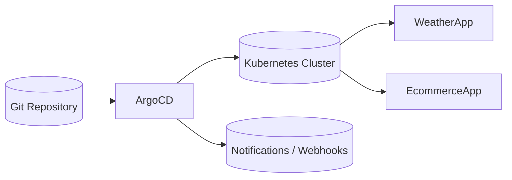

# Lab 10: GitOps with ArgoCD
Implement GitOps workflows using ArgoCD to keep cluster state synchronized with Git.

**Time**: 90 minutes  
**Difficulty**: ⭐⭐⭐⭐ Expert  
**Focus**: GitOps principles, ArgoCD deployment, Automated deployments, Git-driven operations

---

## 🎯 Objective
Master GitOps - the modern way to deploy and manage Kubernetes applications. Learn to set up ArgoCD, create GitOps workflows, and achieve continuous deployment where Git is the single source of truth.

## 📋 What You'll Learn
- GitOps principles and benefits
- ArgoCD installation and configuration
- Application deployment via Git repositories
- Sync policies and health monitoring
- Multi-environment GitOps workflows
- Rollback and disaster recovery
- Best practices for production GitOps

---

## ✅ Prerequisites Check

```bash
./scripts/check-lab-prereqs.sh 10
```

Validates `kubectl`, `helm` (optional), and a local `gitops-configs` workspace.

## ✅ Success criteria

- ArgoCD server and core components are Running in the `argocd` namespace
- An ArgoCD Application can sync a small repo directory (e.g., `development/weather-app`) and deploy resources
- You can trigger a commit and observe ArgoCD auto-sync (or manual sync) apply the changes

## 🧭 Architecture Snapshot



## 📦 Manifest Starter Kit

- Overlay status: `labs/manifests/lab-10/` (in progress)
- Manual approach: install ArgoCD with the official manifests, then build your GitOps structure under `gitops-configs` as described in this lab.

---

## ⚡ Prerequisites
- Completed Labs 1-9 (especially Lab 9 for Helm understanding)
- Git repository access (GitHub/GitLab)
- Understanding of YAML and Kubernetes manifests

---

## 🚀 Steps

### 1. Install ArgoCD (15 min)

```bash
# Create ArgoCD namespace
kubectl create namespace argocd

# Install ArgoCD
kubectl apply -n argocd -f https://raw.githubusercontent.com/argoproj/argo-cd/stable/manifests/install.yaml

# Wait for ArgoCD pods to be ready
kubectl wait --for=condition=ready pod --all -n argocd --timeout=300s

# Check installation
kubectl get pods -n argocd
kubectl get services -n argocd
```

### 2. Access ArgoCD UI (10 min)

```bash
# Port forward ArgoCD server
kubectl port-forward svc/argocd-server -n argocd 8080:443 &

# Get initial admin password
ARGO_PASSWORD=$(kubectl -n argocd get secret argocd-initial-admin-secret -o jsonpath="{.data.password}" | base64 -d)
echo "ArgoCD Admin Password: $ARGO_PASSWORD"

# Access ArgoCD UI
echo "ArgoCD UI: https://localhost:8080"
echo "Username: admin"
echo "Password: $ARGO_PASSWORD"

# Open in browser
open https://localhost:8080
```

**🎯 PRACTICE TASK**: 
- Log into ArgoCD UI
- Explore the interface (Applications, Settings, User Info)
- Note the empty applications list - we'll populate this!

### 3. Prepare GitOps Repository (15 min)

```bash
# Create a new directory for GitOps configs
mkdir -p gitops-configs
cd gitops-configs

# Initialize Git repository
git init
git branch -M main

# Create directory structure for environments
mkdir -p {development,staging,production}/{weather-app,ecommerce-app}
mkdir -p helm-charts
mkdir -p argocd-apps

# Create development weather app manifests
cat <<EOF > development/weather-app/namespace.yaml
apiVersion: v1
kind: Namespace
metadata:
  name: weather-dev
  labels:
    environment: development
    app: weather-app
EOF

cat <<EOF > development/weather-app/deployment.yaml
apiVersion: apps/v1
kind: Deployment
metadata:
  name: weather-app
  namespace: weather-dev
  labels:
    app: weather-app
    environment: development
spec:
  replicas: 2
  selector:
    matchLabels:
      app: weather-app
  template:
    metadata:
      labels:
        app: weather-app
        environment: development
    spec:
      containers:
      - name: weather-app
        image: temitayocharles/weather-app:latest
        ports:
        - containerPort: 3000
        env:
        - name: ENVIRONMENT
          value: "development"
        - name: REDIS_HOST
          value: "redis-service"
        resources:
          requests:
            memory: "128Mi"
            cpu: "100m"
          limits:
            memory: "256Mi"
            cpu: "200m"
        livenessProbe:
          httpGet:
            path: /health
            port: 3000
          initialDelaySeconds: 30
        readinessProbe:
          httpGet:
            path: /health
            port: 3000
          initialDelaySeconds: 5
EOF

cat <<EOF > development/weather-app/service.yaml
apiVersion: v1
kind: Service
metadata:
  name: weather-app-service
  namespace: weather-dev
  labels:
    app: weather-app
    environment: development
spec:
  selector:
    app: weather-app
  ports:
  - port: 80
    targetPort: 3000
    protocol: TCP
  type: LoadBalancer
EOF

cat <<EOF > development/weather-app/kustomization.yaml
apiVersion: kustomize.config.k8s.io/v1beta1
kind: Kustomization

resources:
- namespace.yaml
- deployment.yaml
- service.yaml

commonLabels:
  environment: development
  managed-by: argocd

images:
- name: temitayocharles/weather-app
  newTag: v1.0.0
EOF
```

**🎯 PRACTICE TASK**: 
- Understand each manifest file's purpose
- Notice how we're using Kustomization for environment-specific configs
- Observe resource requests/limits and health checks

### 4. Create ArgoCD Application (15 min)

```bash
# Create ArgoCD Application manifest
cat <<EOF > argocd-apps/weather-dev-app.yaml
apiVersion: argoproj.io/v1alpha1
kind: Application
metadata:
  name: weather-dev
  namespace: argocd
  labels:
    app: weather-app
    environment: development
  finalizers:
    - resources-finalizer.argocd.argoproj.io
spec:
  project: default
  source:
    repoURL: https://github.com/YOUR_USERNAME/gitops-configs.git  # UPDATE THIS
    targetRevision: HEAD
    path: development/weather-app
  destination:
    server: https://kubernetes.default.svc
    namespace: weather-dev
  syncPolicy:
    automated:
      prune: true
      selfHeal: true
      allowEmpty: false
    syncOptions:
    - CreateNamespace=true
    - PrunePropagationPolicy=foreground
    - PruneLast=true
    retry:
      limit: 5
      backoff:
        duration: 5s
        factor: 2
        maxDuration: 3m
EOF

# Commit and push to Git (replace with your repo)
git add .
git commit -m "Initial GitOps setup for weather app development"

# Push to your Git repository
# git remote add origin https://github.com/YOUR_USERNAME/gitops-configs.git
# git push -u origin main
```

**🎯 PRACTICE TASK**: 
- **CRITICAL**: Create your own GitHub repo called `gitops-configs`
- Update the `repoURL` in the Application manifest
- Push the code to YOUR repository
- Understand each field in the Application spec

### 5. Deploy via ArgoCD (10 min)

```bash
# Apply the ArgoCD application
kubectl apply -f argocd-apps/weather-dev-app.yaml

# Watch ArgoCD sync the application
kubectl get applications -n argocd
kubectl describe application weather-dev -n argocd

# Check application status
argocd app list
# Or use kubectl
kubectl get apps -n argocd
```

**🎯 PRACTICE TASK**: 
- Go to ArgoCD UI and watch the sync process
- Click on the `weather-dev` application
- Explore the resource tree visualization
- Verify pods are running: `kubectl get pods -n weather-dev`

### 6. GitOps Workflow - Make Changes (15 min)

```bash
# Simulate a code update by changing image tag
cd gitops-configs
sed -i 's/newTag: v1.0.0/newTag: v1.1.0/' development/weather-app/kustomization.yaml

# Also increase replicas for load testing
sed -i 's/replicas: 2/replicas: 4/' development/weather-app/deployment.yaml

# Commit changes
git add .
git commit -m "Update weather app to v1.1.0 and scale to 4 replicas"
git push origin main

# Watch ArgoCD detect and sync changes
kubectl get applications -n argocd -w
```

**🎯 PRACTICE TASK**: 
- **TIME THE SYNC**: How long does ArgoCD take to detect the change?
- Watch in ArgoCD UI as resources update
- Verify new pods: `kubectl get pods -n weather-dev`
- Check image tags: `kubectl describe pod -n weather-dev | grep Image`

### 7. Multi-Environment Setup (20 min)

```bash
# Create staging environment
cp -r development/weather-app staging/weather-app

# Modify staging for production-like settings
sed -i 's/weather-dev/weather-staging/g' staging/weather-app/*.yaml
sed -i 's/environment: development/environment: staging/g' staging/weather-app/*.yaml
sed -i 's/replicas: 4/replicas: 6/g' staging/weather-app/deployment.yaml
sed -i 's/newTag: v1.1.0/newTag: v1.0.0/g' staging/weather-app/kustomization.yaml

# Update resource limits for staging
cat <<EOF > staging/weather-app/resource-patch.yaml
apiVersion: apps/v1
kind: Deployment
metadata:
  name: weather-app
spec:
  template:
    spec:
      containers:
      - name: weather-app
        resources:
          requests:
            memory: "256Mi"
            cpu: "200m"
          limits:
            memory: "512Mi"
            cpu: "500m"
EOF

# Add patch to kustomization
cat <<EOF >> staging/weather-app/kustomization.yaml

patchesStrategicMerge:
- resource-patch.yaml
EOF

# Create staging ArgoCD application
cat <<EOF > argocd-apps/weather-staging-app.yaml
apiVersion: argoproj.io/v1alpha1
kind: Application
metadata:
  name: weather-staging
  namespace: argocd
  labels:
    app: weather-app
    environment: staging
  finalizers:
    - resources-finalizer.argocd.argoproj.io
spec:
  project: default
  source:
    repoURL: https://github.com/YOUR_USERNAME/gitops-configs.git  # UPDATE THIS
    targetRevision: HEAD
    path: staging/weather-app
  destination:
    server: https://kubernetes.default.svc
    namespace: weather-staging
  syncPolicy:
    automated:
      prune: true
      selfHeal: true
    syncOptions:
    - CreateNamespace=true
    retry:
      limit: 3
      backoff:
        duration: 5s
        maxDuration: 3m
EOF

# Deploy staging
kubectl apply -f argocd-apps/weather-staging-app.yaml

# Commit everything
git add .
git commit -m "Add staging environment with higher resources"
git push origin main
```

**🎯 PRACTICE TASK**: 
- Compare development vs staging in ArgoCD UI
- Notice different resource allocations
- Verify both environments: `kubectl get pods -A | grep weather`
- Understand how Kustomize enables environment-specific configs

### 8. Helm + GitOps Integration (10 min)

```bash
# Create Helm values for different environments
mkdir -p helm-charts/weather-app

# Copy the weather chart from Lab 9 (or create simplified version)
cat <<EOF > helm-charts/weather-app/Chart.yaml
apiVersion: v2
name: weather-app
description: Weather application for GitOps
version: 0.2.0
appVersion: "1.1.0"
EOF

cat <<EOF > helm-charts/weather-app/values.yaml
replicaCount: 3
image:
  repository: temitayocharles/weather-app
  tag: v1.1.0
service:
  type: LoadBalancer
  port: 80
resources:
  requests:
    memory: 128Mi
    cpu: 100m
  limits:
    memory: 256Mi
    cpu: 200m
EOF

# Create environment-specific values
cat <<EOF > development/weather-app/helm-values.yaml
replicaCount: 2
image:
  tag: v1.1.0
resources:
  requests:
    memory: 128Mi
    cpu: 100m
EOF

cat <<EOF > staging/weather-app/helm-values.yaml
replicaCount: 4
image:
  tag: v1.0.0
resources:
  requests:
    memory: 256Mi
    cpu: 200m
EOF

# Create Helm-based ArgoCD application
cat <<EOF > argocd-apps/weather-helm-app.yaml
apiVersion: argoproj.io/v1alpha1
kind: Application
metadata:
  name: weather-helm
  namespace: argocd
spec:
  project: default
  source:
    repoURL: https://github.com/YOUR_USERNAME/gitops-configs.git  # UPDATE THIS
    targetRevision: HEAD
    path: helm-charts/weather-app
    helm:
      valueFiles:
      - ../../development/weather-app/helm-values.yaml
  destination:
    server: https://kubernetes.default.svc
    namespace: weather-helm
  syncPolicy:
    automated:
      prune: true
      selfHeal: true
    syncOptions:
    - CreateNamespace=true
EOF

kubectl apply -f argocd-apps/weather-helm-app.yaml

git add .
git commit -m "Add Helm + GitOps integration"
git push origin main
```

**🎯 PRACTICE TASK**: 
- Now you have 3 different deployment approaches in ArgoCD!
- Compare: Plain YAML, Kustomize, and Helm
- Which approach feels most maintainable for your use case?

---

## ✅ Validation

```bash
# 1. Verify ArgoCD is healthy
kubectl get pods -n argocd
argocd app list

# 2. Check all applications are synced
kubectl get applications -n argocd
kubectl get applications -n argocd -o wide

# 3. Verify weather apps in all environments
kubectl get pods -A | grep weather
kubectl get services -A | grep weather

# 4. Test GitOps workflow
# Make a change, commit, push, watch sync
echo "# Updated at $(date)" >> development/weather-app/README.md
git add . && git commit -m "Test sync" && git push origin main

# 5. Check ArgoCD UI for sync status
open https://localhost:8080
```

---

## 🧹 Cleanup

```bash
# Delete ArgoCD applications
kubectl delete applications weather-dev weather-staging weather-helm -n argocd

# Wait for resources to be cleaned up
kubectl get namespaces | grep weather

# Delete ArgoCD itself (optional)
kubectl delete -n argocd -f https://raw.githubusercontent.com/argoproj/argo-cd/stable/manifests/install.yaml
kubectl delete namespace argocd

# Clean local files
cd ..
rm -rf gitops-configs/
```

---

## 🎓 Key Concepts Learned

### **GitOps Principles**
1. **Declarative**: Everything defined in Git
2. **Versioned**: All changes tracked in Git history
3. **Immutable**: No direct cluster changes
4. **Pulled**: ArgoCD pulls from Git, not pushed to

### **ArgoCD Components**
- **Application**: Defines what to deploy and where
- **Project**: Groups applications with policies
- **Repository**: Git repo containing manifests
- **Sync Policy**: Automated vs manual deployment

### **GitOps Workflows**
```
Developer → Git Push → ArgoCD Detects → Syncs to K8s → Monitors Health
```

### **Benefits Over Traditional CI/CD**
✅ **Git as Single Source of Truth**  
✅ **Audit Trail** - Every change tracked  
✅ **Easy Rollbacks** - Git revert + sync  
✅ **Security** - No cluster credentials in CI  
✅ **Disaster Recovery** - Recreate from Git  

---

## 📚 GitOps Best Practices

### **Repository Structure**
```
gitops-repo/
├── environments/          # Environment-specific configs
│   ├── dev/
│   ├── staging/
│   └── production/
├── applications/          # ArgoCD Application definitions
├── helm-charts/          # Custom Helm charts
└── shared/               # Shared resources
```

### **Environment Promotion**
✅ **DO**:
- Test in dev first
- Use image tags, not `latest`
- Automate promotion pipelines
- Validate before production
- Use branch protection rules

❌ **DON'T**:
- Skip testing environments
- Make direct production changes
- Use mutable tags
- Bypass approval processes

### **Security Practices**
✅ **DO**:
- Use separate Git repos per environment
- Implement RBAC for ArgoCD projects
- Use Git signed commits
- Encrypt secrets (Sealed Secrets, External Secrets)
- Regular access reviews

❌ **DON'T**:
- Store plain text secrets
- Give broad cluster permissions
- Use shared service accounts
- Skip secret rotation

---

## 🔧 Advanced GitOps Patterns

### **1. App of Apps Pattern**
```yaml
# Deploy multiple applications from one
apiVersion: argoproj.io/v1alpha1
kind: Application
metadata:
  name: platform-apps
spec:
  source:
    path: applications/
  syncPolicy:
    automated: {}
```

### **2. Progressive Delivery**
```yaml
# Canary deployments with Argo Rollouts
apiVersion: argoproj.io/v1alpha1
kind: Rollout
spec:
  strategy:
    canary:
      steps:
      - setWeight: 10
      - pause: {duration: 60s}
      - setWeight: 50
      - pause: {duration: 60s}
```

### **3. Multi-Cluster GitOps**
```yaml
# Deploy to multiple clusters
spec:
  destination:
    name: production-cluster
    namespace: weather-app
```

---

## 🔍 Debugging GitOps Issues

### **Application Won't Sync**
```bash
# Check application events
kubectl describe application weather-dev -n argocd

# Check ArgoCD logs
kubectl logs -f deployment/argocd-application-controller -n argocd

# Force refresh
argocd app get weather-dev --refresh
```

### **Resource Conflicts**
```bash
# Check resource status
kubectl get events -n weather-dev --sort-by='.lastTimestamp'

# Check for owner conflicts
kubectl get deployment weather-app -n weather-dev -o yaml | grep ownerReferences
```

### **Git Authentication Issues**
```bash
# Check repository connection
kubectl get secret -n argocd | grep repo
kubectl logs deployment/argocd-repo-server -n argocd
```

---

## 🎯 Real-World Scenarios

### **Scenario 1: Hotfix Deployment**
```bash
# 1. Create hotfix branch
git checkout -b hotfix/security-patch

# 2. Update image tag
sed -i 's/v1.1.0/v1.1.1-security/' development/weather-app/kustomization.yaml

# 3. Commit and create PR
git commit -am "Security hotfix v1.1.1"
git push origin hotfix/security-patch

# 4. After approval, merge triggers deployment
```

### **Scenario 2: Rollback Deployment**
```bash
# 1. Find previous working commit
git log --oneline development/weather-app/

# 2. Revert to working state
git revert <bad-commit-hash>
git push origin main

# 3. ArgoCD automatically syncs rollback
```

### **Scenario 3: Disaster Recovery**
```bash
# 1. Fresh cluster setup
kubectl apply -n argocd -f https://raw.githubusercontent.com/argoproj/argo-cd/stable/manifests/install.yaml

# 2. Apply all ArgoCD applications
kubectl apply -f argocd-apps/

# 3. ArgoCD rebuilds entire environment from Git
```

---

## 📊 Validate Your Work

```bash
./scripts/validate-lab.sh 10
```

- Confirms ArgoCD core deployments in `argocd` namespace are Ready.
- Checks the `weather-dev` application exists and reports `Synced` + `Healthy`.
- Verifies the `<your-app-name>` manifest directory matches what ArgoCD manages.

> If anything fails, re-run `./scripts/check-lab-prereqs.sh 10` to ensure your CLI and repo state are in sync.

## 🧠 Quick Check

<details>
  <summary>How can you inspect why an Argo application is OutOfSync?</summary>

  ```bash
  argocd app diff <app-name>
  ```

  Review drift against Git before deciding to sync or revert.
  </details>

<details>
  <summary>How do you trigger a manual resync from the CLI?</summary>

  ```bash
  argocd app sync weather-dev
  ```

  Use flags like `--prune` if you need to remove stray resources.
  </details>

## 🏆 Challenge Mode

- Bootstrap an **App-of-Apps** repository that deploys all six sample services from a single Argo Application.
- Wire up **SSO for the ArgoCD UI** (GitHub OAuth, Okta, or Dex connector) and enforce RBAC policies.
- Add **ArgoCD Notifications** to broadcast sync status changes to Slack or Microsoft Teams.
- Integrate **Argo Rollouts** canary strategy into one service and manage it entirely through GitOps.

## 🔧 Troubleshooting Flow

1. **Application stuck in `Progressing`** → `kubectl describe application <name> -n argocd` for event history.
2. **Repository authentication errors** → Validate repo secrets + inspect `argocd-repo-server` logs.
3. **Permission denied during sync** → Check Project-level RBAC and target namespace permissions.
4. **Resources drift right after sync** → Confirm no mutating webhooks/ops tools are changing manifests; enable auto-prune.
5. **UI shows stale state** → `argocd app get <name> --refresh` or trigger a hard refresh in the UI.

---

## 🏆 Congratulations!

You've mastered GitOps! You can now:

✅ **Deploy applications** using Git as single source of truth  
✅ **Manage multi-environment** workflows safely  
✅ **Integrate Helm charts** with GitOps pipelines  
✅ **Implement automated** sync policies  
✅ **Handle rollbacks** and disaster recovery  
✅ **Debug GitOps issues** effectively  
✅ **Apply security best practices** for production  

---

## 🚀 What's Next?

1. **Advanced Patterns**: 
   - Progressive delivery with Argo Rollouts
   - Multi-cluster deployments
   - App of Apps pattern

2. **Security Enhancements**:
   - Sealed Secrets or External Secrets Operator
   - RBAC policies for ArgoCD
   - Image scanning integration

3. **Monitoring & Observability**:
   - ArgoCD metrics in Prometheus
   - Deployment notifications
   - Drift detection alerts

4. **Production Readiness**:
   - High availability ArgoCD setup
   - Backup and restore procedures
   - Compliance and audit logging

---

## 📚 Additional Resources

- **[ArgoCD Documentation](https://argo-cd.readthedocs.io/)**
- **[GitOps Principles](https://opengitops.dev/)**
- **[Argo Rollouts](https://argoproj.github.io/argo-rollouts/)**
- **[Sealed Secrets](https://sealed-secrets.netlify.app/)**
- **[GitOps Toolkit](https://toolkit.fluxcd.io/)**

---

## 💡 GitOps Philosophy

> **"If it's not in Git, it doesn't exist in production"**

GitOps transforms how we think about deployments:
- **Declarative** over imperative
- **Pull-based** over push-based  
- **Immutable** over mutable
- **Observable** over black-box

**You've now completed the full professional Kubernetes journey: from basic pods to production GitOps workflows!** 🎉

---

## 🧠 Test Your Knowledge

Ready to verify your mastery? Take the **[Lab 10 Self-Assessment Quiz](../docs/learning/SELF-ASSESSMENT.md#-lab-10--gitops-with-argocd)** and see how you score!