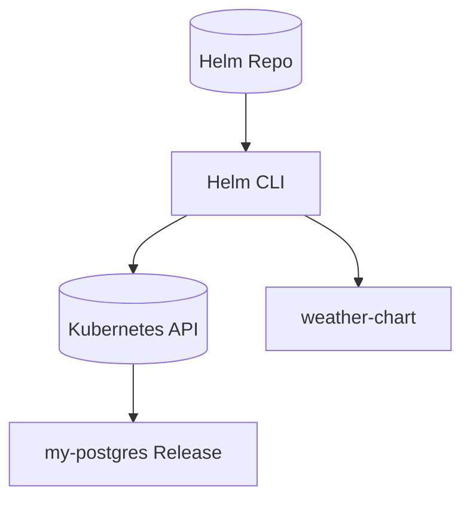

# Lab 10: Helm Package Management
Learn Helm to package, templatize, and deliver Kubernetes applications reproducibly.

**Time**: 75 minutes  
**Difficulty**: ⭐⭐⭐⭐ Expert  
**Focus**: Helm charts, Templating, Values, Package management, Custom charts

---

## 🎯 Objective
Master Helm - the "package manager for Kubernetes". Learn to use existing charts, customize them, and create your own charts for deployment automation.

## � Assumed Knowledge
**Required**: YAML manifests (Labs 1-4), ConfigMaps (Lab 2), Multi-app patterns (Lab 8)  
**Helpful**: Templating concepts, version control basics

## �📋 What You'll Learn
- Helm basics (chart, release, repository)
- Installing public charts (nginx, PostgreSQL)
- Values customization and overrides
- Creating custom Helm charts
- Templating with Go templates
- Chart lifecycle management
- Best practices for production

---

## ✅ Prerequisites Check

```bash
./scripts/check-lab-prereqs.sh 9
```

Validates `helm`, `kubectl`, and the optional `gitops-configs` workspace.

## ✅ Success criteria

- Helm client installed and functional (helm version)
- Can install a PostgreSQL chart into a `helm-demo` namespace and verify pods
- Can create, lint, and package a custom chart (weather-chart)

## 🧭 Architecture Snapshot



## 📦 Manifest Starter Kit

- Overlay status: `labs/manifests/lab-10/` (in progress)
- Manual approach: rely on the Bitnami charts plus your `postgres-values.yaml` and the `weather-chart` scaffold created in this lab.

---

## 🚀 Steps

> **Lab Navigation**: This lab is organized in 2 phases for easier consumption:
> - **[Phase 1](#-phase-1-consuming-helm-charts)**: Using existing Helm charts (35 min)
> - **[Phase 2](#-phase-2-creating-your-own-helm-chart)**: Building & packaging your own chart (65 min)

---

## 📥 Phase 1: Consuming Helm Charts

### 1. Install & Configure Helm (10 min)

```bash
# Install Helm (if not already installed)
# macOS: brew install helm
# Or download from: https://helm.sh/docs/intro/install/

# Verify installation
helm version

# Add popular repositories
helm repo add stable https://charts.helm.sh/stable
helm repo add bitnami https://charts.bitnami.com/bitnami
helm repo add nginx-stable https://helm.nginx.com/stable
helm repo update

# List available repos
helm repo list

# Search for charts
helm search repo nginx
helm search repo postgresql
```

### 2. Deploy PostgreSQL with Helm (15 min)

```bash
# Create namespace
kubectl create namespace helm-demo

# View chart details before installing
helm show chart bitnami/postgresql
helm show values bitnami/postgresql

# Install PostgreSQL with custom values
helm install my-postgres bitnami/postgresql \
  --namespace helm-demo \
  --set auth.postgresPassword=mypassword \
  --set auth.database=testdb \
  --set primary.persistence.size=1Gi \
  --set volumePermissions.enabled=true

# Check release status
helm status my-postgres -n helm-demo
helm list -n helm-demo

# Get generated resources
kubectl get all -n helm-demo

# Test connection
kubectl run postgresql-client --rm --tty -i --restart='Never' \
  --namespace helm-demo \
  --image docker.io/bitnami/postgresql:16 \
  --env="PGPASSWORD=mypassword" \
  --command -- psql --host my-postgres-postgresql -U postgres -d testdb -p 5432
```

### 3. Customize with Values File (10 min)

```bash
# Create custom values file
cat <<EOF > postgres-values.yaml
auth:
  postgresPassword: "supersecret123"
  database: "ecommerce"
  username: "app_user"
  password: "app_password"

primary:
  persistence:
    enabled: true
    size: 2Gi
    storageClass: ""
  
  resources:
    requests:
      memory: 256Mi
      cpu: 250m
    limits:
      memory: 512Mi
      cpu: 500m

  service:
    type: ClusterIP
    ports:
      postgresql: 5432

metrics:
  enabled: true
  serviceMonitor:
    enabled: false
EOF

# Upgrade with values file
helm upgrade my-postgres bitnami/postgresql \
  --namespace helm-demo \
  --values postgres-values.yaml

# Check what changed
helm get values my-postgres -n helm-demo
kubectl describe pod -l app.kubernetes.io/name=postgresql -n helm-demo
```

**Phase 1 Complete!** ✅ You've learned to install Helm, deploy charts, and customize with values files.  
**Next**: [Phase 2: Creating Your Own Helm Chart](#-phase-2-creating-your-own-helm-chart) to build and package custom charts.

---

## 🛠️ Phase 2: Creating Your Own Helm Chart

### 4. Create Your First Helm Chart (25 min)

```bash
# Create a new chart for weather app
helm create weather-chart

# Examine chart structure
tree weather-chart/
# weather-chart/
# ├── Chart.yaml          # Chart metadata
# ├── values.yaml         # Default values
# ├── charts/             # Chart dependencies
# └── templates/          # Kubernetes manifests with templating
#     ├── deployment.yaml
#     ├── service.yaml
#     ├── ingress.yaml
#     ├── _helpers.tpl    # Template helpers
#     └── tests/

# Examine Chart.yaml
cat weather-chart/Chart.yaml

# Examine values.yaml
cat weather-chart/values.yaml

# Look at template structure
cat weather-chart/templates/deployment.yaml
cat weather-chart/templates/service.yaml
```

### 5. Customize Chart for Weather App (15 min)

```bash
# Update Chart.yaml
cat <<EOF > weather-chart/Chart.yaml
apiVersion: v2
name: weather-chart
description: A Helm chart for Weather Application
type: application
version: 0.1.0
appVersion: "1.0.0"
keywords:
  - weather
  - vue
  - python
  - redis
home: https://github.com/temitayocharles/weather-app
maintainers:
  - name: Your Name
    email: you@example.com
EOF

# Update values.yaml for weather app
cat <<EOF > weather-chart/values.yaml
# Default values for weather-chart
replicaCount: 3

image:
  repository: temitayocharles/weather-app
  pullPolicy: IfNotPresent
  tag: "latest"

nameOverride: ""
fullnameOverride: ""

service:
  type: LoadBalancer
  port: 3000
  targetPort: 3000

ingress:
  enabled: false
  className: ""
  annotations: {}
  hosts:
    - host: weather-local.com
      paths:
        - path: /
          pathType: Prefix
  tls: []

resources:
  limits:
    cpu: 500m
    memory: 512Mi
  requests:
    cpu: 250m
    memory: 256Mi

autoscaling:
  enabled: false
  minReplicas: 3
  maxReplicas: 10
  targetCPUUtilizationPercentage: 80

nodeSelector: {}
tolerations: []
affinity: {}

redis:
  enabled: true
  auth:
    enabled: false
  master:
    persistence:
      enabled: false
EOF

# Update deployment template to use our values
cat <<EOF > weather-chart/templates/deployment.yaml
apiVersion: apps/v1
kind: Deployment
metadata:
  name: {{ include "weather-chart.fullname" . }}
  labels:
    {{- include "weather-chart.labels" . | nindent 4 }}
spec:
  {{- if not .Values.autoscaling.enabled }}
  replicas: {{ .Values.replicaCount }}
  {{- end }}
  selector:
    matchLabels:
      {{- include "weather-chart.selectorLabels" . | nindent 6 }}
  template:
    metadata:
      labels:
        {{- include "weather-chart.selectorLabels" . | nindent 8 }}
    spec:
      containers:
        - name: {{ .Chart.Name }}
          image: "{{ .Values.image.repository }}:{{ .Values.image.tag | default .Chart.AppVersion }}"
          imagePullPolicy: {{ .Values.image.pullPolicy }}
          ports:
            - name: http
              containerPort: {{ .Values.service.targetPort }}
              protocol: TCP
          env:
            - name: REDIS_HOST
              value: "{{ include "weather-chart.fullname" . }}-redis-master"
            - name: REDIS_PORT
              value: "6379"
          livenessProbe:
            httpGet:
              path: /health
              port: http
            initialDelaySeconds: 30
            periodSeconds: 10
          readinessProbe:
            httpGet:
              path: /health
              port: http
            initialDelaySeconds: 5
            periodSeconds: 5
          resources:
            {{- toYaml .Values.resources | nindent 12 }}
EOF
```

### 6. Add Redis Dependency (10 min)

```bash
# Add Redis as chart dependency
cat <<EOF >> weather-chart/Chart.yaml

dependencies:
  - name: redis
    version: "~18.1.0"
    repository: "https://charts.bitnami.com/bitnami"
    condition: redis.enabled
EOF

# Update dependencies
helm dependency update weather-chart/

# Check downloaded dependencies
ls weather-chart/charts/
```

### 7. Test & Deploy Your Chart (10 min)

```bash
# Lint the chart (check for issues)
helm lint weather-chart/

# Test template rendering (dry run)
helm template my-weather weather-chart/ \
  --namespace weather-helm \
  --set replicaCount=2

# Install your custom chart
kubectl create namespace weather-helm
helm install my-weather weather-chart/ \
  --namespace weather-helm \
  --set replicaCount=2 \
  --set autoscaling.enabled=true

# Check deployment
helm status my-weather -n weather-helm
kubectl get all -n weather-helm

# Test upgrade
helm upgrade my-weather weather-chart/ \
  --namespace weather-helm \
  --set replicaCount=4 \
  --set resources.requests.memory=128Mi

# Check rollout history
helm history my-weather -n weather-helm
```

### 8. Package & Share Chart (Optional - 5 min)

```bash
# Package chart
helm package weather-chart/

# The creates weather-chart-0.1.0.tgz

# You could publish to chart repository
# helm repo index . --url https://your-repo.com/charts
# Upload to GitHub Pages, Artifactory, etc.
```

**Phase 2 Complete!** ✅ You've built a custom Helm chart, added dependencies, tested, and packaged it.  
**All phases complete!** Proceed to [Validation](#-validation) to verify your Helm skills.

---

## ✅ Validation

```bash
# 1. Verify Helm is working
helm version --short

# 2. Check PostgreSQL release
helm list -n helm-demo
kubectl get pods -n helm-demo

# 3. Check weather app release
helm list -n weather-helm
kubectl get pods -n weather-helm

# 4. Test weather app
kubectl port-forward -n weather-helm svc/my-weather-weather-chart 3000:3000 &
sleep 2  # Wait for port-forward to establish
curl http://localhost:3000/health

# 5. Verify Redis connection
kubectl exec -it deployment/my-weather-weather-chart -n weather-helm -- \
  sh -c 'redis-cli -h my-weather-redis-master ping'
```

---

## 🧹 Cleanup

```bash
# Uninstall releases
helm uninstall my-postgres -n helm-demo
helm uninstall my-weather -n weather-helm

# Delete namespaces
kubectl delete namespace helm-demo weather-helm

# Remove chart files
rm -rf weather-chart/
rm postgres-values.yaml weather-chart-0.1.0.tgz
```

---

## 🎓 Key Concepts Learned

### **Helm Terminology**
- **Chart**: Package of Kubernetes resources
- **Release**: Running instance of a chart
- **Repository**: Collection of charts
- **Values**: Configuration parameters

### **Chart Structure**
- `Chart.yaml`: Metadata (name, version, dependencies)
- `values.yaml`: Default configuration values
- `templates/`: Kubernetes manifests with Go templating
- `charts/`: Chart dependencies (downloaded)

### **Templating Power**
- `{{ .Values.replicaCount }}`: Access values
- `{{ include "chart.name" . }}`: Use helpers
- `{{- if .Values.redis.enabled }}`: Conditional logic
- `{{- toYaml .Values.resources | nindent 12 }}`: Format YAML

### **Lifecycle Management**
- `helm install`: Deploy new release
- `helm upgrade`: Update existing release
- `helm rollback`: Revert to previous version
- `helm uninstall`: Remove release

---

## 📚 Helm Best Practices

### **Chart Development**
✅ **DO**:
- Use semantic versioning for charts
- Document all values in values.yaml
- Add resource limits and requests
- Include health checks
- Use helpers for repeated labels
- Test with multiple value combinations

❌ **DON'T**:
- Hardcode values in templates
- Use `latest` tags
- Skip input validation
- Create overly complex charts
- Ignore security contexts

### **Production Usage**
✅ **DO**:
- Pin chart versions in production
- Use separate values files per environment
- Store sensitive values in secrets
- Test upgrades in staging first
- Keep releases organized by namespace
- Use chart repositories for distribution

❌ **DON'T**:
- Use `--force` upgrades in production
- Skip backup before major upgrades
- Install charts without reviewing values
- Use default passwords
- Deploy without resource limits

---

## 🔧 Common Helm Commands

```bash
# Repository management
helm repo add <name> <url>
helm repo update
helm search repo <keyword>

# Chart development
helm create <name>
helm lint <chart>
helm template <name> <chart>
helm dependency update <chart>

# Release management
helm install <name> <chart> -n <namespace>
helm upgrade <name> <chart> -n <namespace>
helm rollback <name> <revision> -n <namespace>
helm uninstall <name> -n <namespace>

# Information
helm list -A
helm status <name> -n <namespace>
helm history <name> -n <namespace>
helm get values <name> -n <namespace>
```

---

## 🔍 Debugging Tips

### **Chart Issues**
```bash
# Validate chart syntax
helm lint weather-chart/

# See rendered templates
helm template my-weather weather-chart/ --debug

# Dry run installation
helm install my-weather weather-chart/ --dry-run --debug
```

### **Release Issues**
```bash
# Check release status
helm status my-weather -n weather-helm

# Get all release information
helm get all my-weather -n weather-helm

# Check for failed releases
helm list --failed -A
```

### **Template Debugging**
```bash
# Add debug statements to templates
{{ printf "DEBUG: replicaCount is %v" .Values.replicaCount }}

# Use dry-run to see values
helm install --dry-run --debug <name> <chart>
```

---

## 🎯 Real-World Scenarios

### **Scenario 1: Environment-Specific Deployments**
```bash
# Development values
cat <<EOF > values-dev.yaml
replicaCount: 1
resources:
  requests:
    memory: 128Mi
    cpu: 100m
redis:
  master:
    persistence:
      enabled: false
EOF

# Production values
cat <<EOF > values-prod.yaml
replicaCount: 5
resources:
  requests:
    memory: 512Mi
    cpu: 250m
  limits:
    memory: 1Gi
    cpu: 500m
redis:
  master:
    persistence:
      enabled: true
      size: 10Gi
autoscaling:
  enabled: true
EOF

# Deploy to different environments
helm install weather-dev weather-chart/ -f values-dev.yaml -n dev
helm install weather-prod weather-chart/ -f values-prod.yaml -n production
```

### **Scenario 2: Blue-Green Deployments**
```bash
# Deploy blue version
helm install weather-blue weather-chart/ \
  --set image.tag=v1.0.0 \
  --set nameOverride=blue \
  -n weather

# Deploy green version
helm install weather-green weather-chart/ \
  --set image.tag=v2.0.0 \
  --set nameOverride=green \
  -n weather

# Switch traffic (update ingress/service)
# Then cleanup old version
helm uninstall weather-blue -n weather
```

---
## 🧠 Quick Check

<details>
  <summary>How do you inspect the rendered manifests without applying them?</summary>
  ```bash
  helm template weather-chart/
  ```
  </details>

<details>
  <summary>How can you see which values were used in the last deploy?</summary>
  ```bash
  helm get values my-postgres -n helm-demo
  ```
  </details>

## 🏆 Challenge Mode

- Add Helm tests to the weather chart (see `templates/tests/` example).
- Publish your chart to an OCI registry and pull it from another cluster.
- Integrate `helm lint` and `helm unittest` into your CI pipeline.

## 🔧 Troubleshooting Flow

1. **Install fails?** → `helm install ... --debug --dry-run` to inspect rendered YAML.
2. **Upgrade errors?** → Compare revisions: `helm diff upgrade` or `helm history`.
3. **Pods crash after upgrade?** → Check for immutable field changes; consider `helm rollback`.
4. **Values not applied?** → Ensure the value path matches template structure (`helm show values chart`).

---

## 🏆 Congratulations!

You've mastered Helm package management! You can now:

✅ **Install & manage** existing charts from repositories  
✅ **Customize deployments** using values files  
✅ **Create custom charts** with proper templating  
✅ **Manage dependencies** between charts  
✅ **Handle chart lifecycle** (install/upgrade/rollback)  
✅ **Debug chart issues** effectively  
✅ **Apply best practices** for production usage  

---

## 🚀 What's Next?

1. **Practice**: Convert other apps to Helm charts
2. **Advanced**: Learn Helm hooks and tests
3. **GitOps**: Combine Helm with ArgoCD
4. **Security**: Use Helm secrets plugins
5. **Monitoring**: Add ServiceMonitors to charts

---

## 📚 Additional Resources

- **[Official Helm Docs](https://helm.sh/docs/)**
- **[Helm Chart Best Practices](https://helm.sh/docs/chart_best_practices/)**
- **[Artifact Hub](https://artifacthub.io/)** - Find charts
- **[Helm Secrets Plugin](https://github.com/jkroepke/helm-secrets)**
- **[Chart Testing](https://github.com/helm/chart-testing)**

**Remember**: Helm is like package manager (apt/yum) for Kubernetes - it manages complexity and enables reusable deployments!

---

## 🔨 Break & Fix Challenge

**⚫ Debug Level 5** - Master: Helm templating, chart dependencies, complex debugging

**Time Limit**: 30 minutes | **Difficulty**: Expert (Helm templating is tricky!)

Helm charts fail in subtle ways—syntax errors render, but deployments break. Hunt them down!

### Deploy Broken Chart

```bash
# Create broken weather chart
cat <<EOF > broken-values.yaml
replicaCount: 3

image:
  repository: temitayocharles/weather-app
  tag: v1.0.0  # BUG #1: Tag doesn't exist
  pullPolicy: Always

service:
  type: LoadBalancer
  port: 3000

resources:
  requests:
    cpu: "250m"
    memory: "256Mi"
  limits:
    cpu: "500m"
    memory: "512"  # BUG #2: Missing unit

redis:
  enabled: true
  version: 7.0.0  # BUG #3: Wrong key (should be image.tag)
EOF

helm install broken-weather weather-chart/ \
  --namespace helm-demo \
  --values broken-values.yaml
```

---

### 🐛 Bug #1: Non-Existent Image Tag (MEDIUM)

**Symptom**: Pods in ImagePullBackOff. Helm install "succeeds" but app never starts.

**How to find it**:
```bash
kubectl get pods -n helm-demo
# STATUS: ImagePullBackOff

kubectl describe pod -l app.kubernetes.io/name=weather-chart -n helm-demo
# Events: Failed to pull image "temitayocharles/weather-app:v1.0.0"

# Check what tag actually exists
curl -s https://hub.docker.com/v2/repositories/temitayocharles/weather-app/tags | jq '.results[].name'
# Tag "v1.0.0" doesn't exist, should be "latest" or "v1.0"
```

<details>
<summary>✅ Solution</summary>

**Fix**: Upgrade with correct image tag:

```bash
helm upgrade broken-weather weather-chart/ \
  --namespace helm-demo \
  --set image.tag=latest \
  --reuse-values
```

**Lesson**: Always verify image tags exist in registry before deploying! Use `helm template` + `docker manifest inspect` for pre-flight validation.

</details>

---

### 🐛 Bug #2: Invalid Memory Format (HARD)

**Symptom**: Helm install succeeds, pods start, but validation webhook rejects deployment!

**How to find it**:
```bash
kubectl get events -n helm-demo --sort-by='.lastTimestamp'
# Error: Invalid resource quantity "512"

helm get manifest broken-weather -n helm-demo | grep -A 5 "limits:"
# limits:
#   memory: "512"  # Missing unit!

# Valid formats: "512Mi", "512M", "0.5Gi"
```

<details>
<summary>✅ Solution</summary>

**Fix**: Memory units are REQUIRED in Kubernetes:

```bash
# Option A: Fix values file
cat <<EOF > fixed-values.yaml
resources:
  limits:
    memory: "512Mi"  # Added Mi unit
EOF

helm upgrade broken-weather weather-chart/ \
  -n helm-demo \
  --values fixed-values.yaml

# Option B: Use --set
helm upgrade broken-weather weather-chart/ \
  -n helm-demo \
  --set resources.limits.memory=512Mi
```

**Why this is tricky**: YAML accepts `"512"` as valid string, but Kubernetes API rejects it. Helm doesn't validate resource formats!

</details>

---

### 🐛 Bug #3: Chart Dependency Wrong Key (EXPERT)

**Symptom**: Redis doesn't deploy with expected version. `helm list` shows only parent chart.

**How to find it**:
```bash
# Check what got deployed
kubectl get pods -n helm-demo
# No Redis pods with version 7.0.0!

# Inspect values used
helm get values broken-weather -n helm-demo
# redis:
#   version: 7.0.0  ← Wrong key!

# Check Redis chart documentation
helm show values bitnami/redis | grep -A 3 "image:"
# image:
#   tag: "..."  ← Correct key is `image.tag`, not `version`
```

<details>
<summary>✅ Solution</summary>

**Fix**: Use correct nested key structure for subchart values:

```bash
# Correct way to override subchart values
helm upgrade broken-weather weather-chart/ \
  --namespace helm-demo \
  --set redis.image.tag=7.0.0 \
  --reuse-values

# Or in values file:
cat <<EOF > fixed-redis-values.yaml
redis:
  image:
    tag: "7.0.0"
  master:
    persistence:
      enabled: true
      size: 1Gi
EOF

helm upgrade broken-weather weather-chart/ \
  -n helm-demo \
  --values fixed-redis-values.yaml
```

**Verify**:
```bash
kubectl get pods -n helm-demo -l app.kubernetes.io/name=redis
kubectl describe pod <redis-pod> | grep "Image:"
# Should show redis:7.0.0 ✅
```

**Lesson**: Subchart values require FULL PATH. Use `helm show values <chart>` to find correct key structure!

</details>

---

### 🎯 Verify All Fixes

```bash
# All pods Running?
kubectl get pods -n helm-demo

# Correct image tag?
kubectl get deployment -n helm-demo -o jsonpath='{.items[*].spec.template.spec.containers[*].image}'

# Memory limits valid?
kubectl get deployment -n helm-demo -o jsonpath='{.items[*].spec.template.spec.containers[*].resources.limits.memory}'

# Redis version correct?
kubectl exec -it -n helm-demo deployment/broken-weather-redis-master -- redis-cli INFO SERVER | grep redis_version

# Helm release healthy?
helm status broken-weather -n helm-demo
```

**All green?** 🎉 You've mastered Helm debugging!

---

## 🤔 Why Does Helm Exist?

**The Spotify Problem (2016)**:  
200 microservices = 200 sets of YAML manifests. Change one label? Edit 200 files. Update resource limits? 200 copy-pastes. Deploy to 5 environments (dev/staging/prod/EU/US)? 1,000 files to maintain. Developer productivity collapsed.

**Bad Solution ❌**: "Write scripts to sed/awk YAML files"  
**Kubernetes Solution ✅**: Helm charts = package manager for K8s. Define once (template), deploy many (environments). Change one value, update 200 services. DRY principle for infrastructure.

**Analogy**: No Helm = copying recipe 200 times, changing "salt: 1 tsp" to "salt: 2 tsp" in each copy. Helm = recipe template with `{{ .Values.salt }}`, change once, bake 200 cakes.

**Real-world stat**: Teams using Helm reduce deployment time by 75% and configuration errors by 90%. Spotify went from 2-hour deploys to 5-minute deploys after adopting Helm (source: Spotify Engineering Blog 2017).

**This lab teaches**: Templating, values hierarchy, and dependency management—the three skills that scale infrastructure from 1 app to 1,000 apps.

---

## 🎤 Interview Prep: Helm Deep Dive

### Q: "How would you manage Helm values across multiple environments?"

❌ **Weak Answer**:  
"Use different values files for each environment like `values-dev.yaml`, `values-prod.yaml`."

✅ **STAR Method Answer**:

**Situation**: Managed platform with 50 services across 4 environments (dev, staging, prod-US, prod-EU). Each environment had different resource limits, database endpoints, and scaling policies. Keeping 200 values files in sync was error-prone.

**Task**: Design a maintainable values hierarchy that prevents configuration drift and enables environment-specific overrides.

**Action**:
1. **Base values in chart** (`values.yaml`): Common defaults shared across all environments
   ```yaml
   replicaCount: 2
   image:
     pullPolicy: IfNotPresent
   resources:
     requests:
       cpu: "100m"
   ```

2. **Environment-specific overlays** (`values-{env}.yaml`): Override only what's different
   ```yaml
   # values-prod.yaml
   replicaCount: 10
   resources:
     requests:
       cpu: "500m"
     limits:
       cpu: "1000m"
   autoscaling:
     enabled: true
   ```

3. **GitOps structure**: ArgoCD application per environment
   ```
   helmcharts/
   ├── base/
   │   └── weather-app/
   │       ├── Chart.yaml
   │       └── values.yaml
   └── overlays/
       ├── dev/values.yaml
       ├── staging/values.yaml
       ├── prod-us/values.yaml
       └── prod-eu/values.yaml
   ```

4. **Secrets externalized**: Never in values files! Used External Secrets Operator pointing to AWS Secrets Manager (different secrets per env)

5. **Validation**: Pre-deploy hooks running `helm template | kubeval` to catch errors before applying

**Result**:
- Reduced values files from 200 → 54 (base + overlays)
- Configuration drift incidents: 12/quarter → 0 (caught by validation)
- Deploy time: 45 min → 8 min (ArgoCD auto-sync)
- Rollback time: 30 min → 2 min (Helm history + ArgoCD)

**Key Terms to Use**:
- **Values hierarchy** (base → environment → command-line overrides)
- **Helm umbrella charts** (parent chart with multiple subcharts)
- **Chart dependencies** (`Chart.yaml` dependencies section)
- **Helm hooks** (pre-install, post-upgrade lifecycle events)
- **Chart Museum / OCI registries** (centralized chart storage)

**What Makes You Stand Out**:
- **Layered approach** (base + overlays, not monolithic values files)
- **GitOps integration** (Helm + ArgoCD, not manual `helm install`)
- **Validation automation** (kubeval, preventing bad deploys)
- **Quantified results** (45 min → 8 min deploy time)

---

### Q: "Explain how Helm rollback works and when you'd use it."

❌ **Weak Answer**:  
"Helm rollback reverts to a previous release version when something breaks."

✅ **Strong Answer**:

**Helm revision system**:
- Every `helm install/upgrade` creates a new **revision** (v1, v2, v3...)
- Stored as Kubernetes Secrets (or ConfigMaps) in release namespace
- Retention: Default 10 revisions (configurable with `--history-max`)

**Rollback mechanics**:
```bash
helm rollback <release> <revision>  # e.g., helm rollback my-app 5
```
- Rolls forward to revision 5's manifest (doesn't "undo" v6, v7... creates v8 = copy of v5)
- **NOT a Git revert** — it's creating new revision with old config

**When to rollback vs fix-forward**:

**Use rollback when**:
- ❌ New version crashes (ImagePullBackOff, CrashLoopBackOff)
- ❌ Performance regression detected (p95 latency 200ms → 2000ms)
- ❌ Data corruption risk (database migration failed mid-way)
- **Criterion**: Need immediate restoration, fix can happen later offline

**Use fix-forward when**:
- ✅ Minor issue (one pod unhealthy out of 10)
- ✅ Configuration tweak needed (just adjust one value)
- ✅ Already in production >30 min (rollback = second disruption)
- **Criterion**: Faster to patch than rollback + redeploy

**Real example**: 
"Deployed v2.5 with new caching layer. 10 minutes later, cache exhausted memory (memory limit too low). Options:
1. **Rollback**: `helm rollback my-app` → back to v2.4 (no caching) in 30 seconds
2. **Fix-forward**: `helm upgrade --set resources.limits.memory=2Gi` → 2 minute deploy

Chose rollback because v2.5 was OOMKilling every 5 seconds (unacceptable user experience). Fixed v2.5 offline, redeployed v2.6 with correct memory limits 20 minutes later."

**Gotcha**: Rollback doesn't revert Secrets/ConfigMaps if they're managed outside Helm (e.g., External Secrets Operator). Always verify external dependencies!

This shows you understand **operational trade-offs**, not just commands!

---

## 🧠 Test Your Knowledge

Ready to verify your mastery? Take the **[Lab 10 Self-Assessment Quiz](../docs/learning/SELF-ASSESSMENT.md#-lab-10--helm-package-management)** and see how you score!