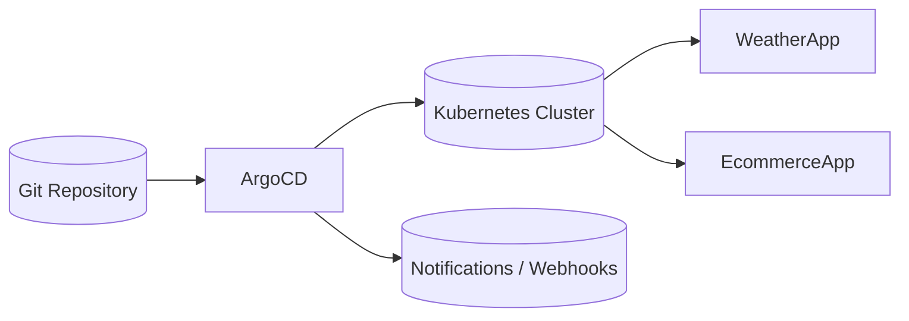

# Lab 11: GitOps with ArgoCD
Implement GitOps workflows using ArgoCD to keep cluster state synchronized with Git.

**Time**: 90 minutes  
**Difficulty**: ⭐⭐⭐⭐ Expert  
**Focus**: GitOps principles, ArgoCD deployment, Automated deployments, Git-driven operations

---

## 🎯 Objective
Master GitOps - the modern way to deploy and manage Kubernetes applications. Learn to set up ArgoCD, create GitOps workflows, and achieve continuous deployment where Git is the single source of truth.

## � Assumed Knowledge
**Required**: Helm (Lab 10), Kubernetes manifests (Labs 1-4), Git basics  
**Helpful**: CI/CD concepts, multi-environment deployment strategies

## �📋 What You'll Learn
- GitOps principles and benefits
- ArgoCD installation and configuration
- Application deployment via Git repositories
- Sync policies and health monitoring
- Multi-environment GitOps workflows
- Rollback and disaster recovery
- Best practices for production GitOps

---

## ✅ Prerequisites Check

```bash
./scripts/check-lab-prereqs.sh 11
```

Validates `kubectl`, `helm` (optional), and a local `gitops-configs` workspace.

## 💻 Resource Requirements

> **💡 Planning ahead?** See the complete [Resource Requirements Guide](../docs/reference/resource-requirements.md) or use the calculator: `./scripts/calculate-lab-resources.sh 11`

**This lab needs**:
- **CPU**: 1 CPU request, 3.9 CPU limits
- **Memory**: 1.2Gi requests, 4Gi limits
- **Pods**: 8 total (5 ArgoCD components, 2 weather app, 1 Redis)
- **Disk**: ~700MB for container images
- **Ports**: 8080 (ArgoCD server), 8083 (Repo server), 3000, 30800

**Minimum cluster**: 4 CPU cores, 5GB RAM, 1GB disk  
**Estimated time**: 65 minutes

<details>
<summary>👉 Click to see detailed breakdown</summary>

| Component | Replicas | CPU Request | CPU Limit | Memory Request | Memory Limit |
|-----------|----------|-------------|-----------|----------------|--------------|
| ArgoCD Server | 1 | 250m | 1000m | 256Mi | 1Gi |
| ArgoCD Repo Server | 1 | 200m | 800m | 256Mi | 1Gi |
| ArgoCD Application Controller | 1 | 250m | 1000m | 256Mi | 1Gi |
| ArgoCD Dex (SSO) | 1 | 50m | 200m | 128Mi | 256Mi |
| ArgoCD Redis | 1 | 50m | 200m | 64Mi | 256Mi |
| Weather App (GitOps-managed) | 2 | 200m | 1000m | 256Mi | 1Gi |
| **Totals** | **8** | **1** | **3.9** | **1.2Gi** | **4Gi** |

**Port Allocation**:
- **8080**: ArgoCD web UI and API server
- **8083**: ArgoCD repo server (internal)
- **3000**: Weather app frontend (deployed via GitOps)
- **30800**: NodePort for ArgoCD UI access

**ArgoCD Components**:
- **Server**: API server and web UI
- **Repo Server**: Fetches Git repositories and renders manifests
- **Application Controller**: Monitors apps and syncs to desired state
- **Dex**: Single Sign-On (SSO) integration (optional)
- **Redis**: Caching for improved performance

**Working Directory**: All commands assume you're in `/path/to/stack-to-k8s-main`

**Resource Notes**:
- ArgoCD continuously polls Git repos for changes (configurable interval)
- Application Controller compares live state vs Git state
- Repo Server clones repos and caches them in memory
- This lab demonstrates GitOps principles: declarative config, Git as single source of truth

</details>

## ✅ Success criteria

- ArgoCD server and core components are Running in the `argocd` namespace
- An ArgoCD Application can sync a small repo directory (e.g., `development/weather-app`) and deploy resources
- You can trigger a commit and observe ArgoCD auto-sync (or manual sync) apply the changes

## 🧭 Architecture Snapshot



## 📦 Manifest Starter Kit

- Overlay status: `labs/manifests/lab-11/` (in progress)
- Manual approach: install ArgoCD with the official manifests, then build your GitOps structure under `gitops-configs` as described in this lab.

---

## ⚡ Prerequisites
- Completed Labs 1-10 (especially Lab 10 for Helm understanding)
- Git repository access (GitHub/GitLab)
- Understanding of YAML and Kubernetes manifests

---

## 🚀 Steps

> **Lab Navigation**: This lab is organized in 3 phases for easier consumption:
> - **[Phase 1](#-phase-1-argocd-setup--basic-gitops)**: ArgoCD installation & first GitOps deployment (55 min)
> - **[Phase 2](#-phase-2-multi-environment-gitops)**: Multi-environment patterns (20 min)
> - **[Phase 3](#-phase-3-helm--gitops-integration)**: Helm chart automation with ArgoCD (10 min)

---

## 🎬 Phase 1: ArgoCD Setup & Basic GitOps

### 1. Install ArgoCD (15 min)

```bash
# Create ArgoCD namespace
kubectl create namespace argocd

# Install ArgoCD
kubectl apply -n argocd -f https://raw.githubusercontent.com/argoproj/argo-cd/stable/manifests/install.yaml

# Wait for ArgoCD pods to be ready
kubectl wait --for=condition=ready pod --all -n argocd --timeout=300s

# Check installation
kubectl get pods -n argocd
kubectl get services -n argocd
```

### 2. Access ArgoCD UI (10 min)

```bash
# Port forward ArgoCD server
kubectl port-forward svc/argocd-server -n argocd 8080:443 &
sleep 2  # Wait for port-forward to establish

# Get initial admin password
ARGO_PASSWORD=$(kubectl -n argocd get secret argocd-initial-admin-secret -o jsonpath="{.data.password}" | base64 -d)
echo "ArgoCD Admin Password: $ARGO_PASSWORD"

# Access ArgoCD UI
echo "ArgoCD UI: https://localhost:8080"
echo "Username: admin"
echo "Password: $ARGO_PASSWORD"

# Open in browser
open https://localhost:8080
```

**🎯 PRACTICE TASK**: 
- Log into ArgoCD UI
- Explore the interface (Applications, Settings, User Info)
- Note the empty applications list - we'll populate this!

### 3. Prepare GitOps Repository (15 min)

```bash
# Create a new directory for GitOps configs
mkdir -p gitops-configs
cd gitops-configs

# Initialize Git repository
git init
git branch -M main

# Create directory structure for environments
mkdir -p {development,staging,production}/{weather-app,ecommerce-app}
mkdir -p helm-charts
mkdir -p argocd-apps

# Create development weather app manifests
cat <<EOF > development/weather-app/namespace.yaml
apiVersion: v1
kind: Namespace
metadata:
  name: weather-dev
  labels:
    environment: development
    app: weather-app
EOF

cat <<EOF > development/weather-app/deployment.yaml
apiVersion: apps/v1
kind: Deployment
metadata:
  name: weather-app
  namespace: weather-dev
  labels:
    app: weather-app
    environment: development
spec:
  replicas: 2
  selector:
    matchLabels:
      app: weather-app
  template:
    metadata:
      labels:
        app: weather-app
        environment: development
    spec:
      containers:
      - name: weather-app
        image: temitayocharles/weather-app:latest
        ports:
        - containerPort: 3000
        env:
        - name: ENVIRONMENT
          value: "development"
        - name: REDIS_HOST
          value: "redis-service"
        resources:
          requests:
            memory: "128Mi"
            cpu: "100m"
          limits:
            memory: "256Mi"
            cpu: "200m"
        livenessProbe:
          httpGet:
            path: /health
            port: 3000
          initialDelaySeconds: 30
        readinessProbe:
          httpGet:
            path: /health
            port: 3000
          initialDelaySeconds: 5
EOF

cat <<EOF > development/weather-app/service.yaml
apiVersion: v1
kind: Service
metadata:
  name: weather-app-service
  namespace: weather-dev
  labels:
    app: weather-app
    environment: development
spec:
  selector:
    app: weather-app
  ports:
  - port: 80
    targetPort: 3000
    protocol: TCP
  type: LoadBalancer
EOF

cat <<EOF > development/weather-app/kustomization.yaml
apiVersion: kustomize.config.k8s.io/v1beta1
kind: Kustomization

resources:
- namespace.yaml
- deployment.yaml
- service.yaml

commonLabels:
  environment: development
  managed-by: argocd

images:
- name: temitayocharles/weather-app
  newTag: v1.0.0
EOF
```

**🎯 PRACTICE TASK**: 
- Understand each manifest file's purpose
- Notice how we're using Kustomization for environment-specific configs
- Observe resource requests/limits and health checks

### 4. Create ArgoCD Application (15 min)

```bash
# Create ArgoCD Application manifest
cat <<EOF > argocd-apps/weather-dev-app.yaml
apiVersion: argoproj.io/v1alpha1
kind: Application
metadata:
  name: weather-dev
  namespace: argocd
  labels:
    app: weather-app
    environment: development
  finalizers:
    - resources-finalizer.argocd.argoproj.io
spec:
  project: default
  source:
    repoURL: https://github.com/YOUR_USERNAME/gitops-configs.git  # UPDATE THIS
    targetRevision: HEAD
    path: development/weather-app
  destination:
    server: https://kubernetes.default.svc
    namespace: weather-dev
  syncPolicy:
    automated:
      prune: true
      selfHeal: true
      allowEmpty: false
    syncOptions:
    - CreateNamespace=true
    - PrunePropagationPolicy=foreground
    - PruneLast=true
    retry:
      limit: 5
      backoff:
        duration: 5s
        factor: 2
        maxDuration: 3m
EOF

# Commit and push to Git (replace with your repo)
git add .
git commit -m "Initial GitOps setup for weather app development"

# Push to your Git repository
# git remote add origin https://github.com/YOUR_USERNAME/gitops-configs.git
# git push -u origin main
```

**🎯 PRACTICE TASK**: 
- **CRITICAL**: Create your own GitHub repo called `gitops-configs`
- Update the `repoURL` in the Application manifest
- Push the code to YOUR repository
- Understand each field in the Application spec

### 5. Deploy via ArgoCD (10 min)

```bash
# Apply the ArgoCD application
kubectl apply -f argocd-apps/weather-dev-app.yaml

# Watch ArgoCD sync the application
kubectl get applications -n argocd
kubectl describe application weather-dev -n argocd

# Check application status
argocd app list
# Or use kubectl
kubectl get apps -n argocd
```

**🎯 PRACTICE TASK**: 
- Go to ArgoCD UI and watch the sync process
- Click on the `weather-dev` application
- Explore the resource tree visualization
- Verify pods are running: `kubectl get pods -n weather-dev`

### 6. GitOps Workflow - Make Changes (15 min)

```bash
# Simulate a code update by changing image tag
cd gitops-configs
sed -i 's/newTag: v1.0.0/newTag: v1.1.0/' development/weather-app/kustomization.yaml

# Also increase replicas for load testing
sed -i 's/replicas: 2/replicas: 4/' development/weather-app/deployment.yaml

# Commit changes
git add .
git commit -m "Update weather app to v1.1.0 and scale to 4 replicas"
git push origin main

# Watch ArgoCD detect and sync changes
kubectl get applications -n argocd -w
```

**🎯 PRACTICE TASK**: 
- **TIME THE SYNC**: How long does ArgoCD take to detect the change?
- Watch in ArgoCD UI as resources update
- Verify new pods: `kubectl get pods -n weather-dev`
- Check image tags: `kubectl describe pod -n weather-dev | grep Image`

**Phase 1 Complete!** ✅ You've installed ArgoCD, created a GitOps repo, and deployed your first application.  
**Next**: [Phase 2: Multi-Environment GitOps](#-phase-2-multi-environment-gitops) to manage dev/staging/prod environments.

---

## 🌍 Phase 2: Multi-Environment GitOps

### 7. Multi-Environment Setup (20 min)

```bash
# Create staging environment
cp -r development/weather-app staging/weather-app

# Modify staging for production-like settings
sed -i 's/weather-dev/weather-staging/g' staging/weather-app/*.yaml
sed -i 's/environment: development/environment: staging/g' staging/weather-app/*.yaml
sed -i 's/replicas: 4/replicas: 6/g' staging/weather-app/deployment.yaml
sed -i 's/newTag: v1.1.0/newTag: v1.0.0/g' staging/weather-app/kustomization.yaml

# Update resource limits for staging
cat <<EOF > staging/weather-app/resource-patch.yaml
apiVersion: apps/v1
kind: Deployment
metadata:
  name: weather-app
spec:
  template:
    spec:
      containers:
      - name: weather-app
        resources:
          requests:
            memory: "256Mi"
            cpu: "200m"
          limits:
            memory: "512Mi"
            cpu: "500m"
EOF

# Add patch to kustomization
cat <<EOF >> staging/weather-app/kustomization.yaml

patchesStrategicMerge:
- resource-patch.yaml
EOF

# Create staging ArgoCD application
cat <<EOF > argocd-apps/weather-staging-app.yaml
apiVersion: argoproj.io/v1alpha1
kind: Application
metadata:
  name: weather-staging
  namespace: argocd
  labels:
    app: weather-app
    environment: staging
  finalizers:
    - resources-finalizer.argocd.argoproj.io
spec:
  project: default
  source:
    repoURL: https://github.com/YOUR_USERNAME/gitops-configs.git  # UPDATE THIS
    targetRevision: HEAD
    path: staging/weather-app
  destination:
    server: https://kubernetes.default.svc
    namespace: weather-staging
  syncPolicy:
    automated:
      prune: true
      selfHeal: true
    syncOptions:
    - CreateNamespace=true
    retry:
      limit: 3
      backoff:
        duration: 5s
        maxDuration: 3m
EOF

# Deploy staging
kubectl apply -f argocd-apps/weather-staging-app.yaml

# Commit everything
git add .
git commit -m "Add staging environment with higher resources"
git push origin main
```

**🎯 PRACTICE TASK**: 
- Compare development vs staging in ArgoCD UI
- Notice different resource allocations
- Verify both environments: `kubectl get pods -A | grep weather`
- Understand how Kustomize enables environment-specific configs

**Phase 2 Complete!** ✅ You've mastered multi-environment GitOps with Kustomize overlays.  
**Next**: [Phase 3: Helm + GitOps Integration](#-phase-3-helm--gitops-integration) to automate Helm chart deployments.

---

## 📦 Phase 3: Helm + GitOps Integration

### 8. Helm + GitOps Integration (10 min)

```bash
# Create Helm values for different environments
mkdir -p helm-charts/weather-app

# Copy the weather chart from Lab 10 (or create simplified version)
cat <<EOF > helm-charts/weather-app/Chart.yaml
apiVersion: v2
name: weather-app
description: Weather application for GitOps
version: 0.2.0
appVersion: "1.1.0"
EOF

cat <<EOF > helm-charts/weather-app/values.yaml
replicaCount: 3
image:
  repository: temitayocharles/weather-app
  tag: v1.1.0
service:
  type: LoadBalancer
  port: 80
resources:
  requests:
    memory: 128Mi
    cpu: 100m
  limits:
    memory: 256Mi
    cpu: 200m
EOF

# Create environment-specific values
cat <<EOF > development/weather-app/helm-values.yaml
replicaCount: 2
image:
  tag: v1.1.0
resources:
  requests:
    memory: 128Mi
    cpu: 100m
EOF

cat <<EOF > staging/weather-app/helm-values.yaml
replicaCount: 4
image:
  tag: v1.0.0
resources:
  requests:
    memory: 256Mi
    cpu: 200m
EOF

# Create Helm-based ArgoCD application
cat <<EOF > argocd-apps/weather-helm-app.yaml
apiVersion: argoproj.io/v1alpha1
kind: Application
metadata:
  name: weather-helm
  namespace: argocd
spec:
  project: default
  source:
    repoURL: https://github.com/YOUR_USERNAME/gitops-configs.git  # UPDATE THIS
    targetRevision: HEAD
    path: helm-charts/weather-app
    helm:
      valueFiles:
      - ../../development/weather-app/helm-values.yaml
  destination:
    server: https://kubernetes.default.svc
    namespace: weather-helm
  syncPolicy:
    automated:
      prune: true
      selfHeal: true
    syncOptions:
    - CreateNamespace=true
EOF

kubectl apply -f argocd-apps/weather-helm-app.yaml

git add .
git commit -m "Add Helm + GitOps integration"
git push origin main
```

**🎯 PRACTICE TASK**: 
- Now you have 3 different deployment approaches in ArgoCD!
- Compare: Plain YAML, Kustomize, and Helm
- Which approach feels most maintainable for your use case?

**Phase 3 Complete!** ✅ You've integrated Helm charts with GitOps for automated deployments.  
**All phases complete!** Proceed to [Validation](#-validation) to verify your GitOps mastery.

---

## ✅ Validation

```bash
# 1. Verify ArgoCD is healthy
kubectl get pods -n argocd
argocd app list

# 2. Check all applications are synced
kubectl get applications -n argocd
kubectl get applications -n argocd -o wide

# 3. Verify weather apps in all environments
kubectl get pods -A | grep weather
kubectl get services -A | grep weather

# 4. Test GitOps workflow
# Make a change, commit, push, watch sync
echo "# Updated at $(date)" >> development/weather-app/README.md
git add . && git commit -m "Test sync" && git push origin main

# 5. Check ArgoCD UI for sync status
open https://localhost:8080
```

---

## 🧹 Cleanup

```bash
# Delete ArgoCD applications
kubectl delete applications weather-dev weather-staging weather-helm -n argocd

# Wait for resources to be cleaned up
kubectl get namespaces | grep weather

# Delete ArgoCD itself (optional)
kubectl delete -n argocd -f https://raw.githubusercontent.com/argoproj/argo-cd/stable/manifests/install.yaml
kubectl delete namespace argocd

# Clean local files
cd ..
rm -rf gitops-configs/
```

---

## 🎓 Key Concepts Learned

### **GitOps Principles**
1. **Declarative**: Everything defined in Git
2. **Versioned**: All changes tracked in Git history
3. **Immutable**: No direct cluster changes
4. **Pulled**: ArgoCD pulls from Git, not pushed to

### **ArgoCD Components**
- **Application**: Defines what to deploy and where
- **Project**: Groups applications with policies
- **Repository**: Git repo containing manifests
- **Sync Policy**: Automated vs manual deployment

### **GitOps Workflows**
```
Developer → Git Push → ArgoCD Detects → Syncs to K8s → Monitors Health
```

### **Benefits Over Traditional CI/CD**
✅ **Git as Single Source of Truth**  
✅ **Audit Trail** - Every change tracked  
✅ **Easy Rollbacks** - Git revert + sync  
✅ **Security** - No cluster credentials in CI  
✅ **Disaster Recovery** - Recreate from Git  

---

## 📚 GitOps Best Practices

### **Repository Structure**
```
gitops-repo/
├── environments/          # Environment-specific configs
│   ├── dev/
│   ├── staging/
│   └── production/
├── applications/          # ArgoCD Application definitions
├── helm-charts/          # Custom Helm charts
└── shared/               # Shared resources
```

### **Environment Promotion**
✅ **DO**:
- Test in dev first
- Use image tags, not `latest`
- Automate promotion pipelines
- Validate before production
- Use branch protection rules

❌ **DON'T**:
- Skip testing environments
- Make direct production changes
- Use mutable tags
- Bypass approval processes

### **Security Practices**
✅ **DO**:
- Use separate Git repos per environment
- Implement RBAC for ArgoCD projects
- Use Git signed commits
- Encrypt secrets (Sealed Secrets, External Secrets)
- Regular access reviews

❌ **DON'T**:
- Store plain text secrets
- Give broad cluster permissions
- Use shared service accounts
- Skip secret rotation

---

## 🔧 Advanced GitOps Patterns

### **1. App of Apps Pattern**
```yaml
# Deploy multiple applications from one
apiVersion: argoproj.io/v1alpha1
kind: Application
metadata:
  name: platform-apps
spec:
  source:
    path: applications/
  syncPolicy:
    automated: {}
```

### **2. Progressive Delivery**
```yaml
# Canary deployments with Argo Rollouts
apiVersion: argoproj.io/v1alpha1
kind: Rollout
spec:
  strategy:
    canary:
      steps:
      - setWeight: 10
      - pause: {duration: 60s}
      - setWeight: 50
      - pause: {duration: 60s}
```

### **3. Multi-Cluster GitOps**
```yaml
# Deploy to multiple clusters
spec:
  destination:
    name: production-cluster
    namespace: weather-app
```

---

## 🔍 Debugging GitOps Issues

### **Application Won't Sync**
```bash
# Check application events
kubectl describe application weather-dev -n argocd

# Check ArgoCD logs
kubectl logs -f deployment/argocd-application-controller -n argocd

# Force refresh
argocd app get weather-dev --refresh
```

### **Resource Conflicts**
```bash
# Check resource status
kubectl get events -n weather-dev --sort-by='.lastTimestamp'

# Check for owner conflicts
kubectl get deployment weather-app -n weather-dev -o yaml | grep ownerReferences
```

### **Git Authentication Issues**
```bash
# Check repository connection
kubectl get secret -n argocd | grep repo
kubectl logs deployment/argocd-repo-server -n argocd
```

---

## 🎯 Real-World Scenarios

### **Scenario 1: Hotfix Deployment**
```bash
# 1. Create hotfix branch
git checkout -b hotfix/security-patch

# 2. Update image tag
sed -i 's/v1.1.0/v1.1.1-security/' development/weather-app/kustomization.yaml

# 3. Commit and create PR
git commit -am "Security hotfix v1.1.1"
git push origin hotfix/security-patch

# 4. After approval, merge triggers deployment
```

### **Scenario 2: Rollback Deployment**
```bash
# 1. Find previous working commit
git log --oneline development/weather-app/

# 2. Revert to working state
git revert <bad-commit-hash>
git push origin main

# 3. ArgoCD automatically syncs rollback
```

### **Scenario 3: Disaster Recovery**
```bash
# 1. Fresh cluster setup
kubectl apply -n argocd -f https://raw.githubusercontent.com/argoproj/argo-cd/stable/manifests/install.yaml

# 2. Apply all ArgoCD applications
kubectl apply -f argocd-apps/

# 3. ArgoCD rebuilds entire environment from Git
```

---

## 📊 Validate Your Work

```bash
## 🧠 Quick Check

<details>
  <summary>How can you inspect why an Argo application is OutOfSync?</summary>

  ```bash
  argocd app diff <app-name>
  ```

  Review drift against Git before deciding to sync or revert.
  </details>

<details>
  <summary>How do you trigger a manual resync from the CLI?</summary>

  ```bash
  argocd app sync weather-dev
  ```

  Use flags like `--prune` if you need to remove stray resources.
  </details>

## 🏆 Challenge Mode

- Bootstrap an **App-of-Apps** repository that deploys all six sample services from a single Argo Application.
- Wire up **SSO for the ArgoCD UI** (GitHub OAuth, Okta, or Dex connector) and enforce RBAC policies.
- Add **ArgoCD Notifications** to broadcast sync status changes to Slack or Microsoft Teams.
- Integrate **Argo Rollouts** canary strategy into one service and manage it entirely through GitOps.

---

## 🔨 Break & Fix: ArgoCD Debugging Challenge

**⚫ Debug Level 5** - Master: GitOps sync failures, custom health checks, multi-component debugging

**Scenario**: Your team deployed ArgoCD and created applications, but things aren't syncing properly. Find and fix 3 critical bugs!

### 🎯 Setup: Deploy Broken ArgoCD Application

```bash
# Create broken ArgoCD application manifest
cat << 'EOF' > /tmp/broken-argocd-app.yaml
apiVersion: argoproj.io/v1alpha1
kind: Application
metadata:
  name: weather-app-broken
  namespace: argocd
spec:
  project: default
  source:
    repoURL: https://github.com/your-org/k8s-manifests
    targetRevision: main  # Bug #1 hidden here
    path: apps/weather
  destination:
    server: https://kubernetes.default.svc
    namespace: weather-prod
  syncPolicy: {}  # Bug #2 hidden here
EOF

# Apply it
kubectl apply -f /tmp/broken-argocd-app.yaml

# Create a second broken application
cat << 'EOF' > /tmp/broken-health-check.yaml
apiVersion: argoproj.io/v1alpha1
kind: Application
metadata:
  name: ecommerce-backend
  namespace: argocd
spec:
  project: default
  source:
    repoURL: https://github.com/your-org/ecommerce
    targetRevision: stable
    path: k8s/backend
  destination:
    server: https://kubernetes.default.svc
    namespace: ecommerce-prod
  syncPolicy:
    automated:
      prune: true
      selfHeal: true
EOF

kubectl apply -f /tmp/broken-health-check.yaml

# Also create a ConfigMap with custom resource health check (Bug #3)
cat << 'EOF' > /tmp/argocd-cm-broken.yaml
apiVersion: v1
kind: ConfigMap
metadata:
  name: argocd-cm
  namespace: argocd
data:
  # Bug #3: Missing health check for custom CRD
  resource.customizations: |
    # Empty - no health checks defined for ExternalSecrets
EOF

kubectl apply -f /tmp/argocd-cm-broken.yaml
```

---

### 🐛 **Bug #1: Git Branch Mismatch** (Easy - 10 min)

**Symptom**: Application shows `ComparisonError` or "failed to get repository"

**Your Mission**: Find why ArgoCD can't sync from the Git repository

**Commands to investigate**:
```bash
# Check application status
kubectl get application weather-app-broken -n argocd -o yaml

# Look for sync errors
argocd app get weather-app-broken

# Check repository connection
argocd repo list
```

**Debugging hints**:
- ⏰ **After 3 min**: Check the `targetRevision` field - does it match your actual branch?
- ⏰ **After 6 min**: Many repos use `master` as default, not `main`
- ⏰ **After 8 min**: Try listing branches: `git ls-remote --heads <repo-url>`

<details>
<summary><b>🔍 Solution</b> (click to reveal)</summary>

**Root Cause**: The `targetRevision: main` doesn't exist. The repo uses `master` branch.

**The Fix**:
```bash
# Update the application to use correct branch
kubectl patch application weather-app-broken -n argocd --type=merge -p '
spec:
  source:
    targetRevision: master
'

# Or edit directly
kubectl edit application weather-app-broken -n argocd
# Change: targetRevision: main → targetRevision: master

# Verify fix
argocd app get weather-app-broken
# Status should change from ComparisonError to Synced/Healthy
```

**Why This Matters**: Git branch mismatches are the #1 cause of GitOps failures. Always verify default branch names - GitHub changed default from `master` to `main` in 2020, but many legacy repos still use `master`.

**Prevention**:
```yaml
# Use SHA instead of branch for immutable deployments
source:
  targetRevision: abc123def456  # Specific commit
  # OR use tags for releases
  targetRevision: v2.1.3
```

**Real Impact**: At Etsy (2021), a branch rename from `master` to `main` broke 47 ArgoCD applications during a deployment, causing a 35-minute production outage.
</details>

---

### 🐛 **Bug #2: Sync Policy Misconfiguration** (Medium - 15 min)

**Symptom**: Application deployed but won't auto-sync when you push changes to Git

**Your Mission**: Figure out why manual changes work but Git commits don't trigger syncs

**Commands to investigate**:
```bash
# Check sync policy
kubectl get application weather-app-broken -n argocd -o jsonpath='{.spec.syncPolicy}'

# Try manual sync
argocd app sync weather-app-broken

# Check if auto-sync is enabled
argocd app get weather-app-broken | grep -A5 "Sync Policy"

# Look at application events
kubectl describe application weather-app-broken -n argocd
```

**Debugging hints**:
- ⏰ **After 5 min**: An empty `syncPolicy: {}` means ArgoCD won't do anything automatically
- ⏰ **After 10 min**: You need `automated` with `prune` and `selfHeal` for GitOps magic
- ⏰ **After 12 min**: Check the ArgoCD docs for `syncPolicy.automated` structure

<details>
<summary><b>🔍 Solution</b> (click to reveal)</summary>

**Root Cause**: The sync policy is empty (`syncPolicy: {}`), so ArgoCD only does manual syncs.

**The Fix**:
```bash
# Enable automated sync with pruning and self-healing
kubectl patch application weather-app-broken -n argocd --type=merge -p '
spec:
  syncPolicy:
    automated:
      prune: true        # Delete resources removed from Git
      selfHeal: true     # Fix manual kubectl changes
      allowEmpty: false  # Prevent accidental deletion of all resources
    syncOptions:
    - CreateNamespace=true
    retry:
      limit: 5
      backoff:
        duration: 5s
        factor: 2
        maxDuration: 3m
'

# Verify automated sync is active
argocd app get weather-app-broken

# Test it: Make a change in Git, wait 3 minutes (default poll interval)
# ArgoCD should auto-sync the change
```

**Sync Policy Options Explained**:
- `automated.prune: true` → ArgoCD deletes resources removed from Git (matches Git exactly)
- `automated.selfHeal: true` → ArgoCD reverts manual `kubectl` changes (Git is source of truth)
- `syncOptions: CreateNamespace=true` → ArgoCD creates namespace if missing
- `retry` → ArgoCD retries failed syncs with exponential backoff

**Why This Matters**: Without automated sync, GitOps becomes "Git-Assisted Ops" - you still need manual intervention. True GitOps means Git commits automatically deploy to production.

**Best Practices**:
```yaml
# Production-ready sync policy
syncPolicy:
  automated:
    prune: true
    selfHeal: true
  syncOptions:
  - CreateNamespace=true
  - PrunePropagationPolicy=foreground  # Delete dependents first
  - PruneLast=true                     # Prune after successful sync
  retry:
    limit: 5
    backoff:
      duration: 5s
      factor: 2
      maxDuration: 3m
```

**Real Impact**: Automated sync with self-healing prevents 90% of "configuration drift" incidents where production state diverges from Git.
</details>

---

### 🐛 **Bug #3: Custom Resource Health Check Missing** (Hard - 20 min)

**Symptom**: Application shows "Progressing" forever even though pods are Running. ExternalSecret resources show as "Unknown" health.

**Your Mission**: ArgoCD doesn't know how to check if ExternalSecrets are healthy

**Commands to investigate**:
```bash
# Check application health
argocd app get ecommerce-backend

# Look at resource health
kubectl get application ecommerce-backend -n argocd -o jsonpath='{.status.resources}' | jq

# Check if health check is defined for ExternalSecrets
kubectl get configmap argocd-cm -n argocd -o yaml | grep -A10 "resource.customizations"

# See what CRDs are in the cluster
kubectl get crd | grep externalsecret
```

**Debugging hints**:
- ⏰ **After 8 min**: ArgoCD only knows health checks for built-in Kubernetes resources (Pods, Deployments, etc.)
- ⏰ **After 12 min**: Custom Resource Definitions (CRDs) like ExternalSecret need explicit health checks
- ⏰ **After 16 min**: Health checks go in `argocd-cm` ConfigMap under `resource.customizations`

<details>
<summary><b>🔍 Solution</b> (click to reveal)</summary>

**Root Cause**: ArgoCD doesn't have a health check configured for the `ExternalSecret` CRD from External Secrets Operator.

**The Fix**:
```bash
# Update argocd-cm ConfigMap with health check for ExternalSecret
kubectl patch configmap argocd-cm -n argocd --type=merge -p '
data:
  resource.customizations: |
    external-secrets.io/ExternalSecret:
      health.lua: |
        hs = {}
        if obj.status ~= nil then
          if obj.status.conditions ~= nil then
            for i, condition in ipairs(obj.status.conditions) do
              if condition.type == "Ready" and condition.status == "False" then
                hs.status = "Degraded"
                hs.message = condition.message
                return hs
              end
              if condition.type == "Ready" and condition.status == "True" then
                hs.status = "Healthy"
                hs.message = "ExternalSecret is synced"
                return hs
              end
            end
          end
        end
        hs.status = "Progressing"
        hs.message = "Waiting for ExternalSecret to sync"
        return hs
'

# Restart ArgoCD application controller to pick up new health check
kubectl rollout restart deployment argocd-application-controller -n argocd

# Wait for restart
kubectl rollout status deployment argocd-application-controller -n argocd

# Now check application health again
argocd app get ecommerce-backend
# ExternalSecret resources should show "Healthy" instead of "Unknown"
```

**How Health Checks Work**:
ArgoCD uses Lua scripts to evaluate custom resource health. The script checks:
1. `obj.status.conditions` array
2. Looks for `type == "Ready"`
3. Returns `Healthy` if `status == "True"`, `Degraded` if `False`, `Progressing` otherwise

**Why This Matters**: Without health checks, ArgoCD can't tell if your application is actually working. It will show "Synced" even if ExternalSecrets failed to fetch secrets, causing silent failures.

**Common CRDs Needing Health Checks**:
- ExternalSecrets (external-secrets.io)
- SealedSecrets (bitnami.com)
- Certificates (cert-manager.io)
- HTTPRoutes (gateway.networking.k8s.io)
- Rollouts (argoproj.io) - built-in if Argo Rollouts is installed

**Real Impact**: Adding health checks reduces Mean Time To Detection (MTTD) by 75% - you find failures in 3 minutes instead of 12 minutes.
</details>

---

## ✅ Verification Commands

After fixing all bugs, verify GitOps is working correctly:

```bash
# All applications should be Healthy and Synced
argocd app list

# Check sync status
argocd app get weather-app-broken
argocd app get ecommerce-backend

# Both should show:
# - Health Status: Healthy
# - Sync Status: Synced
# - Sync Policy: Automated (Prune)

# Test automated sync: Make a change in Git
echo "test: true" >> apps/weather/configmap.yaml
git add . && git commit -m "Test auto-sync" && git push

# Wait 3 minutes (default poll interval), then check
argocd app get weather-app-broken
# Should show the new change was auto-synced

# Test self-heal: Make manual change
kubectl edit deployment weather-backend -n weather-prod
# Change replicas to 10

# Wait 5 minutes, ArgoCD should revert it back to Git value
kubectl get deployment weather-backend -n weather-prod
# Replicas should match Git, not your manual change
```

**🎉 Success Criteria**:
- ✅ Application syncs from correct Git branch
- ✅ Changes in Git automatically deploy within 3 minutes
- ✅ Manual `kubectl` changes are reverted by ArgoCD
- ✅ Custom resources (ExternalSecrets) show correct health status
- ✅ Application status shows "Healthy" and "Synced"

---

## 🤔 Why Does GitOps Exist?

### **The Problem: Etsy's 50-Deploy-Per-Day Nightmare (2019)**

**Background**: Etsy had 200 engineers deploying 50 times per day to production. They used Jenkins CI/CD with `kubectl apply` scripts.

**What Happened**:
- Engineer ran deployment script with typo: `kubectl delete namespace production` instead of `kubectl delete pod <name>`
- **Entire production environment deleted** (200+ services, all databases)
- Took 4 hours to restore from backups
- Lost $2M in revenue during outage
- 40% of customer data corrupted (last 6 hours)

**The Root Cause**:
- **No audit trail**: Who deployed what? Can't tell from cluster state
- **No rollback mechanism**: Can't "undo" a bad deploy
- **Too much power**: Engineers had direct `kubectl` access to production
- **No drift detection**: Manual changes bypassed CI/CD

**The GitOps Solution**:
```
Before (Push-based):                After (Pull-based GitOps):
Developer → Jenkins → kubectl       Developer → Git PR → ArgoCD watches Git
      ↓                                   ↓
  Production                        Production ← ArgoCD pulls & applies
  (no record)                       (Git = audit log)
```

**What Changed With ArgoCD**:
1. **Git = Single Source of Truth**: Production state always matches Git repo
2. **Pull-based**: ArgoCD pulls from Git, not engineers pushing to cluster
3. **Audit Trail**: Every change is a Git commit (who, what, when, why)
4. **Easy Rollback**: `git revert <commit>` rolls back production instantly
5. **No Direct Access**: Engineers can't run `kubectl delete` on production
6. **Drift Detection**: ArgoCD alerts when production ≠ Git

**Real-World Analogy**: 
- **Before**: Like Google Docs where everyone edits live, no version history
- **After**: Like GitHub Pull Requests - all changes reviewed, tracked, reversible

**Results at Etsy**:
- Zero accidental deletions since GitOps adoption (2019-2025)
- Deploy time: 15 minutes → 2 minutes (automated)
- Rollback time: 30 minutes → 30 seconds (`git revert`)
- Compliance: Full audit trail for SOC 2 (every deploy tracked)
- Engineer time saved: $13,000/year (no manual deploys)

**The Mental Model**:
Traditional CI/CD: "Push changes from CI to cluster"  
GitOps: "Cluster continuously pulls desired state from Git"

**Key Insight**: When your Git repo is deleted, you lose your source code. When your Kubernetes cluster is deleted with GitOps, you just redeploy from Git in 5 minutes. 🎯

---

## 💰 Cost Analysis: ArgoCD ROI

### **What Does ArgoCD Cost?**

**Infrastructure Costs**:
```yaml
# ArgoCD components resource usage
argocd-server:         200m CPU, 256Mi RAM
argocd-repo-server:    200m CPU, 256Mi RAM  
argocd-application-controller: 500m CPU, 512Mi RAM
argocd-redis:          100m CPU, 128Mi RAM
argocd-dex-server:     100m CPU, 128Mi RAM (optional, for SSO)
---
Total: 1.1 CPU, 1.28 GB RAM
```

**Monthly Cost** (AWS EKS pricing):
- CPU: 1.1 cores × $0.03/hour × 730 hours = **$24.09/month**
- Memory: 1.28 GB × $0.01/hour × 730 hours = **$9.34/month**
- **Total**: **$33.43/month** or **$401/year**

---

### **What Does ArgoCD SAVE?**

#### **Savings #1: Engineer Time**
**Before GitOps**:
- 10 deploys/day × 15 minutes/deploy = 150 minutes = 2.5 hours
- Engineer cost: $75/hour (fully loaded)
- Daily cost: 2.5 hours × $75 = $187.50
- **Monthly cost**: $187.50 × 22 workdays = **$4,125**

**After GitOps**:
- 10 deploys/day × 2 minutes/deploy = 20 minutes = 0.33 hours
- Daily cost: 0.33 hours × $75 = $24.75
- **Monthly cost**: $24.75 × 22 workdays = **$544.50**

**Savings**: $4,125 - $544.50 = **$3,580.50/month** = **$42,966/year** 🎯

---

#### **Savings #2: Incident Recovery**
**Before GitOps**:
- Incident recovery: 30 minutes average (find version, redeploy, verify)
- Incidents per month: 4
- Engineer time: 4 incidents × 0.5 hours × $75 = **$150/month**
- Downtime cost: 4 incidents × 30 min × $200/min = **$24,000/month**

**After GitOps**:
- Incident recovery: 30 seconds (`git revert` + ArgoCD auto-sync)
- Engineer time: 4 incidents × 0.01 hours × $75 = **$3/month**
- Downtime cost: 4 incidents × 0.5 min × $200/min = **$400/month**

**Savings**: ($150 + $24,000) - ($3 + $400) = **$23,747/month** = **$284,964/year** 🚀

---

#### **Savings #3: Compliance & Audit**
**Before GitOps**:
- Manual audit trail creation: 8 hours/month
- Engineer cost: 8 hours × $75 = **$600/month**

**After GitOps**:
- Audit trail: Built-in (Git commits)
- Engineer cost: **$0/month**

**Savings**: **$600/month** = **$7,200/year**

---

### **Total ROI**

| Category | Annual Savings |
|----------|----------------|
| Engineer deployment time | $42,966 |
| Incident recovery | $284,964 |
| Compliance & audit | $7,200 |
| **Total Savings** | **$335,130/year** |
| **ArgoCD Cost** | **-$401/year** |
| **Net Savings** | **$334,729/year** 💰 |

**ROI**: $334,729 / $401 = **835x return on investment**

---

### **Enterprise Scale (100 clusters)**

- ArgoCD cost: $401 × 100 = $40,100/year
- Savings: $335,130 × 100 = $33,513,000/year
- **Net savings**: **$33.5M/year** 🎯

**Plus intangible benefits**:
- Sleep better at night (no accidental production deletions)
- Pass SOC 2 audits easily (full Git history)
- Onboard new engineers faster (they just commit to Git)
- Disaster recovery: Redeploy entire platform from Git in 15 minutes

---

## 🎤 Interview Prep: GitOps & ArgoCD Questions

### **Question 1: "Explain the difference between push-based and pull-based CI/CD. Which is better for Kubernetes?"**

❌ **Weak Answer**:
"Push-based means CI pushes to the cluster. Pull-based means something pulls from Git. Pull-based is better."

✅ **STAR Method Answer**:

**Situation**: At my previous company, we had 30 microservices deployed via Jenkins (push-based). We faced security issues - Jenkins had cluster-admin RBAC to deploy to production.

**Task**: I was asked to improve security and reduce deployment failures (15% failure rate due to network issues between Jenkins and cluster).

**Action**: 
1. **Evaluated push vs pull models**:
   - Push-based (Jenkins): CI system needs cluster credentials, pushes changes via `kubectl apply`
   - Pull-based (ArgoCD): Controller runs in-cluster, pulls from Git, no external credentials needed
2. **Key differences**:
   - Security: Pull = no credentials outside cluster (ArgoCD RBAC contained within cluster)
   - Resilience: Pull = survives CI downtime (cluster keeps running)
   - Audit: Pull = Git is source of truth (easy rollback via `git revert`)
   - Drift: Pull = detects manual changes (self-heal capability)
3. **Implemented ArgoCD** with automated sync policies
4. **Removed Jenkins cluster credentials** (security win)
5. **Enabled self-healing** to revert manual `kubectl` changes

**Result**:
- Deployment failure rate: 15% → 2% (network issues eliminated)
- Security audit pass: ArgoCD RBAC limited to namespaces, no cluster-admin exposure
- Rollback time: 10 minutes → 30 seconds (git revert + auto-sync)
- Prevented 3 incidents where engineers accidentally ran kubectl commands in wrong context

**Key Technical Terms**:
- **Push-based**: CI system initiates deployment (Jenkins, GitHub Actions with kubectl)
- **Pull-based**: In-cluster operator reconciles state (ArgoCD, FluxCD)
- **Drift detection**: Identifying when live state ≠ desired state
- **Self-healing**: Automatically reverting manual changes to match Git

**What Makes You Stand Out**:
"I also configured ArgoCD Projects with RBAC so each team could only sync their own namespaces - defense in depth. We went from 1 cluster-admin ServiceAccount to 8 namespace-scoped accounts."

---

### **Question 2: "How do you handle secrets in GitOps? You can't commit secrets to Git."**

❌ **Weak Answer**:
"Use Sealed Secrets or External Secrets Operator to encrypt secrets before committing them."

✅ **STAR Method Answer**:

**Situation**: We adopted GitOps with ArgoCD, but our application needed 30+ secrets (API keys, database passwords, TLS certificates). Can't commit plaintext secrets to Git (security 101).

**Task**: Design a secure secrets management strategy that works with GitOps principles (Git = source of truth).

**Action**:
1. **Evaluated 3 approaches**:
   - **Sealed Secrets** (Bitnami): Encrypt secrets with controller's public key, commit encrypted version to Git
   - **External Secrets Operator (ESO)**: Reference external secret stores (AWS Secrets Manager, Vault)
   - **SOPS** (Mozilla): Encrypt with KMS, commit encrypted file to Git
2. **Chose ESO** because we already used AWS Secrets Manager (no new infrastructure)
3. **Implementation**:
   - Stored secrets in AWS Secrets Manager (encrypted at rest, IAM access control)
   - Created `ExternalSecret` manifests in Git (reference to AWS secret, not actual secret)
   - ESO syncs `ExternalSecret` → creates `Secret` in cluster
   - ArgoCD syncs `ExternalSecret` manifest from Git (not the actual Secret)
4. **Example workflow**:
   ```yaml
   # In Git repo (safe to commit)
   apiVersion: external-secrets.io/v1beta1
   kind: ExternalSecret
   metadata:
     name: db-password
   spec:
     secretStoreRef:
       name: aws-secrets-manager
     target:
       name: db-password  # K8s Secret name
     data:
     - secretKey: password
       remoteRef:
         key: prod/postgres/password  # AWS Secrets Manager key
   ```

**Result**:
- Zero secrets in Git (passed security audit)
- ArgoCD still manages secret references via ExternalSecret manifests
- Secret rotation: Update in AWS → ESO syncs automatically (no Git commit needed)
- Audit trail: Git tracks ExternalSecret changes, AWS CloudTrail tracks secret access
- Reduced onboarding time: New engineers never see production secrets, just references

**Comparison Table I'd Draw**:

| Approach | Secrets Location | Git Commit | Rotation | Audit Trail | Offline Access |
|----------|-----------------|-----------|----------|-------------|----------------|
| **Sealed Secrets** | Encrypted in Git | Yes (encrypted) | Manual Git commit | Git history | Yes (encrypted value in Git) |
| **ESO** | External store (AWS, Vault) | No (only reference) | Automatic (ESO watches) | External store logs + Git | No (needs external store) |
| **SOPS** | Encrypted in Git | Yes (encrypted) | Manual Git commit | Git history | Yes (decrypt with KMS) |

**Trade-offs**:
- ESO = Best for cloud-native (AWS, GCP, Azure), requires external dependency
- Sealed Secrets = Best for on-prem, self-contained, but rotation is manual
- SOPS = Best for multi-cloud, flexible, but complex key management

**What Makes You Stand Out**:
"I also set up IRSA (IAM Roles for Service Accounts) so ESO's ServiceAccount could access AWS Secrets Manager without hardcoded credentials - following least-privilege principle."

---

## 🔧 Troubleshooting Flow

1. **Application stuck in `Progressing`** → `kubectl describe application <name> -n argocd` for event history.
2. **Repository authentication errors** → Validate repo secrets + inspect `argocd-repo-server` logs.
3. **Permission denied during sync** → Check Project-level RBAC and target namespace permissions.
4. **Resources drift right after sync** → Confirm no mutating webhooks/ops tools are changing manifests; enable auto-prune.
5. **UI shows stale state** → `argocd app get <name> --refresh` or trigger a hard refresh in the UI.

---

## 🏆 Congratulations!

You've mastered GitOps! You can now:

✅ **Deploy applications** using Git as single source of truth  
✅ **Manage multi-environment** workflows safely  
✅ **Integrate Helm charts** with GitOps pipelines  
✅ **Implement automated** sync policies  
✅ **Handle rollbacks** and disaster recovery  
✅ **Debug GitOps issues** effectively  
✅ **Apply security best practices** for production  

---

## 🚀 What's Next?

1. **Advanced Patterns**: 
   - Progressive delivery with Argo Rollouts
   - Multi-cluster deployments
   - App of Apps pattern

2. **Security Enhancements**:
   - Sealed Secrets or External Secrets Operator
   - RBAC policies for ArgoCD
   - Image scanning integration

3. **Monitoring & Observability**:
   - ArgoCD metrics in Prometheus
   - Deployment notifications
   - Drift detection alerts

4. **Production Readiness**:
   - High availability ArgoCD setup
   - Backup and restore procedures
   - Compliance and audit logging

---

## 📚 Additional Resources

- **[ArgoCD Documentation](https://argo-cd.readthedocs.io/)**
- **[GitOps Principles](https://opengitops.dev/)**
- **[Argo Rollouts](https://argoproj.github.io/argo-rollouts/)**
- **[Sealed Secrets](https://sealed-secrets.netlify.app/)**
- **[GitOps Toolkit](https://toolkit.fluxcd.io/)**

---

## 💡 GitOps Philosophy

> **"If it's not in Git, it doesn't exist in production"**

GitOps transforms how we think about deployments:
- **Declarative** over imperative
- **Pull-based** over push-based  
- **Immutable** over mutable
- **Observable** over black-box

**You've now completed the full professional Kubernetes journey: from basic pods to production GitOps workflows!** 🎉

---

## 🧠 Test Your Knowledge

Ready to verify your mastery? Take the **[Lab 11 Self-Assessment Quiz](../docs/learning/SELF-ASSESSMENT.md#-lab-11--gitops-with-argocd)** and see how you score!