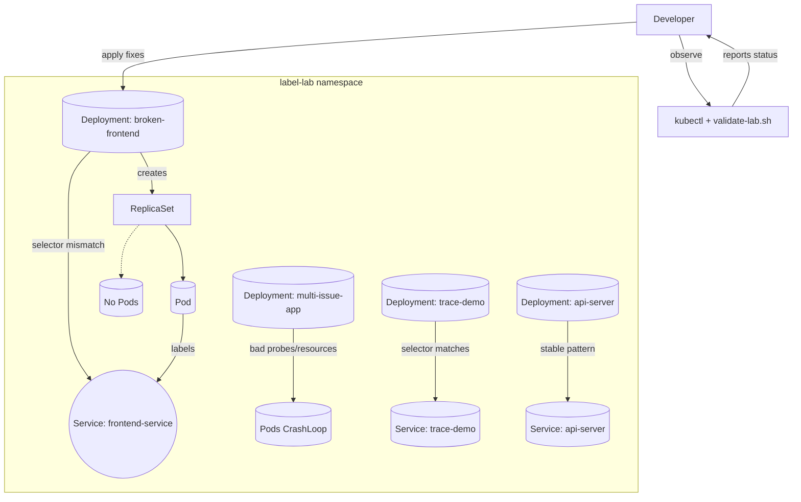

# 🎯 Lab 12: Kubernetes Fundamentals Deep Dive
A focused, hands-on deep-dive into labels, selectors, and systematic troubleshooting.
**Difficulty**: ⭐⭐⭐ (Intermediate-Advanced)  
**Time**: 60-75 minutes  
**Prerequisites**: Complete Labs 1-3

## ✅ Success criteria
- Identify and fix label/selector mismatches so Deployments reach Ready state.
- Ensure Services expose endpoints for matching pods after fixes.
- Validate with: ./scripts/validate-lab.sh 12

## 🎯 What You'll Learn

Master the **core Kubernetes concepts** that cause real production issues. This lab focuses on the fundamentals that trip up even experienced developers.

### Skills You'll Gain:
- **Labels & Selectors mastery** - The #1 source of Kubernetes failures
- **Resource relationships** - How pods, services, deployments connect
- **Troubleshooting workflows** - Systematic debugging approaches
- **Production best practices** - Avoid common mistakes
- **Advanced kubectl** - Power user techniques

## 🧭 Architecture Snapshot



> Apply the pre-built manifests with `kubectl apply -k labs/manifests/lab-12` to
> recreate each scenario using images tagged `:latest`.

---

## 🏷️ Part 1: Labels & Selectors Mastery (20 min)

### The Problem
**90% of Kubernetes failures** are caused by label/selector mismatches. Let's master this!

### Step 1: Create Test Environment
```bash
# Create namespace (safer: avoid mutating the current kubectl context)
# This pattern creates the namespace and applies resources with an explicit -n.
prev_ns=$(kubectl config view --minify --output 'jsonpath={..namespace}')
if [ -z "$prev_ns" ]; then prev_ns=default; fi

# Create the lab namespace idempotently
kubectl create namespace label-lab --dry-run=client -o yaml | kubectl apply -f -

# Deploy an app with INTENTIONAL label problems (apply explicitly to the lab ns)
cat > broken-app.yaml << 'EOF'
apiVersion: apps/v1
kind: Deployment
metadata:
  name: broken-frontend
  namespace: label-lab
  labels:
    app: frontend
    version: v1.0.0
    component: web
spec:
  replicas: 3
  selector:
    matchLabels:
      app: frontend-service  # ❌ WRONG! Should match pod labels
  template:
    metadata:
      labels:
        app: frontend          # Different from selector!
        version: v1.0.0
        component: web
        tier: frontend
    spec:
      containers:
      - name: web
        image: nginx:latest
        ports:
        - containerPort: 80
---
apiVersion: v1
kind: Service
metadata:
  name: frontend-service
  namespace: label-lab
  labels:
    app: frontend
spec:
  selector:
    app: frontend-app  # ❌ WRONG! Should match pod labels
    tier: frontend
  ports:
  - port: 80
    targetPort: 80
  type: ClusterIP
EOF

kubectl apply -f broken-app.yaml
```

### Step 2: Diagnose Label Problems
```bash
# Check deployment status
kubectl get deployment -n label-lab
kubectl describe deployment broken-frontend -n label-lab

# Check replicaset creation
kubectl get replicaset -n label-lab
kubectl describe replicaset -n label-lab

# Check if pods are created
kubectl get pods -n label-lab

# Check service endpoints
kubectl get endpoints -n label-lab
kubectl describe service frontend-service -n label-lab
```

**Questions to explore**:
- Why is the deployment showing 0/3 ready?
- Why are no pods created?
- Why does the service have no endpoints?

### Step 3: Fix Label Mismatches
```bash
# Fix the deployment
cat > fixed-app.yaml << 'EOF'
apiVersion: apps/v1
kind: Deployment
metadata:
  name: frontend
  namespace: label-lab
  labels:
    app: frontend
    version: v1.0.0
    component: web
spec:
  replicas: 3
  selector:
    matchLabels:
      app: frontend      # ✅ MATCHES pod labels
      component: web
  template:
    metadata:
      labels:
        app: frontend    # ✅ MATCHES selector
        version: v1.0.0
        component: web
        tier: frontend
    spec:
      containers:
      - name: web
        image: nginx:latest
        ports:
        - containerPort: 80
---
apiVersion: v1
kind: Service
metadata:
  name: frontend-service
  namespace: label-lab
  labels:
    app: frontend
spec:
  selector:
    app: frontend      # ✅ MATCHES pod labels
    component: web
  ports:
  - port: 80
    targetPort: 80
  type: ClusterIP
EOF

# Delete broken resources
kubectl delete -f broken-app.yaml

# Apply fixed version
kubectl apply -f fixed-app.yaml

# Verify everything works
kubectl get all -n label-lab
kubectl get endpoints -n label-lab
```

### Step 4: Advanced Label Operations
```bash
# View all labels
kubectl get pods -n label-lab --show-labels

# Filter by labels
kubectl get pods -n label-lab -l app=frontend
kubectl get pods -n label-lab -l tier=frontend
kubectl get pods -n label-lab -l 'version in (v1.0.0,v2.0.0)'

# Add labels to existing resources
kubectl label pods -n label-lab -l app=frontend environment=production
kubectl label pods -n label-lab -l app=frontend 'owner=team-alpha'

# Remove labels
kubectl label pods -n label-lab -l app=frontend environment-

# Update labels
kubectl label pods -n label-lab -l app=frontend version=v1.1.0 --overwrite

# Label nodes (be careful!)
kubectl get nodes --show-labels
kubectl label nodes rancher-desktop disk=ssd  # Example – adjust to your node name (e.g., rancher-desktop, kind-worker)
```

### Step 5: Label Best Practices Demo
```bash
# Create app with proper labeling strategy
cat > best-practice-labels.yaml << 'EOF'
apiVersion: apps/v1
kind: Deployment
metadata:
  name: ecommerce-api
  namespace: label-lab
  labels:
    # Kubernetes recommended labels
    app.kubernetes.io/name: ecommerce
    app.kubernetes.io/instance: ecommerce-prod
    app.kubernetes.io/version: "1.2.3"
    app.kubernetes.io/component: api
    app.kubernetes.io/part-of: ecommerce-platform
    app.kubernetes.io/managed-by: kubectl
    # Custom organizational labels
    team: platform
    environment: production
    cost-center: engineering
spec:
  replicas: 2
  selector:
    matchLabels:
      app.kubernetes.io/name: ecommerce
      app.kubernetes.io/component: api
  template:
    metadata:
      labels:
        # Same as selector (required)
        app.kubernetes.io/name: ecommerce
        app.kubernetes.io/component: api
        # Additional labels for monitoring/debugging
        app.kubernetes.io/instance: ecommerce-prod
        app.kubernetes.io/version: "1.2.3"
        app.kubernetes.io/part-of: ecommerce-platform
        team: platform
        environment: production
    spec:
      containers:
      - name: api
        image: nginx:latest
        ports:
        - containerPort: 80
        env:
        - name: APP_VERSION
          value: "1.2.3"
---
apiVersion: v1
kind: Service
metadata:
  name: ecommerce-api-service
  namespace: label-lab
  labels:
    app.kubernetes.io/name: ecommerce
    app.kubernetes.io/component: api
spec:
  selector:
    app.kubernetes.io/name: ecommerce
    app.kubernetes.io/component: api
  ports:
  - port: 80
    targetPort: 80
EOF

kubectl apply -f best-practice-labels.yaml

# Query using standard labels
kubectl get all -n label-lab -l app.kubernetes.io/name=ecommerce
kubectl get all -n label-lab -l app.kubernetes.io/part-of=ecommerce-platform
kubectl get pods -n label-lab -l environment=production
```

---

## 🔗 Part 2: Resource Relationships Deep Dive (15 min)

### Step 1: Understanding the Ownership Chain
```bash
# Create a deployment and trace relationships
kubectl create deployment trace-demo --image=nginx:latest --replicas=2 -n label-lab

# Get the full resource chain
echo "=== DEPLOYMENT ==="
kubectl get deployment trace-demo -n label-lab -o yaml | grep -A 10 -B 5 "labels\|selector"

echo "=== REPLICASET ==="
kubectl get replicaset -n label-lab -l app=trace-demo -o yaml | grep -A 10 -B 5 "labels\|selector\|owner"

echo "=== PODS ==="
kubectl get pods -n label-lab -l app=trace-demo -o yaml | grep -A 10 -B 5 "labels\|ownerReferences"

# Show the tree relationship
kubectl get all -n label-lab -l app=trace-demo
```

### Step 2: Trace Service to Pod Connection
```bash
# Create service
kubectl expose deployment trace-demo --port=80 --target-port=80 -n label-lab

# Trace the connection
echo "=== SERVICE SELECTOR ==="
kubectl get service trace-demo -n label-lab -o yaml | grep -A 5 selector

echo "=== POD LABELS ==="
kubectl get pods -n label-lab -l app=trace-demo --show-labels

echo "=== SERVICE ENDPOINTS ==="
kubectl get endpoints trace-demo -n label-lab -o yaml

# Test the connection
kubectl run debug-pod --image=curlimages/curl:latest --rm -it --restart=Never -n label-lab \
  -- curl -s http://trace-demo.label-lab.svc.cluster.local
```

### Step 3: Understand Orphaned Resources
```bash
# Create orphaned resources scenario
kubectl scale deployment trace-demo --replicas=0 -n label-lab

# Check what remains
kubectl get all -n label-lab -l app=trace-demo

# Delete deployment but leave service
kubectl delete deployment trace-demo -n label-lab

# Check what's left
kubectl get all -n label-lab -l app=trace-demo
kubectl get endpoints trace-demo -n label-lab

# Clean up orphaned service
kubectl delete service trace-demo -n label-lab
```

---

## 🔍 Part 3: Systematic Troubleshooting (15 min)

### Step 1: Create a Complex Broken Scenario
```bash
cat > complex-broken.yaml << 'EOF'
apiVersion: apps/v1
kind: Deployment
metadata:
  name: multi-issue-app
  namespace: label-lab
spec:
  replicas: 3
  selector:
    matchLabels:
      app: multi-issue
  template:
    metadata:
      labels:
        app: multi-issue
        version: v1
    spec:
      containers:
      - name: web
        image: nginx:latest
        ports:
        - containerPort: 8080  # ❌ Wrong port
        livenessProbe:
          httpGet:
            path: /health      # ❌ Path doesn't exist
            port: 80
          initialDelaySeconds: 5
        readinessProbe:
          httpGet:
            path: /ready       # ❌ Path doesn't exist
            port: 80
          initialDelaySeconds: 5
        resources:
          requests:
            memory: "2Gi"      # ❌ Request too large for most clusters
            cpu: "1000m"
          limits:
            memory: "3Gi"      # ❌ Still oversized; stresses scheduling
            cpu: "2000m"
---
apiVersion: v1
kind: Service
metadata:
  name: multi-issue-service
  namespace: label-lab
spec:
  selector:
    app: multi-issue-wrong  # ❌ Wrong selector
  ports:
  - port: 80
    targetPort: 8080
  type: ClusterIP
EOF

kubectl apply -f complex-broken.yaml
```

### Step 2: Systematic Debugging Workflow
```bash
# Step 1: Overall cluster view
kubectl get all -n label-lab

# Step 2: Check deployment
kubectl describe deployment multi-issue-app -n label-lab

# Step 3: Check replicaset
kubectl get replicaset -n label-lab -l app=multi-issue
kubectl describe replicaset -n label-lab -l app=multi-issue

# Step 4: Check pod status
kubectl get pods -n label-lab -l app=multi-issue
kubectl describe pods -n label-lab -l app=multi-issue

# Step 5: Check pod logs
kubectl logs -n label-lab -l app=multi-issue

# Step 6: Check service
kubectl describe service multi-issue-service -n label-lab
kubectl get endpoints multi-issue-service -n label-lab

# Step 7: Check events
kubectl get events -n label-lab --sort-by='.lastTimestamp'

# Step 8: Resource usage
kubectl top pods -n label-lab
```

### Step 3: Fix Issues Systematically
```bash
cat > fixed-complex.yaml << 'EOF'
apiVersion: apps/v1
kind: Deployment
metadata:
  name: multi-issue-app
  namespace: label-lab
spec:
  replicas: 3
  selector:
    matchLabels:
      app: multi-issue
  template:
    metadata:
      labels:
        app: multi-issue
        version: v1
    spec:
      containers:
      - name: web
        image: nginx:latest
        ports:
        - containerPort: 80     # ✅ Fixed port
        resources:
          requests:
            memory: "64Mi"      # ✅ Reasonable request
            cpu: "50m"
          limits:
            memory: "128Mi"     # ✅ Limit > Request
            cpu: "100m"
---
apiVersion: v1
kind: Service
metadata:
  name: multi-issue-service
  namespace: label-lab
spec:
  selector:
    app: multi-issue           # ✅ Fixed selector
  ports:
  - port: 80
    targetPort: 80             # ✅ Fixed port
  type: ClusterIP
EOF

kubectl apply -f fixed-complex.yaml

# Verify fix
kubectl get all -n label-lab -l app=multi-issue
kubectl get endpoints multi-issue-service -n label-lab
```

---

## 🧰 Part 4: Advanced kubectl Techniques (10 min)

### Step 1: Powerful Queries
```bash
# Get all resources across namespaces
kubectl get all --all-namespaces

# Custom columns
kubectl get pods -n label-lab -o custom-columns=\
"NAME:.metadata.name,STATUS:.status.phase,NODE:.spec.nodeName,AGE:.metadata.creationTimestamp"

# JSON queries with jq
kubectl get pods -n label-lab -o json | jq '.items[] | {name: .metadata.name, labels: .metadata.labels}'

# Find pods by resource usage
kubectl top pods -n label-lab --sort-by=memory
kubectl top pods -n label-lab --sort-by=cpu

# Check which pods use specific images
kubectl get pods -n label-lab -o json | jq -r '.items[] | select(.spec.containers[].image | contains("nginx")) | .metadata.name'
```

### Step 2: Bulk Operations
```bash
# Label all pods in namespace
kubectl label pods --all -n label-lab team=platform --overwrite

# Delete all pods with label
kubectl delete pods -n label-lab -l version=v1

# Scale all deployments
kubectl get deployments -n label-lab -o name | xargs -I {} kubectl scale {} --replicas=1

# Get logs from all pods
kubectl logs -n label-lab -l app=multi-issue --tail=10

# Port-forward to service
kubectl port-forward service/multi-issue-service -n label-lab 8080:80 &
curl localhost:8080
kill %1  # Stop port-forward
```

### Step 3: Resource Inspection
```bash
# Explain resource fields
kubectl explain pod.spec.containers.resources
kubectl explain service.spec

# View final YAML after defaults
kubectl get deployment multi-issue-app -n label-lab -o yaml

# Compare resources
kubectl diff -f fixed-complex.yaml

# Dry run changes
kubectl apply -f fixed-complex.yaml --dry-run=client
```

---

## 🎯 Part 5: Production Patterns (15 min)

### Step 1: Recommended Labels Pattern
```bash
cat > production-pattern.yaml << 'EOF'
apiVersion: apps/v1
kind: Deployment
metadata:
  name: api-server
  namespace: label-lab
  labels:
    # Required Kubernetes labels
    app.kubernetes.io/name: api-server
    app.kubernetes.io/instance: api-server-prod
    app.kubernetes.io/version: "2.1.0"
    app.kubernetes.io/component: backend
    app.kubernetes.io/part-of: ecommerce
    app.kubernetes.io/managed-by: helm
    # Organizational labels
    environment: production
    team: backend
    cost-center: engineering
    criticality: high
spec:
  replicas: 3
  selector:
    matchLabels:
      app.kubernetes.io/name: api-server
      app.kubernetes.io/instance: api-server-prod
  template:
    metadata:
      labels:
        app.kubernetes.io/name: api-server
        app.kubernetes.io/instance: api-server-prod
        app.kubernetes.io/version: "2.1.0"
        app.kubernetes.io/component: backend
        app.kubernetes.io/part-of: ecommerce
        environment: production
        team: backend
        # Pod-specific labels
        deployment-id: "20241005-1200"
    spec:
      containers:
      - name: api
        image: nginx:latest
        ports:
        - containerPort: 80
        # Proper resource limits
        resources:
          requests:
            memory: "128Mi"
            cpu: "100m"
          limits:
            memory: "256Mi"
            cpu: "200m"
        # Health checks
        livenessProbe:
          httpGet:
            path: /
            port: 80
          initialDelaySeconds: 30
          periodSeconds: 10
        readinessProbe:
          httpGet:
            path: /
            port: 80
          initialDelaySeconds: 5
          periodSeconds: 5
---
apiVersion: v1
kind: Service
metadata:
  name: api-server
  namespace: label-lab
  labels:
    app.kubernetes.io/name: api-server
    app.kubernetes.io/component: backend
spec:
  selector:
    app.kubernetes.io/name: api-server
    app.kubernetes.io/instance: api-server-prod
  ports:
  - name: http
    port: 80
    targetPort: 80
  type: ClusterIP
EOF

kubectl apply -f production-pattern.yaml
```

### Step 2: Label-Based Operations
```bash
# Find all resources for an application
kubectl get all -n label-lab -l app.kubernetes.io/part-of=ecommerce

# Find resources by team
kubectl get all --all-namespaces -l team=backend

# Find high-criticality resources
kubectl get all --all-namespaces -l criticality=high

# Rolling update by changing labels
kubectl patch deployment api-server -n label-lab -p \
  '{"spec":{"template":{"metadata":{"labels":{"deployment-id":"20241005-1300"}}}}}'

# Monitor rollout
kubectl rollout status deployment api-server -n label-lab
```

### Step 3: Troubleshooting Commands Reference
```bash
# Create debugging cheat sheet
cat > debug-commands.md << 'EOF'
# Essential Debugging Commands

## Resource Status
kubectl get all -n <namespace>
kubectl describe <resource> <name> -n <namespace>
kubectl get events -n <namespace> --sort-by='.lastTimestamp'

## Pod Debugging
kubectl logs <pod> -n <namespace> -c <container>
kubectl logs <pod> -n <namespace> --previous
kubectl exec -it <pod> -n <namespace> -- /bin/sh

## Label Debugging
kubectl get pods --show-labels -n <namespace>
kubectl get all -l <label-selector> -n <namespace>
kubectl describe service <service> -n <namespace>
kubectl get endpoints <service> -n <namespace>

## Network Debugging
kubectl run debug --image=nicolaka/netshoot:latest --rm -it -- /bin/bash
kubectl port-forward pod/<pod> <local-port>:<pod-port>
kubectl port-forward service/<service> <local-port>:<service-port>

## Resource Usage
kubectl top nodes
kubectl top pods -n <namespace>
kubectl describe node <node-name>
EOF

cat debug-commands.md
```

---

## 🧪 Part 6: Validation & Challenge (10 min)

### Step 1: Label Challenge

Review `labs/manifests/lab-12/scenarios/label-challenge.yaml`. It deploys
`challenge-frontend` and `challenge-backend` with **intentionally broken service
selectors**. Your job is to align the labels so traffic flows end-to-end.

```bash
# Apply the challenge scenario (installs Deployments + Services)
kubectl apply -f labs/manifests/lab-12/scenarios/label-challenge.yaml

# Inspect the broken selectors
kubectl describe service challenge-frontend-svc -n label-lab | grep Selector
kubectl get pods -n label-lab -l app=challenge-frontend --show-labels

# Patch the services once you've identified the correct labels
kubectl patch service challenge-frontend-svc -n label-lab \
  --type merge -p '{"spec":{"selector":{"app":"challenge-frontend","tier":"web"}}}'
kubectl patch service challenge-backend-svc -n label-lab \
  --type merge -p '{"spec":{"selector":{"app":"challenge-backend","tier":"api"}}}'

# (Optional) run kubectl edit to practice manual fixes instead of patch
```

Validate connectivity when you're done:

```bash
kubectl run test-pod --image=curlimages/curl:latest --rm -it --restart=Never -n label-lab \
  -- curl -s http://challenge-frontend-svc.label-lab.svc.cluster.local

kubectl run test-pod --image=curlimages/curl:latest --rm -it --restart=Never -n label-lab \
  -- curl -s http://challenge-backend-svc.label-lab.svc.cluster.local
```

### Step 2: Troubleshooting Exercise
```bash
# Debug this intentionally broken deployment
kubectl create deployment mystery-app --image=nginx:latest --replicas=3 -n label-lab
kubectl scale deployment mystery-app --replicas=0 -n label-lab
kubectl scale deployment mystery-app --replicas=3 -n label-lab

# Something is wrong - figure out what!
kubectl get all -n label-lab -l app=mystery-app

# Use systematic debugging approach:
# 1. Check deployment
# 2. Check replicaset  
# 3. Check pods
# 4. Check events
# 5. Check logs
```

---

## 🎓 Lab Completion Checklist

- [ ] Fixed label/selector mismatches
- [ ] Traced resource ownership relationships
- [ ] Applied systematic troubleshooting workflow
- [ ] Used advanced kubectl commands effectively
- [ ] Implemented production labeling patterns
- [ ] Completed label connectivity challenge
- [ ] Debugged mystery application issue

## 📊 Validate Your Work

```bash
./scripts/validate-lab.sh 12
```

- Confirms the `label-lab` namespace exists and the intentionally broken
  `broken-frontend` deployment/service were applied.
- Checks the corrected `frontend` deployment reaches a Ready state after you fix
  labels and selectors.
- Ensures `frontend-service` exposes ready endpoints once labels line up.

> If validation fails, run `./scripts/check-lab-prereqs.sh 12` to verify your
> CLI prerequisites and confirm you applied the manifests from
> `labs/manifests/lab-12`.

## 🧠 Quick Check

<details>
  <summary>How do you trace which pods back a Service quickly?</summary>

  ```bash
  kubectl get svc frontend-service -n label-lab -o jsonpath='{.spec.selector}'
  kubectl get pods -n label-lab -l app=frontend,component=web --show-labels
  ```

  Inspect the selector and list pods with matching labels to confirm endpoint
  membership.
  </details>

<details>
  <summary>Which command shows whether a Deployment spawned its ReplicaSet?</summary>

  ```bash
  kubectl describe deployment broken-frontend -n label-lab | grep -i replica -A5
  ```

  The describe output highlights Ownership references and recent events when a
  selector mismatch blocks ReplicaSet creation.
  </details>

## 🏆 Challenge Mode

- Patch the `broken-frontend` manifest to add recommended
  `app.kubernetes.io/*` labels, then re-run validation to ensure nothing broke.
- Extend the overlay with a `backend` deployment + service and wire a Network
  Policy that only allows traffic from the frontend pods.
- Introduce a canary rollout by creating a second Deployment with `version=v2`
  and use label selectors to shift traffic gradually.

## 🔧 Troubleshooting Flow

1. **Start with namespaces** → `kubectl get ns | grep label-lab` to ensure the
   lab overlay was applied.
2. **Check deployments** → `kubectl get deploy -n label-lab` then `kubectl
   describe` the failing workload for selector warnings.
3. **Inspect endpoints** → `kubectl get endpoints frontend-service -n label-lab`
   confirms whether pods are backing the service.
4. **Review events** → `kubectl get events -n label-lab --sort-by=.lastTimestamp`
   surfaces probe failures, scheduling issues, or admission denials.
5. **Look at logs** → `kubectl logs -n label-lab -l app=multi-issue` to catch
   crash loops or readiness probe errors.

---

## 💡 Key Takeaways

✅ **Labels are everything** - 90% of K8s issues are label problems  
✅ **Systematic debugging** - Follow the ownership chain  
✅ **Standard labels** - Use `app.kubernetes.io/*` conventions  
✅ **kubectl mastery** - Know your debugging commands  
✅ **Resource relationships** - Understand how everything connects  

### Common Production Mistakes to Avoid:
1. **Selector mismatch** - `selector.matchLabels` must match `template.metadata.labels`
2. **Service selection** - Service selector must match pod labels
3. **Inconsistent labeling** - Use standard label conventions
4. **Resource limits** - Always set requests and limits
5. **Health checks** - Always implement liveness/readiness probes

---

**Time Spent**: ⏱️ ~75 minutes  
**Difficulty**: ⭐⭐⭐ Intermediate-Advanced  
**Next Lab**: Continue with specialized topics!

---

## 🚀 What's Next?

1. **Apply these patterns** to your own applications
2. **Practice debugging** on broken scenarios
3. **Memorize debug commands** for efficiency
4. **Use standard labels** in all deployments
5. **Teach others** these troubleshooting techniques

**Remember**: Mastering labels and systematic debugging will solve 90% of your Kubernetes production issues!