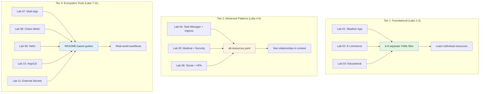

# Architecture Decisions - Manifest Overlays

This document explains the architectural decisions made when creating the Kubernetes manifest overlays for Labs 1-12.

## Table of Contents
1. [Labs 7-11: Why No Kustomize Overlays?](#labs-7-11-why-no-kustomize-overlays)
2. [Labs 4-6: Why Consolidated Files?](#labs-4-6-why-consolidated-files)
3. [Summary: Three-Tier Approach](#summary-three-tier-approach)

---

## Labs 7-11: Why No Kustomize Overlays?

### Decision: Documentation-Only Approach

Labs 7-11 do NOT have traditional kustomize overlays with separate YAML files. Instead, they have **README-based instructions** that guide users through installing and configuring third-party tools.

### Rationale

#### Lab 7 - Multi-App Orchestration
**Why no overlay:**
- Orchestrates ALL 6 applications simultaneously
- Each app already has its own manifests in `{app}/k8s/` directories
- Creating duplicate manifests would violate DRY principles
- Users learn to reference existing resources from multiple sources

**Alternative approach:**
```bash
# Lab 7 teaches users to deploy existing apps into a shared namespace
kubectl create namespace platform
for app in weather-app ecommerce-app educational-platform task-management-app medical-care-system social-media-platform; do
  kubectl apply -f $app/k8s/ -n platform
done
```

#### Lab 8 - Chaos Engineering
**Why no overlay:**
- Requires **Chaos Mesh** (third-party tool) installation via Helm
- Chaos experiments are defined in `CRDs` (Custom Resource Definitions)
- Lab focuses on learning Chaos Mesh APIs, not static manifests
- Uses Lab 6's existing social-media overlay as the chaos target

**Alternative approach:**
```bash
# Reuse Lab 6 as the target application
kubectl apply -k labs/manifests/lab-06
# Install Chaos Mesh via Helm (not kustomize)
helm install chaos-mesh chaos-mesh/chaos-mesh -n chaos-mesh --create-namespace
```

#### Lab 9 - Helm Package Management
**Why no overlay:**
- Lab teaches **Helm chart creation** workflow
- Kustomize and Helm are competing technologies (different philosophies)
- Users learn to create charts from scratch using `helm create`
- Providing kustomize manifests would undermine the Helm learning objectives

**Alternative approach:**
```bash
# Lab 9 teaches Helm CLI, not YAML manifests
helm create my-weather-app
helm install weather-release ./my-weather-app -n helm-demo
```

#### Lab 10 - GitOps with ArgoCD
**Why no overlay:**
- ArgoCD is a **GitOps controller** that pulls from Git repositories
- Lab teaches Git-based workflows, not local file application
- ArgoCD Application manifests must reference real Git repos
- Users must fork/create their own repos (cannot be pre-created)

**Alternative approach:**
```bash
# Install ArgoCD (official manifests)
kubectl apply -n argocd -f https://raw.githubusercontent.com/argoproj/argo-cd/stable/manifests/install.yaml
# Users create Application manifests pointing to their own Git repos
```

#### Lab 11 - External Secrets Operator
**Why no overlay:**
- Requires **cloud provider credentials** (AWS Secrets Manager, GCP Secret Manager, etc.)
- Credentials cannot be pre-configured (user-specific)
- ESO must be installed via Helm with cloud-specific settings
- SecretStore resources require actual cloud account setup

**Alternative approach:**
```bash
# Install ESO via Helm
helm install external-secrets external-secrets/external-secrets -n external-secrets-system --create-namespace
# Users create SecretStore with their own AWS/GCP credentials
```

### Benefits of This Approach

1. **Teaches Real-World Workflows**
   - Lab 7: Multi-app coordination using existing resources
   - Lab 8: Installing third-party operators
   - Lab 9: Helm chart development lifecycle
   - Lab 10: GitOps with actual Git repositories
   - Lab 11: Cloud integration patterns

2. **Avoids Anti-Patterns**
   - No mock/fake credentials in Git
   - No duplicate manifests across directories
   - No mixing competing tools (kustomize vs Helm)

3. **Maintains Pedagogical Value**
   - Users learn industry-standard installation methods
   - Commands match official documentation
   - Transferable skills to production environments

---

## Labs 4-6: Why Consolidated Files?

### Decision: Single `all-resources.yaml` Files

Labs 4, 5, and 6 use **consolidated `all-resources.yaml`** files instead of separate files per resource (like Labs 1-3).

### Comparison

#### Labs 1-3: Separate Files (7-10 files per lab)
```
lab-01/
├── namespace.yaml
├── secret.yaml
├── backend.yaml
├── frontend.yaml
├── redis.yaml
└── kustomization.yaml
```

#### Labs 4-6: Consolidated Files (3 files per lab)
```
lab-04/
├── all-resources.yaml    # <-- All K8s resources in one file
├── kustomization.yaml
└── README.md
```

### Rationale

#### Increasing Complexity = Simpler File Structure

As labs progress, the **conceptual complexity increases**, so we simplify the file management:

| Lab | Focus | Complexity | File Structure |
|-----|-------|-----------|----------------|
| 1-3 | Basic concepts (Pods, Services, ConfigMaps) | Learning YAML structure | **Separate files** (easier to locate specific resources) |
| 4-6 | Advanced patterns (Ingress, RBAC, HPA) | Understanding relationships | **Single file** (see all resources in context) |
| 7-11 | Ecosystem tools (Helm, ArgoCD, Chaos) | External integrations | **No overlays** (use official install methods) |

#### Lab 4 - Task Manager (Ingress)
**Why consolidated:**
- Ingress rules reference backend/frontend services
- Seeing all resources together shows the routing flow:
  ```yaml
  # In one file, users see the complete picture:
  Ingress → Service (frontend) → Deployment (frontend)
  Ingress → Service (backend) → Deployment (backend)
  ```
- Easier to understand path-based routing when all components are visible

#### Lab 5 - Medical Security (RBAC + NetworkPolicies)
**Why consolidated:**
- 4 NetworkPolicies define pod-to-pod communication rules
- ServiceAccount, Role, and RoleBinding must be viewed together
- Security policies make sense only in context of all workloads:
  ```yaml
  # Security architecture visible in one file:
  NetworkPolicy (default-deny-all)
  NetworkPolicy (allow-frontend-to-api)
  NetworkPolicy (allow-api-to-db)
  ServiceAccount + Role + RoleBinding
  ```

#### Lab 6 - Social Media (HPA)
**Why consolidated:**
- HorizontalPodAutoscaler references Deployment
- Resource requests/limits must be defined in Deployment
- Seeing HPA + Deployment together clarifies autoscaling requirements:
  ```yaml
  # Autoscaling configuration visible in context:
  Deployment (with resource requests/limits)
  HorizontalPodAutoscaler (targeting Deployment)
  ```

### Benefits of Consolidation

1. **Contextual Learning**
   - Users see how resources interconnect
   - No need to jump between multiple files
   - Copy-paste friendly for experimentation

2. **Aligns with Real-World Practices**
   - Many production teams use single-file manifests for related resources
   - GitOps tools (ArgoCD, Flux) often group resources this way
   - Multi-document YAML (with `---` separators) is standard practice

3. **Easier Troubleshooting**
   - `kubectl apply -f all-resources.yaml` applies everything at once
   - `kubectl delete -f all-resources.yaml` cleans up completely
   - Less chance of missing dependencies

### Why Labs 1-3 Stay Separate

Early labs use **separate files** because:
- Beginners need to understand each resource type individually
- Easier to explain "this is a Deployment, this is a Service"
- Gradual introduction to YAML structure
- Lower cognitive load when learning basics

---

## Summary: Three-Tier Approach

Our manifest overlay strategy uses three distinct patterns:



### File Structure Comparison

```
📁 Tier 1 (Separate Files)          📁 Tier 2 (Consolidated)         📁 Tier 3 (Guides)
├── lab-01/                         ├── lab-04/                      ├── lab-07/
│   ├── namespace.yaml              │   ├── all-resources.yaml       │   └── README.md
│   ├── secret.yaml                 │   ├── kustomization.yaml       ├── lab-08/
│   ├── backend.yaml                │   └── README.md                │   └── README.md
│   ├── frontend.yaml               ├── lab-05/                      ├── lab-09/
│   ├── redis.yaml                  │   ├── all-resources.yaml       │   └── README.md
│   └── kustomization.yaml          │   ├── kustomization.yaml       ├── lab-10/
├── lab-02/                         │   └── README.md                │   └── README.md
│   ├── namespace.yaml              └── lab-06/                      └── lab-11/
│   ├── configmap.yaml                  ├── all-resources.yaml           └── README.md
│   ├── secret.yaml                     ├── kustomization.yaml
│   ├── postgres.yaml                   └── README.md
│   ├── backend.yaml
│   ├── frontend.yaml
│   └── kustomization.yaml
└── lab-03/
    ├── namespace.yaml
    ├── secret.yaml
    ├── postgres-statefulset.yaml
    ├── backend.yaml
    ├── frontend.yaml
    └── kustomization.yaml
```

### Tier 1: Labs 1-3 (Foundational)
- **Pattern**: Separate YAML files per resource type
- **Purpose**: Learn individual Kubernetes resources
- **Benefit**: Clear separation of concerns for beginners
- **Example**: 7-10 files per lab (namespace, secret, deployment, service, etc.)

### Tier 2: Labs 4-6 (Advanced Patterns)
- **Pattern**: Consolidated `all-resources.yaml` files
- **Purpose**: Understand resource relationships and patterns
- **Benefit**: See complete architecture in context
- **Example**: 3 files per lab (all-resources, kustomization, README)

### Tier 3: Labs 7-11 (Ecosystem Tools)
- **Pattern**: README-based installation guides
- **Purpose**: Learn real-world tooling (Helm, ArgoCD, Chaos Mesh)
- **Benefit**: Industry-standard workflows, no mock setups
- **Example**: Installation commands + user-specific configuration

### Lab 12: Special Case
- **Pattern**: Helm chart with intentional errors
- **Purpose**: Troubleshooting practice (label selectors, debugging)
- **Benefit**: Teaches fixing real-world misconfigurations

---

## Future Enhancements

### Potential Improvements

1. **Lab 7 Alternative**: Create a kustomize overlay that references all 6 apps
   ```yaml
   # labs/manifests/lab-07/kustomization.yaml
   resources:
     - ../../weather-app/k8s/
     - ../../ecommerce-app/k8s/
     # ... etc
   namespace: platform
   ```
   **Tradeoff**: More complex kustomize, but fully self-contained

2. **Lab 9 Helm Charts**: Provide starter Helm charts in `labs/charts/`
   **Tradeoff**: Users might skip creation steps and just modify existing charts

3. **Lab 11 Mock Secrets**: Create dummy SecretStore with fake credentials
   **Tradeoff**: Less realistic, doesn't teach actual cloud integration

### Current Choice Rationale

We prioritize **pedagogical value** over convenience:
- Users learn real installation procedures
- No false sense of security with mock credentials
- Skills transfer directly to production environments
- Aligns with industry best practices

---

## Related Documentation

- [Image Tag Updates](IMAGE-TAG-UPDATES.md) - How we standardized on `:latest` tags
- [README.md](README.md) - Main overlay directory documentation
- Individual lab READMEs in `labs/manifests/lab-{01-12}/README.md`

## Questions?

If you have questions about these architectural decisions, please:
1. Check the individual lab README files
2. Review the validation scripts in `scripts/validate-lab.sh`
3. Refer to the main lab guides in `labs/`

These decisions were made to balance:
- ✅ Educational effectiveness
- ✅ Real-world applicability
- ✅ Maintenance simplicity
- ✅ Progressive complexity
